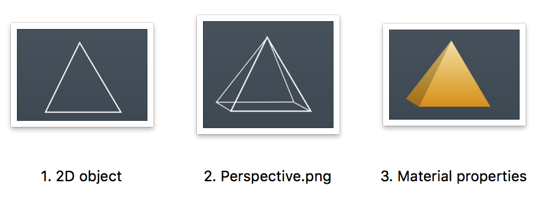
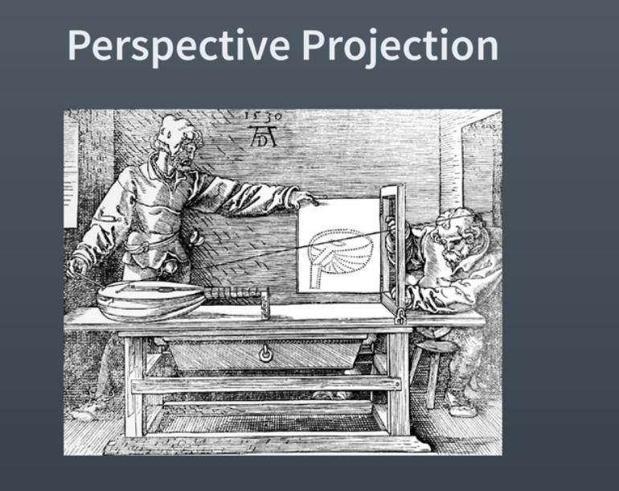
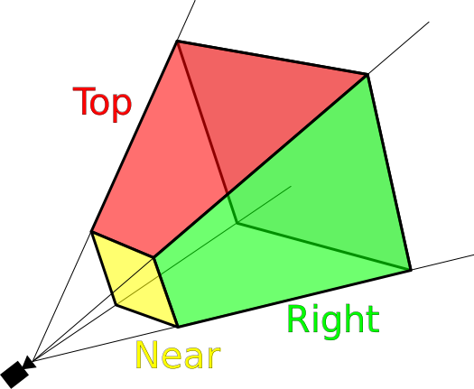
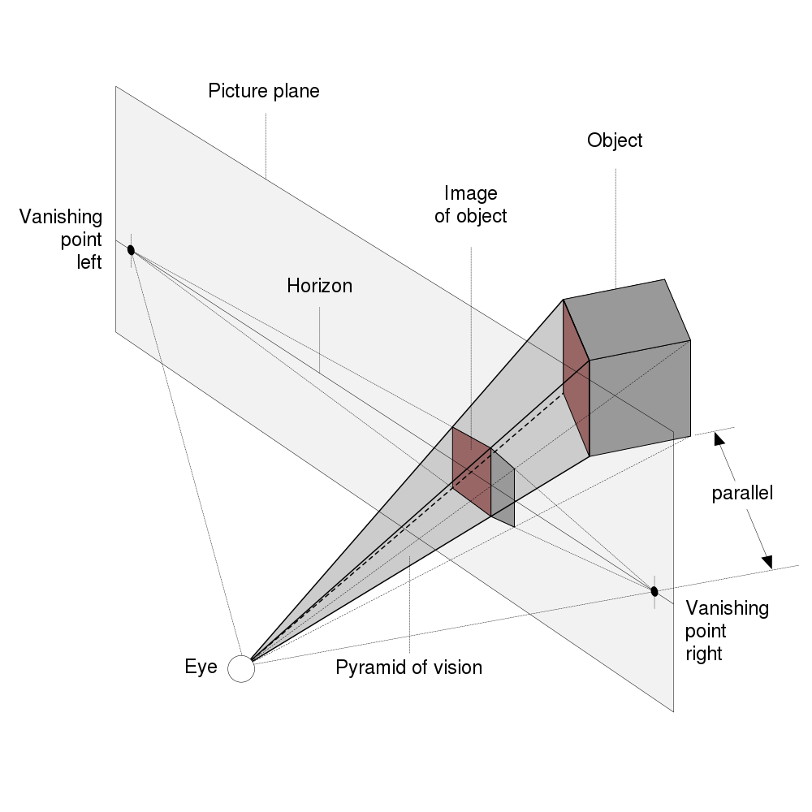
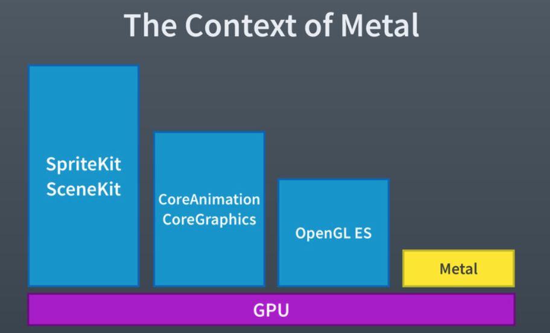

###### 3D graphics rendering -

So what is 3D rendering. It sounds as if it is the augmentation of 2D objects (geometric shapes, real word objects, etc.) with things such as perspective (that is the angle and distance at which something is visible and how it alters the shape), material properties (texture?), lighting.

Texture it seems is a pretty all-encompassing terms. It includes 2 dimensional qualities such as color and brightness, and then also includes things such as how reflective the object is.

Every 3D object can be represented as composite triangles stitched together.

******************

###### Perspective projection and view frustum -

Eventually all 3D objects get mapped in a 2D way visually. This process is called perspective projection/transformation. Looking at the below picture, imagine it like this. The lute on the left needs to be mapped into 2D and imagine the eye/camera is a single point on the right. Now for every point on the lute a ray emanates from the eye to that point. And let's say it intersects a viewing plane on the way. Now eventually all the points of the 3D object will have an intersection on the viewing plane and they will together compose a perspective projection on it.

Now technically this comes into effect in something called view frustum. It is the region of space in the real world that may be drawn on the screen. There is a near plane and a far plane. Only the objects between the near and far planes get drawn. So if the far plane is configured to be at an infinite distance, a lot more objects get drawn. (Well near plane could be the same thing as view/screen/picture plane).

And the way objects in the view frustum get drawn is perspective projection. In the below diagram, the object on the right is assumed to be in the view frustum and there is a view plane on the left. So the projection of the object on the view plane is used.

###### Coordinate spaces -

There are several different coordinate spaces involved when doing 3D graphics.

Model space - The local coordinate system for an object. Say a cup on a table. Then table is the model space for the cup.
World space - The real word coordiante system. So in the above example, accounts for where table is positioned as well.
Eye space - The coordinate system emanating from the eye/camera.
Screen space - The near plane/view plane coordinate system. Its probably a 2D system.

Any point can be converted into a point in screen space through below operation. Mproj is the projection matrix, i.e. a matrix that converts a point in the eye/camera space to a point on the screen/view space. Its a pretty complicated thing, its said.

v' = (Mproj) x (Meye) x (Mworld) x (Mmodel) x v

******************

###### Graphics technologies in iOS -
 

In iOS itself, there are several different 3D graphics technologies that exist. SpriteKit and SceneKit are easy but not flexible. CoreAnimation and CoreGraphics are better but more cumbersome to work with (in fact SpriteKit and SceneKit themseleves are built on top of it). OpenGL is an idustry standard and was the single most low level technology (it too has shaders, etc.) until 2014. Metal is now the most suited low level technology, and it abstracts nothing thereby giving most power.

Model I/O framework - Something used to act as datasource for Metal. Parses data files and loads vertex buffers.

###### Metal vs OpenGL -

Commands are sent from CPU to GPU and they should be properly balanced. Nether should GPU sit idle while CPU is still preparing to send commands nor should GPU take so much that it isn't able to keep up. Metal seeks to strike the right balance.

One of the reasons OpenGL is slow is that it is designed as if CPU and GPU are on separate chips so data had to be literally copied every time between them. This required expensive thread locks to ensure data inconsistency does not happen between them. iPhones whereas have always had CPU and GPU on the same chip. Starting with A7 chip, Metal was introduced and it takes advantage of this design of both being on the same chip.

Command buffer is the central control object. This has been exposed (unlike in Open GL). The order in which work is queued on them can be controlled. Multiple threads can be created and even the buffer execution be deliberately delayed (same thing as paused?).

Metal allows precompiled shaders whereas OpenGL complied shaders at runtime (on each draw call).

OpenGL also does state validation about every time before sending commands to GPU, this too is expensive as the state does not change in every draw call. Metal does not mandate state validation every time.

###### History of OpenGL -

Apple devices have two processors (brains) that can be used - CPU and GPU. The GPU is supposed to be special because it can do something called 'floating point maths' 'in parallel' very quickly. CPU can't do it quickly.

The traditional frameworks offload most of such tasks to GPU in some way. So you would probably be dealing with these CPU level frameworks which in turn would be offloading the task to GPU.

Now what is 'floating point maths' is not very clear to me, but it seems it has something to do with graphics programmimg in particular. And, GPU can be used for nongraphics programming too, its called GPGPU (General Purpose Graphics Programming).

OpenGL probably does not do any GPGPU tasks (at least the initial 2007 verison). So while it can use GPU for graphics programming, it cannot use GPU for non-graphics programming.

Graphics programming is nothing but the image/drawing rendering and manipulation.

1992 - OpenGL made public  
2004 - OpenGL 2.0  
2003 - OpenGL ES was released. A subset of OpenGL. Removed a lot of non-optimal implementation. It was especially developed for embedded devices, i.e. video game consoles and smart phones.  
2007 - OpenGL ES 2.0 released. Had shaders and programmable pipeline (so what exactly are these?).  

OpenGL 2.0 introduced OpenGL Shading Language (GLSL). A C like language that allowed to write programs for GPU (then what was OpenGL 1.0 doing?).

The first iPhone supported Open GL ES. Open GL ES 2.0 support started from iPhone 4S (2010).
