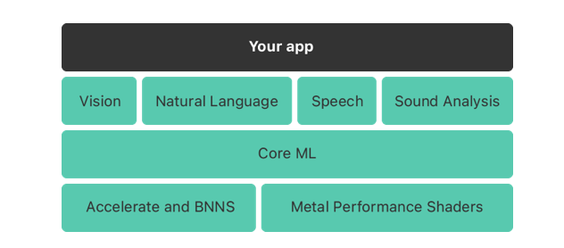
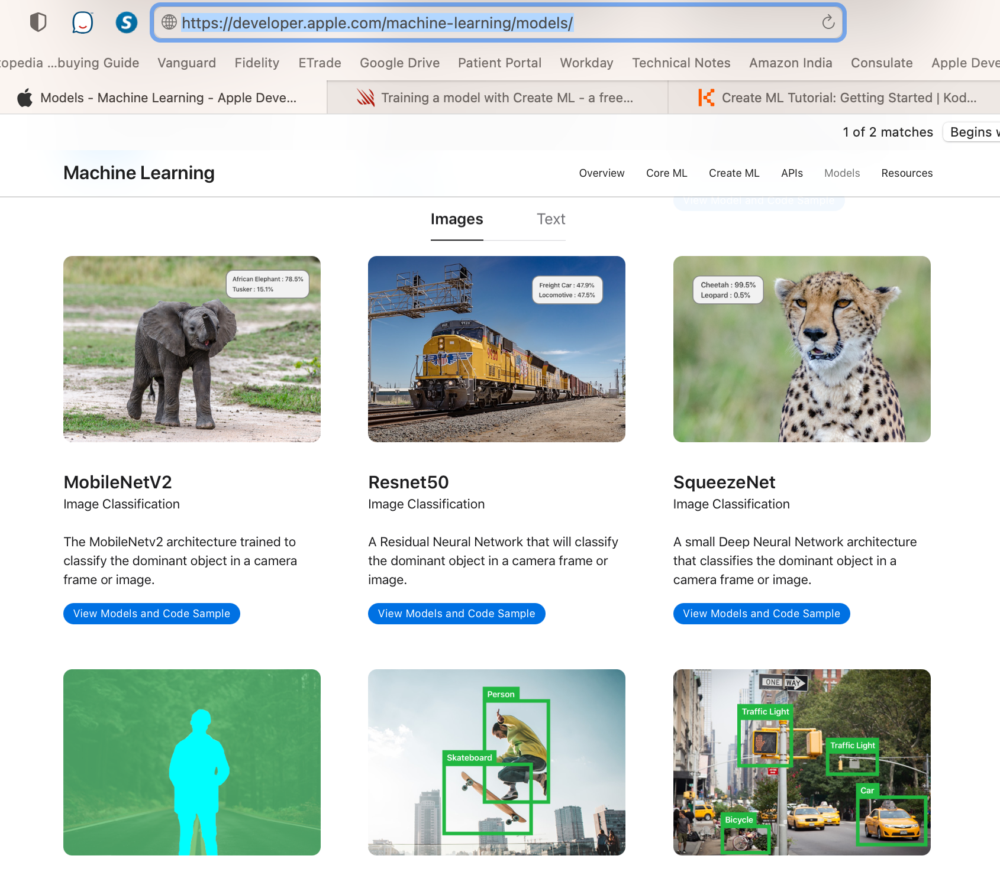
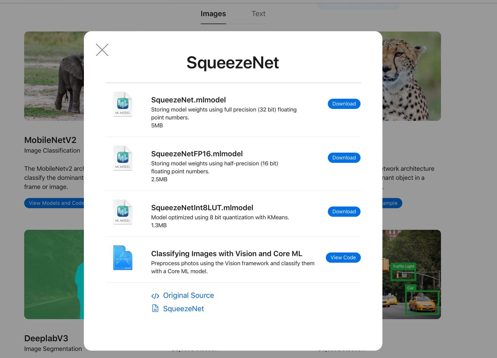
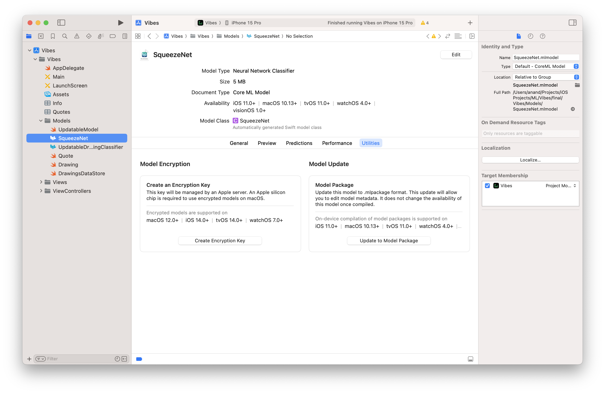
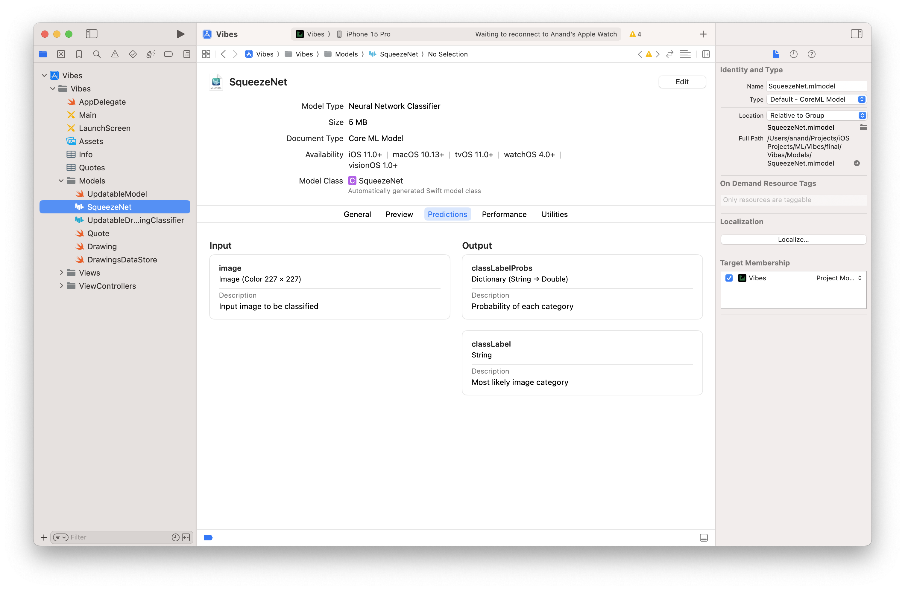
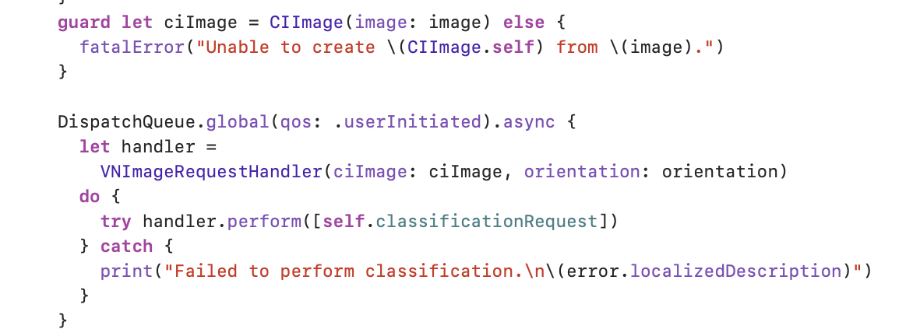
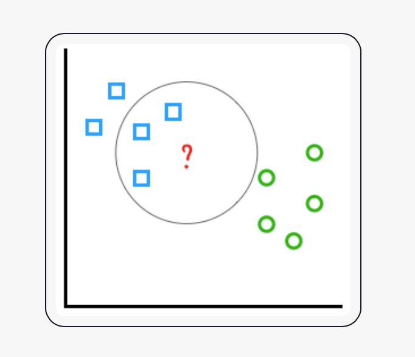

[TOC]

#### What is `CoreML`

Training is compute intensive, inference/prediction is not (though even this has gotten intensive lately). `CoreML` is the framework used to integrate ML models in the app. It can be used to have trained models predict, as well as to fine-tune models. ([Reference](https://developer.apple.com/documentation/coreml))

> Even if sometimes Apple tends to losely say that `CoreML` can be used to train a model, its likely not accurate. CoreML can fine-tune (i.e. very trivially train) a model but not fully train it. For fully training a model, `CreateML` has to be used (and that's a macOS framework).

`CoreML` - Introduced in iOS 11 (2017)  `CoreML 3` - Brought ability to train (fine-tune rather?) models on device with iOS 13 (2019)  

`CoreML` is what is behind domain-specific frameworks such as `Vision` for image analysis ( `Vision` can classify images using a built-in model that Apple provides or custom Core ML models that you provide, used for object tracking and face detection, uses OpenCV too; `Natural Language` can process text (can identify name of people, location, etc.); `Speech` can convert audio to text; and `Sound Analysis` can identify sounds in audio).

`CoreML` itself is built on top of lower-level primitives - `Accelerate` , `BNNS` , and `Metal` Performance Shaders. There is an  `Inference engine` and on GPU Metal Shaders are used, on CPU Accelerate is used (~2018) . Core ML models seamlessly leverage all the hardware acceleration available on the device, be it the CPU, the GPU or the Apple Neural Engine, which is specifically designed for accelerating neural networks.

| Examples of things Machine Learning can do.                  | Sample CoreML prediction code                                |
| ------------------------------------------------------------ | ------------------------------------------------------------ |
|  |  |

#### Trained models provided by Apple

There are several different trained models that Apple already provides (listed [here](https://developer.apple.com/machine-learning/models/)), that can be downloaded and added to the Xcode project, and then used. 

| Models provided by Apple                                     | Various configurations for the model                         |
| ------------------------------------------------------------ | ------------------------------------------------------------ |
|  |  |

#### `.mlmodel` file

The model is a `.mlmodel` file and when added to Xcode looks like this.

| General Tab                                                  | Utilities Tab                                                |
| ------------------------------------------------------------ | ------------------------------------------------------------ |
|  |  |

The Predictions tab explains the inputs and outputs. For example, here the input is a 227*227 image and the output is a dictionary of the image's classification and the probability of that classification.

Its possible to autogenerate the corresponding swift model files from the mlmodel files through this button in the mlmodel preview.

And the code then roughly looks like this.

Similar snippets from WWDC 2017: Introducing Core ML.

|  |  |  |
| ------------------------------------------------------------ | ------------------------------------------------------------ | ------------------------------------------------------------ |

Its even possible to drop some inputs in Xcode's mlmodel UI itself and have it do live prediction

#### Various entities

`VNCoreMLRequest` and `VNImageRequestHandler` are classes in `Vision` farmework that are together used to specify the image for which the underlying model should make prediction, specify the model, and then to make the prediction. 

|                                                              |                                                              |
| ------------------------------------------------------------ | ------------------------------------------------------------ |
|  |  |

The underlying model is represented by `VNCoreMLModel`. The classification result is represented by `VNClassificationObservation`.

Various `CoreML` entities - `MLFeatureProvider`, `MLModel` , `MLFeatureValue`, `MLModelConfiguration`  

The prediction results are like this when printed in console.

>Top classifications: [(confidence: 0.4309082, identifier: "library"), (confidence: 0.3251953, identifier: "turnstile")]

#### Types of models supported by `CoreML`

CoreML supports a wide variety of models and has extensive support for neural networks. ~2017 it looked like this.

#### Making multiple predictions

A new batch API was introduced in 2018 to do multiple predictions quicker.

#### Personalizing models on device

The idea with updateable models seems to be that trained models can be further personalized/customized with some more training  ([Apple documentation](https://developer.apple.com/documentation/coreml/model_personalization/personalizing_a_model_with_on-device_updates)). That is how FaceID works too. The default model that's present is already trained to recognize faces, it is then updated to recognize a specific person's face. FWIW, in case of FaceID this is done using k-NN algorithms.

> k-NN algorithms work by comparing *feature vectors*. An example feature vector is RGB color represented by R, G, B. Comparing the distance between feature vectors is a simple way to see if two objects are similar. k-NN categorizes an input by using its *k* nearest neighbors. Choosing *k = 3* predicts that this new drawing is a square.     

So in a way this is some training of models on device. Apple does not support on-device training for all kinds of models. It does support it for k-NN models, and also for neural networks (are they kind of related things?).

In CoreML, an image is a collection of pixels represented by `CVPixelBuffer`. `MLImageConstraint` is used to describe an image feature in CoreML. 

`UpdatableDrawingClassifier.mlmodel` is a trainable model in a sample code provided by Apple ([link](https://developer.apple.com/documentation/coreml/model_personalization/personalizing_a_model_with_on-device_updates)) where the user can train image classifier with some more hand drawn images and their respectie labels. The model is updated using `MLUpdateTask`.

`MLUpdateTask` is a task that updates a model with additional training data ([reference](https://developer.apple.com/documentation/coreml/mlupdatetask)).

#### Misc.

##### Resources

WWDC 2017: Introducing Core ML ([link](https://www.bilibili.com/video/BV18P4y1472G/))  Kodeco Tutorial: Core ML and Vision Tutorial: On-device training ([link](https://www.kodeco.com/7960296-core-ml-and-vision-tutorial-on-device-training-on-ios))  