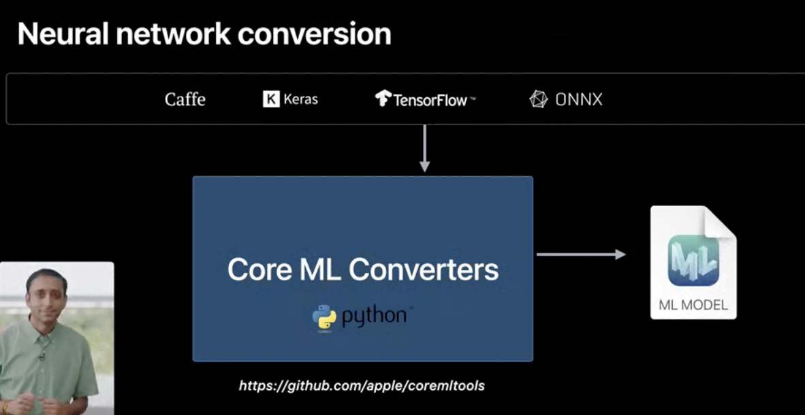
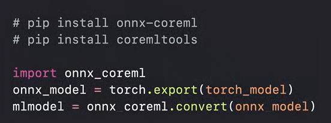
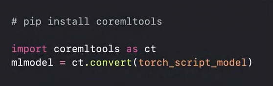

[toc]

`CoreML Tools Python package` is basically a set of Python package provided by Apple that takes output of external CoreML libraries and converts them into CoreML format. So it can create `mlmodel` (and probably also train them).

Its open source. Has a bunch of converters, a missing converter can be added by anyone.

> 'WWDC 2018: What’s New in Core ML, Part 2 ([link](https://www.bilibili.com/video/BV1rw41197Ps/?spm_id_from=333.788.recommend_more_video.-1))' : At 22 min mark, has a demo on how to convert a non-CoreML model into CoreML model.

#### Optimizing model sizes

> 'WWDC 2018: What's New in Core ML Part one ([link](https://www.bilibili.com/video/BV1YX4y1c7Y6/))'.  'WWDC 2018: What’s New in Core ML, Part 2 ([link](https://www.bilibili.com/video/BV1rw41197Ps/?spm_id_from=333.788.recommend_more_video.-1))'

##### Quantized Weights

Model size depends upon the number of weights (i.e. something like features?) used inside the model, and also how much space every weight takes. This is how the options for size of weights (in neural networks) have evolved until 2018. When weight size is reduced, that is known as `Quantized weights` (can go as low as 1 bit). Quantized models however are not as accurate, so there is always a tradeoff.

| Weight size options for neural networks                      | How model size reduces with weight size                      | Lower the bits to quantize to, lesser the accuracy           |
| ------------------------------------------------------------ | ------------------------------------------------------------ | ------------------------------------------------------------ |
|  |  |  |

CoreML Tools have tools to quantize any neural network that is in CoreML model format. It can also train quantized models. CoreML 2 (2018) introduced a bunch of Quantization related and Flexible Shape utilities too. it supports post training Quantization too.

Quantization techniques supported by CoreML - Linear, Lookup Table

> Explained in 'WWDC 2018: What’s New in Core ML, Part 2 ([link](https://www.bilibili.com/video/BV1rw41197Ps/?spm_id_from=333.788.recommend_more_video.-1))'

| Liner quantization                                           | Lookup Table quantization                                    |
| ------------------------------------------------------------ | ------------------------------------------------------------ |
|  |  |

> 'WWDC 2018: What’s New in Core ML, Part 2 ([link](https://www.bilibili.com/video/BV1rw41197Ps/?spm_id_from=333.788.recommend_more_video.-1))': At 11:00 min mark, has a demo where a mmodel is quantized using CoreML tools. Does the conversion in Jupyter notebook.

##### Flexible shapes and sizes

Sometimes models can be multi-task too, that means the same model making two different kinds of predictions. And sometimes something known as `Flexible Shapes and Sizes` can be used, with it a single model can tackle different input types (as far as possible). There are only certain kinds of models that can be trained to accept flexible inputs.

| A model supporting multiple inputs                           | Models that can support flexibility (~2018)                  |
| ------------------------------------------------------------ | ------------------------------------------------------------ |
|  |  |

#### CoreML Converters

> Covered in depth in 'WWDC 2020: Get Models on Device Using Core ML Converters'

As of 2020, Apple supports the conversion of neural network models from one of these frameworks. 

[TensorFlow](https://en.wikipedia.org/wiki/TensorFlow) is a broad set of ML related libraries thats owned by Google, with some contributions from other companies such as Apple too.

[ONNX](https://github.com/onnx/models) (Open Neural Network Exchange) is an open source set of AI tools, mostly related to standards. It was originally developed by Facebook. (Pronounced as Onyx)

CoreML Python tools ([TensorFlow Converter](https://apple.github.io/coremltools/docs-guides/source/convert-tensorflow.html)) can convert TensorFlow models to mmodels.

Converting TensorFlow models is done through `tfcoreml`.

Converting PyTorch models is a one-step process with `torch_script_model`.

`Model Intermediate Language`, or `MIL` is the in-memory representation thats used during model conversion. It has a set of operations, optimization passes and a model builder API. As an end user, you generally don't interact with MIL but it can be useful still.

> 6:30 mark has examples of using CoreML converters.

> From the WWDC 2020 video - A Core ML custom layer, allows you to accompany the ML model with your own swift implementation of the op. This is great, but in many cases, it may be possible to take another easier approach while conversion. You can use what we call the "composite op," which does not require writing additional Swift code since it can keep everything bundled in the ML model file..

CoreML tools have an [ONNX converter](https://github.com/onnx/onnx-coreml) too.

#### TuriCreate

[TuriCreate](https://github.com/apple/turicreate) is an Apple package (probably in C++ and Python) that can be used to create custom ML models.
