[toc]

> First introduced in 'WWDC 2019: Core ML 3 Framework'

##### What is an Updatable Model

The idea with 'Updatable Models' is that the user can add their own training data (in limited quantity) to make the model optimized for their needs. This is known as 'personalizing the model'.

In CoreML 3, a model can have a set of 'updatable parameters' that can be used to update the model. There is an 'update interface' and it is different from the usual 'prediction interface'.

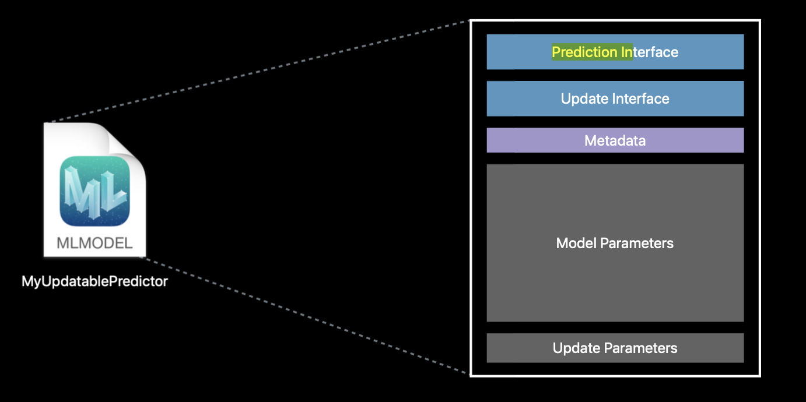

Making an update is easy, you just supply a set of training examples and you'll get out a new variant of that model that was fit or fine-tuned to that data.

CoreML 3 supports making updatable models of nearest neighbor classifiers as well as neural networks. These updated models can be updated in pipelines too, thereby making pipelines updatable too.

| Updatable model in Xcode                                     | Updatable section there                                      |
| ------------------------------------------------------------ | ------------------------------------------------------------ |
| 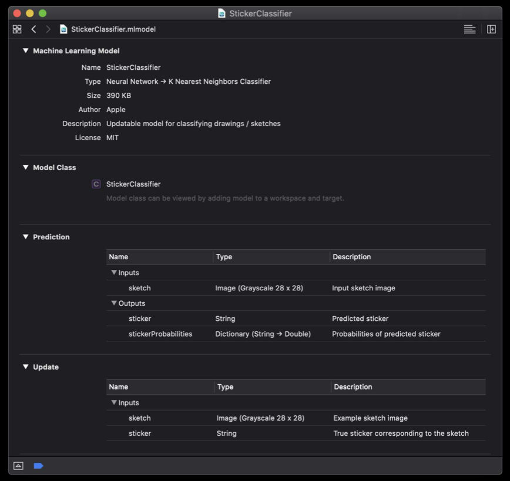 | 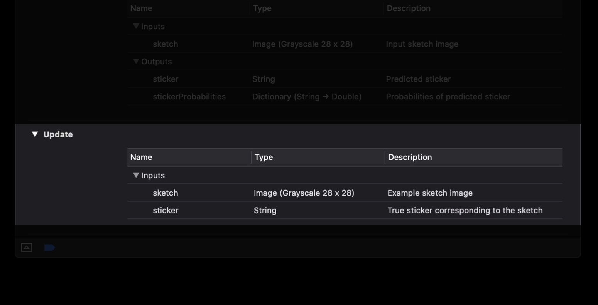 |

CoreML auto-generates a new class that helps you provide the training data.

##### Basic steps of personalization

The actual personalization itself can happen in three easy steps. First, you need to get the updatable model URL. Next, prepare the training data in the expected format. For this, you could either use the origin rated class that I showed or build a feature provider of your own. And lastly, you would kick off an update task. 

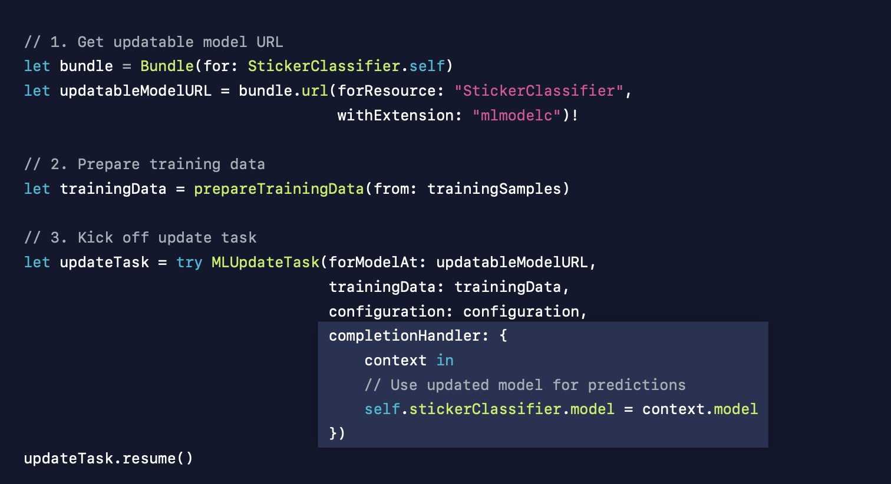

The update is done using `MLUpdateTask`,  it has a state associated with it which tellls where it's at in the process as well as the ability to resume and cancel that task.

| 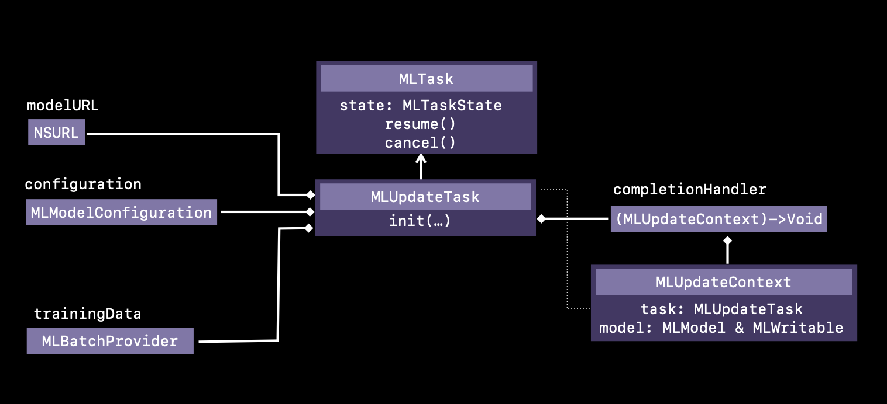 | 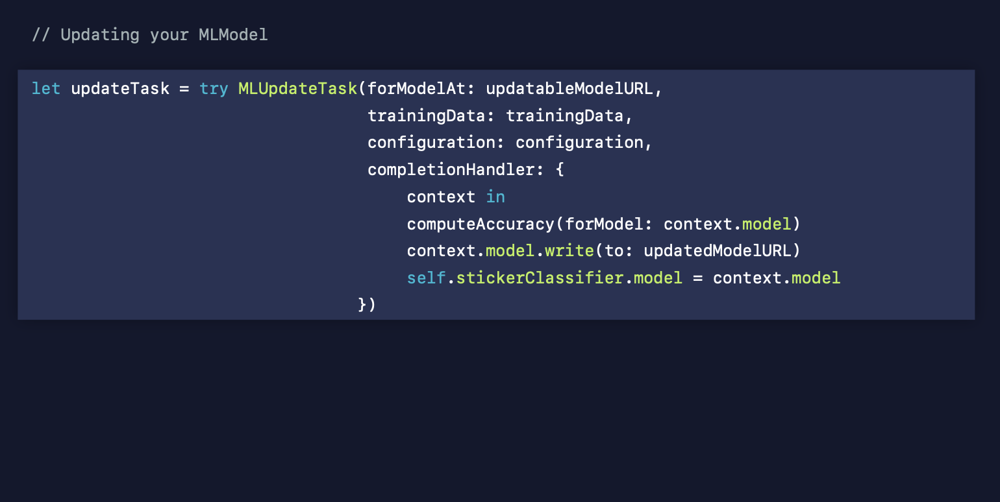 |
| ------------------------------------------------------------ | ------------------------------------------------------------ |

##### Updatable Neural Networks

Things are more complicated though with neural networks. A neural network in its simplest case is just a collection of layers, each with some inputs and some weights that it uses in combination to create an output. To adjust that output, we'll need to adjust the weights in those layers. And to do that, we need to mark these layers as updatable. And finally we need to provide this to our optimizer.

`MLUpdateProgressHandler` is the entity for tracking progress.

| 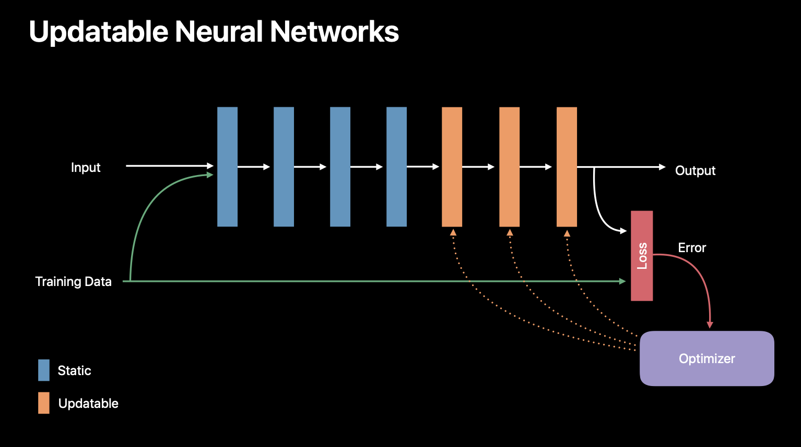 | 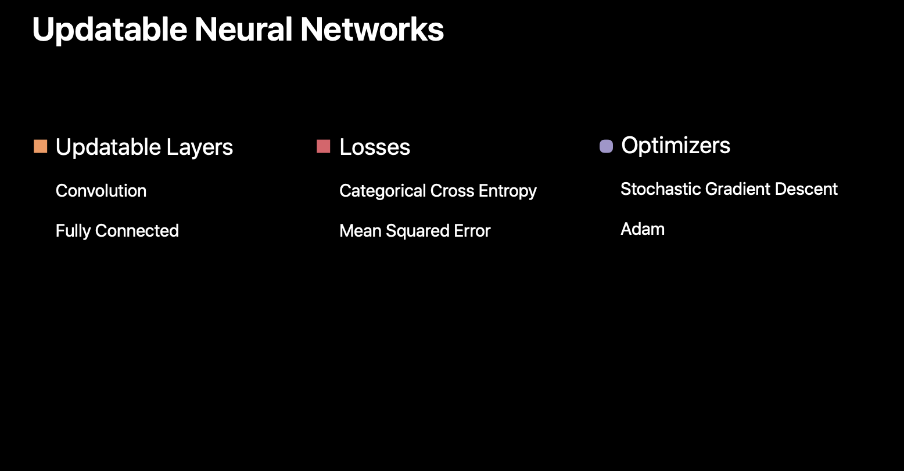 | 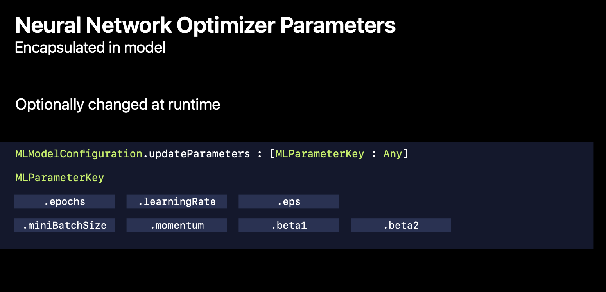 |
| ------------------------------------------------------------ | ------------------------------------------------------------ | ------------------------------------------------------------ |

| 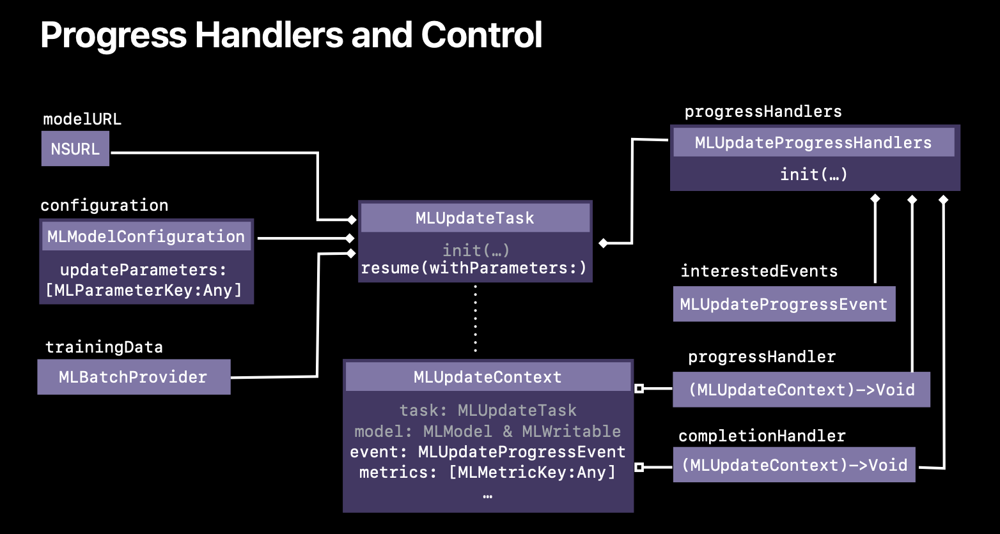 | 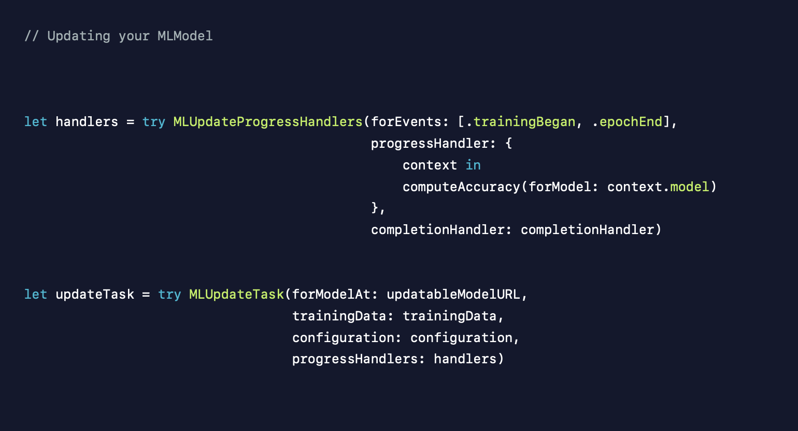 |
| ------------------------------------------------------------ | ------------------------------------------------------------ |

##### Updating models in background

CoreML models can also be updated in the background when they are complicated and are supposed to take time. Using the `BackgroundTask` framework will allot several minutes of runtime to your application. Even if the user isn't using your app or even if they're not interacting with the device, you just use the BGTaskScheduler and make a BGProcessingTaskRequest and we'll give you several minutes to do further updates and further computations.

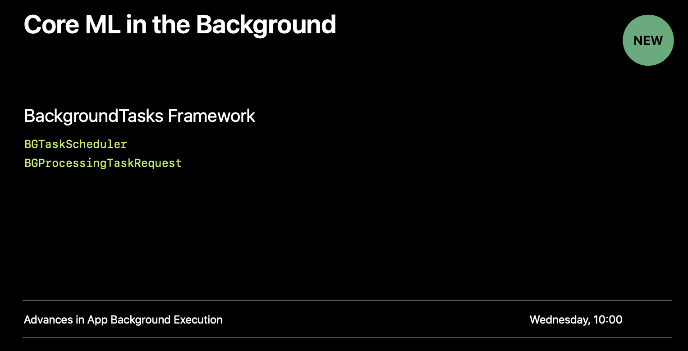

##### How to generate an updatable model in the first place

You simply pass the respect trainable flag in when you're converting your model and it'll take those trainable parameters - the things like what optimization strategy you want, what layers are updatable -- and we'll take that and embed that within your model. 

