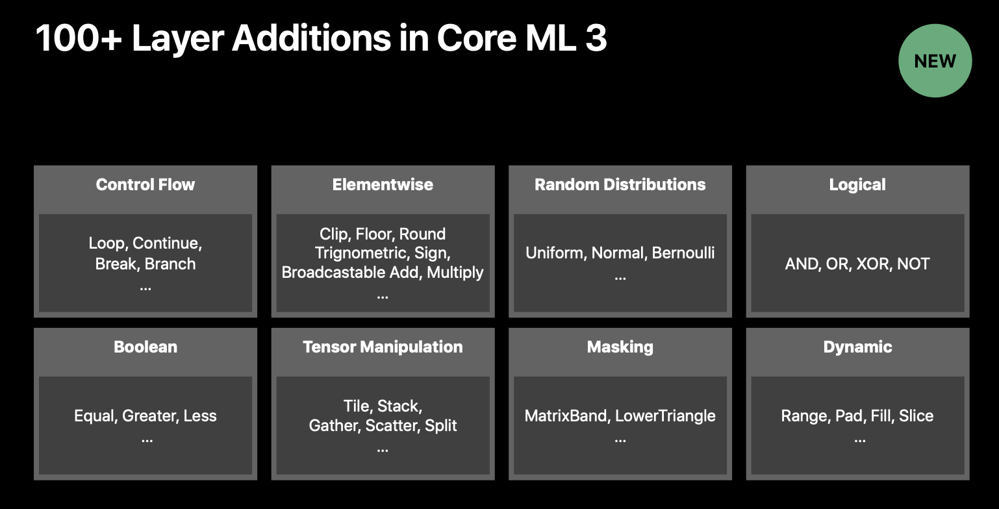
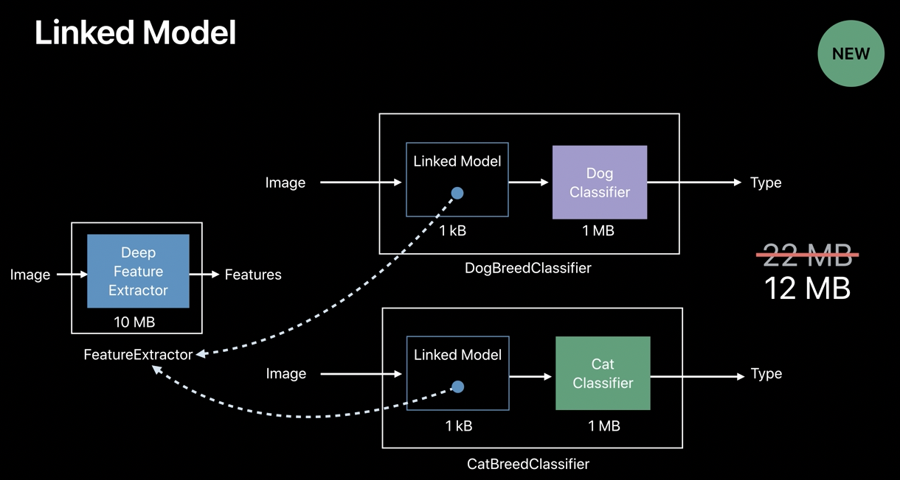

> A lot of this is explained in 'WWDC 2019: Core ML 3 Framework'.

A neural network in its simplest case is just a collection of layers, each with some inputs and some weights that it uses in combination to create an output.

##### Layer Additions in Core ML 3

If you really look at the neural network, we see that it's essentially either a graph or a program that involves these very large multidimensional variables and these very heavy mathematical functions. So essentially it's a very compute and memory intensive program. As shown in this code snippet, we are allocating a memory that depends on the input of the program so it can change at runtime. Now we can do exactly the same in Core ML this year using what we call dynamic layers, which allows us to change the shape of the multi array based on the input of the graph. So, if you come across a new layer, it's highly likely that it can be expressed in terms of the layers that are there in Core ML 3.  

Core ML is an open source Protobuf specification, we can always specify a model programmatically using any programming language of your choice. So that option is always available to us. But in the majority of the cases, we like to use converters that can automatically do that for us.

Apple provides a few converters for neural networks on GH.

> As an example, `Bidirectional Encoder Representation from Transformers (BERT)` is a certain a neural network model that can perform multiple tasks for natural language understanding. But what's inside the BERT model? A bunch of modules. And what's inside these modules? Layers, many, many layers.  To use new Core ML converter, I just need to export a model into the Protobuf format right here.

##### Linked Models

In 2019 a new model type called `Linked Model was introduced. It is simply a reference to a model sitting at desk. And this really makes it easy to share a model across different models. Another way I like to think about linked model is it behaves like linking to a dynamic library. And it has only a couple of parameters. One, the name of the model that it's linking to and a search path. Helps reduce size.

> This can be commonly used in neural networks, but is it something that applies to other kinds of models too?

