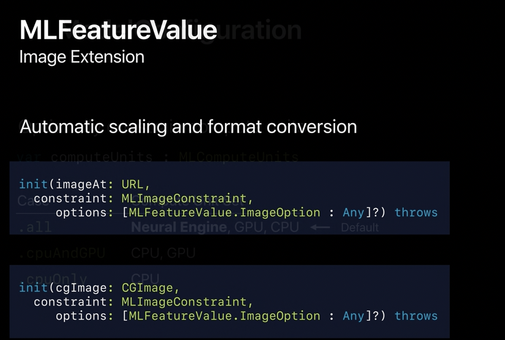
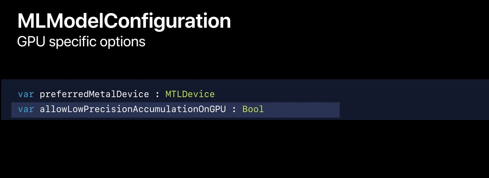

[toc]

##### Downloading and compiling model at runtime

Its possible to download ML models from internet during runtime, this helps in reducing the app size in App Store and they can be downloaded only when needed. ([reference](https://developer.apple.com/documentation/coreml/downloading_and_compiling_a_model_on_the_user_s_device)) It can then be persisted on the device, so that it doesn't need to be downloaded everytime.

##### TuriCreate

[TuriCreate](https://github.com/apple/turicreate) is an Apple package (probably in C++ and Python) that can be used to create custom ML models.

##### Getting an image as MLFeatureValue

So now we can directly get an image from a URL or a CGimage.

##### GPU configuration for MLModelConfiguration

A couple of more options added to MLModelConfiguration.  The first one is the ability to specify preferred metal device on which the model can execute. The other option that we've added this called low precision accumulation. And the idea here is that if your model is learning on the GPU, instead of doing accumulation in float32, that happens in float60. 

