[toc]

##### Misc.

Its possible to download ML models from internet during runtime, this helps in reducing the app size in App Store and they can be downloaded only when needed. ([reference](https://developer.apple.com/documentation/coreml/downloading_and_compiling_a_model_on_the_user_s_device)) It can then be persisted on the device, so that it doesn't need to be downloaded everytime.

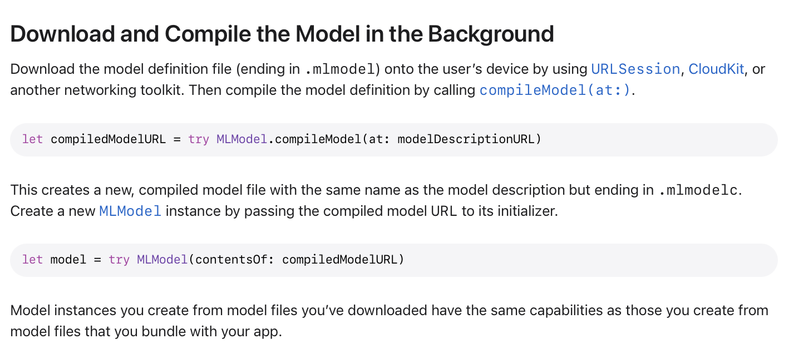

[TuriCreate](https://github.com/apple/turicreate) is an Apple package (probably in C++ and Python) that can be used to create custom ML models.

[TensorFlow](https://en.wikipedia.org/wiki/TensorFlow) is a broad set of ML related libraries thats owned by Google, with some contributions from other companies such as Apple too.

ONNX (Open Neural Network Exchange) is an open source set of AI tools, mostly related to standards. It was originally developed by Facebook. (Pronounced as Onyx)

##### Notes WWDC 2017: Introducing Core ML ([link](https://www.bilibili.com/video/BV18P4y1472G/))

Inference ~ Prediction (even this has been challenging lately). For example neural networks require a lot of code if they were to be written in code (but isn't that what a model is?).

Vision - Framework for all OpenCV and images related work. Object tracking, face detection, etc.  NLP - Text processing, language detection, named entity recognition (identifying name of people, location, etc.)  CoreML - Domain agnostic ML framework, i.e. not tied any one kind of input such as image, music, text, etc.

Accelerate, MPS (Metal Performance Shader) - High performance math framrworks, used for custom ML models. Can also be used for any intensive math work that is not related to ML.

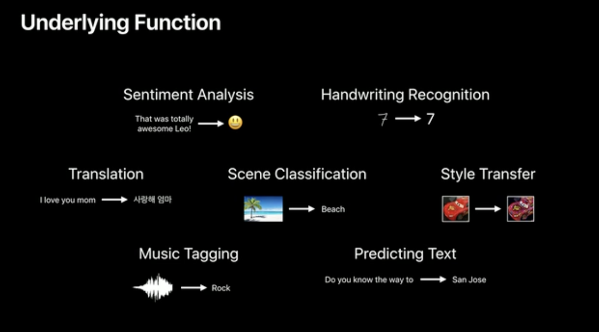

CoreML supports a wide variety of models. Has extensive support for neural networks.

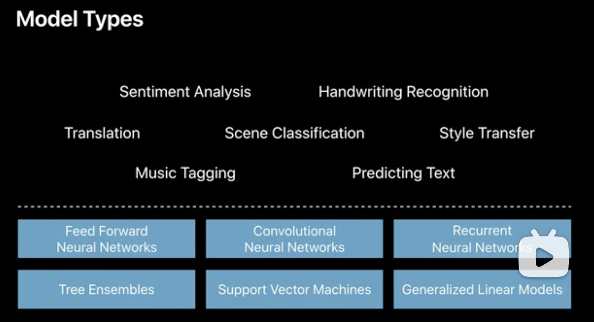

CoreML Tools Python package - Takes output of external CoreML libraries and converts them into CoreML format. So what does it do, takes learned models and converts them to mmodel? Or takes models, trains them, and then converts to mmodel? And its open source. Has a bunch of converters, a missing converter can be added by anyone.

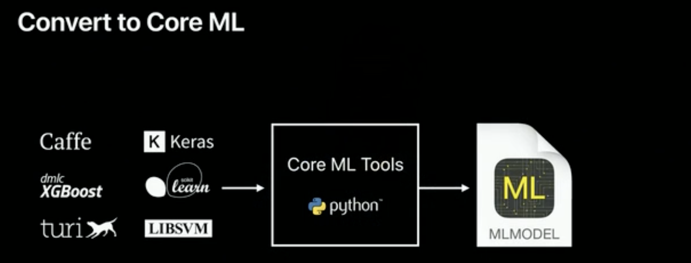

mmodel gets compiled and bundled into the app, its optimized for runtime.

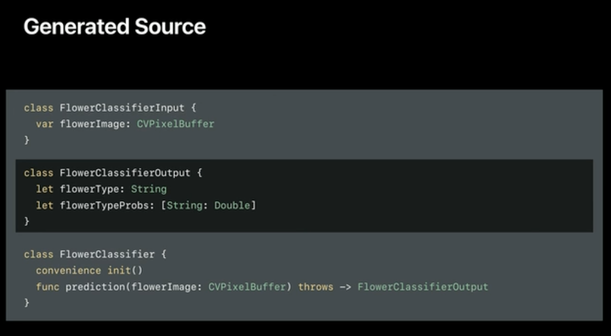

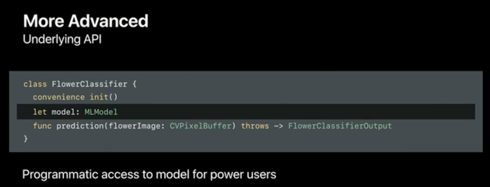

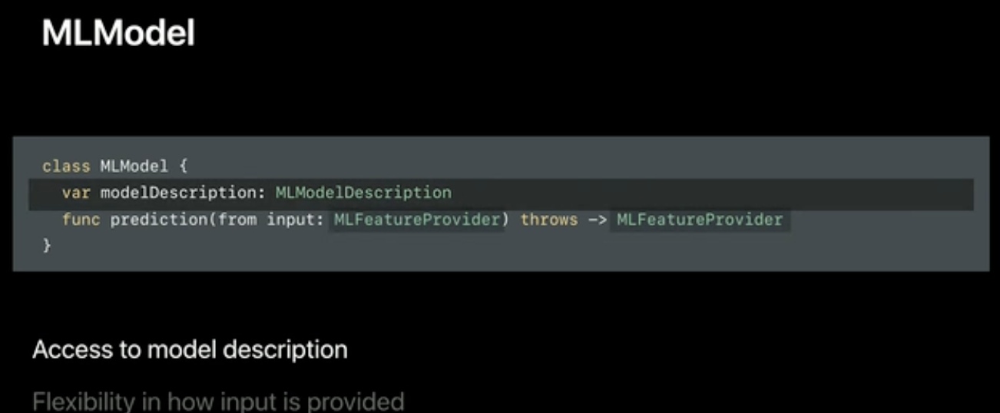

##### Notes WWDC 2018: What's New in Core ML Part one ([link](https://www.bilibili.com/video/BV1YX4y1c7Y6/))

This was already there.

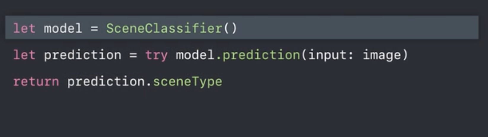

Topics covered - Model Size, Performance, Customization

###### Model Size

Models can probably be downloaded on demand, stored in sandbox and still used in runtime?

Model size depends upon the number of weights (i.e. something like features?) used inside the model, and also how much space every weight takes. This is how the options for size of weights (in neural networks) have evolved until 2018. Quantized weights can go as low as 1 bit.

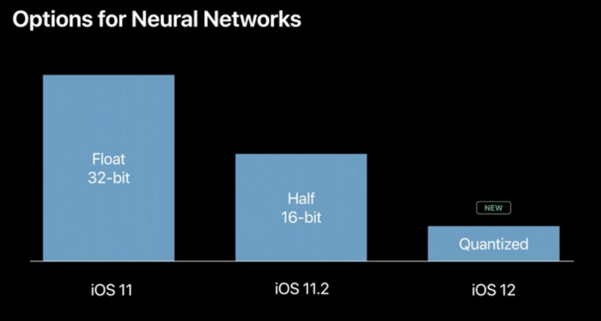

How model size can reduce as lower weight size is used.

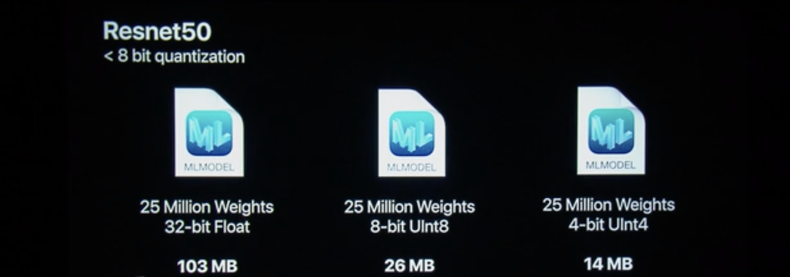

CoreML Tools have tools to quantize any neural network that is in CoreML model format. It can also train quantized models. Quantized models however are not as accurate, so there is always a tradeoff.

Sometimes models can be multi-task too, that means the same model making two different kinds of predictions. And sometimes something known as `Flexible Shapes and Sizes` can be used, with it a single model can tackle different input types (as far as possible).

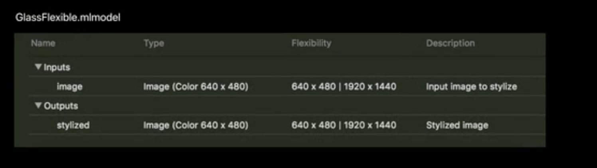

There are only certain kinds of models that can be trained to accept flexible inputs.

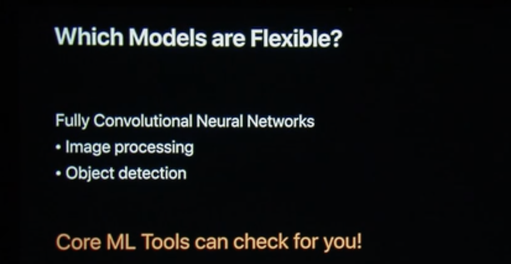

###### Performance

Inference engine. On GPU Metal Shaders are used, on CPU Accelerate is used.

A new batch API to do multiple predictions quicker.

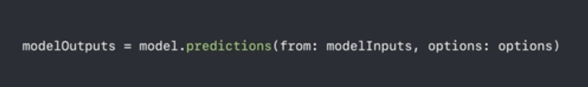

###### Customization

Custom layers (`MLCustomLayer`) can be added in case of neural network models.

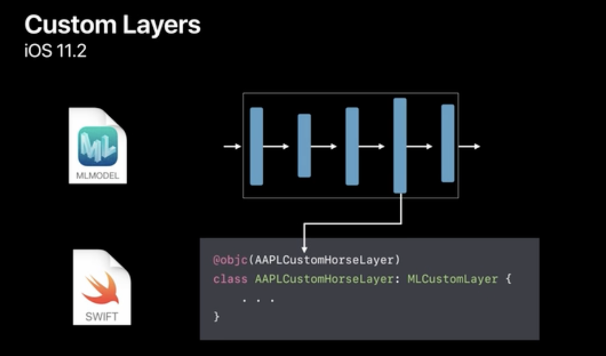

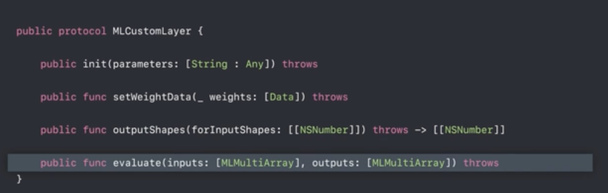

It even has an optional method for the shader process where you can have the performance you want.

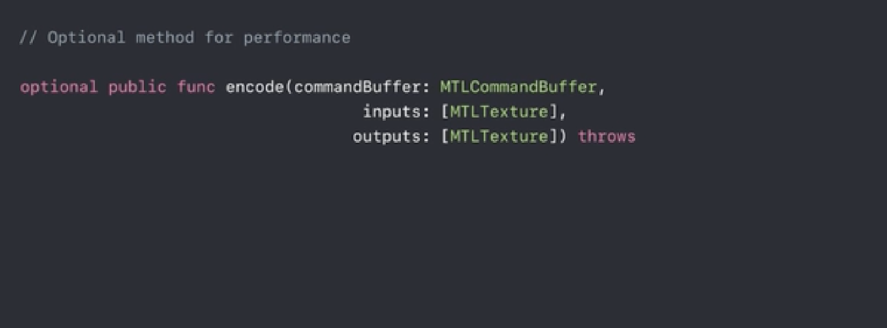

Custom models have been introduced (so until 2018 it wasn't possible to have non Apple approved mlmodel files? Can't be).

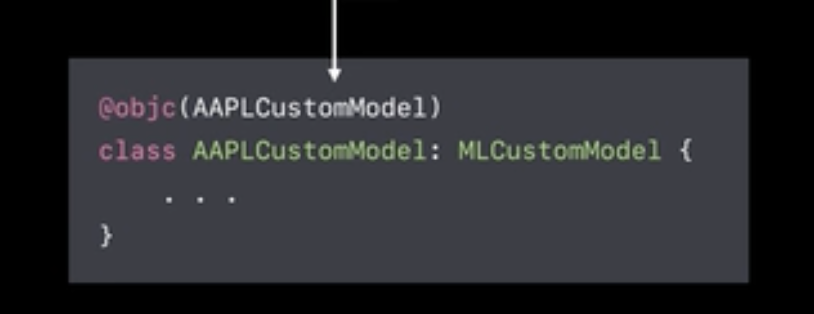

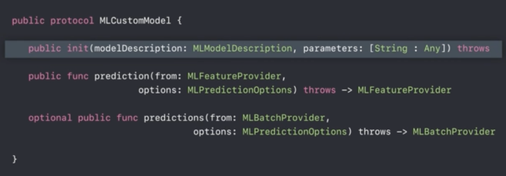

In Xcode, a custom model has a dependencies section.

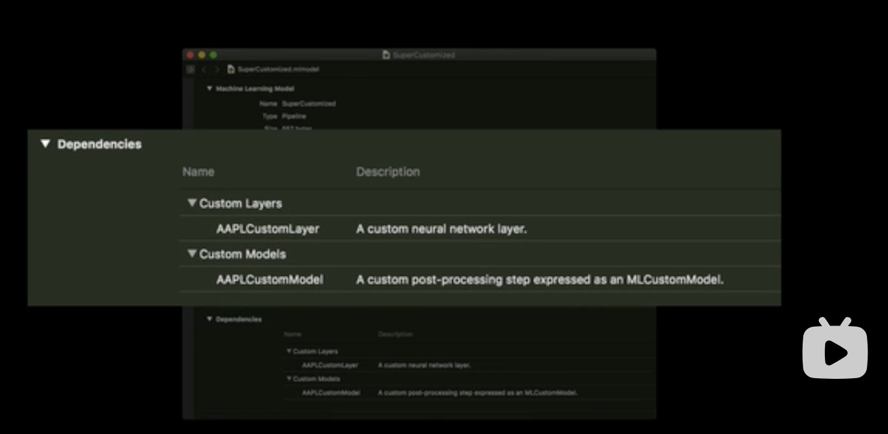

##### Notes WWDC 2018: What’s New in Core ML, Part 2 ([link](https://www.bilibili.com/video/BV1rw41197Ps/?spm_id_from=333.788.recommend_more_video.-1))

CoreML Python tools ([TensorFlow Converter](https://apple.github.io/coremltools/docs-guides/source/convert-tensorflow.html)) can convert TensorFlow models to mmodels.

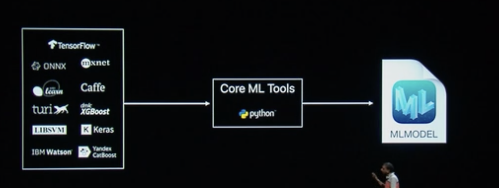

CoreML tools have an [ONNX converter](https://github.com/onnx/onnx-coreml) too.

CoreML 2 introduced a bunch of Quantization related and Flexible Shape utilities too. CoreML supports post training Quantization.

Quantization techniques supported by CoreML - Linear, Lookup Table

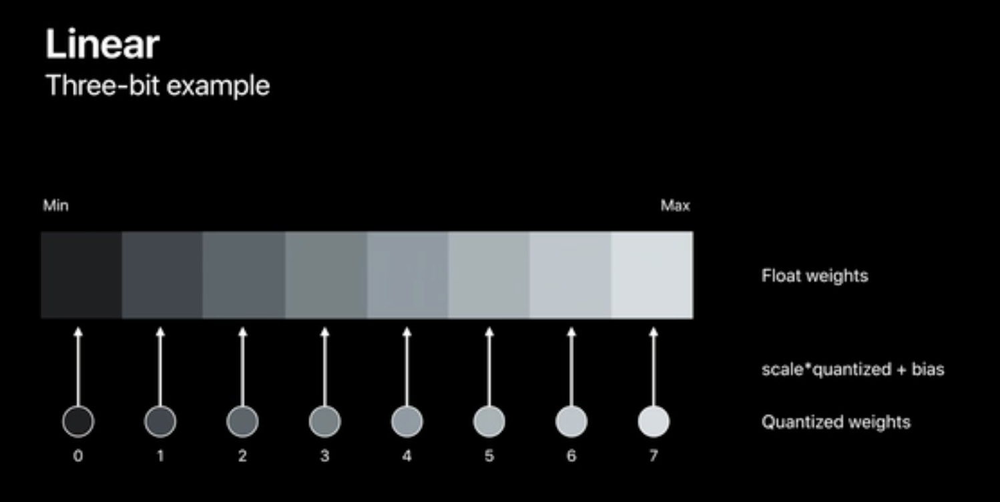

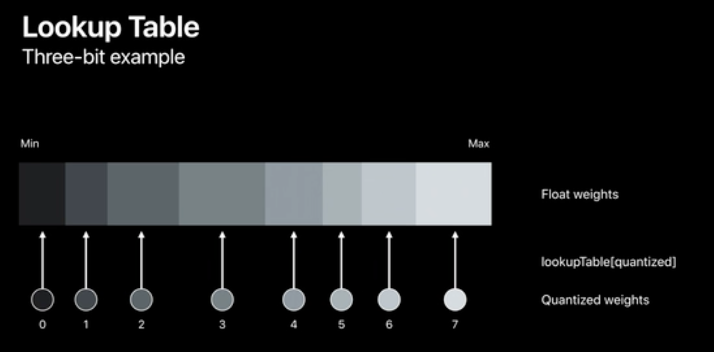

11:00 min mark - Has a demo where a mmodel is quantized using CoreML tools. Does the conversion in Jupyter notebook.

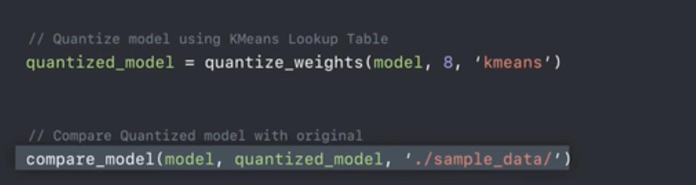

Lower the bits to quantize to, lesser the accuracy.

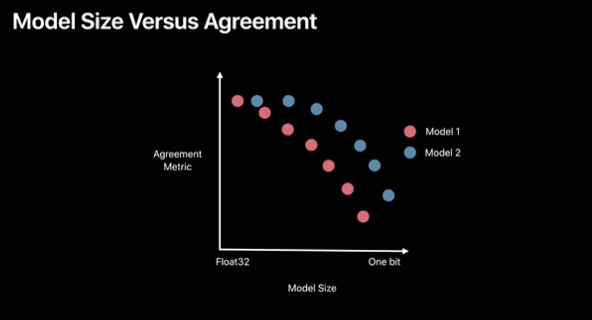

###### Custom Conversion

22 min mark - demo on how to convert a non-CoreML model into CoreML model, and also how to add a custom layer in a neural network model.