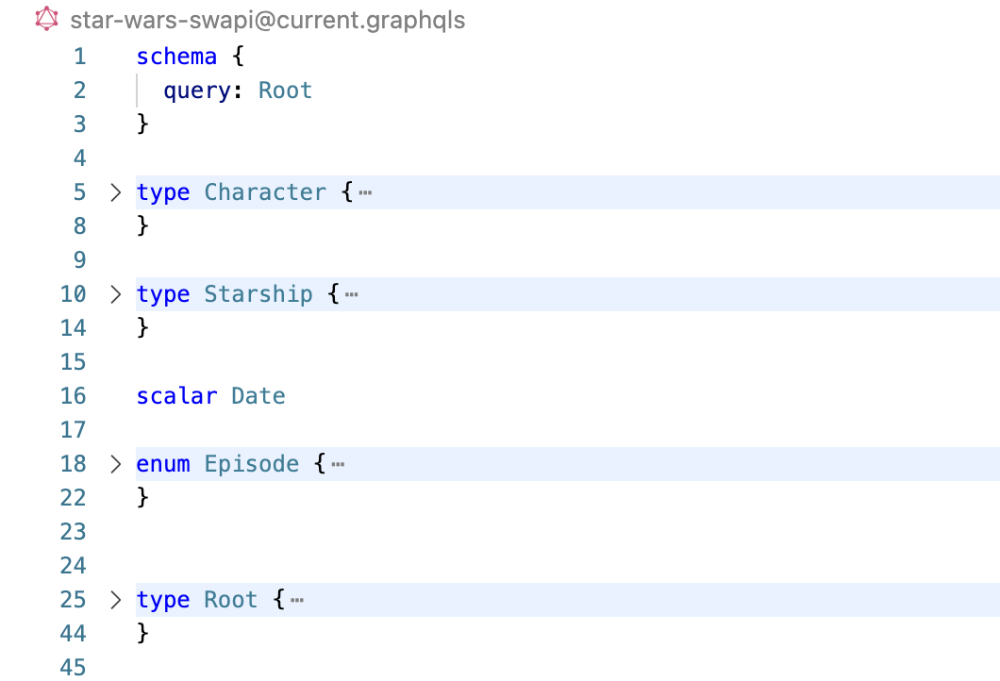
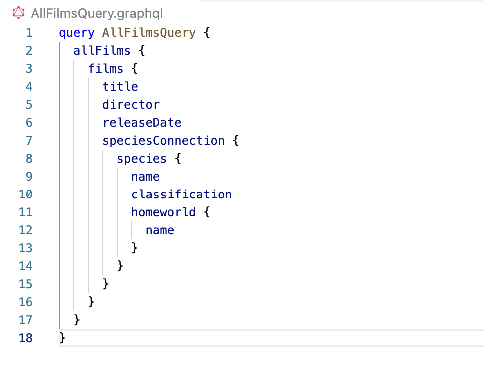
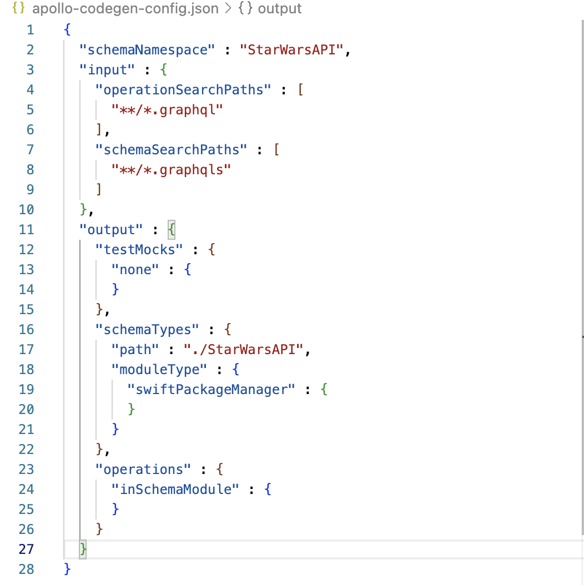
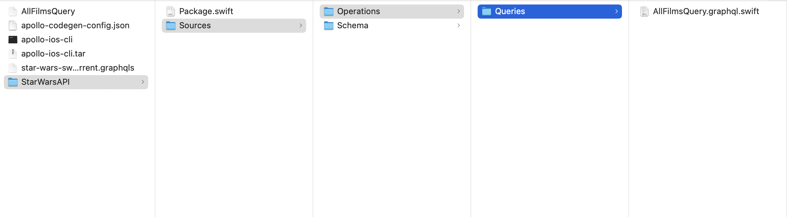

[toc]

##### Codegen

Official tutorial ([link](https://www.apollographql.com/docs/ios/tutorial/codegen-getting-started)) <br>Official reference ([link](https://www.apollographql.com/docs/ios/code-generation/codegen-cli)) <br>

There is a [command line tool](https://github.com/apollographql/apollo-ios/releases) that Apollo-iOS provides which given a schema file and a file with an operation, can generate Swift entities (i.e. structs, etc.) for that operation.

The typical steps are these -

1. Have the schema file in a folder (have '.graphqls' extension)

2. Have the desired operation is another file (have '.graphql' extension)

3. Run the command line tool and create a codegen config file  and then edit it as needed.

   ```swift
   ./apollo-ios-cli init --schema-namespace StarWarsAPI --module-type swiftPackageManager
   ```

4. Run the command line tool and generate a package (if so specified in config file) for its corresponding Swift entities. The package is usually generated in the same folder (unless specified otherwise).

   `````
   ./apollo-ios-cli generate
   `````

| Schema file                                                  | Operation file                                               | Config file                                                  |
| ------------------------------------------------------------ | ------------------------------------------------------------ | ------------------------------------------------------------ |
|  |  |  |




The CLI also has a command to download the schema. The URL for the schema needs to be given in the config file (the key name is `schemaDownloadConfiguration`).

```
./apollo-ios-cli fetch-schema
```

##### Using the package generated by Codegen

Official tutorial ([link](https://www.apollographql.com/docs/ios/tutorial/tutorial-introduction))

```swift
import Apollo
import GeneratedPackage

private(set) lazy var apollo = ApolloClient(url: URL(string: "https://apollo-fullstack-tutorial.herokuapp.com/graphql")!)

Network.shared.apollo.fetch(query: GeneratedQuery()) { result in .... }
```

> That should be it, I can follow the full tutorial step by step and do it but I think the basics are covered

It can also maintain a cache that uses a local SQLite database.

##### Request Chain Customization

Apollo-iOS has a chain of interceptors that do various phases of a GraphQL requets construction, call, response handling. There can be custom interceptors created and the entire request chain customized. ([link](https://www.apollographql.com/docs/ios/networking/request-pipeline))

##### Useful Links

Apollo iOS lib reference ([link](https://www.apollographql.com/docs/ios/docc/documentation/index)) <br>Fetching data ([link](https://www.apollographql.com/docs/ios/fetching/fetching-data)) <br>Passing arguments ([link](https://www.apollographql.com/docs/ios/fetching/operation-arguments)) <br>Client-side caching ([link](https://www.apollographql.com/docs/ios/caching/introduction)) <br>Pagination ([link](https://www.apollographql.com/docs/ios/pagination/introduction)) <br>Mocks for unit testing ([link](https://www.apollographql.com/docs/ios/testing/test-mocks)) <br>File uploads using multi-part requests ([link](https://www.apollographql.com/docs/ios/file-uploads)) <br>

