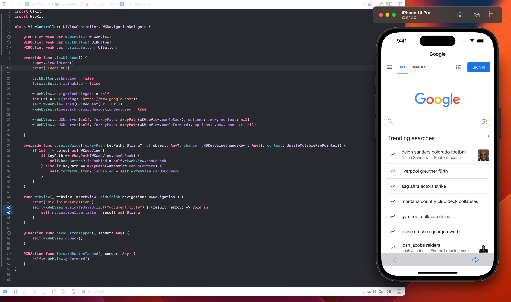
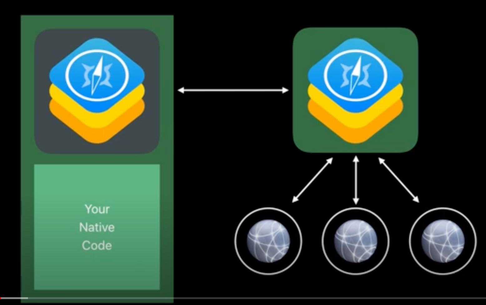
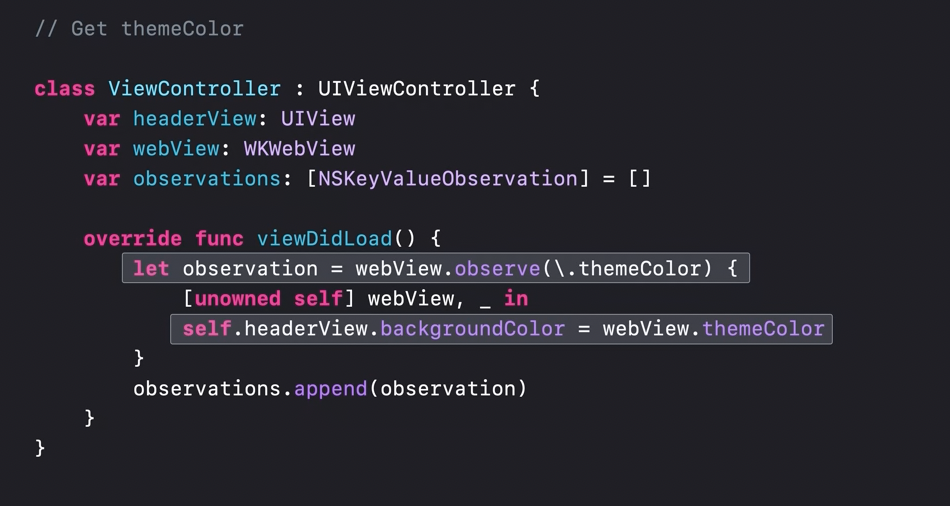
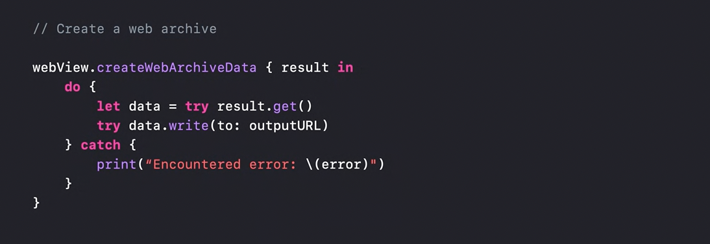
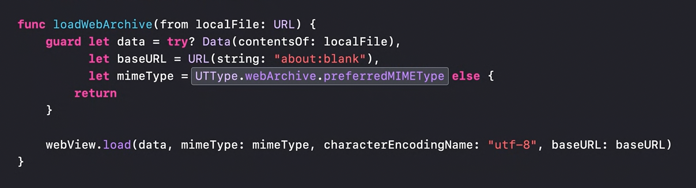

[toc]

`WKWebView` was introdcued in iOS8, and Yosemite.

##### Creating a basic WKWebView

The URL is specified in `load(_ request: URLRequest)`. 

Several of its properties (like `canGoBack`, `canGoForward`) are KVO compliant and hence can be observed as needed.

The object that conforms to `WKNavigationDelegate` protocol gets all the navigation related callbacks (i.e. functions like `webView(_ webView: WKWebView, didFinish navigation: WKNavigation!))`.

`evaluateJavaScript(_ javaScriptString: String, completionHandler: {...})` can evaluate the specified string on page's JS and return that in a closure.



###### How to test

While one way to test the web view is with remote URL, the easier way is to have a HTML that you want add it to the app bundle, and load the web view with that.

```
let localURL = Bundle.main.url(forResource: "local", withExtension: "html")!
self.wkWebView.loadFileURL(localURL, allowingReadAccessTo: localURL.deletingLastPathComponent())
```

And for testing with a remote URL.

```
let remoteURL = URL(string: "https://myaccounts.capitalone.com/digitalWalletManager/gpaypush")!
self.wkWebView.load(URLRequest(url: remoteURL))
```

##### Separate process for WKWebViews

WKWebView does process isolation while loading web content, i.e. it loads the web content, renders it, and executes JavaScript in a separate process from the app's process. In fact different web contents, can run in different processes (so the same page can have web content loading from different processes?). This improves security as well as performance. Advanced JS JIT compiler can be used too because of the accompanying security gurantees from things running in different processes.



##### Executing JS

Its possible to inject JS in the webpage, and get it to run. This in turn can also be used to fetch various elements from the webpage.

The below functions evaluate the passed JS string and if there are any responses make them available in the completion handler. `WKContentWorld` and `WKFrameInfo` can be specified if needed.

```
evaluateJavaScript(String, completionHandler: ((Any?, Error?) -> Void)?)
evaluateJavaScript(String, in: WKFrameInfo?, in: WKContentWorld, completionHandler: ((Result<Any, Error>) -> Void)?)
evaluateJavaScript(String, in: WKFrameInfo?, contentWorld: WKContentWorld) -> Any?
```

Example

```
webView.evaluateJavaScript("document.getElementById('someElement').innerText") { (result, error) in
    if error == nil {
        print(result)
    }
}
```

The below functions asynchronously execute the passed string as a JS function

```
callAsyncJavaScript(String, arguments: [String : Any], in: WKFrameInfo?, in: WKContentWorld, completionHandler: ((Result<Any, Error>) -> Void)?)
callAsyncJavaScript(String, arguments: [String : Any], in: WKFrameInfo?, contentWorld: WKContentWorld) -> Any?
```

```
webView.evaluateJavaScript("document.getElementById('someElement').innerText") { (result, error) in
    if error == nil {
        print(result)
    }
}
```

`callAsyncJavaScript` can be used to asynchronously run a string as JS. Serialization and deserialization of argument types happens automatically. If the JavaScript returns a promise, then the completion handler is not called right away. Instead, it waits for the promise to resolve and is called with the result of that fulfillment. 

| Example 1                                                    | Example 2                                                    |
| ------------------------------------------------------------ | ------------------------------------------------------------ |
|  |  |

> What is `postMessageWithReplies` that is referenced in the WWDC 2020 talk 'Discover WKWebView enhancements'.

> Explained in 'WWDC20 - Discover WKWebView enhancements'

###### Avoid JavaScript injection when possible

There are some features that are just incompatible with injected JavaScript. Like app-bound domains, but to use that any JS should not be injected. Injecting JS also does not let one use ApplePay. Sometimes there are however APIs to easily interact with the content in web view without having to deal with injecting JavaScript.

>  In this example, the pages' theme color and related colors for a website are accessed. 

> Shown in 'WWDC21 - Explore WKWebView additions'

##### Creating PDF, Webarchive

###### createPDF

There is also an ability to take a bitmap snapshot of its contents as a PDF.


> Shown in 'WWDC20 - Discover WKWebView enhancements'.

###### createWebArchiveData, loadWebArchive

A web archive is an actual rich snapshot of the current DOM of the web content and the sub-resources it would need to render. With `createWebArchiveData`, its possible to take a snapshot of web content for later debugging and testing. Can load webArchive content. 

| Create webarchive                                            | Load webarchive                                              |
| ------------------------------------------------------------ | ------------------------------------------------------------ |
|  |  |

> Shown in 'WWDC20 - Discover WKWebView enhancements'.

##### WWDC videos

WWDC 2021 - Explore WKWebView additions<br>WWDC 2020 - Discover WKWebView enhancements<br>WWDC 2017 - Customized Loading in WKWebView<br>WWDC 2015 - Introducing Safari View Controller (initial part)<br>
