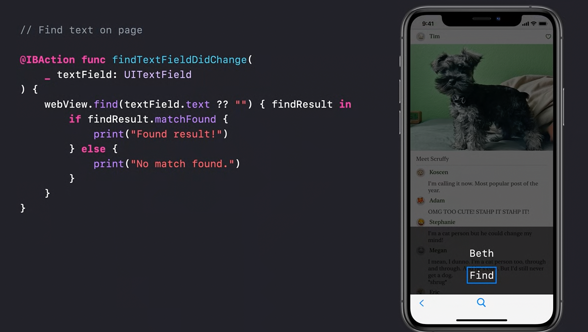
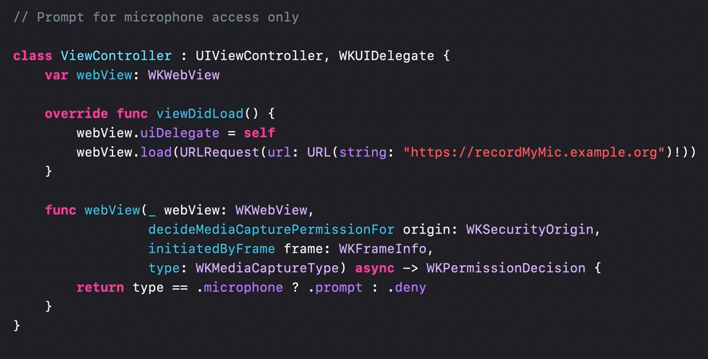
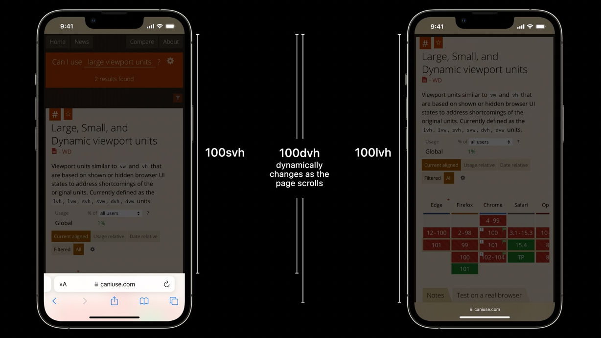
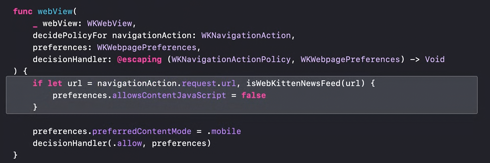

[toc]

##### Various properties, functions to configure WKWebView

###### pageZoom property

A `WKWebView` property that sets the scale factor of webview's content.

> Explained in 'WWDC20 - Discover WKWebView enhancements'

###### findString

 `findString` simply allows to visibly find text in the web content. If a result is found, it is selected and scrolled into view.

> Shown in 'WWDC20 - Discover WKWebView enhancements'

###### Disabling text interaction (`WKPreferences.textInteractionDisabled`)

This is done using `WKPreferences` property `textInteractionDisabled`.

> Shown in 'WWDC21 - Explore WKWebView additions'

###### Controlling media playback (`MediaPlayback`)

This can be done using several properties.

Previously, if you wanted to pause or suspend media that was playing in your web view, you'd need to inject JavaScript. You'd also need to find the specific element in the DOM to be able to control it. But now, we have a simple API that makes it easy to control the state of media in your web view. `setAllMediaPlaybackSuspended`, `pauseAllMediaPlayback`

> There is also a similar `setCameraCaptureState` property for the rendered camera feed.

> Shown in 'WWDC21 - Explore WKWebView additions'

###### HTTPS override flag (`WKWebViewConfiguration.upgradeKnownHostsToHTTPS`)

We are taking HTTP requests to sites that we know support HTTPS and upgrading them for you. In order to get this added security, you don't need to do anything at all! But, if you do need to turn it off for some local debugging, there's an easy flag named `upgradeKnownHostsToHTTPS` to set on configuration.

> Shown in 'WWDC21 - Explore WKWebView additions'

###### Media capture prompt

Around iOS14, WKWebView started supporting the Web API `getUserMedia()` ([this](https://developer.mozilla.org/en-US/docs/Web/API/MediaDevices/getUserMedia) thing) thereby allowing WebRTC (real time media communications on web) functions to work inside the webview. 

> The [`MediaDevices`](https://developer.mozilla.org/en-US/docs/Web/API/MediaDevices)**`.getUserMedia()`** method prompts the user for permission to use a media input which produces a [`MediaStream`](https://developer.mozilla.org/en-US/docs/Web/API/MediaStream) with tracks containing the requested types of media.

iOS15 onwards, when the web media content is loaded from a custom scheme handler, the user request prompt will show the app as the origin of the request, rather than show a request from the website URL. If you want the prompt to remain as a request from the URL, just load without the custom scheme handler, and the prompt will be shown as it is today. 

There is also a new API to allow you to decide when and how to prompt the user for camera and microphone permissions when working with web content.

> Shown in 'WWDC21 - Explore WKWebView additions'

###### Full screen APIs

All you need to do in your app is set `WKPreferences.isElementFullscreenEnabled`. you can observe the value of `WKWebView.fullscreenState`, which will let your app know when the web content is becoming full screen or returning. 

> Shown in 'WWDC22 - What's new in WKWebView'

######  Using CSS units for dynamic viewports

We also have new CSS units to allow web content to lay out according to dynamic viewport sizes. These new CSS units include `svh`, `lvh`, `dvh`, and many others. They allow web developers to modify layout based on the smallest, largest, and dynamic viewport sizes. 

> Shown in 'WWDC22 - What's new in WKWebView'

If your app changes the viewport of your WKWebView, then you should inform WebKit up front what the viewport size ranges are. 

###### findInteractionEnabled

If you set `WKWebView.findInteractionEnabled` to true, then your users will be able to use familiar UI and shortcuts like Command-F to search the text on the open page. 

> Shown in 'WWDC22 - What's new in WKWebView'

###### Suppressing JS coming from webpage (`WKWebPagePreferences.allowsContentJavaScript`)

This is done using `allowsContentJavaScript` property of `WKWebPagePreferences`.

Until 2017, the WKWebView API had a way to disable JavaScript by setting the `javaScriptEnabled` property of `WKPreferences` to false but it was deprecated that year. A new property of `WKWebPagePreferences` named `allowsContentJavaScript`  was introduced.

It suppresses only the JavaScript that comes from the web page content itself (in-line `<script>` scripts , remotely referenced JavaScript files, JavaScript URLs `javascript: URLs`, everything). But the application's JavaScript (i.e. JS injected by native app) continues working.

That is, if webpage has any JS it will not run! The HTML will render, but its JS will not run.

`WKWebPagePreferences` API allows configuring certain behaviors on a per-navigation basis. 

> So in a webpage where the page's JS has scrolling which interferes with the default scrolling offered by webview's scrolling, disabling contentJS can smoothen scrolling in the web view.   

> Explained in 'WWDC20 - Discover WKWebView enhancements'

###### mediaType property

By setting a custom `mediaType` on `WKWebView`, its possible to rid of some weirdly rendered elements that webview would not otherwise properly understand. Requires looking into the webpage's code/CSS to understand what to use. Essentially it allows the webview to have a `@media` rule for its CSS. ([reference](https://www.w3schools.com/css/css3_mediaqueries.asp))

> In the below example, setting the media type allowed it to be rendered properly.  

> Shown in 'WWDC20  - Discover WKWebView enhancements' video around 17:00 mark.

##### Encrypted Media

iPadOS 16 allows encrypted media for WKWebView. If you have content that uses the Encrypted Media Extensions and Media Source Extensions APIs, you can now use it in your apps on iPadOS. 

> Shown in 'WWDC22 - What's new in WKWebView'

##### Intelligent Tracking Prevention (ITP)

`Intelligent Tracking Prevention (ITP)` uses various client-side heuristics and machine learning to identify, classify and thwart trackers.  in iOS 14 and macOS Big Sur, ITP is enabled by default on all WKWebView apps. If needed, the users can switch off ITP for compatibility with a website you don't control. There is an API for it (which one?).

> Mentioned in 'WWDC20 - Discover WKWebView enhancements'.

##### App bound domains

`WKWebView` also has something called `App-bound domains`. The idea is simple. You specify which domains are the core part of the implementation of your app. Deep interaction with the web content not core to your app is disabled for both the code you write and any other code you might bring in from frameworks or libraries.  You just need to add an entry for `WKAppBoundDomains` to your app's `Info.plist`. Loading any other domain still works, but deep interaction with other domains is prevented at a technological level. It's even possible to disable deep interaction with all domains in your app by simply adding the key to your info.Plist with an empty set of values.

> What is 'deep interaction'? Simply, navigation to further pages?

> Mentioned in 'WWDC20 - Discover WKWebView enhancements'.

([Reference](https://webkit.org/blog/10882/app-bound-domains/), [Use Your Loaf article](https://useyourloaf.com/blog/app-bound-domains/))