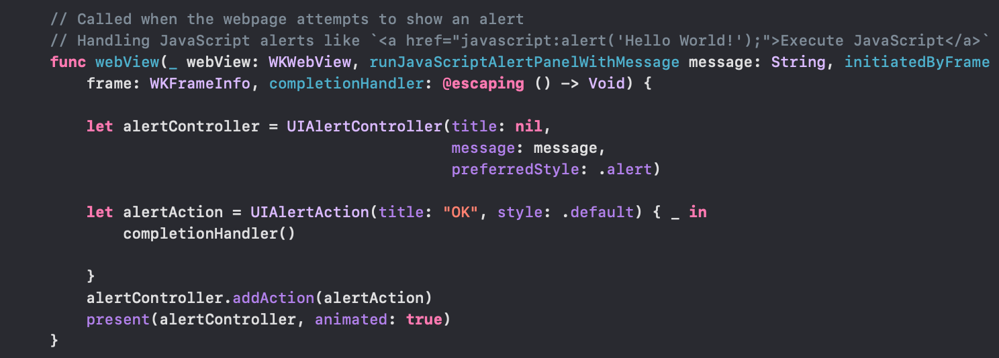
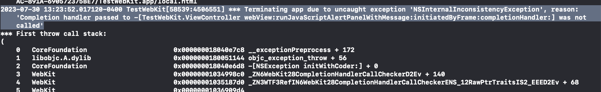
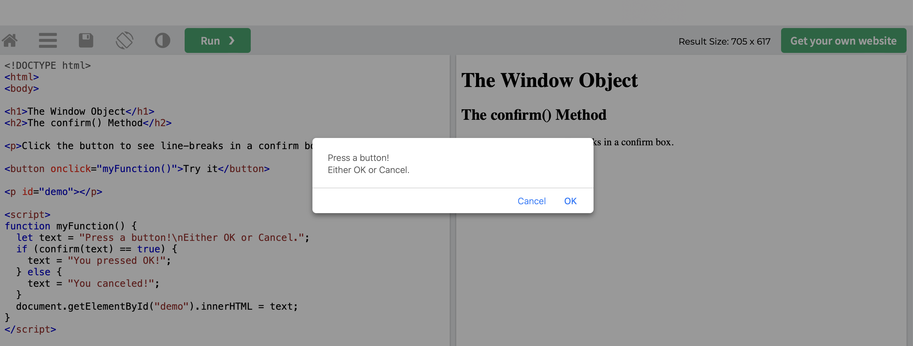
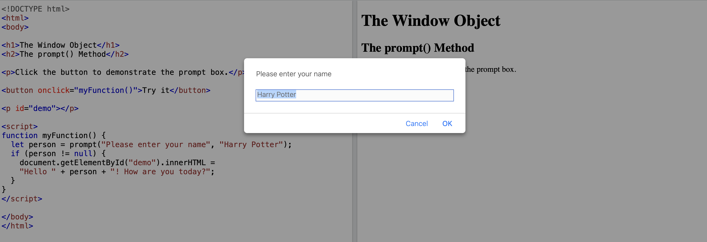
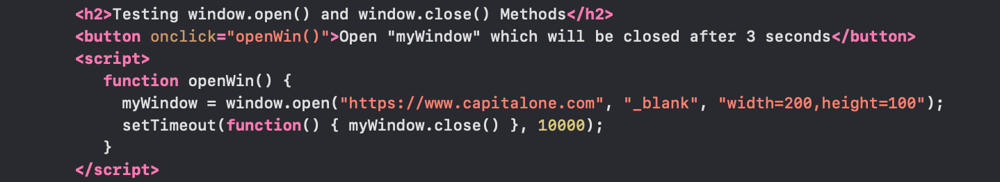
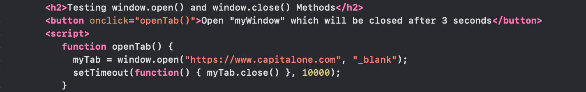
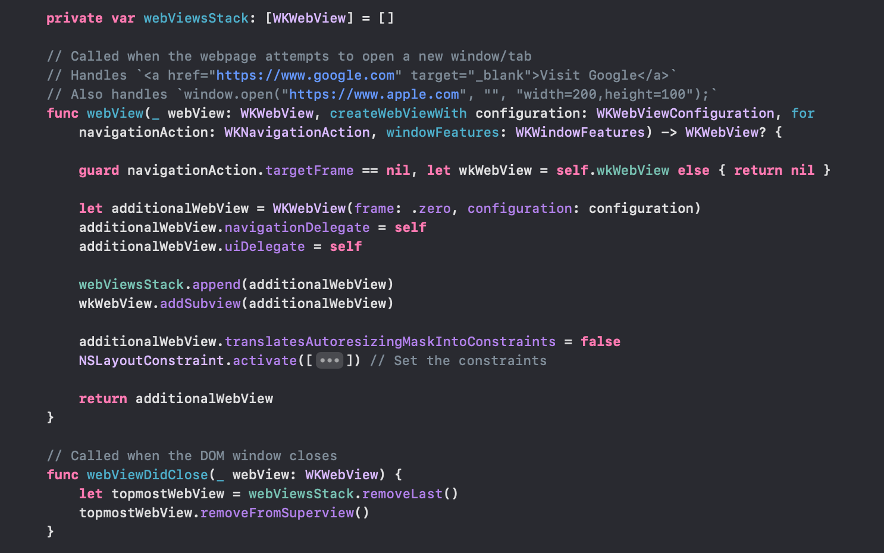

[toc]

`WKUIDelegate` is the protocol whose functions are called anytime the built-in web view implementation delegates the control of  opening of new windows, tabs, etc. ([Reference](https://developer.apple.com/documentation/webkit/wkuidelegate))

> The default `WKWebView` implementation assumes one window per web view, so to show additional windows, tabs, etc. this delegate needs to be implemented. And then new windows, tabs, alerts, etc. can be shown on top of the current webview. The code needs to keep track of all webviews it stacks up, so that it can also intelligently close/remove them as needed.

Test app - TestWebKit<br>Sample tutorial code - [Marco Eidinger](https://blog.eidinger.info/how-to-handle-popups-and-alerts-in-wkwebview)<br>

##### Displaying UI panels

###### Displaying a JS alert panel (`runJavaScriptAlertPanelWithMessage`)

When the webpage attempts to diaplay a JS alert panel, `webView(_: WKWebView, runJavaScriptAlertPanelWithMessage: String, initiatedByFrame: WKFrameInfo, completionHandler:`_ is invoked. Its the responsibility of this function to show an appropriate native UI (the alert panel's message, etc. are passed to it.)

Sample JS code that launches alerts like this.

```
<a href="javascript:alert('Hello World!');">Execute JavaScript</a>
```

The panel should have a single OK button. Tapping on that button automatically dismisses the displaying alert controller, i.e. there is no need to call `dismiss()` explicitly from the native code.



The `completionHandler` passed in the fourth argument has to be called after the alert controller has been dismissed, or else there is a runtime exception. Hence, the common practice is to call it from the UIAlertAction's button tap handler.



The `async` version of this function.

```
optional func webView(_ webView: WKWebView, runJavaScriptAlertPanelWithMessage message: String, initiatedByFrame frame: WKFrameInfo) async {}
```

###### Displaying other kinds of JS panels

Similar to above, there are delegate callbacks for JS confirm panel, and JS text input panel.

For displaying confirm panel - `func webView(WKWebView, runJavaScriptConfirmPanelWithMessage: String, initiatedByFrame: WKFrameInfo, completionHandler: (Bool) -> Void)`

For displaying text input panel - `func webView(WKWebView, runJavaScriptTextInputPanelWithPrompt: String, defaultText: String?, initiatedByFrame: WKFrameInfo, completionHandler: (String?) -> Void)`

| Confirm panel                                                | Text input panel/prompt                                      |
| ------------------------------------------------------------ | ------------------------------------------------------------ |
|  |  |


##### Creating and closing the web view

###### Opening new window/tab, and closing it (`createWebViewWith`, `webViewDidClose`)

Sample JS code for opening new window/tab and then closing it, which needs to be intercepted by native WebKit code for both the opening and closing.

| JS code that opens new window                                | JS code that opens new tab                                   |
| ------------------------------------------------------------ | ------------------------------------------------------------ |
|  |  |

When a new window/tab opening is attempted, `webView(_:createWebViewWith:for:windowFeatures:)` is called. It needs to create a new webview for the new window/tab, show it, and then return it too. The passed `WKNavigationAction`'s `targetFrame` should be verified as being nil to ensure its indeed a new window/tab being opened. The created webView should have the passed `WKWebViewConfiguration` tied to it.

When a DOM window/tab is closed (JS - `window.close()`), `webViewDidClose(WKWebView)` is called and the native code should take care of removing/hiding the corresponding WKWebView. For this, it has to somehow keep a track of the webview when it was shown in the first place.



##### Displaying a contextual menu

##### Requesting permissions

##### Displaying an edit menu

##### Displaying an upload panel