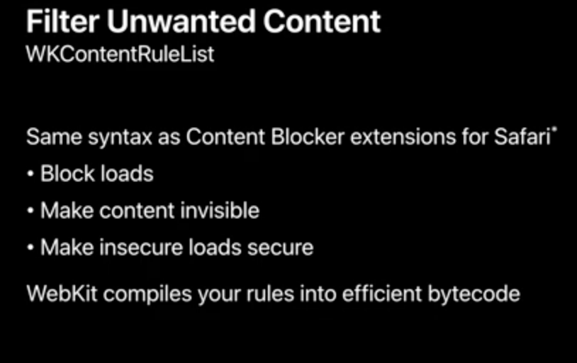
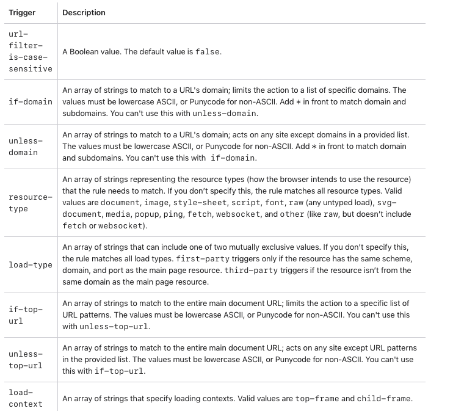
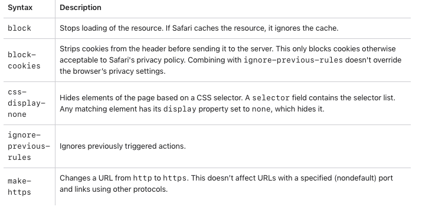
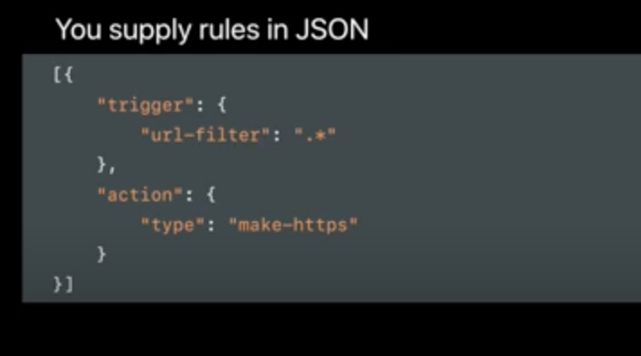
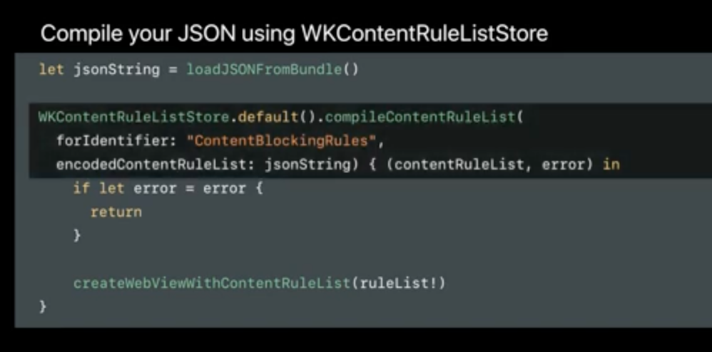
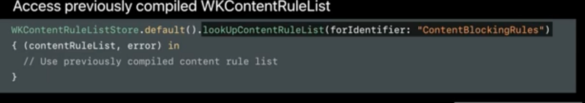

[toc]

`WKUserContentController` is an object used for managing interactions between JS code and the native web view code, and also for filtering content in the web view.

##### Adding and removing message handlers

###### Two-way communication JS- webview (`WKScriptMessageHandler`, `WKScriptMessageHandlerWithReply`)

Web browsers have a `window.postMessage()` method ([reference](https://developer.mozilla.org/en-US/docs/Web/API/Window/postMessage)) that is used for cross-origin communication, i.e. communication between different window objects. This is the mechanism that can be used to receive messages in native webview code from the JS code in the webpage.

The message can be posted from webpage using a code such as this (notice the `postMessage` in the script part).

> The JS message has to be posted using `window.webkit.messageHandlers.*.postMessage()` function.

```javascript
<label class="switch">
    <input type="checkbox" name="myCheckbox">
    <span class="slider round"></span>
</label>

<script>
      var _selector = document.querySelector('input[name=myCheckbox]');
      _selector.addEventListener('change', function(event) {
          var message = (_selector.checked) ? "CUSTOM MESSAGE FROM JS 1" : "CUSTOM MESSAGE FROM JS 2";
          if (window.webkit && window.webkit.messageHandlers && window.webkit.messageHandlers.xyzMessageHandler) {
              window.webkit.messageHandlers.xyzMessageHandler.postMessage({
                  "message": message
              });
          }
      });
</script>
```

And then it can be received in the native code by an object that conforms to `WKScriptMessageHandler` protocol. The user content controller needs to be accessed using webView's configuration object, and then a message handler attached to it. The messageHandler string should be same as the one in the JS code.

```swift
class ViewController: UIViewController, WKScriptMessageHandler {

  let contentController = wkWebView.configuration.userContentController
  contentController.add(self, name: "xyzMessageHandler")

  func userContentController(_ userContentController: WKUserContentController, didReceive message: WKScriptMessage) {
    guard let dict = message.body as? [String: AnyObject] else { return }
    print(dict)
  }
}
```

> Keep in mind that the `WKUserContentController` object needs to be tied to the WKWebView in some fashion (usually through the WKWebViewConfiguration object), having a fresh userContentController object and not tying it to the web view does not work. Also, it should be tied to the web view before the web view is created (happens automatically if it gets tied to the configuration object).

[Sample tutotial (Diamantidis)](https://diamantidis.github.io/2020/02/02/two-way-communication-between-ios-wkwebview-and-web-page) <br>[Sample tutorial (Ray Kim)](https://medium.com/capital-one-tech/javascript-manipulation-on-ios-using-webkit-2b1115e7e405)

> If the message posted by webpage's JS is not handled by the native webview, there is a JS console message that says 'javascript on loaded page finds window.webkit is undefined'. This JS console message can be seen using Safari's web inspector.

If a response has to be provided back to JavaScript, it can be done using the `WKScriptMessageHandlerWithReply` protocol. [Reference](https://developer.apple.com/documentation/webkit/wkscriptmessagehandlerwithreply) <br>[Example link](https://stackoverflow.com/questions/65270083/how-does-the-ios-14-api-wkscriptmessagehandlerwithreply-work-for-communicating-w)

In iOS. The reply is sent by invoking `replyHandler` closure received in the delegate, the firsta rgument should be used to indicate a successful response and the second argument for any kind of error response.

```swift
extension ViewController: WKScriptMessageHandlerWithReply {
    func userContentController(_ userContentController: WKUserContentController, didReceive message: WKScriptMessage, replyHandler: @escaping (Any?, String?) -> Void) {
        if message.name == JavaScriptAPIObjectName, let messageBody = message.body as? String {
            print(messageBody)
            replyHandler("response back to JS", nil ) // first var is success return val, second is err string if error
        }
    }
}
```

In JS. The reply should be handled from the promise of the same message that was posted to begin with.

```javascript
var promise = window.webkit.messageHandlers.xyzHandler.postMessage(inputInfo);
promise.then(
  function(result) {
    console.log(result);
  },
  function(err) {
    console.log(err);
  })
```


###### Other functions

There are several `WKUserContentController` functions that exist which can add and remove message handlers.

```
func add(WKScriptMessageHandler, name: String)
func add(WKScriptMessageHandler, contentWorld: WKContentWorld, name: String)
func addScriptMessageHandler(WKScriptMessageHandlerWithReply, contentWorld: WKContentWorld, name: String)

func removeScriptMessageHandler(forName: String)
func removeScriptMessageHandler(forName: String, contentWorld: WKContentWorld)
func removeAllScriptMessageHandlers(from: WKContentWorld)
func removeAllScriptMessageHandlers()
```

> So what does this mean? I can add/remove message handlers to the `WKUserContentController` I receive in the `WKScriptMessageHandler` delegate function? Need to understand it better.

You can also inject `WKScriptMessageHandlers` into a specific content world to isolate them as well.

> Explained in 'WWDC20 - Discover WKWebView enhancements'

##### Adding and Removing Custom Scripts

##### Adding and Removing Content Rules

##### Filtering unwanted content (`WKContentRuleListStore`, `WKContentRuleList`)

`WKContentRuleList` is what is used to conditionally filter content. Has same syntax as the content blocker extensions for Safari. Can even block cookies from being sent out in certain requests.  Can also run regular expressions on the URL of the current frame. 



When the rule list is provided to WebKit, it converts the rules into an efficient bytecode format and its supposed to be very performant (as of ~2017). The full list of supported triggers and actions is probably [this](https://developer.apple.com/documentation/safariservices/creating_a_content_blocker).

| Triggers                                                     | Actions                                                      |
| ------------------------------------------------------------ | ------------------------------------------------------------ |
|  |  |

Rules are specified in a JSON format. It has pairs of triggers and actions. `make-https` action for instance means that every request should be converted to https (the destination server though ofcourse needs to be able to support https).

After the content has been loaded, that is when it should be tied to the webview (i.e. when webview should be created).

| 1. Specify rules in JSON                                     | 2. Tie the rules to `WKWebView ` using `WKContentRuleListStore` | 3. Easily access previosuly compiled `WKContentRuleList`     |
| ------------------------------------------------------------ | ------------------------------------------------------------ | ------------------------------------------------------------ |
|  |  |  |

> Demo code shown in the 'WWDC 2017 - Customizes Loading in WKWebView' video at 19:00 mark.
