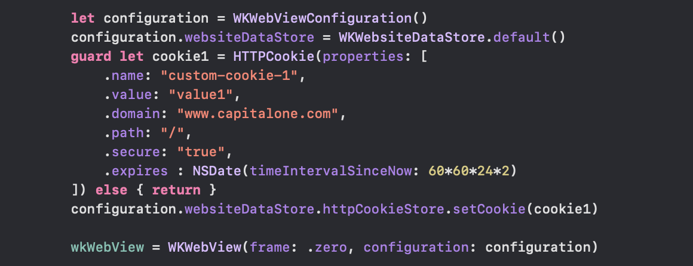
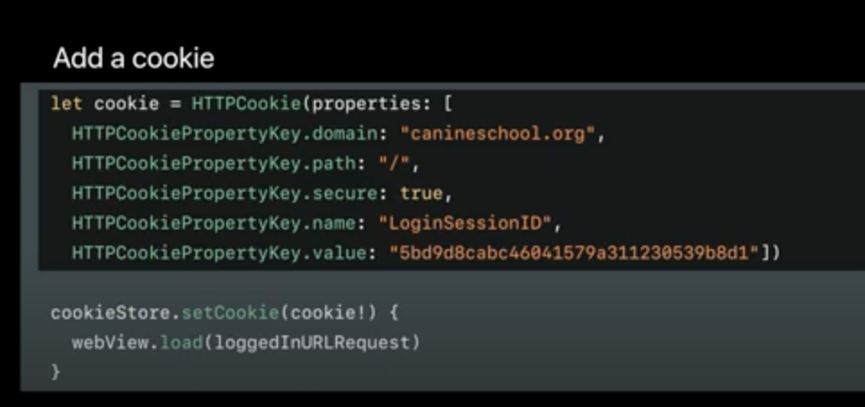
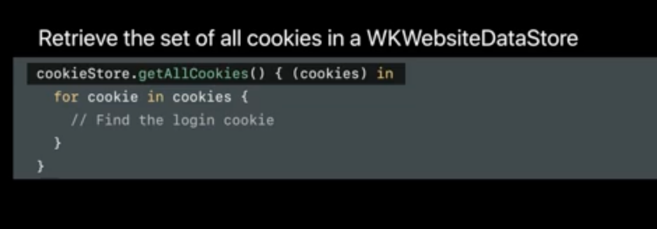
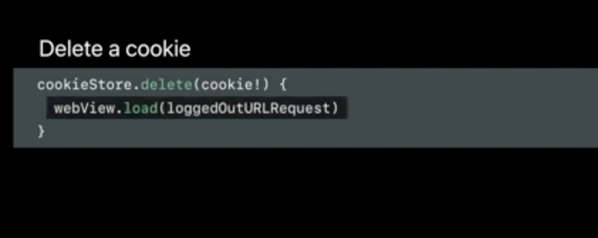
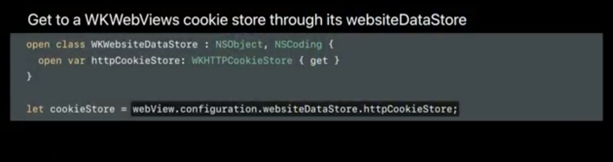
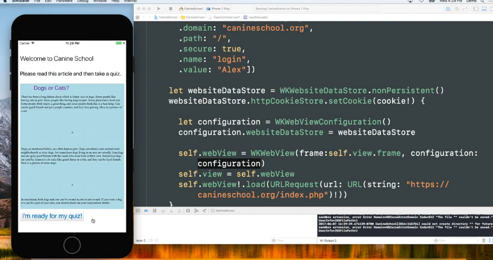

[toc]

`WKWebsiteDataStore` is the higher level class used to work with cookies, disk and memory cache, etc. [reference](https://developer.apple.com/documentation/webkit/wkwebsitedatastore)<br>`WKHTTPCookieStore` is the specific class used to work with cookies in particular ([reference](https://developer.apple.com/documentation/webkit/wkhttpcookiestore)).

##### Default and non-persistent data stores

A data store object needs to be created and assigned it to the `websiteDataStore` property of a `WKWebViewConfiguration` object before the `WKWebView` is created. This data store then has a property named `httpCookieStore` to work with cookies.

A data store has to be marked as being of the type `default` (i.e. persistent) or `nonPersitent` at the time of creation. The nonpersistent type does not persist anything in cache and hence stays only as long as webView is accessed. Its typcially used for private browsing sessions.

##### Accessing data store of a webView

For accessing the existing dataStore of a webView, its configuration has to be used.

```
wkWebView.configuration.websiteDataStore.httpCookieStore.getAllCookies { cookies in
    cookies.forEach {
        print("\($0.domain): \($0.name) - \($0.value) - \($0.expiresDate)")
    }
}
```

##### Cookie attributes matter

Also, keep in mind that the `expires` attribute of the cookie matters. If none is specified, it will last only as long as the webView is in memory. While creating/parsing a cookie, there are `HTTPCookie` properties for various standard attributes.



##### Common cookie related functions

All cookie functions work with a completion handler (as cookie access takes some time to complete across all processes), so any further code should only be in that.

| Adding a cookie                                              | Getting all cookies                                          | Removing a cookie                                            |
| ------------------------------------------------------------ | ------------------------------------------------------------ | ------------------------------------------------------------ |
|  |  |  |

There are even functions such as `removeData(ofTypes: Set<String>, modifiedSince: Date) {}` which allow to remove all cookies added in previous one hr, etc.

> It isn't that WKWebView can access Safari cookies, but it can persist cookies that were saved using it, and later access it (regardless of domain).

##### Observing cookie store for changes

The cookie store can also be observed for changes.



##### Example

> So over here when the `WKWebView` loads data, the cookies its sending have been appropriately modified using the `WKHTTPCookieStore` and a richer experience can hence be provided. <br><br>

> Demo code shown in the 'WWDC 2017 - Customizes Loading in WKWebView' video at 16:30 mark.

##### Misc.

In initial days of `WKWebView`, you could only use JS to get a list of all cookies the webview has access to but it could not get the HTTPonly cookies. Access to `HTTPonly cookies` is now possible in WKWebView (since ~2017). 

There is also `WKWebsiteDataRecord` that does something regarding the type of data stored by websites ([reference](https://developer.apple.com/documentation/webkit/wkwebsitedatastore)).

Interesting [SO post](https://stackoverflow.com/a/39899217/1135417) from 2020 regarding persistent cookies.

Keep in mind that `NSHTTPCookieStorage` is something else. Its used or managing cookies in usual API calls outside webViews. It was also used by now deprecated UIWebView. ([reference](https://developer.apple.com/documentation/foundation/nshttpcookiestorage))
