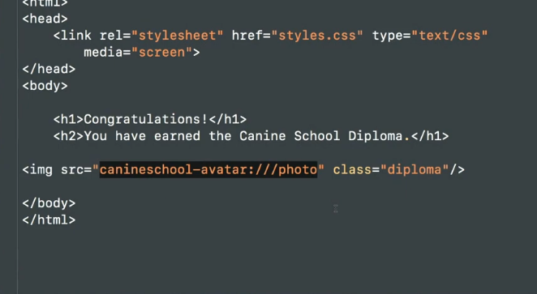
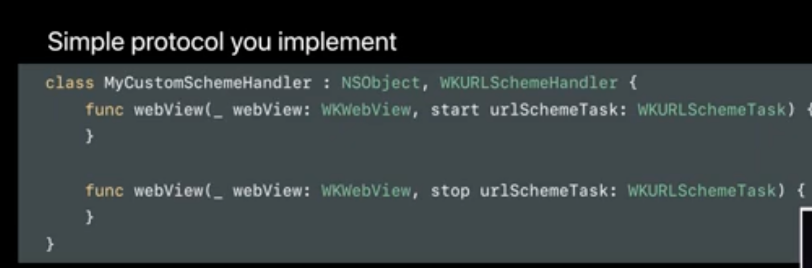
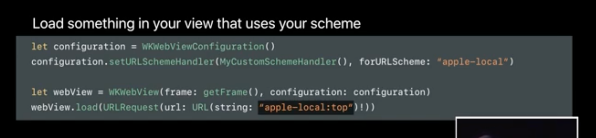
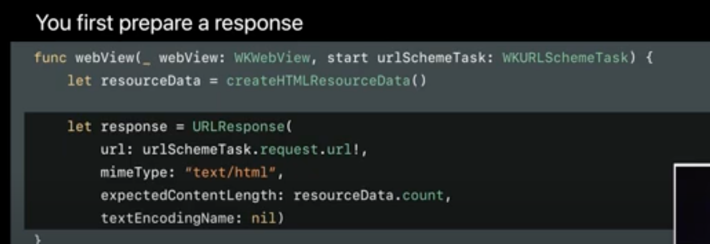
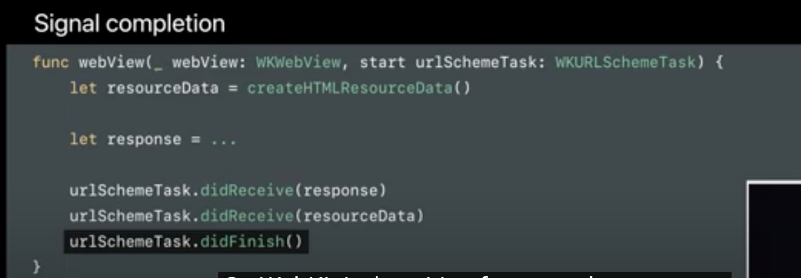
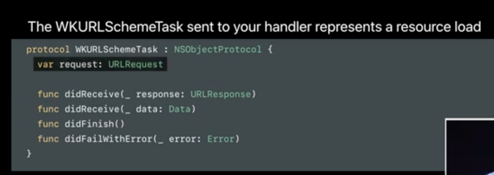

[toc]

##### Accessing custom native resources (`WKURLSchemeHandler`)

`WKWebView` can get access to local native app resources (i.e. photos, or even API response payloads from native calls, etc.).  Done using `WKURLScheme`, `WKURLSchemeHandler`, `WKURLSchemeTask`.

> So for something like this where the rendered webpage is trying to access a custom URL scheme, the request will reach native WKWebView code and it will be able to hand it back to the webpage's HTML/JS.     

The native resource is specified using a `WKURLScheme`, and it needs to be any URL scheme which WebKit does not handle itself.  An instance conforming to `WKURLSchemeHandler` protocol is where the resource laod request is started and then the response completion informed to the webview (through a `WKURLSchemeTask`).

| 1. Conform to `WKURLSchemeHandler` protocol for the custom scheme | 2. Get the `WKWebView` to load a URL having that scheme      |
| ------------------------------------------------------------ | ------------------------------------------------------------ |
|  |  |

| 3. In handler delegate, fetch the data and create the response instance (i.e. start the loading of resource) | 4.  Once done, call the task's delegate functions            |
| ------------------------------------------------------------ | ------------------------------------------------------------ |
|  |  |

The handler receives a `WKURLSchemeTask` instance which respresents a resource load.

>  Demo code shown in the 'WWDC17 - Customized Loading in WKWebView' video at 28:24 mark.