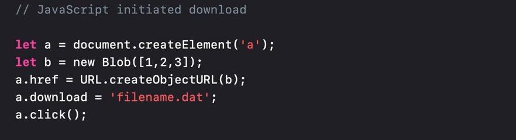
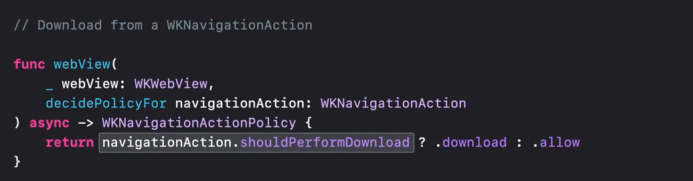
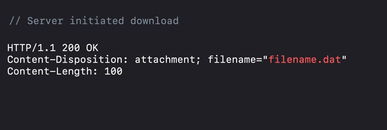
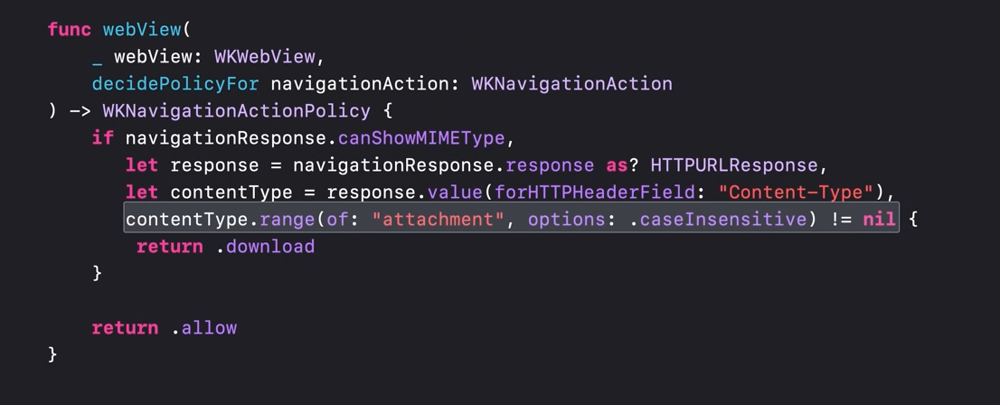
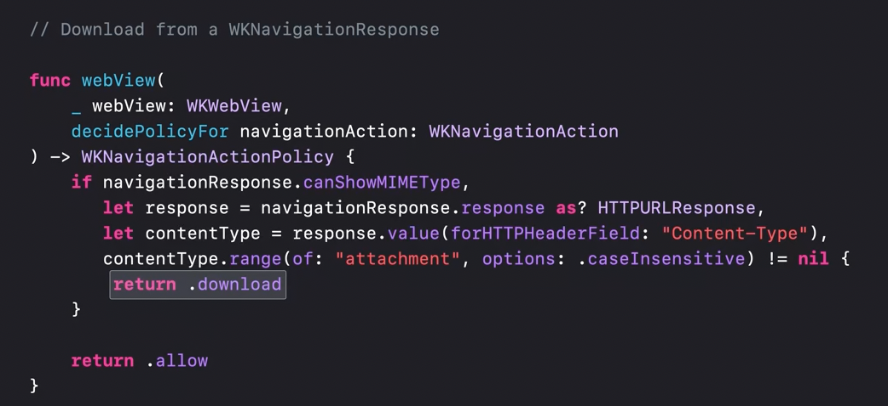

[toc]

#### Managing downloads from web views

> Need to try these to understand better.

There are three ways to initiate a download. 

1. The web content JS can initiate a download

| 1. Web starts download with a code like this                 | 2. Native app has this delegate called, `shouldPerformDownload` property should be set |
| ------------------------------------------------------------ | ------------------------------------------------------------ |
|  |  |

2. The server can initiate a download

   | 1. Server initiates download in HTTP like this               | 2. `WKNavigationResponse` then gets a a `Content-Disposition` header field with a value containing `attachment`. A `WKNavigationPolicyDownload` should be returned to start the download |
   | ------------------------------------------------------------ | ------------------------------------------------------------ |
   |  |  |

3. The native app code can initiate a download. Done using `WKDownload`.

   

> Shown in 'WWDC21 - Explore WKWebView additions'

