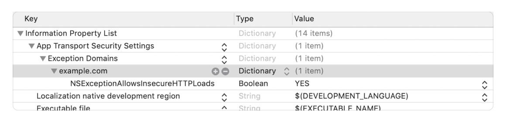

##### Suppressing ATS checks (`NSAllowsArbitraryLoadsInWebContent`, `NSExceptionAllowsInsecureHTTPLoads`)

> ATS requires that all HTTP connections made with the [URL Loading System](https://developer.apple.com/documentation/foundation/url_loading_system)—typically using the [`URLSession`](https://developer.apple.com/documentation/foundation/urlsession) class—use HTTPS. It further imposes extended security checks that supplement the default server trust evaluation prescribed by the Transport Layer Security (TLS) protocol. ATS blocks connections that fail to meet minimum security specifications. 

 ([ATS reference](https://developer.apple.com/documentation/security/preventing_insecure_network_connections))

If app's Info.plist has `NSAllowsArbitraryLoadsInWebContent` marked as true, then App Transport Security (ATS) restrictions are disabled for requests made from web views. Things like HTTPS being necessary for all web view requests are not imposed anymore. If this key however is to be used in production, an explanation needs to be given to Apple at the time of app submission.

The ATS exception can also be limited to a single domain by using `NSExceptionAllowsInsecureHTTPLoads ` .

