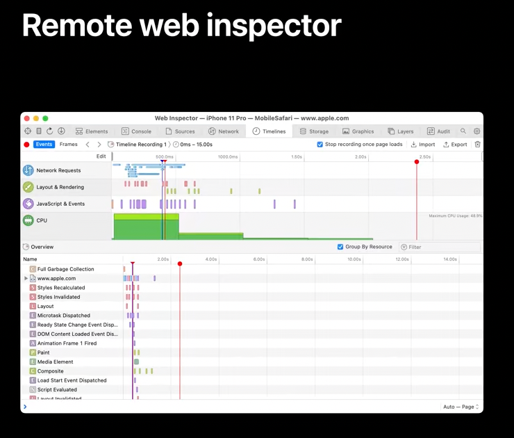

[toc]

##### Remote web inspector

Turn on Web Inspector in Safari settings on the iOS device, then enable the Develop menu in Advanced Settings in Safari on your Mac.  You can explore the DOM, run and debug JavaScript execution, view timelines of your page-loading, etc.

|  |  |
| ------------------------------------------------------------ | ------------------------------------------------------------ |

> Shown in 'WWDC22 - What's new in WKWebView'