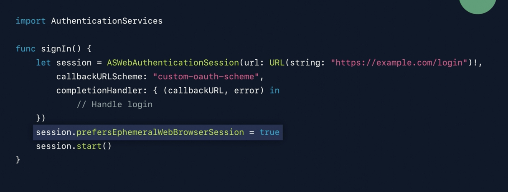
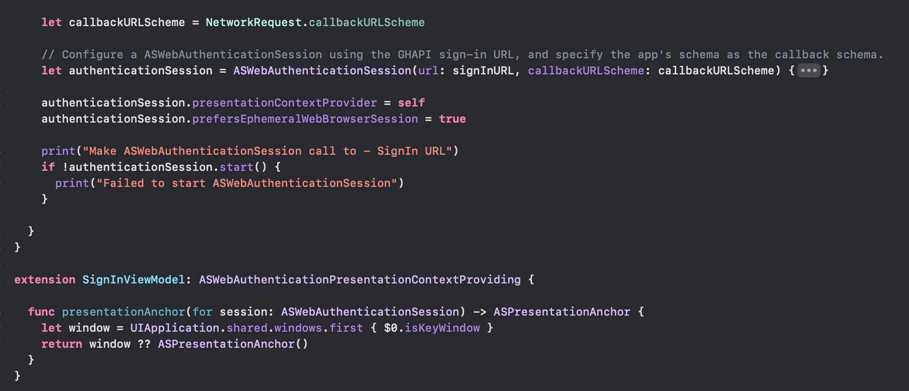
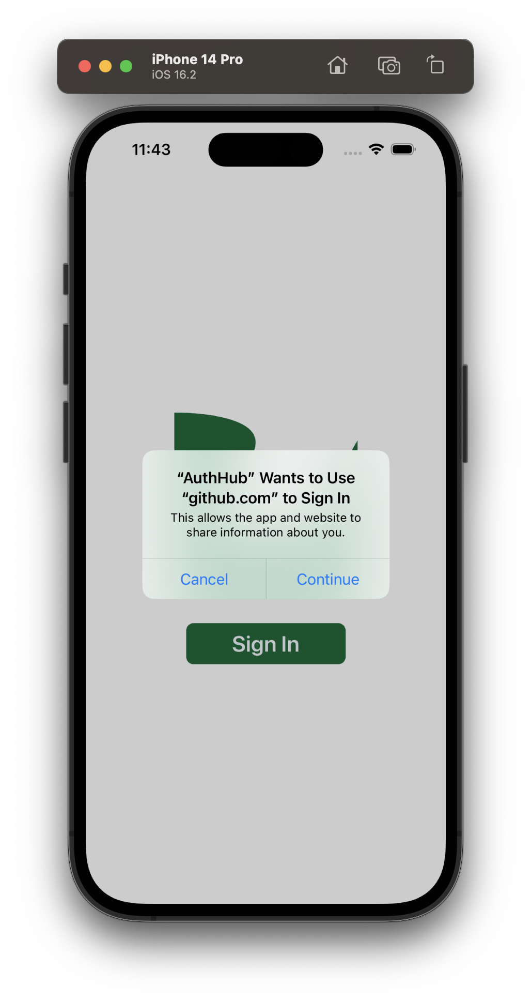
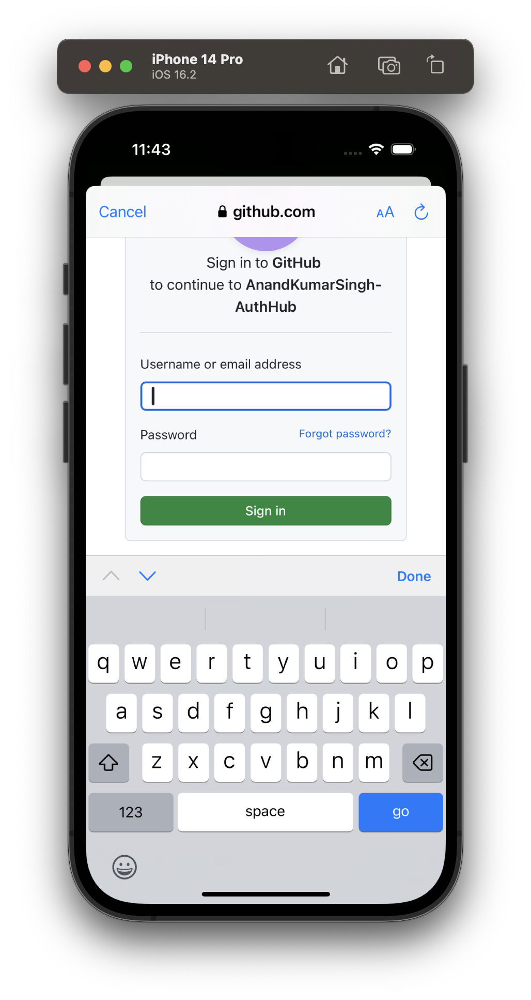
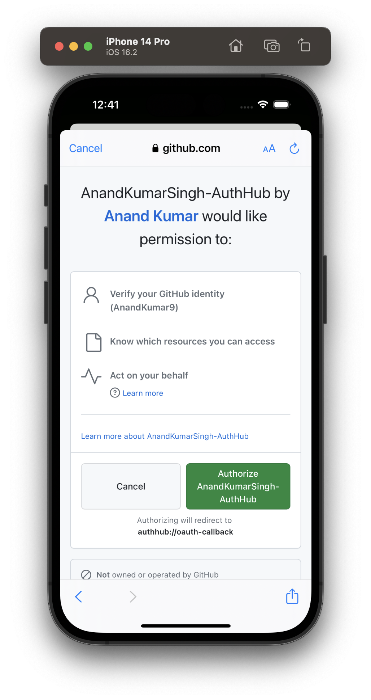

[toc]

##### What is ASWebAuthenticationSession

Essentially, it is a way to connect to an eternal identity provider that uses OAuth for authentication and get tokens back. It needs to be initialized with the identity provider's sign-in page URL (client ID, etc. typically appended as query params), host app's URL schema, and a completion handler. The OAuth tokens are received by host app in the completion handler, as query params appended with host app's URL schema. That's it, that is the gist of it.

Another benefit is also that if a user has already got the identity provider's password, cookies, etc. saved in their device those easily get reused while doing sign-in (for this the prefersEphemeral property should not be used though.

##### Code snippet

Once `start()` is called, iOS automatically launches a web browser and goes to the passed URL. The website's code then runs, and is responsible for establishing the user's identity (through a fresh sign-in if needed) and once done, invoking the schema the session was instantiated with, and passing the required tokens as the schema's query params.

`prefersEphemeralWebBrowserSession` allows the user session that starts for the identity provider to be short enough so that user is not signed in there beyond the native app's current lifecycle. In the absence of it, a new sign in may not be needed everytime the ASWebAuthenticationSession is used (and that's actually not desirable).

Typically a `presentationContextProvider ` also needs to be provided for the  `ASWebAuthenticationSession` instance. It needs to be of the type `ASWebAuthenticationPresentationContextProviding`and is meant to be a 'display context' for the web view that is brought up (something like current `UIWindow`). Typically its just boilerplate code like this.

So the onus is indeed also on the identity provider website to trigger the received URL schema (with OAuth tokens appended to it) once sign-in has been done, else it will not work.

> On macOS, the sign in happens on user's preffered web browser.

###### Things not quite clear just yet

> When I tried giving a random URL schema that does not exist, there was an error while running which said this schema is not valid. How did it know that. Even in the test project, the schema that worked its not like that schema was declared anywhere in project settings. Did it just assumed that if the schema matches the app name, it can be deemed valid.

> Why can't this mechanism be used to just use as a regular web view, what if the received URL schema is never trigerred by the website. Is there a penalty of sorts?

##### What does the UI feel like (screenshots)

| 1. Initial confirmation modal (shown only if `prefersEphemeral` property is false) | 2. Provided sign-in URL shows up in a webview automatically | 3. The website may have its own confirmation screens after sign in |
| ------------------------------------------------------------ | ----------------------------------------------------------- | ------------------------------------------------------------ |
|                                 |                                |                                 |

##### About the test project I tried

TestASWebAuthSession (test project based on [Kodeco tutorial](https://www.kodeco.com/19364429-implementing-oauth-with-aswebauthenticationsession), does a OAuth to GH)

There are 4 URLs in it -

Accessed using `ASWebAuthSession` - SignIn URL  
Accessed through plain API calls after above gives an OAuth token - GetAccessToken, GetUserDetails, GetRepos

For doing an OAuth to GH, an 'app' (i.e. a consumer of GH APIs) is first created in GitHub and these static things are received - App ID: 320525, Client ID: Iv1.48e1ea6157951702, Client secret - 72eaa15387aaf6cf809bb50a6177c2dd63660fbb

The sign in URL - https://github.com/login/oauth/authorize?client_id=YOUR_CLIENT_ID_HERE

Responds with - authhub://appschema?code=b572deab26eec3eb164f

Subsequent sample API call - https://github.com/login/oauth/access_token?client_id=Iv1.48e1ea6157951702&client_secret=72eaa15387aaf6cf809bb50a6177c2dd63660fbb&code=b572deab26eec3eb164f

##### Misc.

`SFAuthenticationSession` was the predecessor for `ASWebAuthenticationSession` and has been deprecated since ~iOS 13 or so.

##### Resources and WWDC videos 

[Kodeco tutorial](https://www.kodeco.com/19364429-implementing-oauth-with-aswebauthenticationsession) (this is what I followed)

TestASWebAuthSession (TestProject based on above tutorial, does OAuth to GH)

WWDC 2019 - What's New in Authentication (12:20 - 14:50)

>  Check Faraz's Flask imeplementation for a local test server.

WWDC 2015 - Introducing Safari View Controller (OAUth covered 23:00 onwards). It talks about how SFSafariVC can be used for OAuth confirmations too (but is it still relevant?)