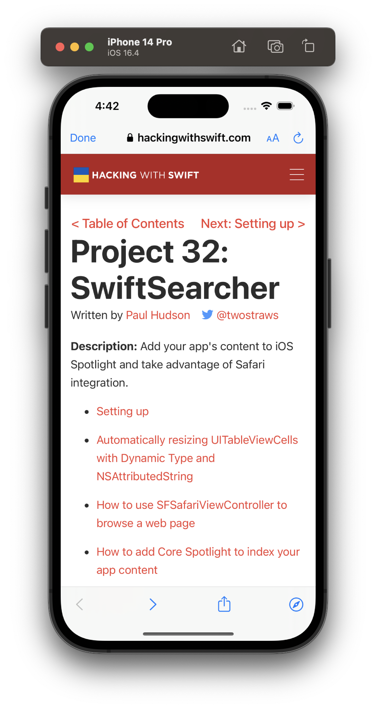
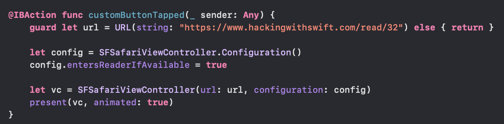
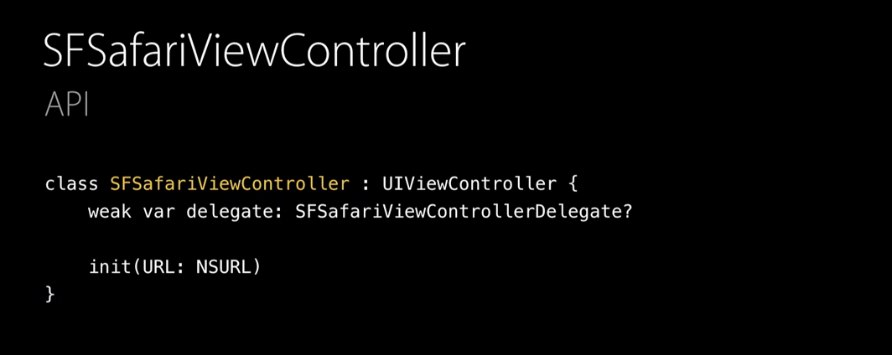
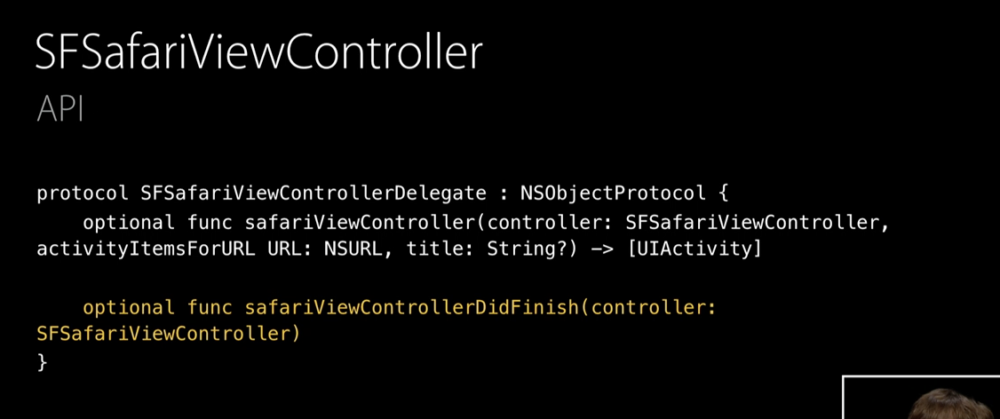
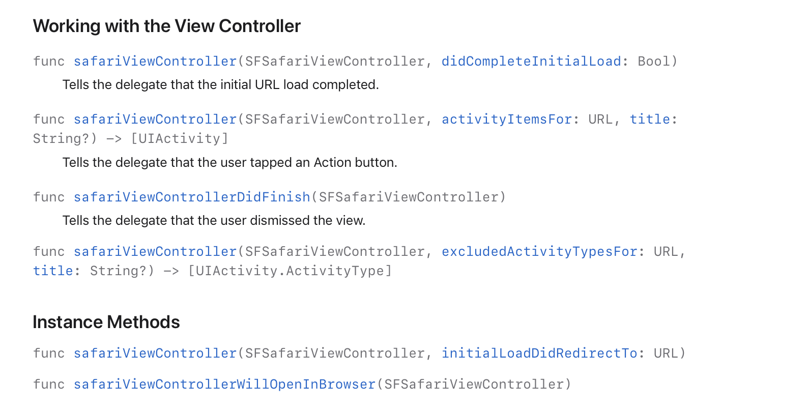

##### What is it

`SFSafariViewController` is a 'just like Safari' web view controller that can be used in apps, and it automatically provides nearly every feature that Safari provides (including cookie access for webpages). 

The URL address bar is readonly, Multiple tabs aren't there. It shares cookies and other website data with Safari. It also gives automatic access to password managers and credit card autofill, and in fact the reader view and share button too. The content blockers installed on the device for Safari work automatically too.

The host app cannot directly access any of this (cookie, etc.) though. It runs in a separate process than the application.

##### What does it look like

| No address bar, A Done button on top                         | No 'Open in new tab' option                                  |
| ------------------------------------------------------------ | ------------------------------------------------------------ |
|  |  |

##### Basic code

`SFSafariViewController.Configuration` is a class used for some basic configuration of the view controller. It has things like `entersReaderIfAvailable`, `barCollapsingEnabled`, `activityButton` (an additional button to be shown in SFSafariViewController's toolbar).

The done button can be customized to various styles (Done/cancel/close).

`SFSafariViewControllerDelegate` is the protocol which has methods for implementing custom event handling. The events being things like initial URL load completing, user tapping on an action button, user dismissing the view controller, asking what activity types (i.e. actions) to include/exclude for the share sheet for a given URL.

| SFSafariViewController                                       | SFSafariViewControllerDelegate                               |
| ------------------------------------------------------------ | ------------------------------------------------------------ |
|  |  |

##### SFSafariViewControllerDelegate

##### WWDC videos and Resources.

WWDC 2015 - Introducing Safari View Controller (OAUth covered 23:00 onwards). It talks about how SFSafariVC can be used for OAuth confirmations too (but is it still relevant with ASWebAuthenticationSession being there?)

WWDC 2017 - What's New in Safari View Controller (https://wwdctogether.com/wwdc2017/225)

##### Misc.

preferredBarTintColor, preferredControlTintColor
