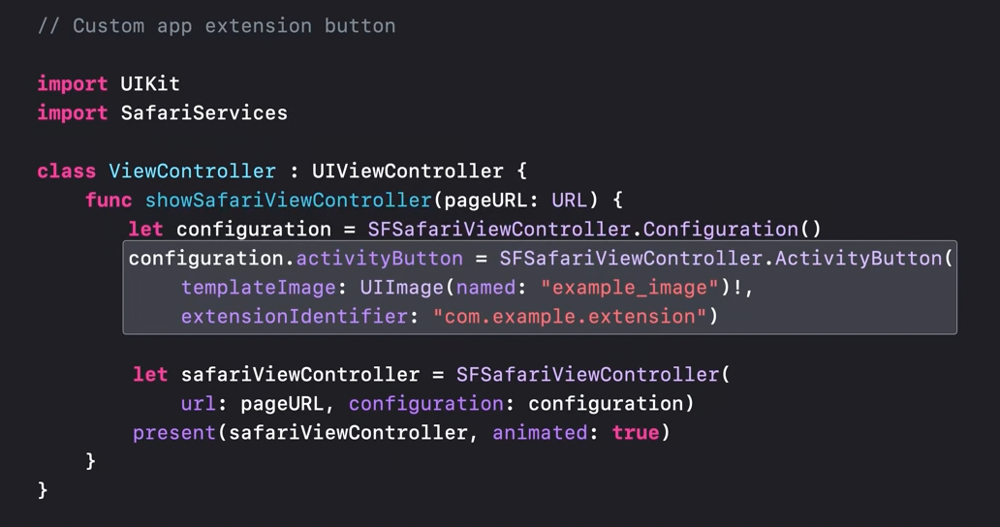

If you primarily need an in-app web browser and don't need deep customization of that experience, SFSafariViewController is the best choice for you and your users. Your users get Reader, content blockers, autofill and more, and you get a browser in a box. Built on top of WKWebView.

When you need a higher degree of configurability or are using web content in ways unrelated to browsing, you can also build on WKWebView directly. Isolates web content in a separate process. 

APIs to help you isolate your app and web content from one another.

Interact with web content via JavaScript.

##### SFSafariViewController.ActivityButton

`SFSafariViewController.ActivityButton` is probably a way to add a custom button to SafariVC, which can then invoke a specific share extension of the app.

> An Action button that invokes an activity view controller offering custom services from your app, and activities, such as messaging, from the system and other extensions. ([Reference](https://developer.apple.com/documentation/safariservices/sfsafariviewcontroller))

You can map this button to one of your app's share extensions, and you can even set an image for that button that will best represent the extension that will run, allowing users to run your app extensions directly from the toolbar, including running JavaScript on the page. 

