[toc]

#### Resources

MDN Web Extensions API ([link](https://developer.mozilla.org/en-US/docs/Mozilla/Add-ons/WebExtensions/API)) <br>Creating a Safari web extension ([Apple guide](https://developer.apple.com/documentation/safariservices/creating-a-safari-web-extension?language=objc)) <br>Building a Safari app extension ([Apple guide](https://developer.apple.com/documentation/safariservices/building-a-safari-app-extension?language=objc))

WWDC 2020: Meet Safari Web Extensions - **k**<br>WWDC 2021: Meet Safari Web Extensions on iOS - **k** <br>WWDC 2021: Explore Safari Web Extension Improvements - **k** <br>WWDC 2021: Discover Web Inspector improvements - <br>WWDC 2021: Design for Safari 15 - <br>WWDC 2022: What's New in Safari Web Extensions - **k** <br>Tech Talk 2022: Build and deploy Safari Extensions for iOS - **k** <br>WWDC 2023: What's New in Safari extensions - **k** <br>

----

#### WWDC 2020: Meet Safari Web Extensions

> Keep in mind that this brought re-architected web extensions to macOS (all using JS and web technologies), and this was brought to iOS only in  WWDC 2021.

Share (ie Action) extensions. These are also available on both iOS and macOS. Once invoked by the user, they're able to run JavaScript on the web page and return data to your app extension.

Safari app extensions available on Mac OS. These are great if you are a native app developer already familiar with Swift or Objective-C who wants to extend your app's functionality into Safari. 

Safari web extensions are built using classic web technologies. Still packaged with native apps.

manifest.json

There are three main parts of an extension. The background scripts, content scripts, and a popover. There's a special API that lets an extension communicate between these three parts as well as create keyboard shortcuts, access cookies, and more.

The background key defines which scripts make up the background page. These scripts have no visible UI and can contain the logic that drives your extension.

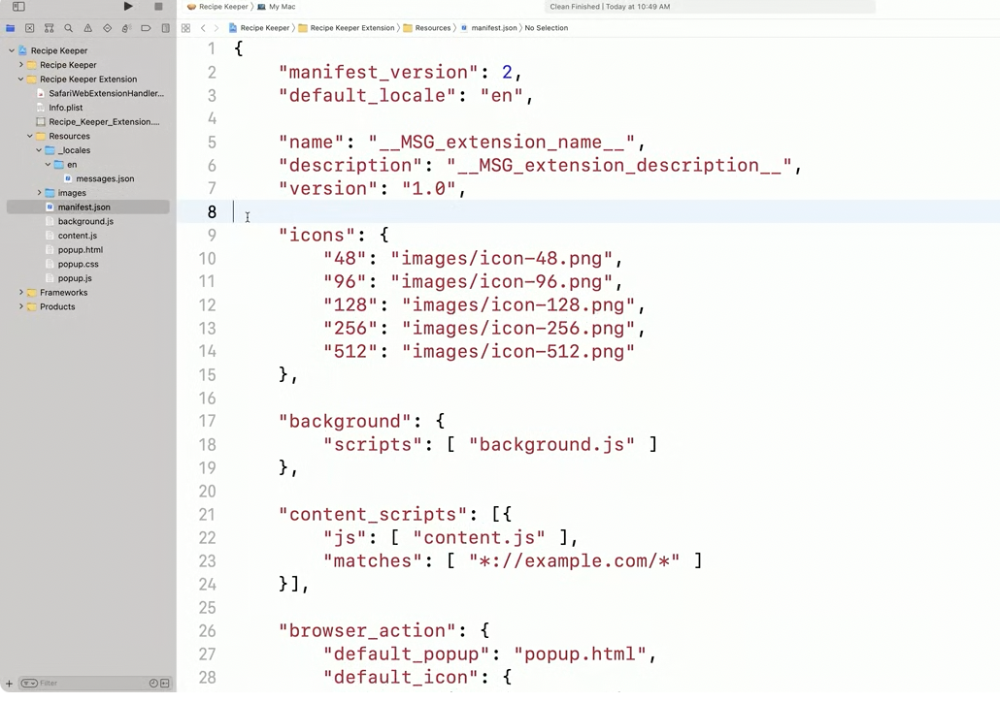

Content scripts are injected into web pages and can modify their appearance and function. These scripts execute in an isolated world, meaning they won't conflict with the web page's JavaScript. 

And finally a popover. Here the browser action key defines a popover that appears when the user clicks the toolbar button.

The permissions key defines privileges your extension has in Safari. You can put API names here, like cookies, which lets an extension read and set browser cookies. 

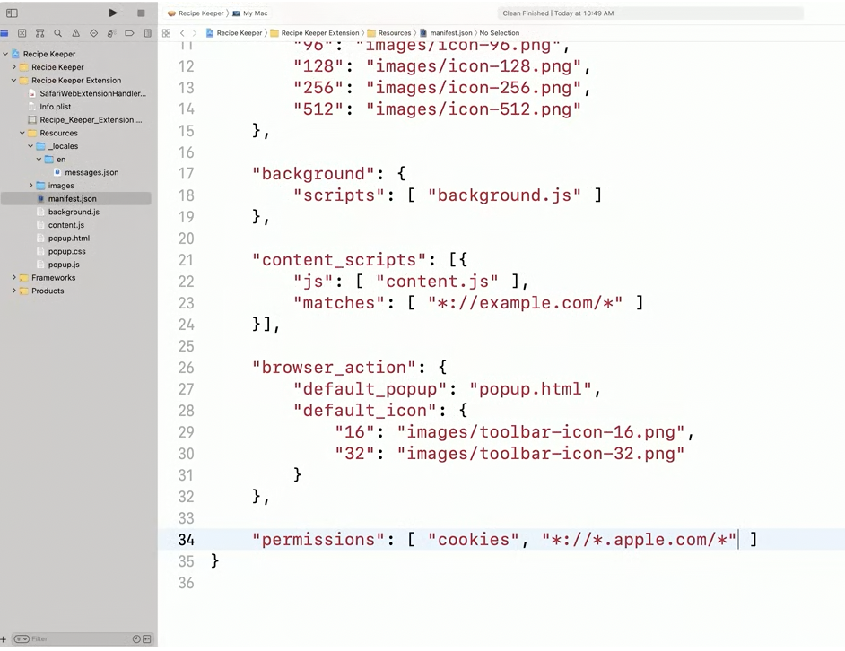

Permissions

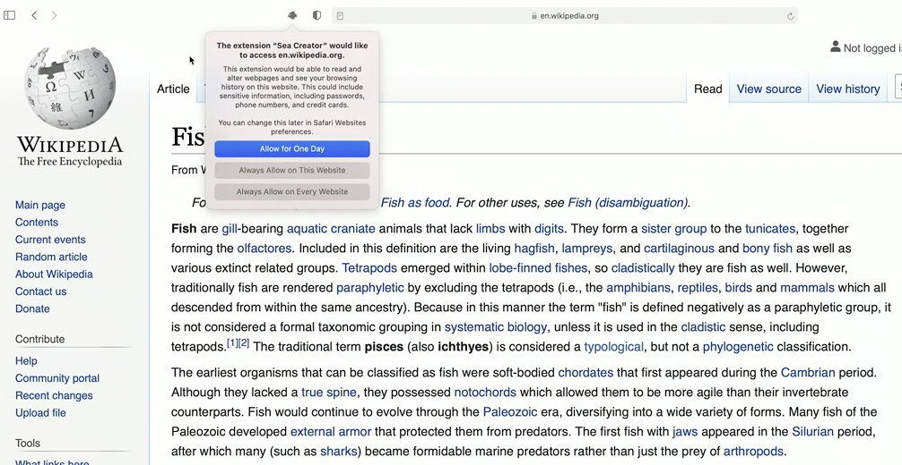

Optional permissions are used for permissions that aren't critical to your extension's functionality. 

The best way for an extension to respect user intention when it comes to privacy is by using the activeTab permission. With this permission, your extension is only granted access to know things about a tab like its URL, and inject script into the web page when your user expresses intent to use your extension with that tab very clearly

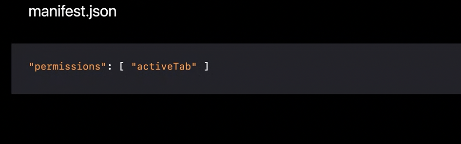

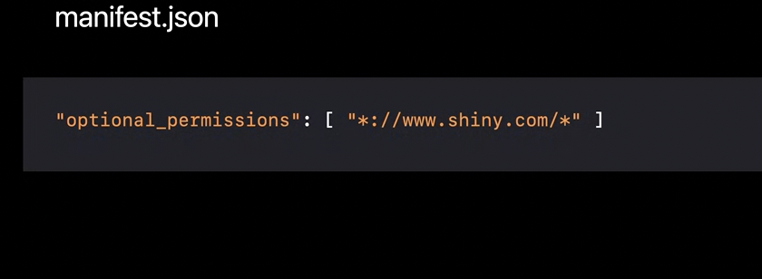

Communicating with container app

Unlike in other browsers, your extension is only allowed to communicate with its container app.

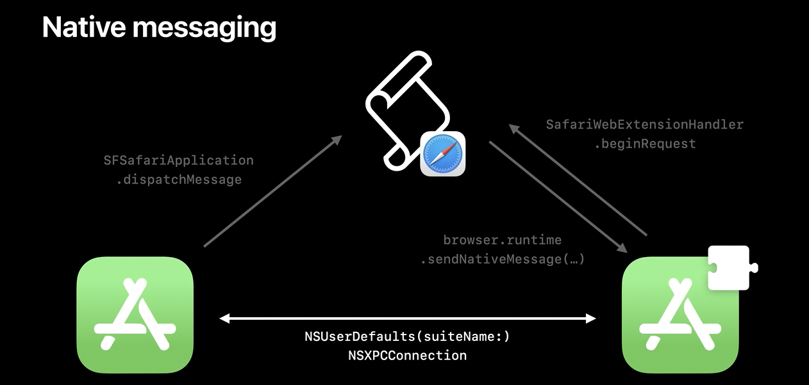

For communicating from background page to native app, use **browser.runtime.sendNativeMessag**e or **browser.runtime.connectNative**, and make sure you request the native messaging permission in your manifest.

If we want to go the other way and send a message from the app extension's native code to the background page, use the completion handler on the NSextension context object passed into **SafariWebExtensionHandler.beginRequest.** 

To send a message from your app to the extension's background page, you can use **SFSafariApplication.dispatchMessage**. To receive the message in the background page, you must have opened a port using browser.runtime.connectnative. 

And to communicate between the different components of your app group use NSUserDefaults or an XPC connection.

#### WWDC 2021: Meet Safari Web Extensions on iOS

WebExtension API has been available for all the major desktop browsers for a while, which means you can write a browser extension once and deploy it across various browsers.

brought the same Web Extensions permission model from Safari on the Mac to iOS, which means I, as the user, have full control over how much of my browsing extensions can access

safari-web-extension-converter tool to create an extension from one already created for another browser, or to add support to an existing Mac Safari extension

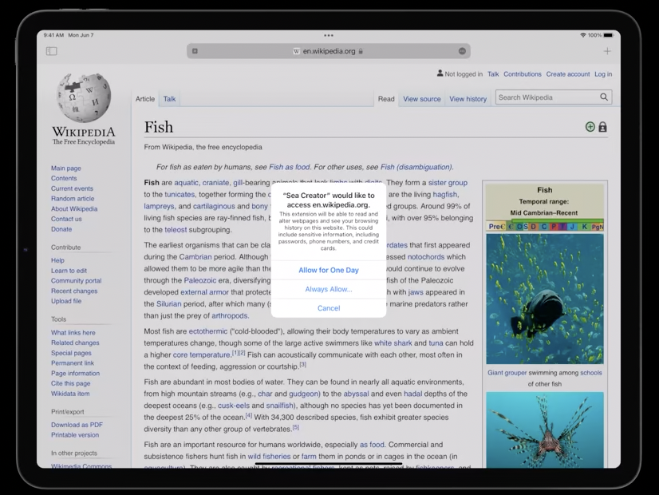

Popover possible here too

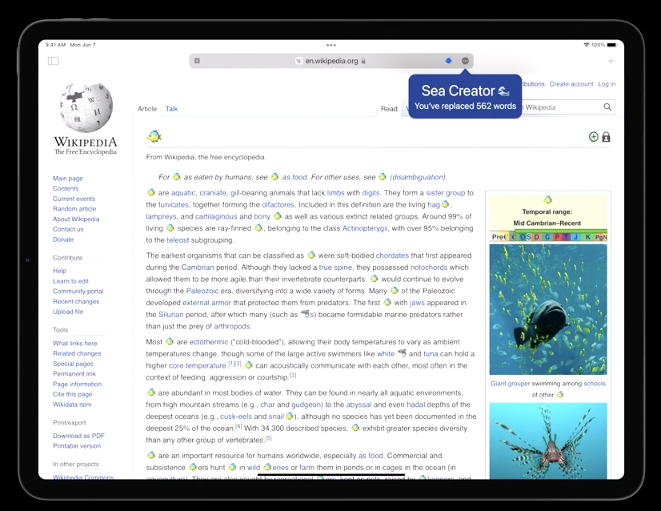

Default page possible in new tabs


To support Persistent background pages not supported in iOS extensions (as of 2021).

You can make a background page non-persistent, which means the browser will only load it when your extension actually needs to do work, and the browser can later unload that page when it's been idle for some time. Any extension that is marked as persistent (while porting from existing extension for other browsers) should be expicitly marked as non-persistent in the manifest.

manifest is a JSON file that describes the structure of the extension. It includes important information such as the extension's name, which websites it wants to access, and what features it supports, such as a pop-up page or a New Tab page

background script. The browser can run this script in the background when your extension is enabled, and it allows your extension to listen for various events coming from the browser or other parts of your extension.

content script. The browser automatically runs this script on web pages that the user visits. An extension can have any number of content scripts, and the manifest specifies which content scripts should run on which websites. This script gives your extension the power to extend and customize pages by directly manipulating them.

If your extension currently depends on handling mouse events for arbitrary clicks and drags, be aware that the same events won't be sent when the user taps on iOS. You should instead adopt the Pointer Events API. 

If your extension uses the Windows API, you should know that each scene of Safari actually has two windows: one for regular browsing and one for Private browsing. 

instead of unconditionally calling these APIs, conditionalize that code based on the existence of those APIs, so you can cleanly exclude parts of your extension and make it more flexible when it comes to which browsers it supports. 

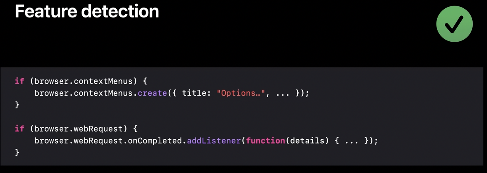


users with an opt-in model where extensions are only given access to websites when the user consents. 

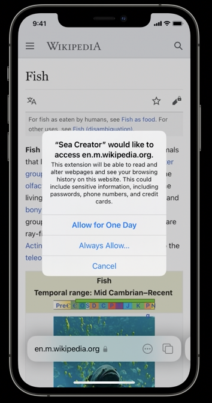

any API that reveals the URL or title of a tab will only include this info if your extension has permission for that URL. The Cookies API will only let your extension read and write cookies for websites your extension has permission for. And injecting JavaScript and stylesheets will only be allowed on websites where, you guessed it, your extension has permission.

If your extension's scripts call any of these APIs when your extension doesn't have the required permissions but hasn't asked the user yet, Safari will wait to call your completion handlers and will show a non-disruptive banner at the top of the screen. You should avoid requesting more permission this way than your extension really needs. 

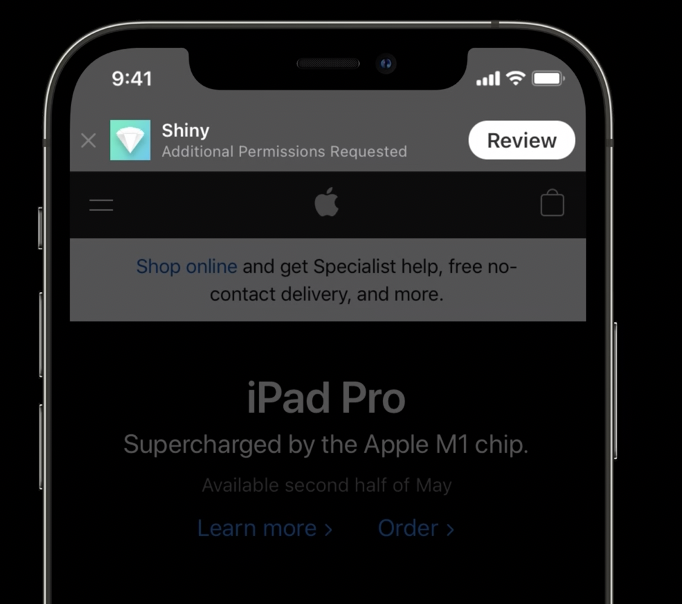

When your extension requests the activeTab permission, Safari will automatically grant your extension permission on tabs where the user explicitly uses your extension. And this permission will be limited to just the current website in just the current tab. So it'll be revoked if the user navigates that tab to a different website. Safari won't display a prompt when granting this permission, since there's no long-term commitment needed from the user.

-------

#### WWDC 2021: Explore Safari Web Extension Improvements

Goes over these web extension APIs in more details

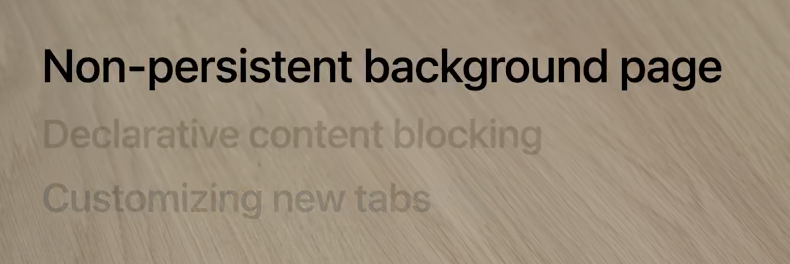

##### Non-persistent background pages

Web extensions are made using JavaScript, HTML, and CSS. Some extensions have a script that run in the background of the browser called a background page. It doesn't have any visible UI, but it can react to events like a tab opening or a message from another part of the extension.

Persistent background pages are like these invisible tabs that a user can never close, and they eat up memory and increase CPU usage. That's not allowed in iOS. Instead extensions can adopt a non-persistent background page. 

The lifetime of a non-persistent background page is structured around events. A background page registers event listeners in order to react to things that happen in the browser like a tab closing or a message from another part of the extension. And those events help the browser to determine if your background page should be loaded or unloaded. For the sake of this example, let's say that this background page has exactly one listener for a message from a content script. If time passes and our content script doesn't send any messages, the background page will be unloaded by the browser because of that inactivity. But if our content script sends a message, the background page will be woken up so it can receive and react to that message.

Because your background page can be unloaded, you'll need to use the storage API to write information to disk as needed. Use browser.storage to maintain information across the lifetime of your background page. Next, you'll need to register your event listeners at the top level of your script.

#### WWDC 2022: What's New in Safari Web Extensions

A new version of Manifest file (v3)

One of the key new features in Manifest version 3 is that your extension can use a **service worker** instead of a background page. These are event driven pages where you can register listeners using the addEventListener API. 

Another improvement in version 3 is that the APIs for executing JavaScript and styling on a web page have moved from the tabs API to the new scripting API. here are some new, additional features that scripting provides, such as new ways to inject code on a webpage, more options for which frames on the page the code should be executed in, and the ability to decide which execution environment the code should run in.

with the new scripting API, I can pass along a function object containing code (instead of raw string). there's a new property called target. This property is used to specify where the script should run. you have to specify the ID of the tab you want to script to execute in. (Does this apply to iOS too?) 

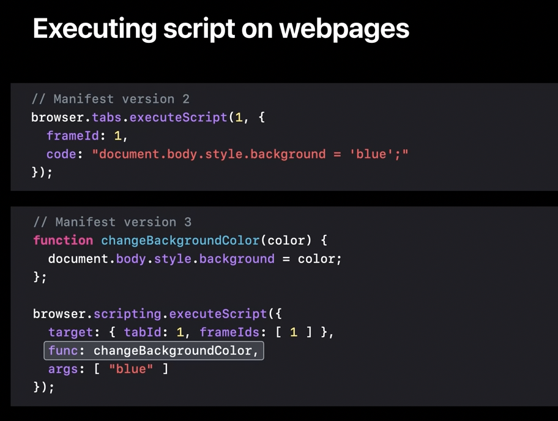

More enhancements also made for web_accessible_resources API.


In Safari 16, we've made the experience of using extensions more seamless. If a user turns on your extension on one of their devices, it'll be turned on on all of their devices. In Safari 16, we've made the experience of using extensions more seamless. If a user turns on your extension on one of their devices, it'll be turned on on all of their devices.

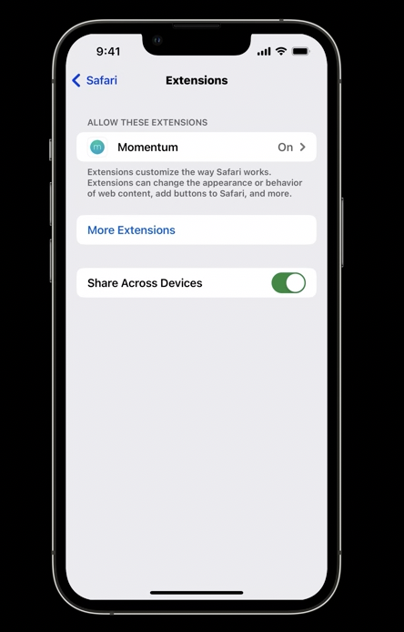


| Manifest v2 that used background page                        | Manifest v3 API that uses Service worker instead             |
| ------------------------------------------------------------ | ------------------------------------------------------------ |
| 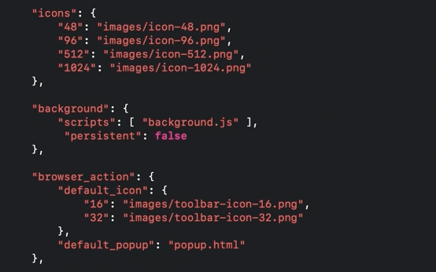 | 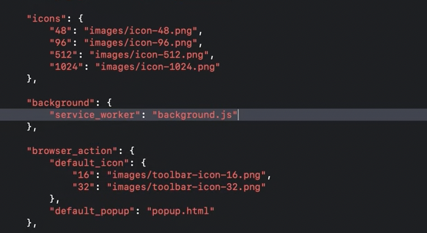 |

**externally_connectable** can be used to have the extension communicate with a webpage (what does it do that content.js does not? Ok so its probably a way for the webpage's actual JS itself to initiate a communication). 

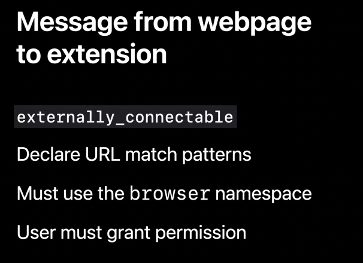

| Code in webpage                                              | Code in background page (can be content.js or service worker too?) |
| ------------------------------------------------------------ | ------------------------------------------------------------ |
| 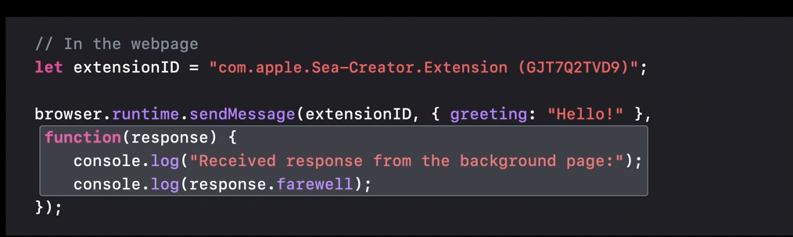 | 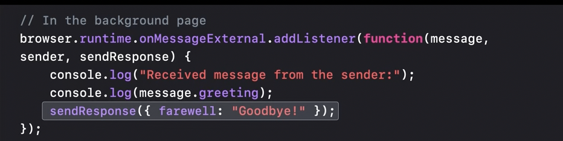 |


#### Tech Talk 2022: Build and deploy Safari Extensions for iOS

Four kinds of permissions - **Script injection permission** that allows to insert JS and CSS into a page the user is browsing). **Implicit permission**, this includes non-sensitive permissions that do not require extra privileges, and sensitive permissions which they do as they have website-identifying data such as cookies. When a relavant API is called the first time, the user is shown a prompt and  they get a minute to respond. When they approve it, the callback gets fulfilled and the data is given back. **Explicit permission**, the extension itself is requesting permission. A prompt is always shown modally. **Active Tab permission**, is a special case when you want to avoid alerts.  This grants a tabs permission for the current domain in the current tab.   

| Script Injection Permissions                                 | Implicit Permissions                                         |
| ------------------------------------------------------------ | ------------------------------------------------------------ |
| 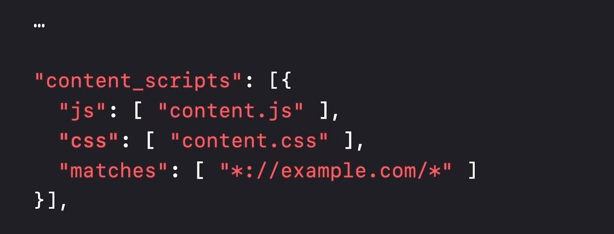 | 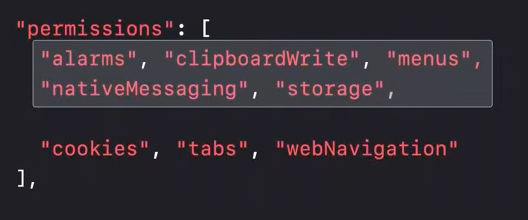 |

| Explicit Permissions                                         | Active Tab Permission                                        |
| ------------------------------------------------------------ | ------------------------------------------------------------ |
| 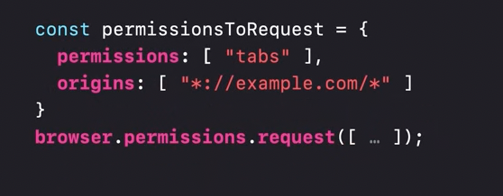 | 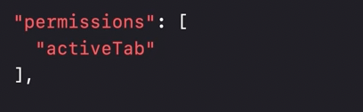 |

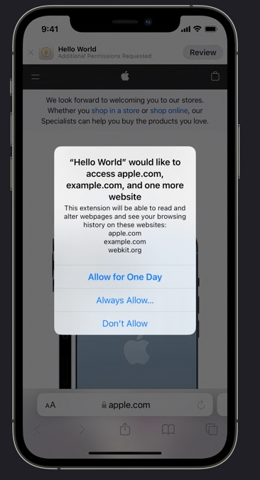

Content script template is set up to send and listen for messages. 

#### WWDC 2023: What's New in Safari extensions

There are four ways to build Safari extensions: content blockers, share extensions, app extensions, and web extensions. Safari 17 continues to support all of these types, but the future of browser customization lies in web extensions.

> How are 'app extensions' and 'web extensions' different from each other.

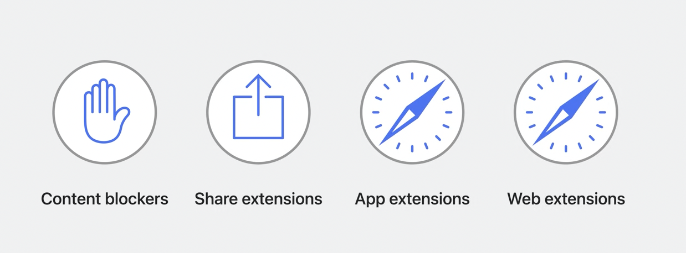

##### Safari web extension improvements

###### Declarative Net Request to modify network requests

If you're looking to block or modify network requests with a web extension (basically content/ad blocking), you should check out updates to Declarative Net Request. One big update to Declarative Net Request in Safari 16.4 is that your extension can now modify request headers.

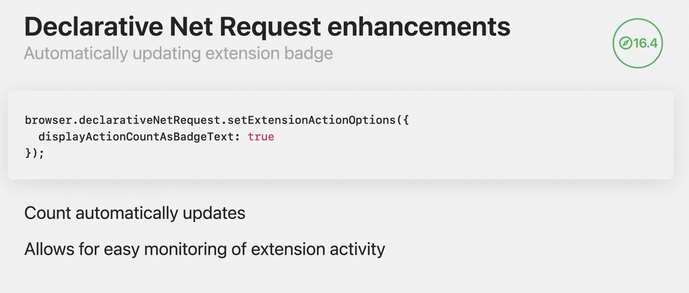

###### registerContentScript for dyanmic content scripts

With the **registerContentScript** set of APIs, you can create content scripts that can be registered, updated, or removed programmatically. This new API complements the static content scripts defined in the extension manifest, giving you greater flexibility in managing content scripts

> Oh so content scripts can be changed during runtime?

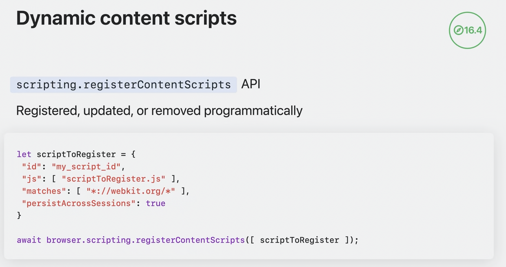

###### Session storage area

Safari 16.4 also brings a new storage area to web extensions: the **session storage area**. This API allows you to store data in memory for the duration of your browser session. Unlike local storage, session storage is not persisted to disk and it's cleared when Safari quits.

##### Safari app extension improvements

If you're already familiar with per-site permissions from web extensions, they work the same way for app extensions.

Users are able to grant extensions access to websites as they browse, providing for better privacy and control.

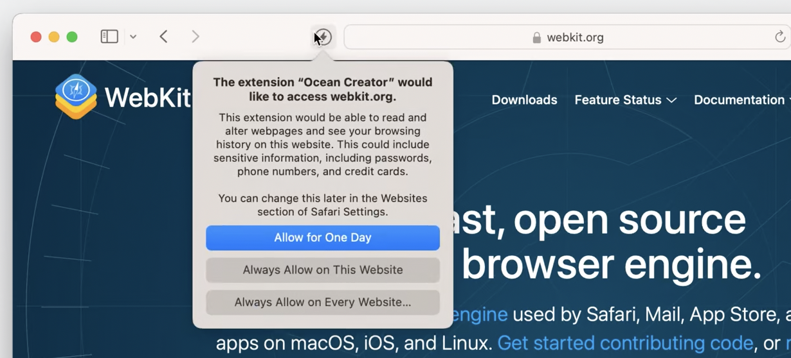

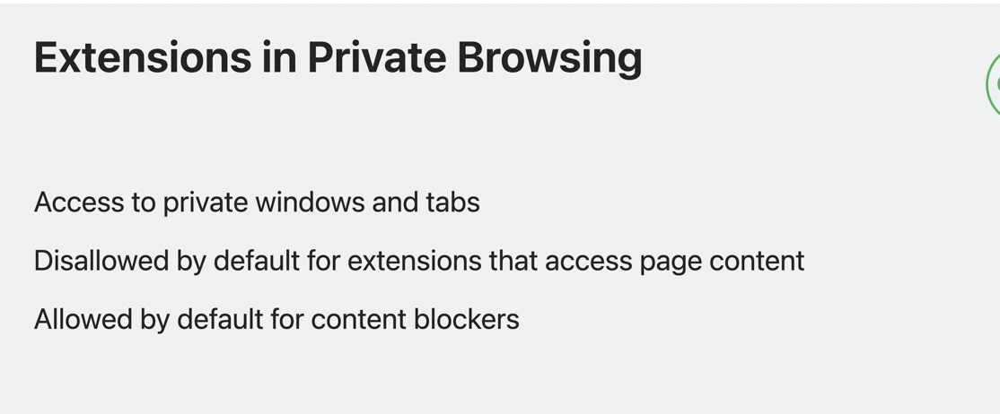


Profiles are new in Safari this year.

They're a way to keep browsing data separated.

Profiles contain separate history, cookies, and website data.

Users can also choose which extensions they want to turn on per profile.

#### Misc.

Understanding Chrome extension service workers ([link](https://www.youtube.com/watch?v=CmU_xwwYLDc))

Check this in manifest file

```swift
"background": {
    "service_worker": "background.js" // or "scripts": ["background.js"] for older manifest v2
 },
```

