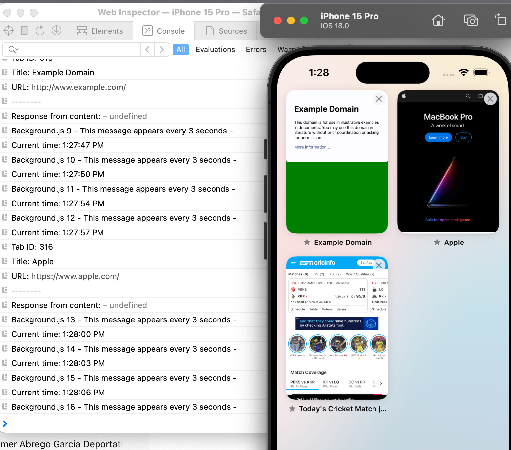
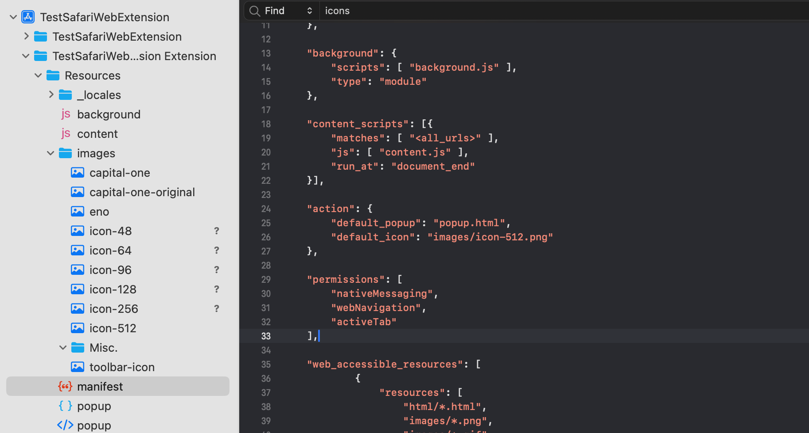
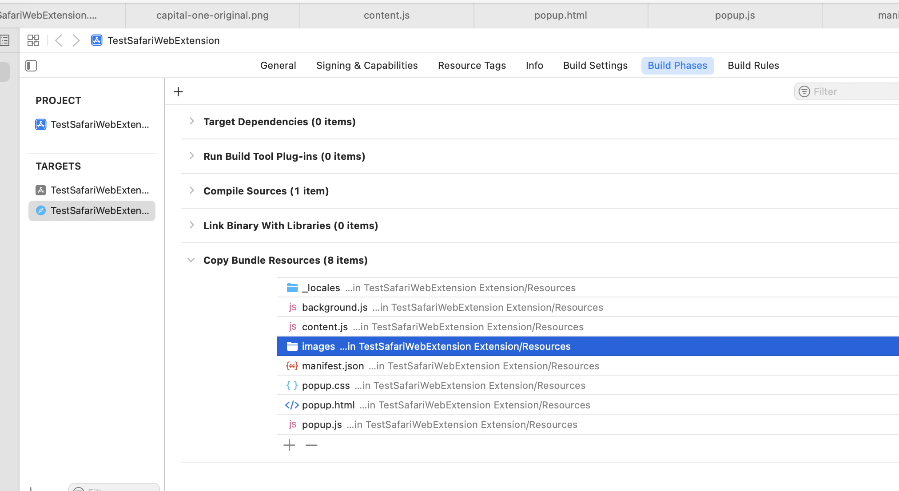

##### Querying tabs from background.js

This prints the active tabs (which I think is usually just 1?) there.

```swift
chrome.tabs.query({ active: true, currentWindow: true }, function(tabs) {
    tabs.forEach((tab) => {
        console.log(`Tab ID: ${tab.id}`);
        console.log(`Title: ${tab.title}`);
        console.log(`URL: ${tab.url}`);
        console.log("--------");
    });
}
```

In the below screenshot the apple webpage's tab has been printed in the console, and that is indeed the one I have actvated last in Safari.



##### Showing local images from JS

Manifest needs to have the accessible images listed in **web_accessible_resources** key. 

```json
"web_accessible_resources": [
        {
            "resources": [
                "html/*.html",
                "images/*.png",
                "images/*.gif",
                "images/*.svg",
                "json/*.json",
                "fonts/*.ttf",
                "css/*.css"
            ],
            "matches": [
                "<all_urls>"
            ]
        }
]
```

The image location specified above should be correct and match what is in the project/bundle.



> Its in fact better to keep them all under a folder, as that way it also gets taken care of more easily in the Extension Target Settings > Copy Bundle Resources phase. <br> 

And then for accessing the image from JS, use the `browser.runtime.getURL()` function.

```swift
const imgEno = document.createElement("img");
imgEno.src = browser.runtime.getURL("images/eno.png");
imgEno.alt = "ENO";
imgEno.height = 25;
imgEno.width = 25;
```

