[toc]

> Can observe what URLs user is navigating in background, Can modify webpage<br>Should also be able to do two-way communication with companion app, try that (such that a fresh login is not needed) <br>Does not look like can bring up popups automatically

#### The structure

**manifest.json** - A pretty important file. An info.plist + entitlements file of sorts. This is where the extension's required access are specified. <br>**background.js** - A JS that runs in background and this is where you can know what URLs, etc. the user is navigating to even if they do not open the extension. <br>**content.js** - A JS that gets automatically injected into the webpage, this is the piece that can modify the webpage. No need to open the extension for it. <br>**popup.html/css/js** - The UI that is shown when the user opens the extension.

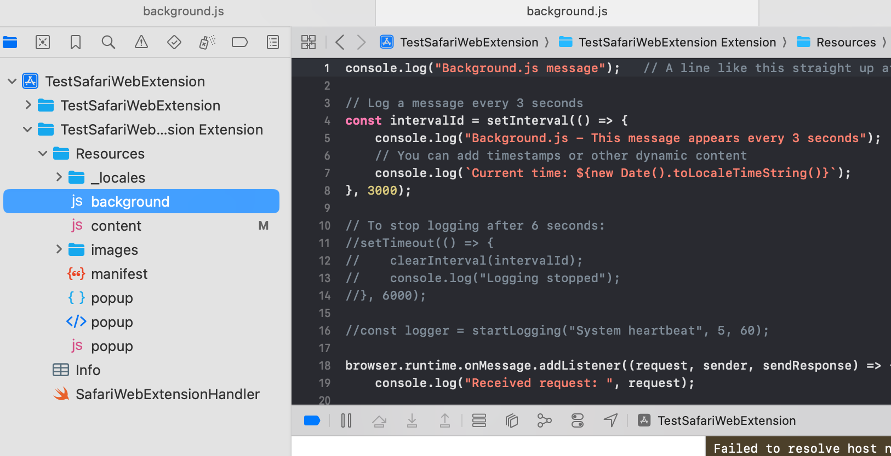

#### Running the main files

##### First time setup

##### background.js

Configure the manifest file, put some script in it, and open a webpage, and then see console messages through 'Safari > Develop > Simulator > Extension Background Page'.

| 1. Configure manifest.json                                   | 2. Add some script in background.js                          | 3. Run app, monitor in 'Safari > Develop > Simulator > Extension Background Page' |
| ------------------------------------------------------------ | ------------------------------------------------------------ | ------------------------------------------------------------ |
| All of these permissions are probably not needed just for background.js to work. I added webNavigation just to see how URLs navigation monitoring works. (That does bring up some confirmation dialogs though the first time the extension is run.)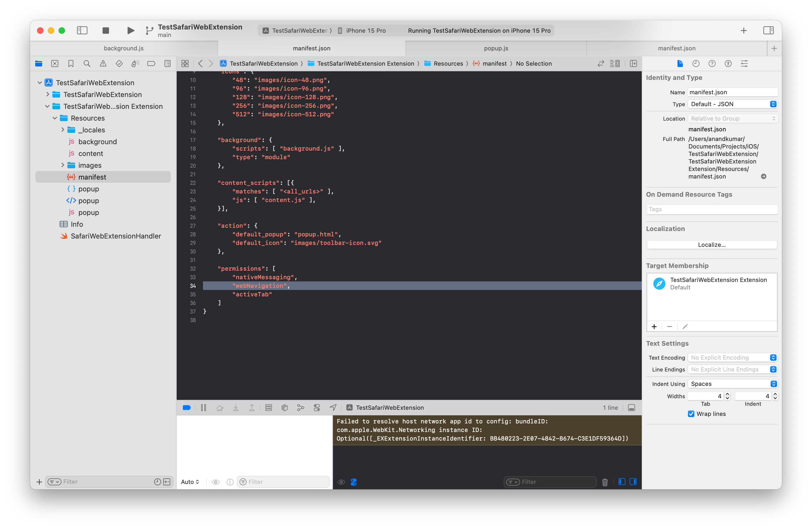 | Some script to log a message in console every 3 sec. 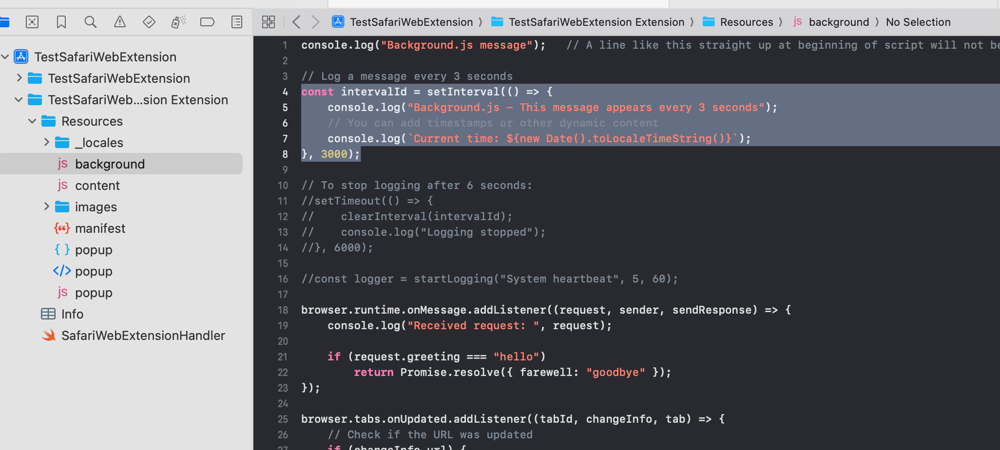 | Run the project, go to Safari and  open a webpage and observe logs from above option. The option shows up automatically once simulator Safari is opened.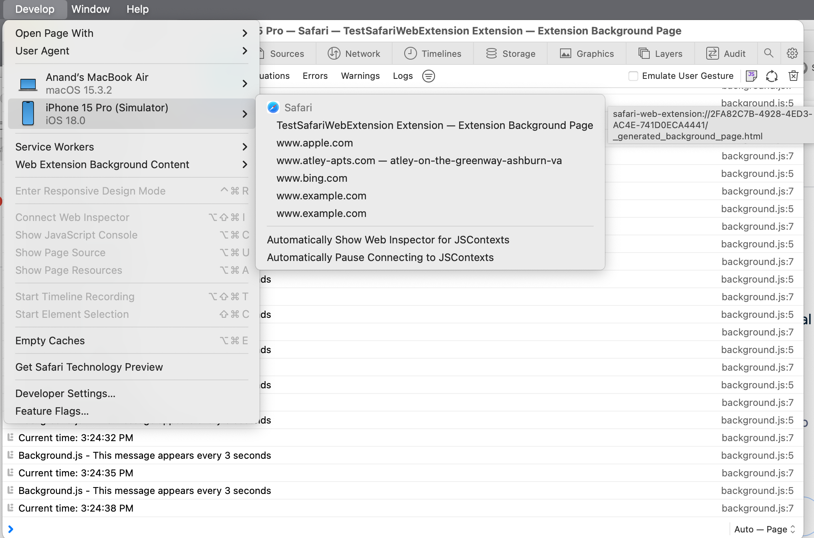 |

##### content.js

| 1. Configure manifest.json                                   | 2. Add some script in content.js                             |      |
| ------------------------------------------------------------ | ------------------------------------------------------------ | ---- |
| Be careful to specify matches key properly in content_scripts. The script will only be injected for those keys.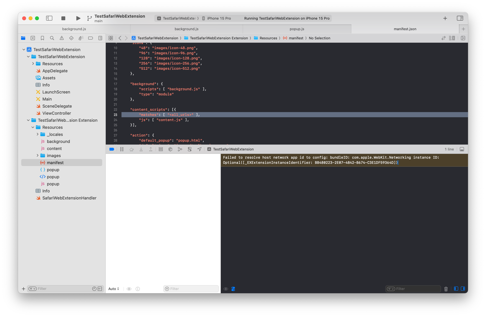 | script here changes the webpage's background color.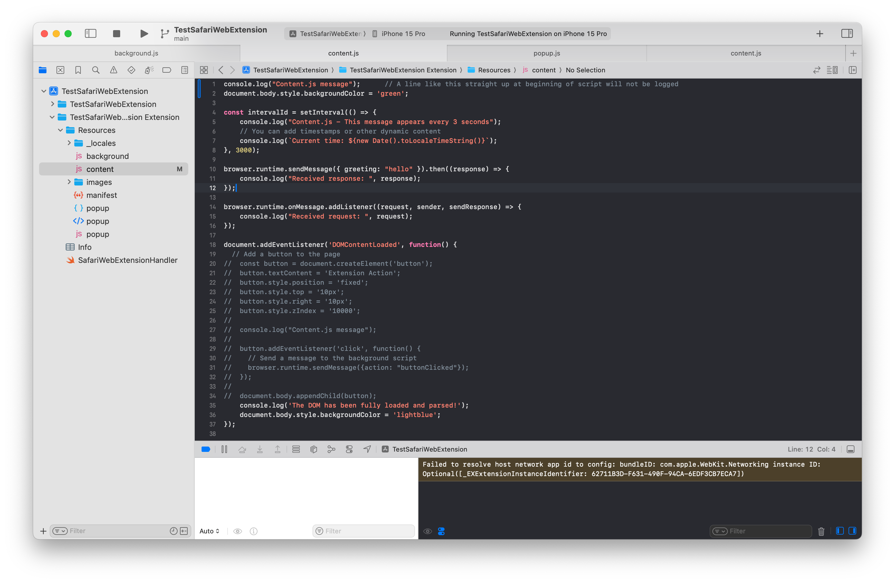 |      |

| 3. Run app, webpage modified                                 | 4. Monitor logs in 'Safari > Develop > Simulator > Actual webpage' |
| ------------------------------------------------------------ | ------------------------------------------------------------ |
| 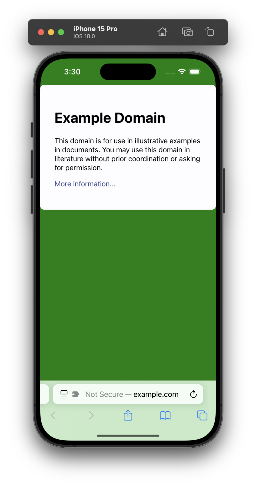 | 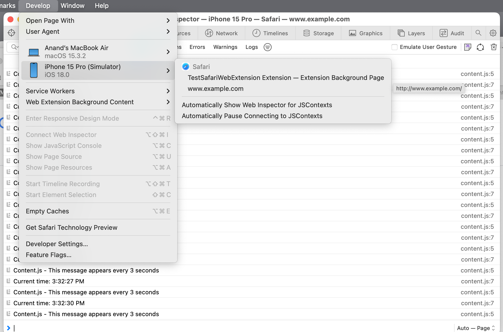 |

###### Inserting UI element in webpage

The below snippet (when put in content.js) adds a `div` (overlay) on the webpage, the div has a button which if tapped modifies a form in the webpage.

```swift
const popup = document.createElement("div");
popup.style.position = "fixed";
popup.style.top = "10px";
popup.style.right = "10px";
popup.style.padding = "10px";
popup.style.backgroundColor = "white";
popup.style.border = "1px solid black";
popup.style.zIndex = "9999";
popup.style.borderRadius = "8px";
popup.style.boxShadow = "0 0 10px rgba(0,0,0,0.3)";

const button1 = document.createElement("button");
button1.textContent = "Autofill!";
button1.style.marginRight = "8px";
button1.onclick = () => {
//    alert("Button 1 clicked!");
    document.getElementById("cc-number").value = "4111 1111 1111 1111";
    document.getElementsByName("firstName")[1].value = "Anand";
    document.getElementsByName("lastName")[1].value = "Kumar";
    document.querySelectorAll('[autocomplete="cc-csc"]')[0].value = "541";
};

popup.appendChild(button1);
document.body.appendChild(popup);
```

| Webpage with a button added on top                           | Webpage form autofilled aftre button tap                     |
| ------------------------------------------------------------ | ------------------------------------------------------------ |
| 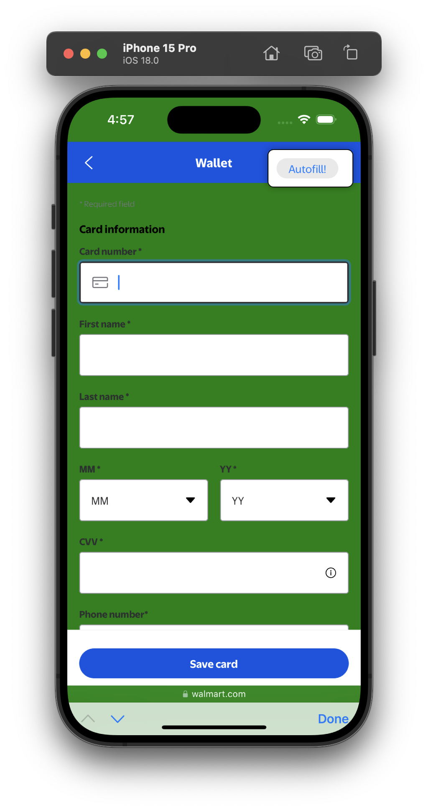 | 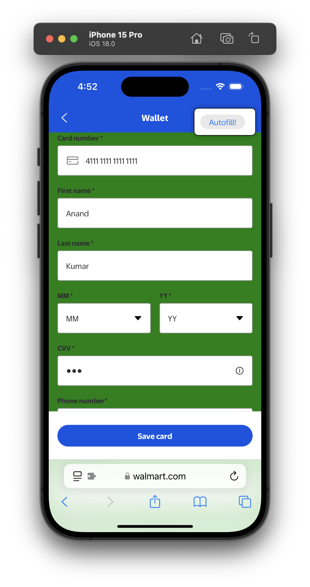 |


##### popup.js

| 1. Add some script in popup.js                               | 2. Open the popup                                            | 3. Monitor logs in 'Safari > Develop > Simulator > Extension Popup Page' |
| ------------------------------------------------------------ | ------------------------------------------------------------ | ------------------------------------------------------------ |
| 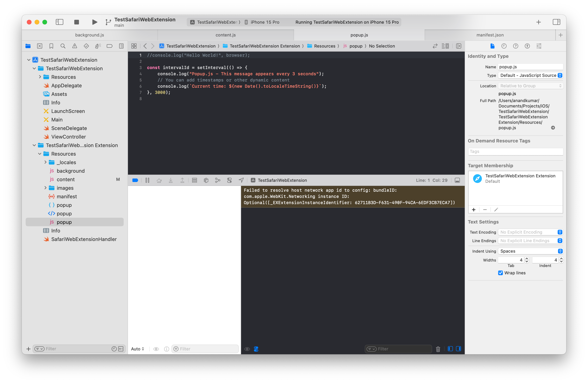 | 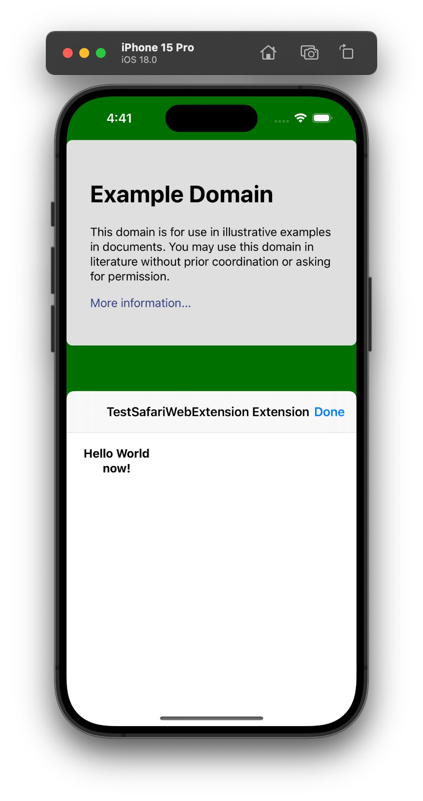 | 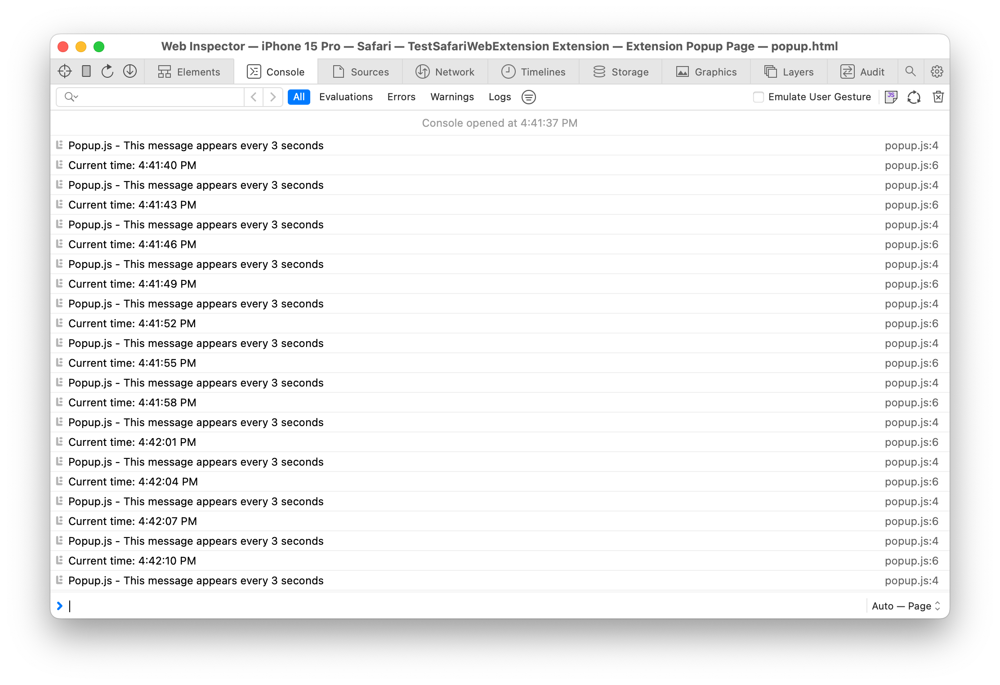 |

> Any console messages logged by popup.js are logged in same popup.html's console logs

#### How to access Safari web extensions

| 1. Enable in Settings > Safari             | 2. Access from URL bar                       | 3. Select the extension                      |
| ------------------------------------------ | -------------------------------------------- | -------------------------------------------- |
| 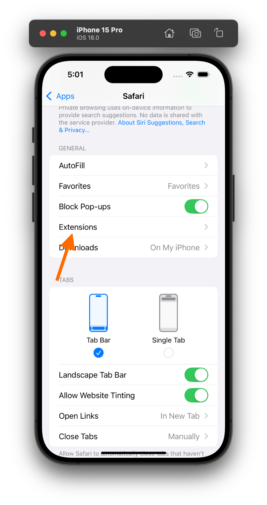 | 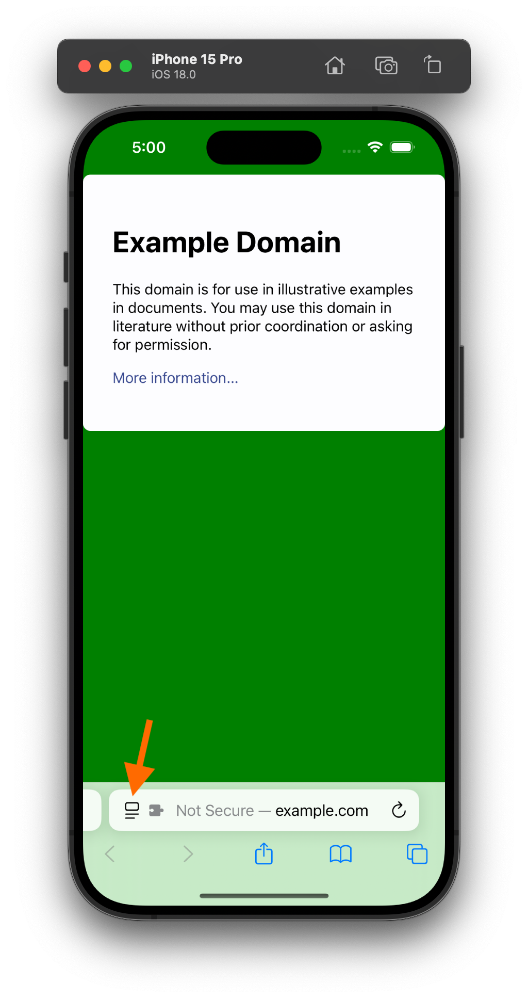 | 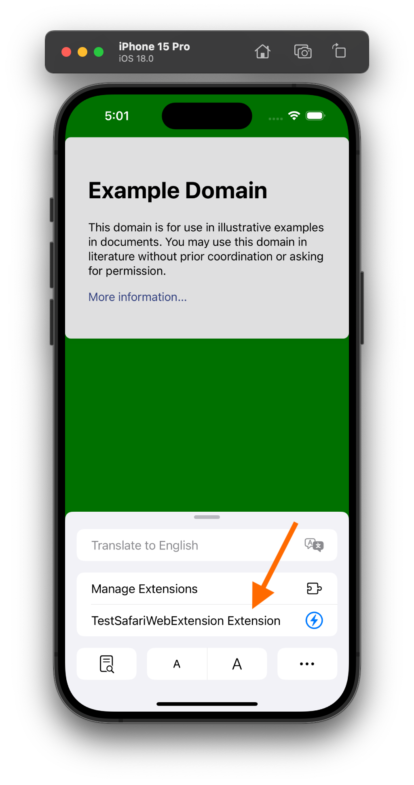 |


#### User prompts

The first time the app is run, prompts such as these are shown to the user for confirmation (depending on what is there in manifest.json)

|  | 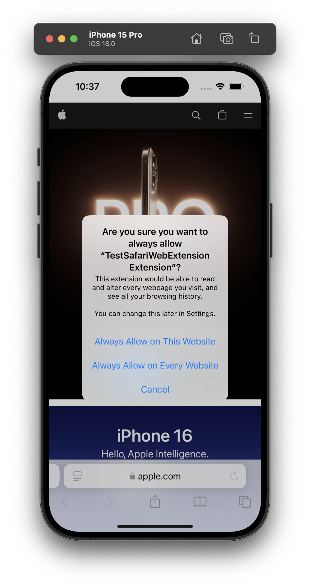 |
| ------------------------------------------------------------ | ------------------------------------------------------------ |

#### Communicating between various components

##### Initiated from content.js to background.js

Send a message from `content.js` to `background.js` and receive an asynchronous response back. 

Code to send a message from content.js and receive the asynchronous reply.

```swift
let responseReceived = "";
browser.runtime.sendMessage({ greeting: "hello from content" }, function(response) {
    console.log("Response from background:", response);
    responseReceived = response["reply"];
});
```

Code to receive the message in background.js and asynchronously reply (in the sendResponse function).

```swift
browser.runtime.onMessage.addListener(function(request, sender, sendResponse) {
    console.log("Received from content script:", request);    
    if (request.greeting === "hello from content") {
        sendResponse({ reply: "hello from background" });
    }
    return true;
});
```

> Somehow even `chrome.runtime.` (instead of `browser.runtime.`) works above. 

The content.js message can then be seen in debug console. Refresh the page for fresh messages in console.

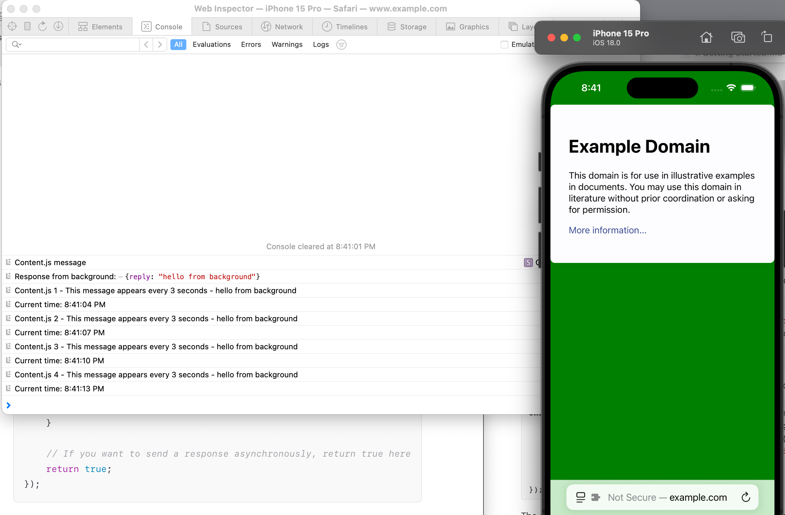

##### Initiated from background.js to content.js

Send a message from `content.js` to `background.js` and receive an asynchronous response back. The trick here is though it has to be sent to a specific tab.

Code to send a message from background.js and receive the asynchronous reply.

```swift
let responseReceivedFromContentJS = "";
chrome.tabs.sendMessage(tabs[0].id, { greeting: "hello content" }, function(response) {
    console.log("Response from content:", response);
    responseReceivedFromContentJS = response["reply"];
});
```

Code to receive the message in content.js and asynchronously reply (in the sendResponse function).

```swift
chrome.runtime.onMessage.addListener(function(request, sender, sendResponse) {
    console.log("Received from background script:", request);
    if (request.greeting === "hello content") {
        sendResponse({ reply: "hello back to you background, from content" });
    }
});
```

The background.js message can then be seen in debug console. Have some webpage on, and time the message correctly so that background.js console can indeed pick up the message back.

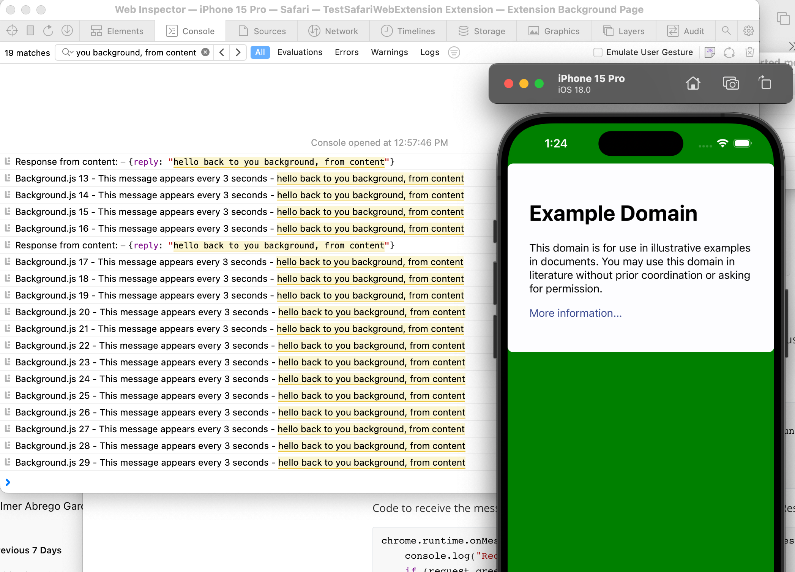

##### Initiated from background.js to SafariWebExtensionHandler (i.e. swift code in extension)

Send a message from background.js to the main app's bundle ID and receive an asynchronous reply back.

Code to send a message from background.js and receive the asynchronous reply.

```swift
browser.runtime.sendNativeMessage("TestProjects.TestSafariWebExtension", { message: "hello from JS" })
  .then(response => {
    console.log("Response from native:", response);
  })
  .catch(error => {
    console.error("Error sending message to native:", error);
  });
```

Code to receive the message in SafariWebExtensionHandler.swift and asynchronously reply (in `context.completeRequest()` invocation in `beginRequest()` ).

```swift
class SafariWebExtensionHandler: NSObject, NSExtensionRequestHandling {

    func beginRequest(with context: NSExtensionContext) {
        print("SafariWebExtensionHandler - native code ")
        let request = context.inputItems.first as? NSExtensionItem

        let profile: UUID?
        if #available(iOS 17.0, macOS 14.0, *) {
            profile = request?.userInfo?[SFExtensionProfileKey] as? UUID
        } else {
            profile = request?.userInfo?["profile"] as? UUID
        }

        let message: Any?
        if #available(iOS 15.0, macOS 11.0, *) {
            message = request?.userInfo?[SFExtensionMessageKey]
        } else {
            message = request?.userInfo?["message"]
        }

        os_log(.default, "Received message from browser.runtime.sendNativeMessage: %@ (profile: %@)", String(describing: message), profile?.uuidString ?? "none")

        let response = NSExtensionItem()
        if #available(iOS 15.0, macOS 11.0, *) {
            response.userInfo = [ SFExtensionMessageKey: [ "echo": message ] ]
        } else {
            response.userInfo = [ "message": [ "echo": message ] ]
        }

        context.completeRequest(returningItems: [ response ], completionHandler: nil)
    }
}
```

**SafariWebExtensionHandler** has to conform to **NSExtensionRequestHandling** protocol annd in the extension's info.plist `SafariWebExtensionHandler` should be specified as the `NSExtensionPrincipalClass`.

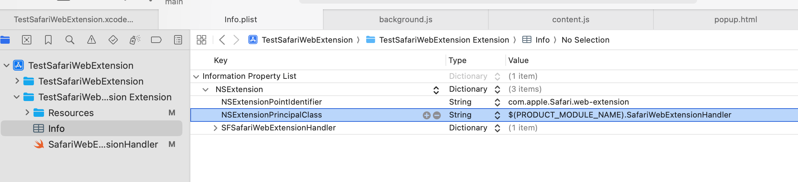

The background.js console logs (including the reply received from swift file) can then be seen in debug console. Have some webpage on, and time the message correctly so that background.js console can indeed pick up the message back.

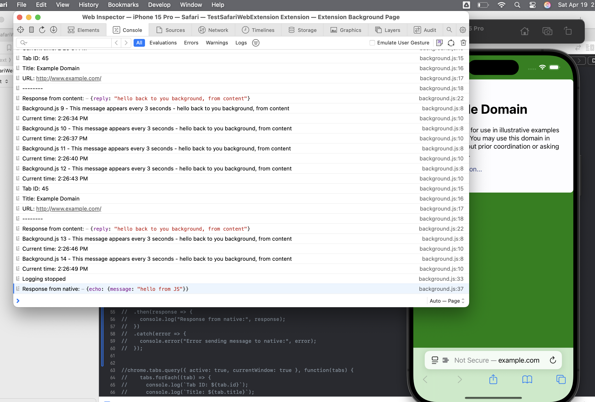

To be able to use breakpoints or see console logs of native code just, have a scheme that points to the extension target and have it set like this and run this scheme on Safari. The breakpoints then do get hit.

| Scheme settings                                              | Breakpoints hit                                              |
| ------------------------------------------------------------ | ------------------------------------------------------------ |
| 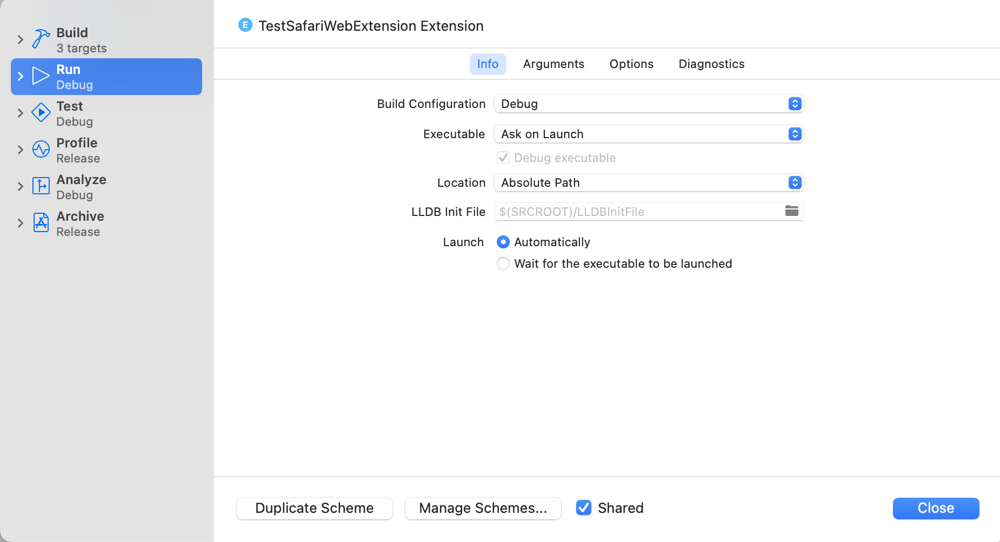 | 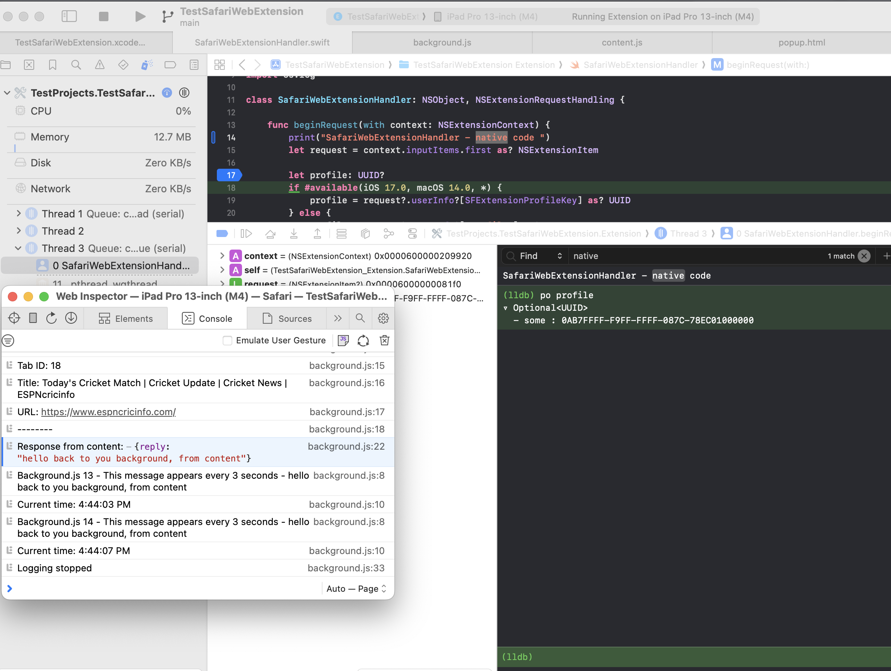 |

> Note that when a breakpoint in native code in extension is hit, the JS console logs in Safari probably get paused too (as if the code execution there too is paused).

##### Data sharing between main app and extension

There isn't any way to initiate a request from one to the other and then get an asynchronous response back. However, it is possible to share data between the two which either can query into whenever they wish to. This can be done in multiple ways.

###### App Group

Just the usual way to save and get data using **UserDefaults(suiteName:)** (the app group name is specified in the `suiteName` argument. Anything that can be persisted in UserDefaults (i.e. primitive types like string, etc.) can be shared this way.

> Keep in mind that its possible to tie an app to multiple app groups together in entitlements.

The code to save/read something from **UserDefaults(suiteName:)**.

```swift
func saveDataInAppGroupIfNeeded() {
    let keyName = "TestKey"
    
    guard let userDefaultsUserGroup = UserDefaults(suiteName: "group.TestProjects.TestSafariWebExtension"),
          (userDefaultsUserGroup.object(forKey: keyName) as? String) == nil
    else {
        print(UserDefaults(suiteName: "group.TestProjects.TestSafariWebExtension")?.object(forKey: keyName) as? String)
        return
    }
    
    print("Will set something in app group")
    userDefaultsUserGroup.set("Experimenting", forKey: keyName)
}
```

How to create and add an app group.

| 1. On provisioning portal, Identifiers > App Groups          | 2. Create new identifier > App Groups                        |
| ------------------------------------------------------------ | ------------------------------------------------------------ |
| 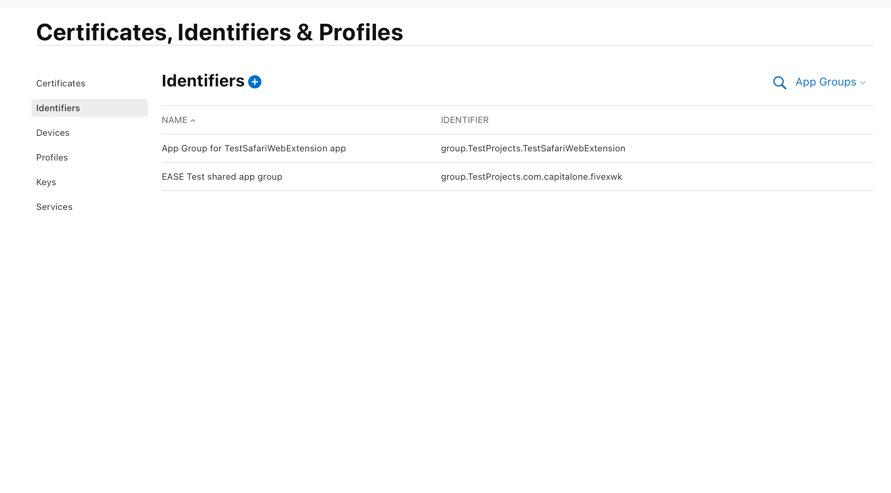 | 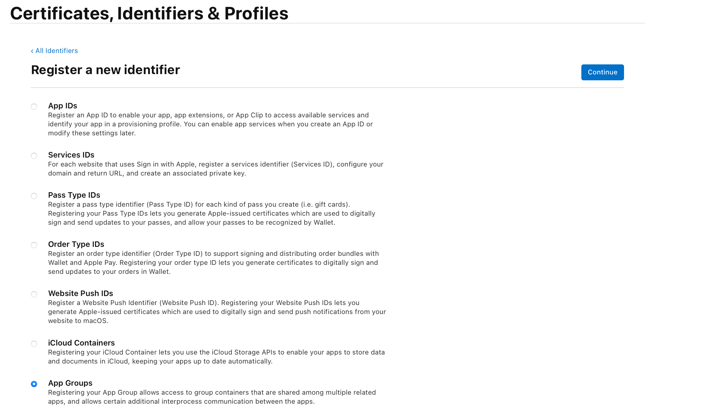 |

| 3. Have the provisioning profiles created for every target in provisioning portal | 4. Do not use 'Automatically manage signing' in Xcode and specify the correct provisioning profiles |
| ------------------------------------------------------------ | ------------------------------------------------------------ |
| 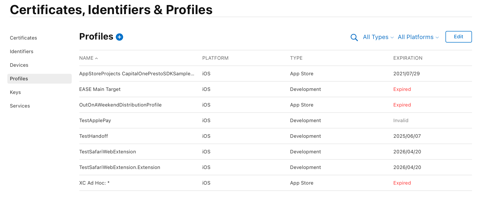 | 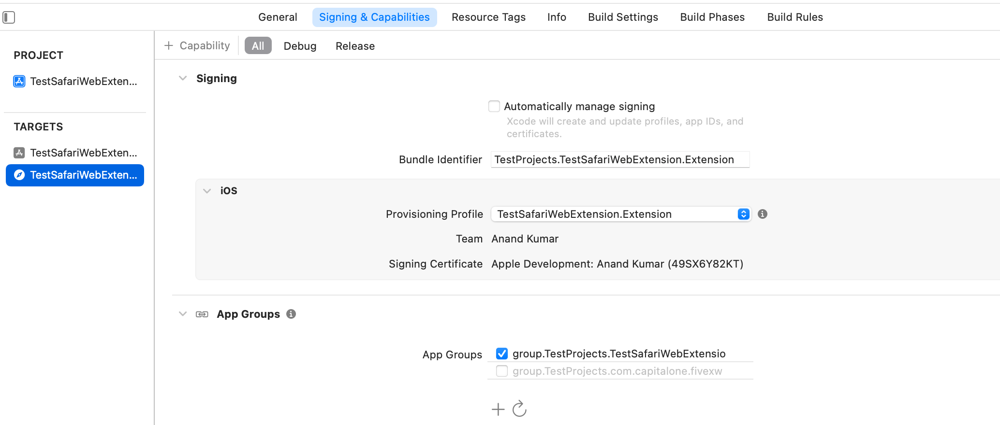 |

The app groups can be assigned to a bundle ID either in 'Provisioning portal > App Groups' or in Xcode itself.

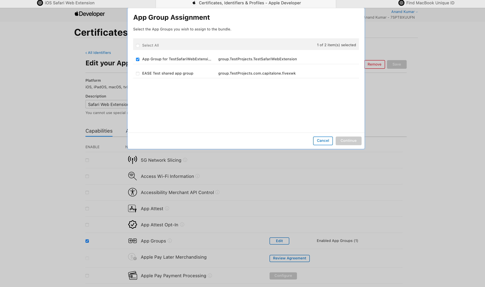

###### Shared Container

Can be used to share files/large amount of data, which is then accessed through. 

Sample code, haven't tried this lately. Writing

```swift
  if let containerURL = FileManager.default.containerURL(forSecurityApplicationGroupIdentifier: "AppGroupName") {
      let fileURL = containerURL.appendingPathComponent(fileName)

      do {
          try fileContents.write(to: fileURL, atomically: true, encoding: .utf8)
          print("File written to: \(fileURL)")
      } catch {
          print("Error writing file: \(error)")
      }
  }
```

Reading

```swift
  if let containerURL = FileManager.default.containerURL(forSecurityApplicationGroupIdentifier: "AppGroupName") {
      let fileURL = containerURL.appendingPathComponent(fileName)

      do {
          let content = try String(contentsOf: fileURL, encoding: .utf8)
          print("Read from shared file: \(content)")
      } catch {
          print("Error reading file: \(error)")
      }
  }
```

##### popup.js interactions backed up popup.js script

HTML element in popup.html

``` 
<!DOCTYPE html>
<html>
<head>
    <meta charset="UTF-8">
    <link rel="stylesheet" href="popup.css">
    <script type="module" src="popup.js"></script>
</head>
<body>
    <strong>Hello World now!</strong>
    <input type="text" id="myTextfield" name="myTextfield">
    <button id="myButton">Click Me</button>
</body>
</html>

```

The button tap above is handled by popup.js here

```swift
document.addEventListener("DOMContentLoaded", function () {
  const button = document.getElementById("myButton");
  if (button) {
    button.addEventListener("click", function () {
      console.log("Button clicked!");
      // Do something here, like send a message to content.js or background.js
    });
  }
});
```


##### What can't be done

It is not possible to send a direct message from **content.js to SafariWebExtensionHandler**. content.js has to send a message to background.js and then background.js has to send it to SafariWebExtensionHandler, and then the response gets chained back.

Like mentioned before, its also not possible to initiate **a message in either direction between main target and extension**. 

Also, have not seen a way to initiate a message **from SafariWebExtensionHandler to any JS**. Communication in Safari Web Extensions is **event-driven** and initiated from the JS side (this is not the case in Chrome extensions and over there background scripts can initiate messages).
