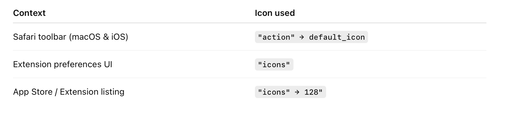
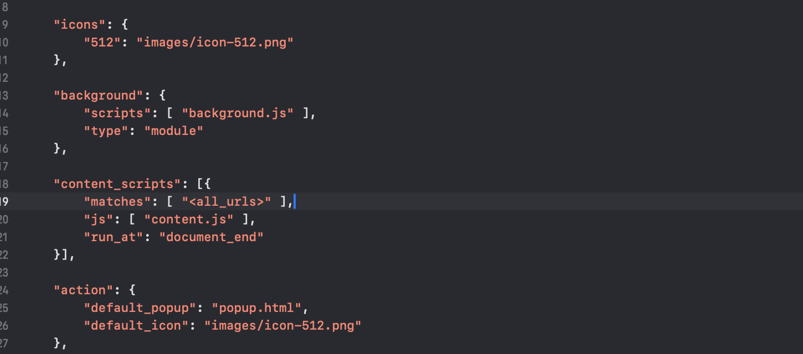
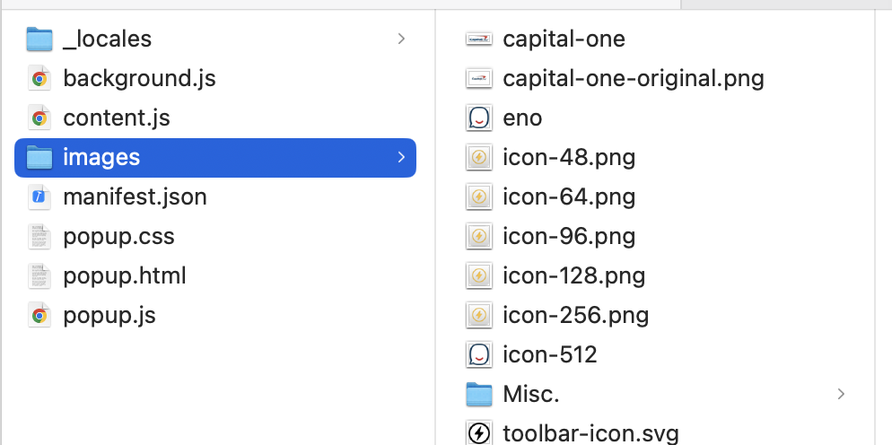
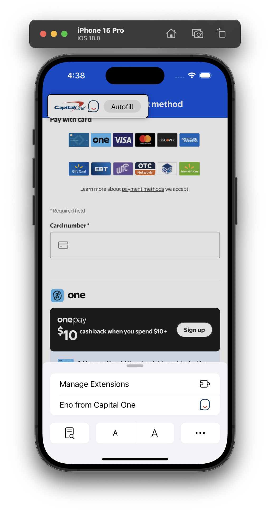
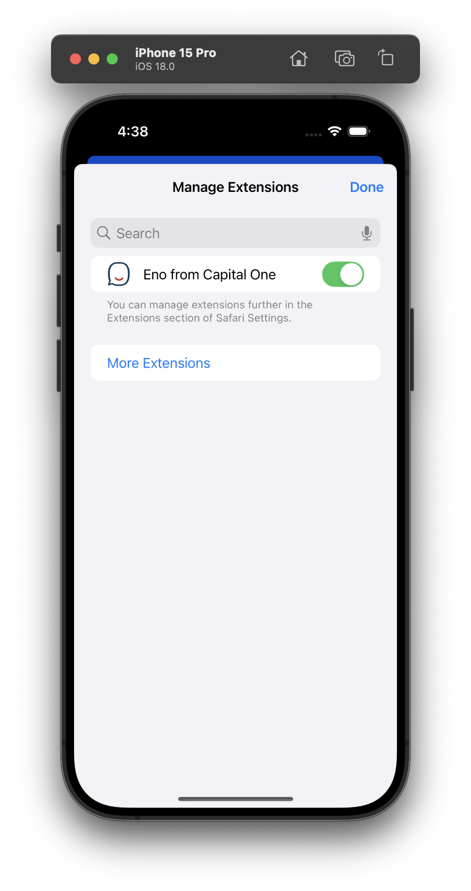

Pretty much this - 

| What is used where                                           | Manifest  example                                            |
| ------------------------------------------------------------ | ------------------------------------------------------------ |
|  |  |

These icons/dimensions are usually present by default -

Various places that icon show up

| Safari toolbar                                               | Extension Preferences/ Manage Extensions                     |
| ------------------------------------------------------------ | ------------------------------------------------------------ |
|  |  |

