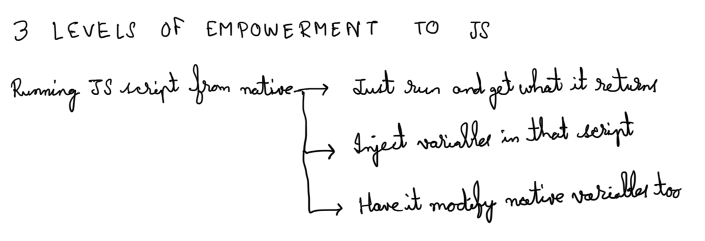
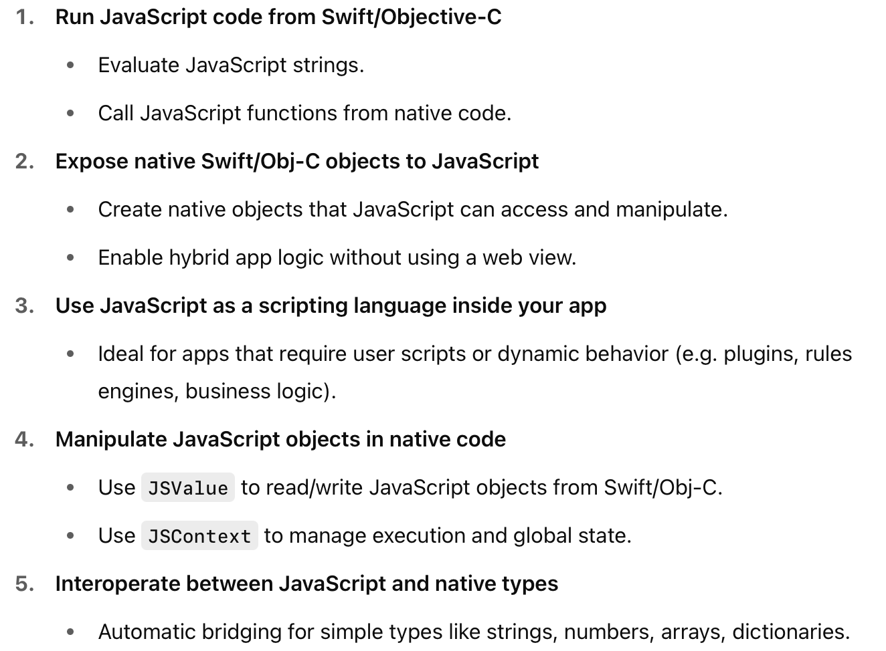

[toc]

##### Resources

Official reference ([link](https://developer.apple.com/documentation/javascriptcore)) <br>NSHipster article ([link](https://nshipster.com/javascriptcore/))

Test code - TestJavaScriptCore <br>Test code - TestSDUI

##### What is it

Plainly put, **JavaScriptCore** is a framework that allows JavaScript and native code to interact with each other.

The basic premise is that native can evaluate JS scripts using **evaluateScript()** and even get the results. But there are things it can do with that script even before running it.

1. Native can inject new JS objects into JS scripts. 
2. JS can access native objects and modify them from right within JS when the script is evaluated.

The script has certain **keyed subscripts** (think of them as keys of a dictionary) and native can both get the corresponding value for a given subscript and also change it.



##### Core capabilities of JavaScriptCore (from ChatGPT)



##### Run JavaScript code from Swift/Objective-C

This includes evaluating JS scripts, getting any values it returns, as well as running specific JS functions from native code.

Scripts are evaluated using **evaluateScript()** and specific functions can be run using  **invokeMethod(:withArguments:)**. Both of these are shown in the next code snippet.

##### Native injects objects and values into JS

JS objects can be accessed using **objectForKeyedSubscript()** and even changed **setObject(:forKeyedSubscript:)**.

Query properties inside that object using **forProperty()**, change any property using **setValue(:forProperty:)**. Invoke JS methods from native using **invokeMethod(:withArguments:)**.

```swift
let context = JSContext()!

// 1. Evaluate a JS script which has set an object/keyed subscript in the JS context
context.evaluateScript("""
    var user = {
        name: "X",
        age: 30,
        greet: function() {
            return "Hi, I am " + this.name + " and I'm " + this.age + " years old.";
        }
    };
""")

// 2. Get that JS object as a JSValue
let user = context.objectForKeyedSubscript("user")!

// 3. Access properties of that JS object
print("Native - Name: \(user.forProperty("name")?.toString() ?? "")")
print("Native - Age: \(user.forProperty("age")?.toInt32() ?? 0)")

// 4. Modify one of the properties of that JS object
user.setValue("Y", forProperty: "name")

// 5. Call a method on the JS object (this will also show that property changed in step 4 has indeed changed)
let greeting = user.invokeMethod("greet", withArguments: [])?.toString()
print(greeting ?? "")

// How to set an object for a new subscript in JS, from native if needed. After this a `console.log(state)` is done from JS it will print Bihar
context.setObject("Bihar", forKeyedSubscript: "state" as (NSCopying & NSObjectProtocol))
```

The above will print this

```
Native - Name: X
Native - Age: 30
Hi, I am Y and I'm 30 years old.
```

##### Exposing native objects to JS and modifying them from JS

The native object should conform to **JSExport** protocol.

```swift
@objc protocol PersonJSExport: JSExport {
    var name: String { get set }
    func greet() -> String
}

@objc class Person: NSObject, PersonJSExport {
    var name: String
    
    init(name: String) {
        self.name = name
    }
    
    func greet() -> String {
        return "Hello, my name is \(name)!"
    }
}
```

And then it can be exposed to JS scripts using usual  **setObject(:forKeyedSubscript:)**, and thereafter when the script is avaluated, any change in that object from JS is reflected in native too.

```swift
let context = JSContext()!

// Create the object
let person = Person(name: "X")

print("Native log: \(person.name)") 

// Expose it to JavaScript
context.setObject(person, forKeyedSubscript: "person" as NSString)

// Now run some JS that uses the native object
context.evaluateScript("""
    console.log(person.greet());  // Will print: Hello, my name is X!
    person.name = "Y";
    console.log(person.greet());  // Hello, my name is Y!
""")
print("Native log: \(person.name)")
```

The above will print this

```swift
Native log: X
Native log: Y
```

##### Getting `console.log` from JS script to show up in Xcode console

It requires use of **@convention**.

```swift
  // Define native Swift logging function
  let consoleLog: @convention(block) (String) -> Void = { message in
      print("JS Log: \(message)")
  }

  // Inject it as console.log into JSContext
  context.setObject(consoleLog, forKeyedSubscript: "consoleLog" as NSString)
  context.evaluateScript("var console = { log: consoleLog }")
```

