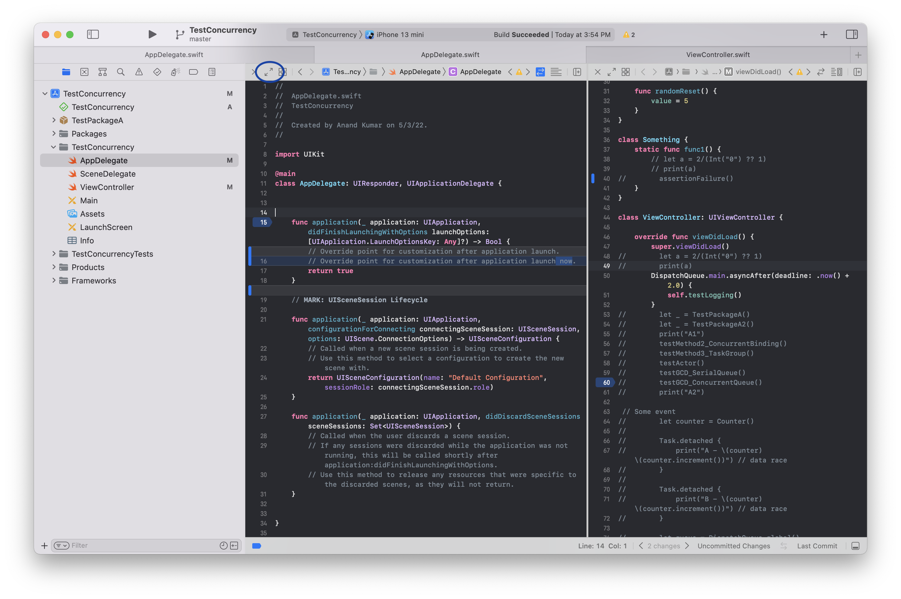
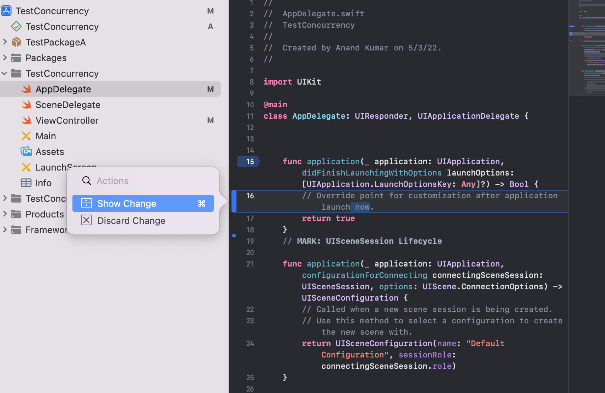

##### WWDC Videos

WWDC 2019: Getting Started with Xcode k  
WWDC 2019: What's New in Xcode 11 k  
WWDC 2021: Explore advanced project configuration in Xcode k  
WWDC 2022: What's new in Xcode  

WWDC 2019: Great Developer Habits k  

-----

##### Editor splitting

Its possible to have multiple editors open in the same tab. Each editor get its own state, so there can be Authors shown in one but not in the other, and so on.

These new editors can be created by the '+' button at the top right of current tab.

If 'option click' is done on +, then the new editor gets created in different a direction (i.e. horizontal/vertical) than before.

##### Destination chooser

If a 'option shift click' is done on a file in the File Navigator, the new editor can be opened anywhere you want. It can be in the existing window or even in a new window.

##### Focus mode

Focus mode can be activated using the Expand button on top left of every editor. Its handy when there are too many edtors open in a single tab.

##### Minimap

A rich snapshot of the current editor's contents. Its keyboard shorcut is `Cmd Shift Ctrl M`.

##### Source control - Change bar, Code Rewiew

When source control is being used, the `Change Bar` on left shows the parts that have changes. Doing a hover over there even brings up options like viewing and discarding changes.

Also, in the top bar for every editor there is a `Show code review` button which can show all the uncommited code changes that are there.

