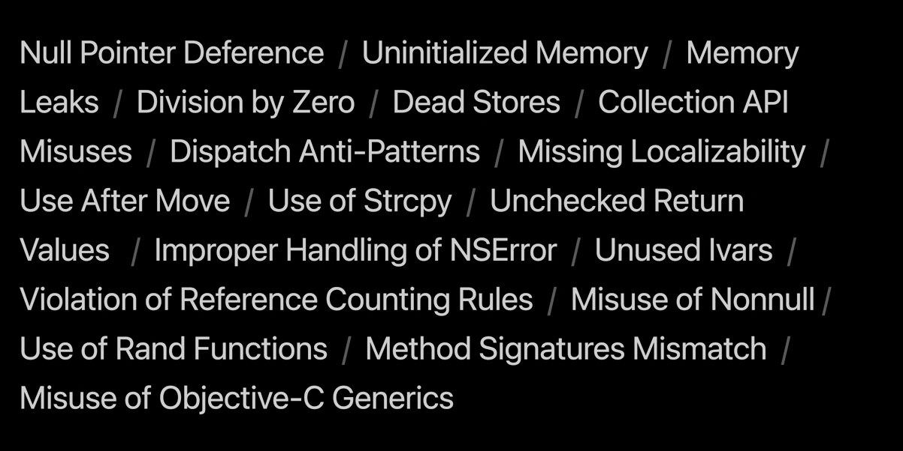
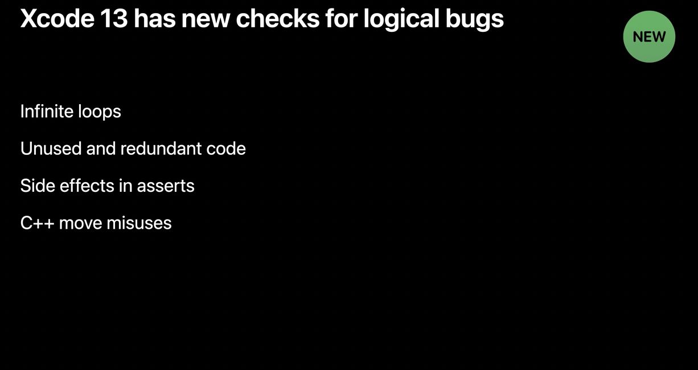
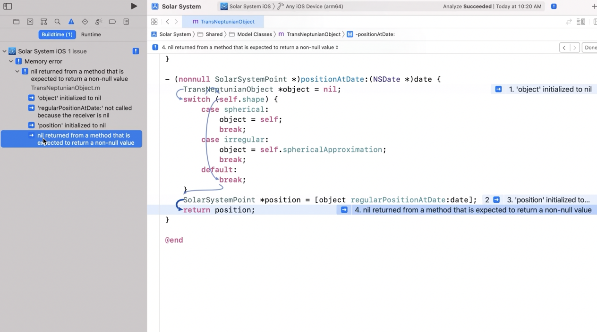
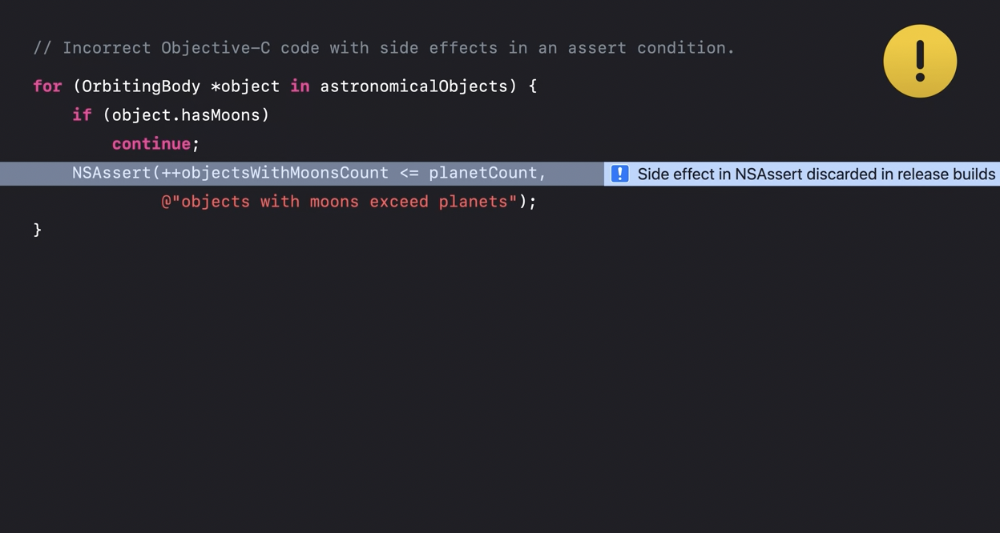
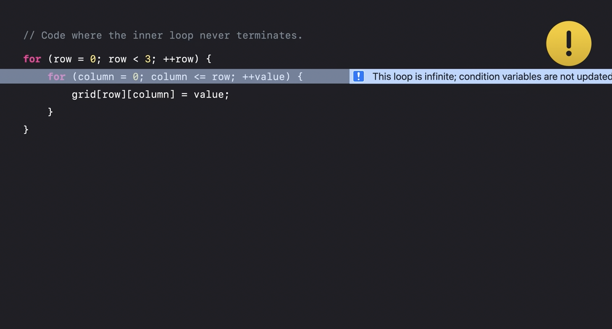
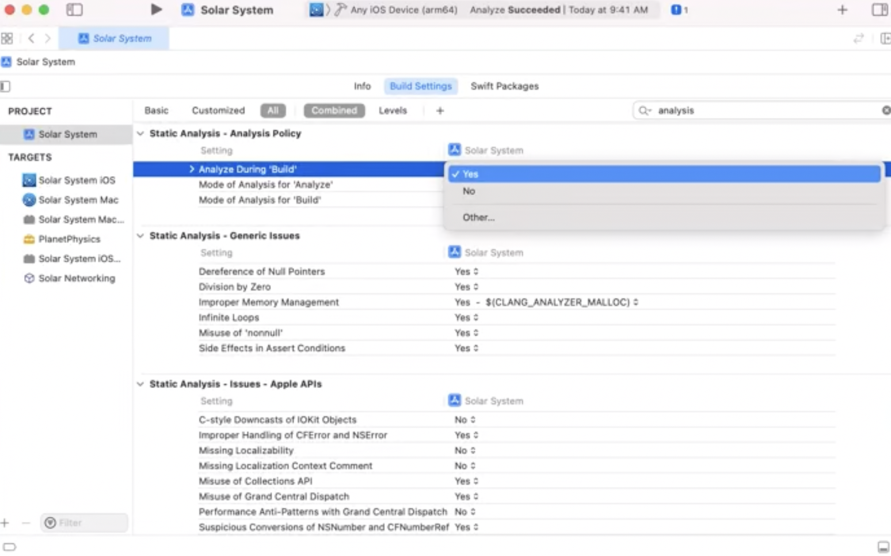
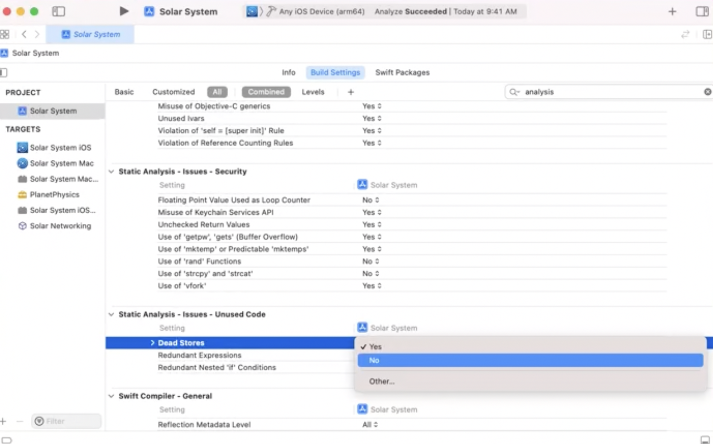
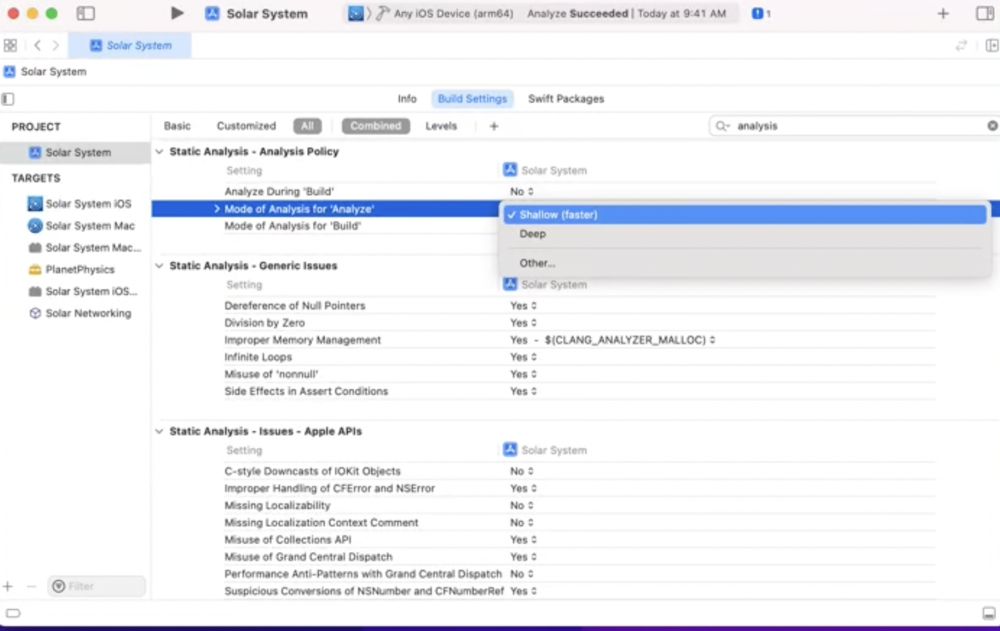

> This is mostly from 'WWDC 2021: Detect bugs early with the static analyzer'.

The entire idea behind static analysis is that it can try and detect some possible issues in the code without compiling it. For example, something looking like an infinite loop. The kind of things it can checks keeps evolving with every Xcode version and can be selectively chosen through Build Settings. Also, most of these new checks are added by open-source contributions made to Apple's Clang compiler.

They mostly seem to do checks for C based code though (including mixed Swift and Objective-C code).

##### Things that Static Analyzer can check

Checks as of 2021 | New checks added in 2021
--- | ---
 | 

###### Objective-C nonull function returning nil

In general (in the navigator), you can expand the analyzer issues and see the sequence of events that lead to the bug.

> Are those arrows real?

###### Memory update during asserts

Its not a recommended practice that asserts have side effects, such as writing to variables or memory. This check works not just for NSAsserts, but also for asserts in C and C++.

###### Infinite loops

##### How to run the static analyzer

It can be run through the menu option `Product > Analyze (Cmd Shift B)`. This analyzes all files in the currently selected scheme.

Its also possible to analyze just the currently highlighted file alone using `Product > Perform Action menu (Control Command Shift B)`.

##### Relevant Build settings

To enable automatic static analysis during builds, `Analyze Debug` Build setting can be checked. It does make sure that in case of incremental builds, the analysis runs only on files that are modified.

Some of the checks can be selectively opted in or out. The checks that suit your project by enabling or disabling them selectively from the build settings. For instance, if your project has security-critical code, enable the checks for security issues (its possibly not on by default).

Analyze During Build | Specific opt-ins
--- | ---
 | 

##### Shallow and Deep analysis

The analyzer offers two modes of analysis: shallow and deep. Shallow mode is faster, but avoids exploring bugs spanning multiple functions (what does that mean?).

