> These are mostly from 'WWDC 2015: Advanced Debugging and the Address Sanitizer' 13:25 onwards.

The idea behind `Address Sanitizer` is that when actiavted it can catch some potential issues during runtime which one may otherwise not realize. These are things that are inadvisable and can cause unpredictable issues to happen. For example, memory allocated for one object might be overwritten by another object. Or maybe some memory is being used that does not belong to that part of the code but is due to some miscalculation.

If you have code that manipulates memory directly, by calling malloc, or by doing arithmetic, or you simply have code that interoperates with C and C++ APIs, you are in the risk group that needs the most help.

It is an LLVM tool for C-based languages.
> Does Address Sanitizer not work for Swift code?

##### Kind of issues that `Address Sanitizer` can catch

> Need to understand what these actually are by replicating.

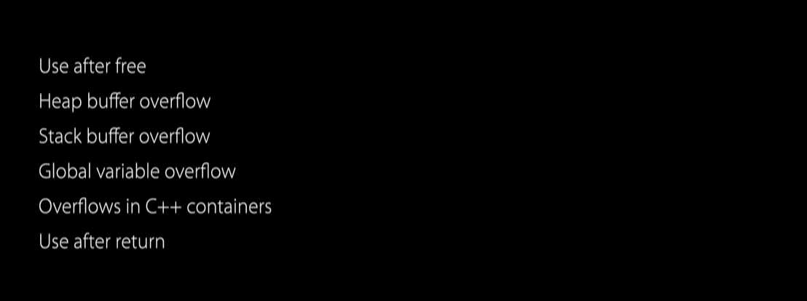

##### How to activate `Addrss Sanitizer`

Its done through the scheme's run action settings > diagnostics.

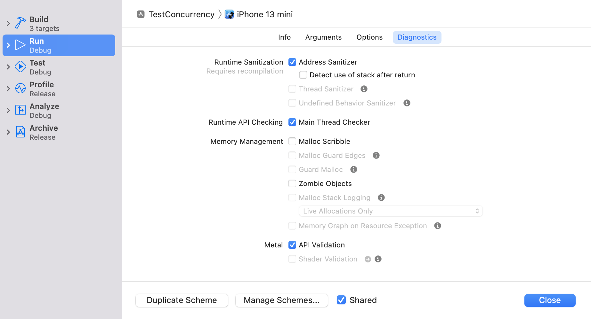

Address Sanitizer does require re-compilation. So after this check box is checked, Xcode will know to rebuild the application with Address Sanitizer turned on. It will then launch it in a special mode that will allow Address Sanitizer to poke at the process even more at runtime.

When running through command line, it can be activated by passing an extra argument to Xcode Build.

```
xcodebuildscheme -scheme "SchemeName" test -enableAddressSanitizer YES
```

Its even recommended to you use Address Sanitizer in the continuous integration jobs.

##### Example: Heap Buffer Overflow detection

Here is an example of how it looks when a heap buffer overflow is caught.

In the example, it tells us that the faulty address is one byte after 2,240-byte heap region, and it also tells us where that heap region has been allocated.

Even though this is not a live thread, but a historical snapshot of the process execution when that allocation event occurred, we can look at streams as if it was a live thread, and here it takes us right to the point where the memory has been allocated.

The `Memory View` in `Debug Navigator` even allows to see which memory is considered to be valid, and which memory is considered to be invalid, from Address Sanitizer's perspective.

Error shown in Editor | Memory View
--- | ---
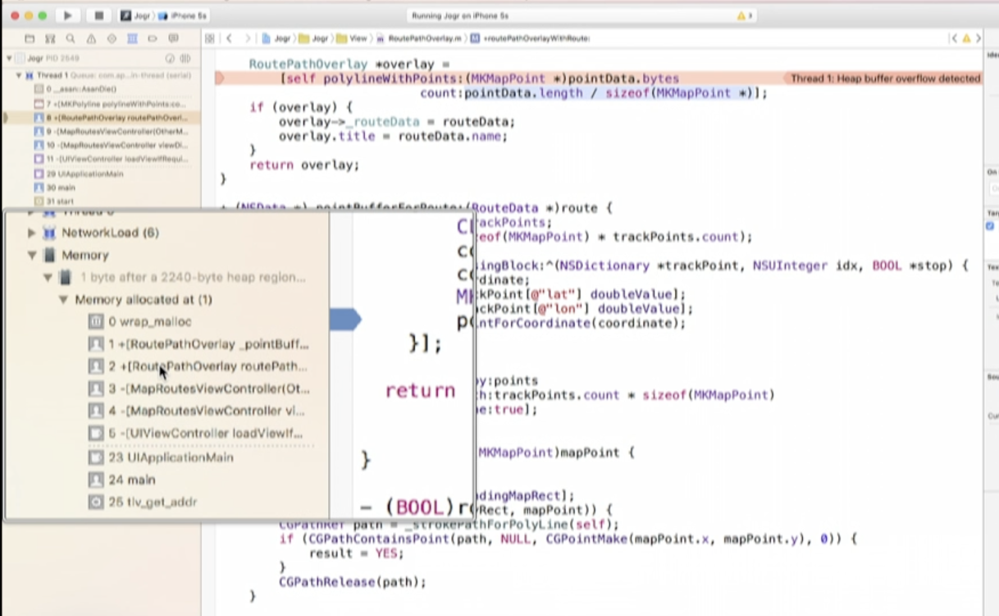 | 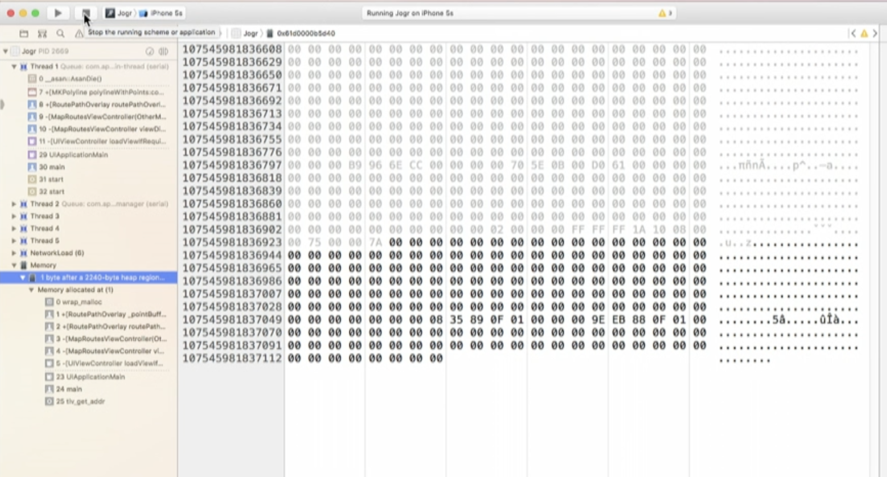

##### Compiler Optimizations when Address Sanitizer is used

> What does all this mean?

Its recommended to use Address Sanitizer in Debug builds, where the compiler optimizations are turned off.  However, it is also supported with the Fast optimization level that corresponds to 01 compiler flag. One thing to keep in mind is that when you are deciding between those two optimization levels, is that your debugging experience will not be as smooth in case you have any compiling optimizations turned on.

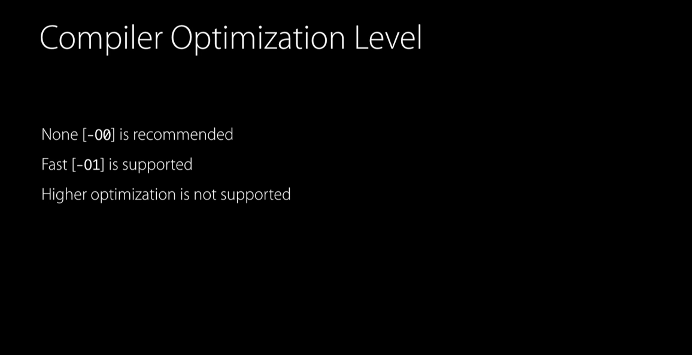

##### How does it internally work

> All of this is pretty intricate and requires some understanding of stack and heap internals.

In order to use Address Sanitizer, Xcode passes a special flag to clang. It produces an instrumented binary that contains more memory checks.
```
-fsanitize=address
```

And at runtime, this binary links with asan runtime dylib, that contains even more checks, and that dylib is required by the instrumentation.

If this is your process memory, Address Sanitizer maintains so-called shadow memory, that tracks each byte in your real memory, and it has information of whether that byte is address-accessible or not.

Bytes on invalid memory are called red zones or as we say, memory there is termed poisoned, and reported in diagnostics report. The lookups into the shadow memory are very fast.

Shadow Mapping 1 | Shadow Mapping 2
--- | ---
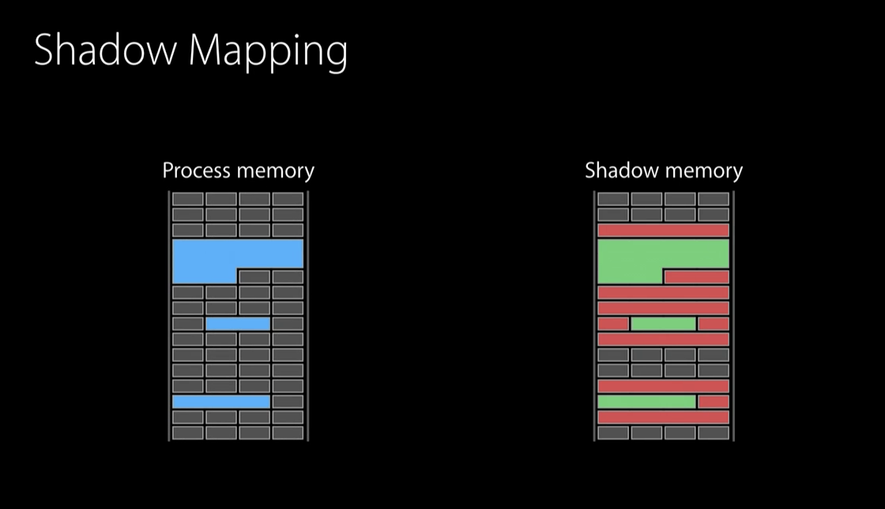 | 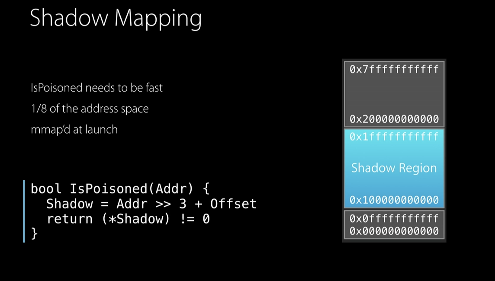

To catch overflows and other bugs in heap, Address Sanitizer provides its custom allocator that replaces the default Malloc implementation.

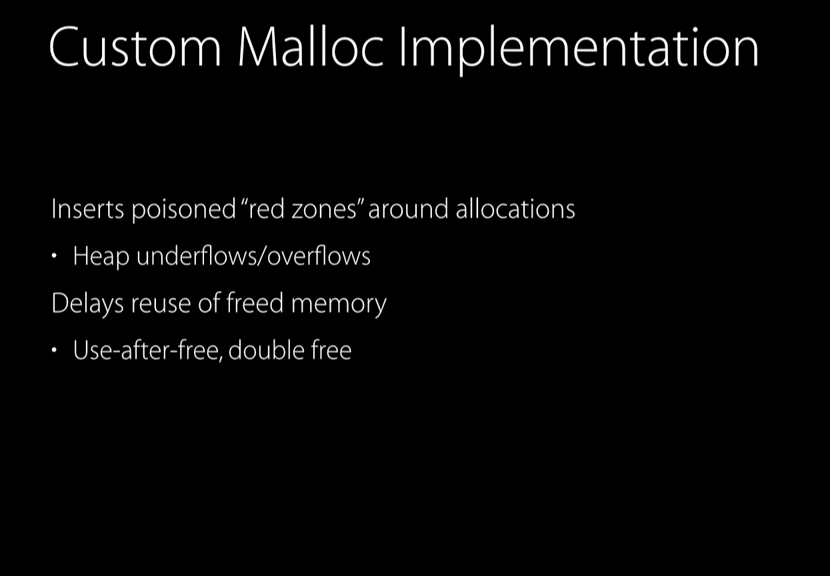

Let's talk about the stack. So similarly, to heap memory, red zones are put in between individual stack variables. So, suppose we have an array, and an integer as our local variables, then when compiling under Address Sanitizer, additional red zones are inserted in between those variables, so we can detect any overflows on stack variables. Stack red zones are poisoned when you enter the function at runtime, and they are unpoisoned when you are exiting the function at runtime. Dealing with global variables is very similar, again, during compilation, the global variables are instrumented, and additional red zones are inserted around them. Now, both stack and global compiler instrumentation is a really useful feature of Address Sanitizer.

##### Other tools

> These tools seem mostly relevant for Objective-C code and were there ~2015 but may be not now (i.e. 2022).

`Guard malloc` - It finds some of the same issues as Address Sanitizer. And the main advantage of using Guard Malloc is that it doesn't require recompilation. does not work on iOS devices, and it also doesn't find all of the issues that Address Sanitizer finds.

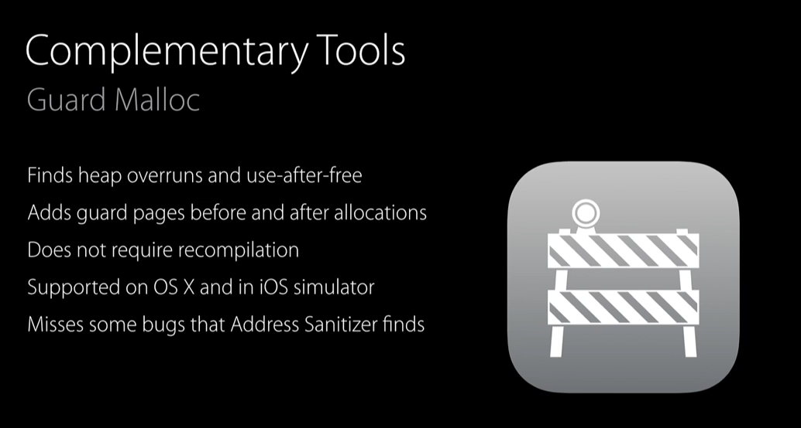

`NSZombie` -  Good for catching Objective-C object over-releases. It works by replacing deallocated objects with zombie objects that trap when messaged. The basic functionality can be enabled from the same Diagnostics tab in Xcode. However, if you want to gain full power of this feature do use Zombies Instrument.

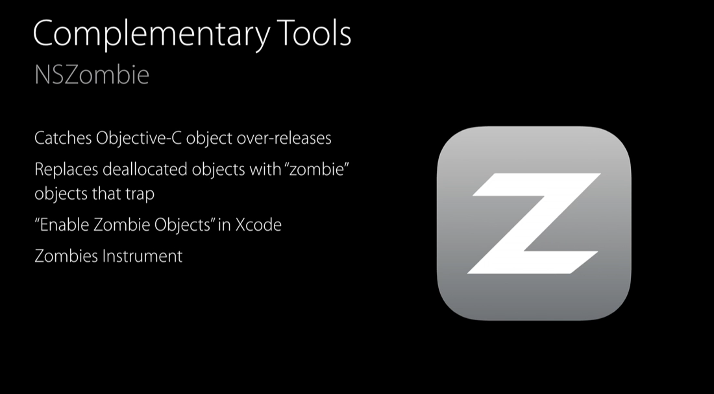

`Malloc Scribble` - Helps in investigating uninitialized memory issues. It makes those errors much more predictable, by filling the allocated and deallocated memory with preset constants.

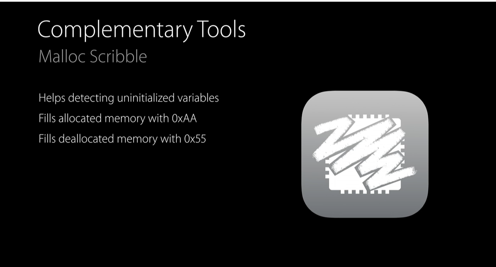

`Leaks instrument` - Helps in finding retained cycles, and abandoned memory that leads to higher memory consumption. This is of course still there in Instruments.
