> These notes are mainly from  'WWDC 2021: Discover breakpoint improvements'

#### Source file breakpoints

##### Line Breakpoints

These are the traditional breakpoints. The execution pauses when it reaches a particular line.

##### Column Breakpoints

For a code snippet like below, assume that (through a `Line breakpoint`) execution pauses when it reaches line 70 and the developer then wants to 'step into' 'convertedToVolume' implementation. However the 'step in' will then take the user to 'adjustedDensity' property first as that is the one that needs to be done first. The developer could then 'step out' and then reach 'convertedToVolume' but that's an inconvenient thing to do.

Step 1 | Step 2
--- | ---
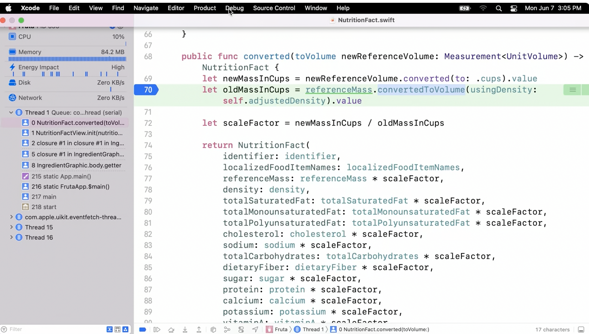 | 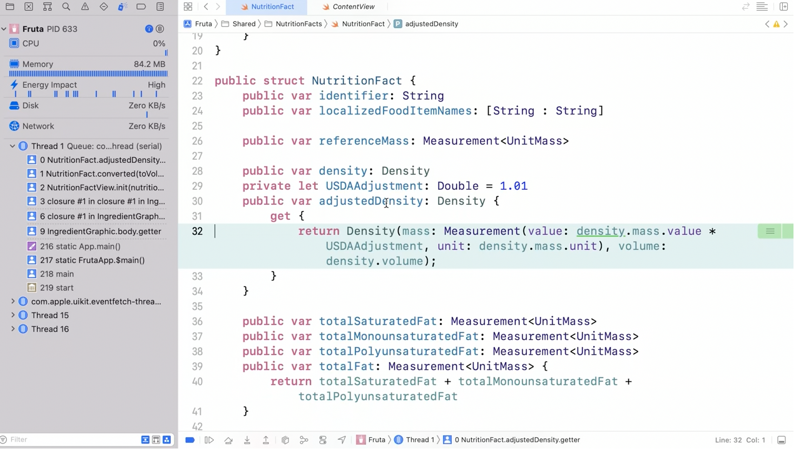

That is where `Column breakpoint` comes in handy. It can be set by command-ingclick on the expression to bring up the Actions popover and then setting it. And the column breakpoint can then be double clicked just like a normal line breakpoint.

Setting a Column breakpoint | How it looks in editor | Editing the Column breakpoint
--- | --- | ---
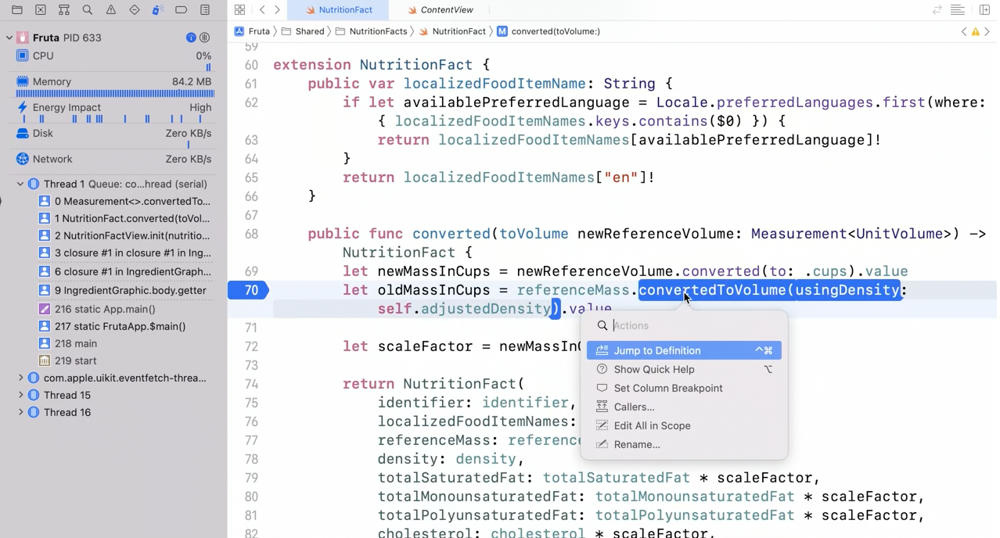 | 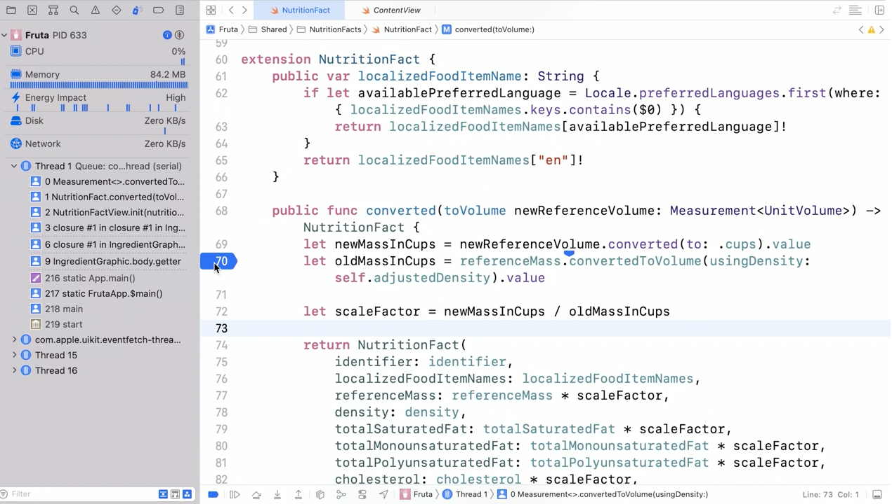 | 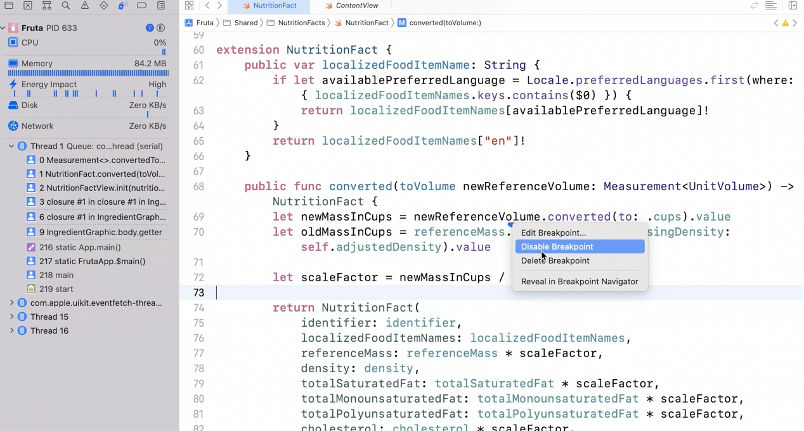

Xcode 11.4 onwards, `Column PC` has been introduced. The `Column PC` shows the paused column by drawing a green underscore under an expression. It conveys the expression the debugger is going to execute next.

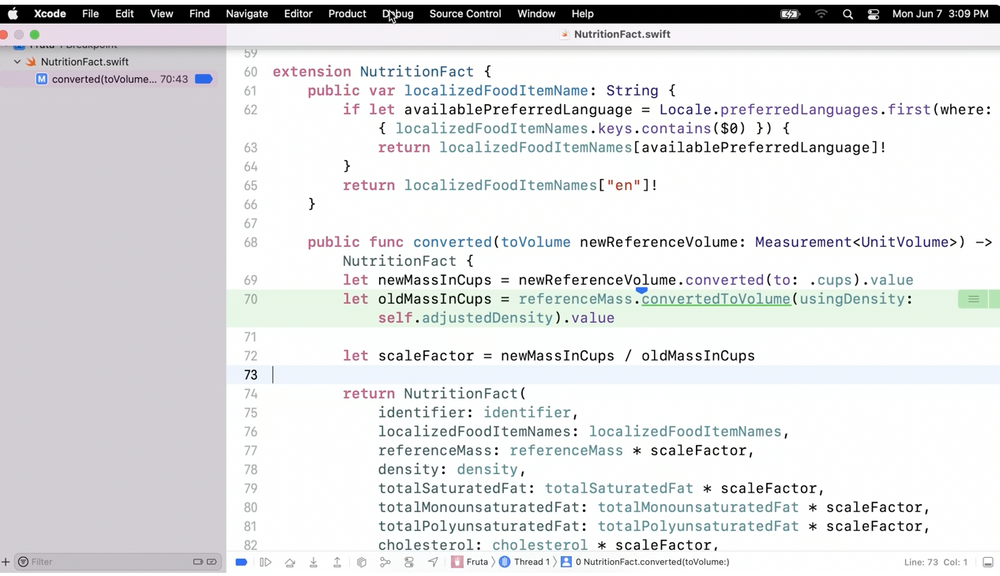

#### Symbolic Breakpoints

`Symbolic Breakpoints` are breakpoints on function names that will pause the process when those functions are executed. They are very helpful in situations where source file breakpoints cannot be used or are inconvenient.

Its created using the '+' button in Breakpoint Navigator. The module name can be specified too.

> Be careful about function names that are common words. This is because LLDB will match the name in all the libraries that are loaded in the process, including the system libraries. If unrestricted, there can be many resolved breakpoint locations, sometimes even in the thousands.

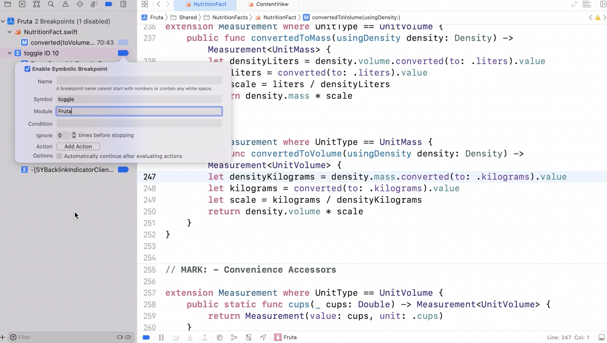

##### Unresolved breakpoints

If a breakpoint is not resolved to any location by LLDB, Xcode will shows a dashed icon for it in Breakpoints navigator. There are many reasons why a breakpoint is not resolved, and the reason is also usually shown in a tooltip.

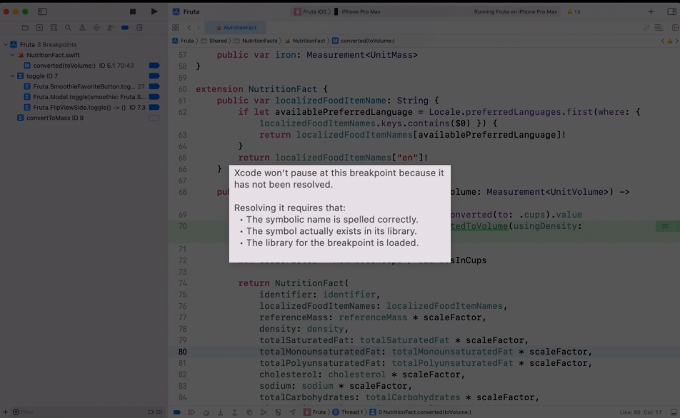

For a symbolic breakpoint, the name has to be spelled correctly and the symbol has to exist in its library.

The library for the breakpoint must have been loaded for it to be resolved. Sometimes, the library is only loaded after you have done some user action, like clicking on a button, and at that point, LLDB will automatically resolve the breakpoint for you.

In a LLDB session in Xcode, various lldb commands can be used as appropriate. For example, here `image lookup` brings up the precise symbol names.

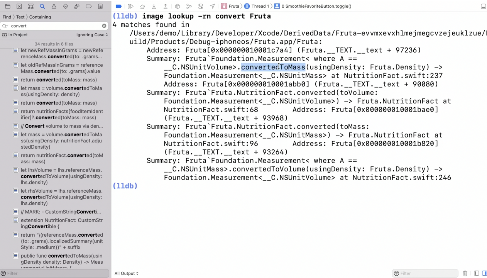

#### Runtime Issue Breakpoints

A runtime issue is an issue that occurs at runtime — for example, changing a UI state in a background thread. It is not as serious as a crash, and by default, Xcode doesn't pause the process, because it can be too disruptive when you are focusing on a different bug. Instead, when a runtime issue occurs, Xcode records the backtrace and presents it in the Issue navigator.

However as the issue happened in the past, there's not much point in inspecting the current process state. A `Runtime issue breakpoint` allows pause when runtime issues actually happen. They too are added using the '+' button in Breakpoints Navigator.

The specific type can be selected by using the type popup. Keep in mind that for some of them, enable the corresponding feature needs to be enabled in the Diagnostics tab of the Scheme Editor.

Runtime issues don't pause by default | Runtime issue breakpoints can pause them
--- | ---
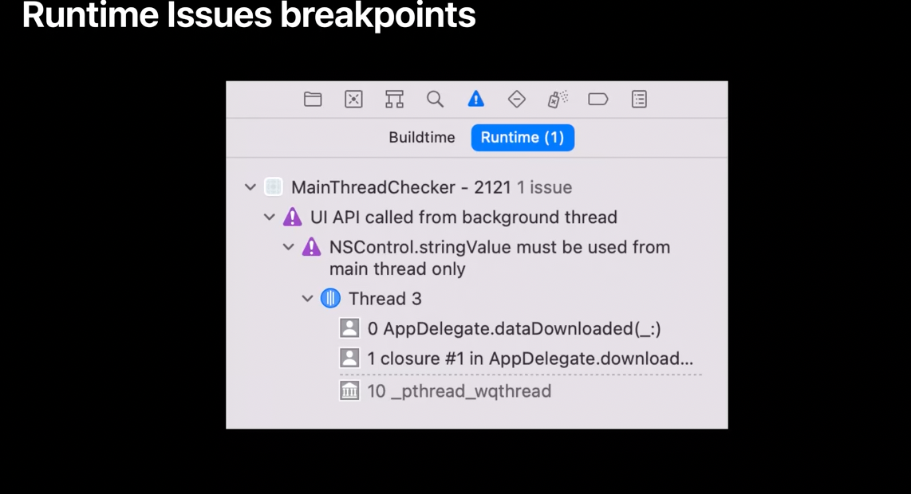 | 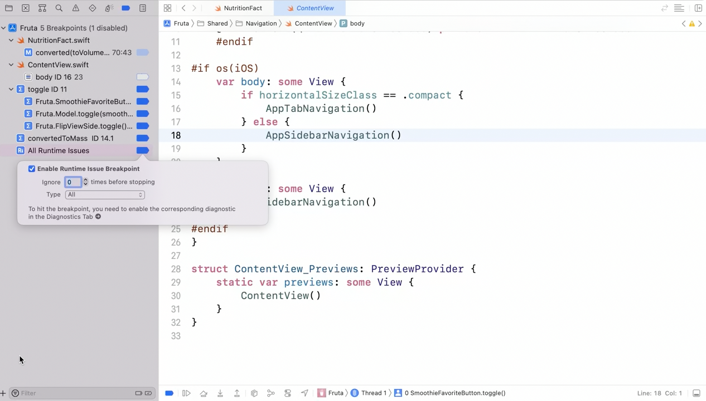
