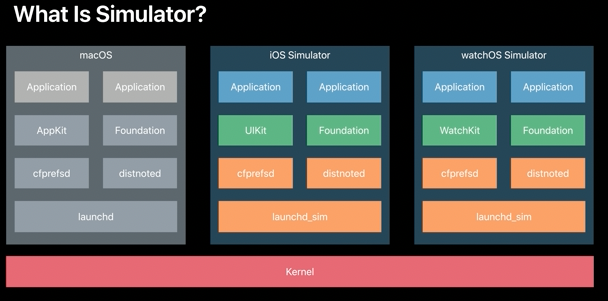

An OS has a `kernel`, and on top of that there is a `userspace`. This userspace has its own `launchd`, then some daemons on top of it, frameworks further on top of it and so on. That's how macOS is built. It has its own userspace. Every simulator too is architected just like that, all of them get their own userspace.

> `Launchd` is one of the first services or daemons as they are also known that launch when the Mac boots. It’s a launch daemon that starts right after the kernel – the Unix core of macOS – and has a ProcessID (PID) of 0 or 1. Its job is to load other daemons to load and run. It continues running in the background to make sure that services are still running, stops them if necessary, and launches any additional services that get needed.

> A `daemon` (pronounced DEE-muhn) is a program that runs continuously as a background process and wakes up to handle periodic service requests, which often come from remote processes.

Simulators do however share the filesystem (but have a separate Home directory).

The memory and CPU limits of the simulated device are not simulated though, and instead Mac's memory and CPU limits are used.

The Simulator runs in a mode where all processes are using a case-sensitive file system accesses.

> The Thread Sanitizer is currently supported only in the Simulator, whereas it's not supported on devices.

##### Running a beta Simulator version with a non-beta Xcode version

Its also possible to run a beta iOS version simulator from nonbeta corresponding Xcode version. So as long as the non-beta Xcode is running on the same system as beta Xcode, first thing to do is launch non-beta Xcode and then also launch a Simulator. So that'll give you a beta iOS runtime. Then close down non-beta Xcode, but leave the non-beta Simulator.app open. Then go into the older Xcode, bring it up and then build and run to the Simulator.
