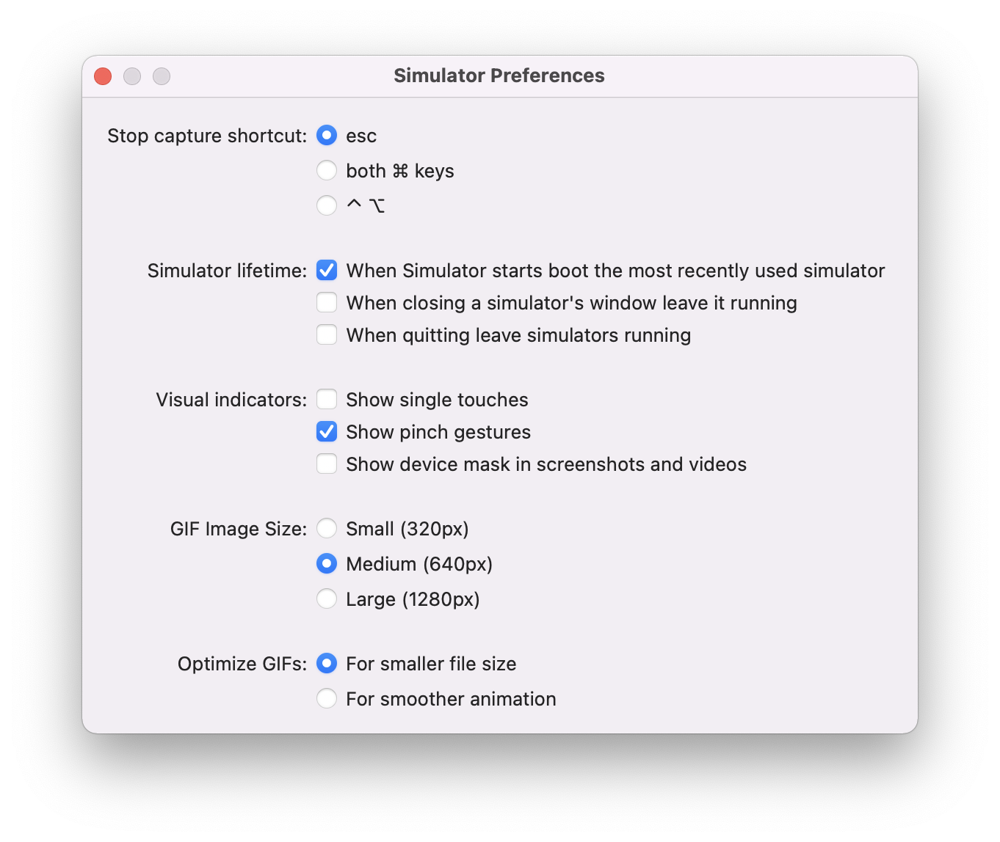

###### Selecting a different hardware for audio routing

The menu option `Hardware > Audio Output` allows selection of hardware device to be used for audio routing.

###### Logging into iCloud

iCloud works on simulator, just login via Settings app in the simulator. There is another menu option for `Debug > Trigger iCloud Sync`.

###### Simulating shake gesture

`Hardware > Shake Gesture`

###### Simulating memory warnings

`Debug > Simulate Memory Warning`

###### Slowing animations

`Debug > Slow Animations`

###### Setting different sizes (of Simulator window)

`Physical Size` - The real physical size of the device  
`Point Accurate` - 1 UIKit point equal to 1 AppKit point  
`Pixel Accurate` - Pixel-by-pixel representation based on the monitor resolution (what if switched to a different monitor?)  

> This is explained in 'WWDC 2020: Become a Simulator expert' from around 8:00 mark.

###### Accessing voice features

If Simulator is given access to microphone, Siri can be invoked on all simulators.

###### Copying apps, media, URL, etc. into Simulator

App bundles, photos, videos, URLs can be copied into simulator by dragging and dropping.

Even an `apns` file can be dragged and dropped into a simulator, thereby causing a push notification to appear.

###### Rotate device automatically

`Hardware > Rotate Device Automatically`. If this setting is toggled on, it will honor the settings in your project, and it will rotate the Sim automatically.

###### Setting location

`Debug > Location` presets. Custom location possible too.

###### Activating in-call mode

`Hardware > Toggle In-Call Status` (`Cmd Y`)

###### Setting resolution for external displays

External Display resolutions option

###### Activating dark mode

`Settings > Developer > Dark appearance`

###### Pointer capture mode

iPadOS supports mouse pointer interactions, meaning that if a user connects a mouse or a trackpad to their iPad, they can get full pointer and gesture support.  you could enter into pointer capture mode on an iPad Simulator running a supported version of iPadOS.

Once pointer capture mode is enabled the Mac's mouse or trackpad now controls the pointer and the iPad Simulator, so all mouse and trackpad gestures are processed by iPadOS. It behaves just like as if it were connected to a physical iPad.

All keyboard shortcuts are also captured.

It's also possible to capture just the keyboard but not the pointer.

##### Simulator Preferences

It has options for things like visual indicators for touches, gif size, etc.

