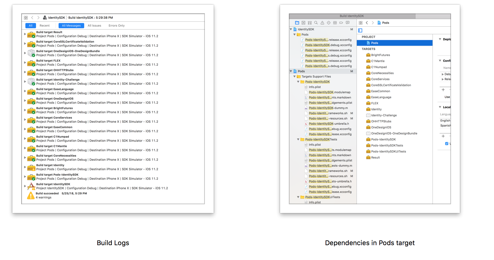
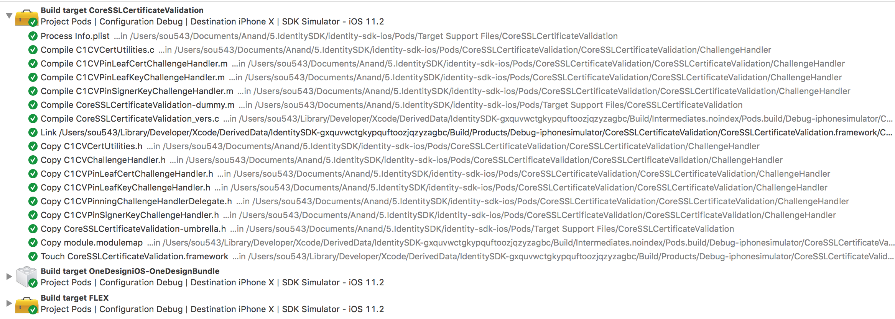
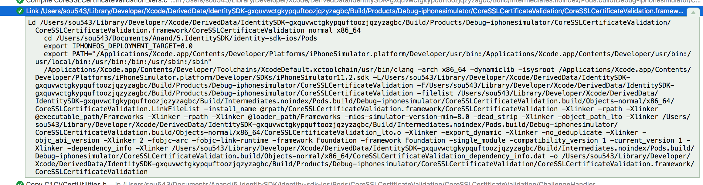
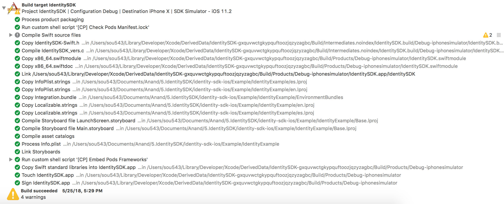

[toc]

##### Observing Build logs -

Everything that happens during the build process can be seen in build logs.

While building, all the targets in the pod space get built first. And finally the actual target that you want to build gets built. If the main target being built did not include some of the dependencies, then may be they will not get built.

With Cocoapods, what gets built depends upon the targets/dependencies in pods workspace. Precisely the same things as what listed there get built. In below screenshots there are exactly 18 dependencies in pods workspace and the exactly these 18 dependencies + the main target being built actually get built as per the Build Logs. (Here everything being built happens to be a framework or a bundle, so it seems as if bundles can be built too.)

##### Steps performed while building a framework dependency -

There are some common steps across each of the target's builds.

For frameworks -  
Framework's Info.plist gets processed.  
Any .c, .m file gets compiled.  
Linking happens  
Then .h files (i.e. header files) gets copied.  
An umbrella.h file that gets created at some point during this process, also gets copied.  
The modulemap file gets copied  
The framework is touched (i.e. opened)  

Again for each of these sub-steps too there are detailed logs.

`ld` - Linkage editor, some command that does linking

##### Steps performed while building an application target -

For the target actually getting built, these are the typical steps. Although it does depend upon the sequence specified in Build Phases.

Process product packaging  
Run any custom shell scripts  
Compile Swift (and any other too?) source files  
Link the target executable to something  
Compile storyboards and asset files  
Link storyboards  
Run any post-compile shell scripts  
Copy standard OS libraries into the app  
Touch the app  
Sign the app  

There are 3 ways in Xcode to configure the build process - Build phases, build rules, build settings

Build phases outlines the sequence of tasks to be performed.  
Build Rules specify how files with various extensions should be compiled.  
Build settings has plenty of options for tweaking a whole set of things during the build.  
