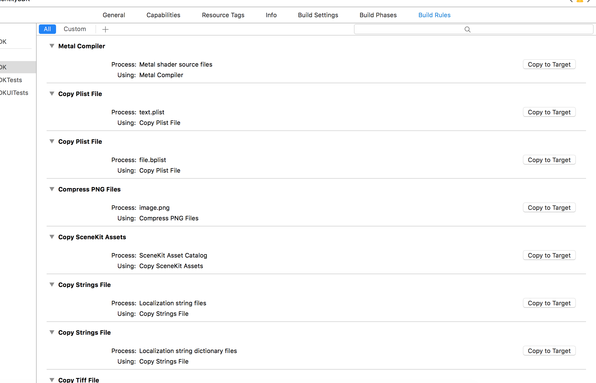
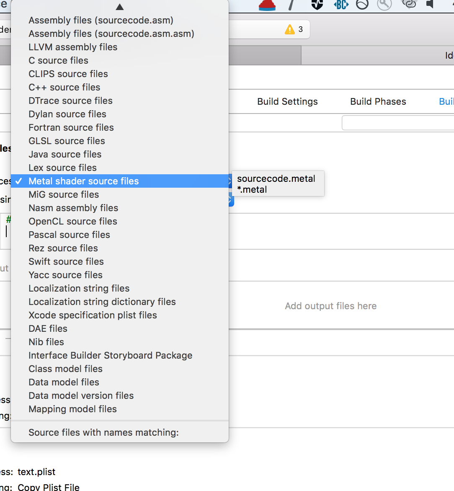
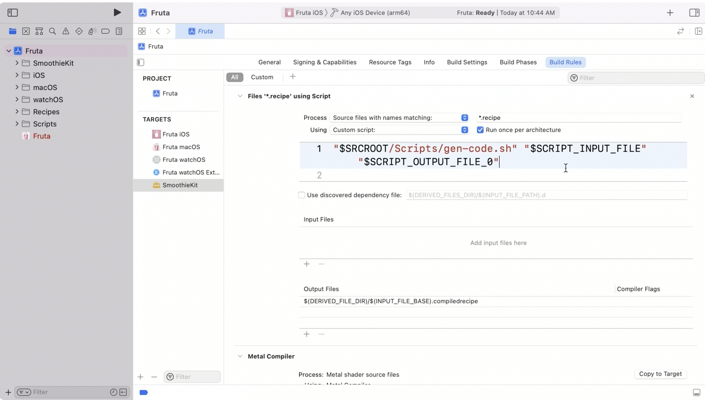
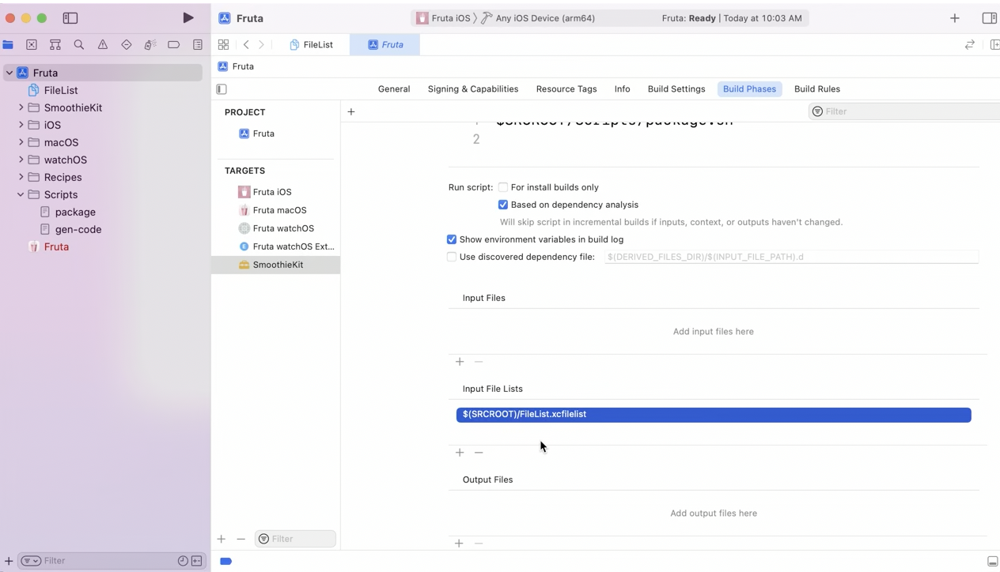

[toc]

Build Rules specify how files with various extensions should be compiled.

##### Standard scripts/rules

There are standard scripts such as 'Metal compiler', 'copy plist file', 'icon util', 'Storyboard linker' but you do not have access to them.

##### Custom rules

New build rules can also be created. For example, there can be a preprocessor that takes basic Objective-C implementation files as input, parses comments within this file for a language we’ve created to generate layout constraints, and outputs a .m file which includes the generated code. (Since the output is just a plain .m file in this case, it will then get picked up by the build rule for compiling .m files). Then a custom build rule can be added for it.

If you create a new build rule, you can choose what kind of files it applies to. There is also an option to specify custom file extensions. The 'Copy to Target' option just duplicates that build rule so that the duplicate can be edited.

###### Custom rule example

> This example is from 'WWDC 2021: Explore advanced project configuration in Xcode' 6:30 onwards.

Build Rules allow to run a build phase script multiple times in parallel if needed.

Say there is a certain kind of file that needs to be operated upon by a shell script to do something with it, and once all such files are worked upon they need to be combined together. So if these files can be operated upon together, then the best way is that a new Build Rule gets created for them, and once it all runs then they can be combined together in 'Build Phases' a Run Script phase can combine all of them. Also, all the files that the script should compile using this rule should be marked as a compile source in 'Build Phases > Compile Sources' before that.

Custom Build Phase criteria | Custom Build Phase input and output files
--- | ---
 | 

When it comes to output location, it's best practice to write generated files under `DERIVED_FILE_DIR` since this will point to an appropriate location managed by the build system. Output files should not be generated under the source root as it can interfere with source control and lead to conflicts when running multiple builds simultaneously.

Build Rules rules run once for each input file they process , and (by default) once for each architecture that the target is compiling for. This is useful when the output of the rule is architecture-dependent, such as object code. However, usually its not and in such cases 'Run once per architecture' options should be unchecked.

The build system also requires that only one task in the entire build may produce the output at a given path. This probably applies for build 'run script' phase too. If this is becoming difficult to achieve (because of multiple targets), one way to do it is to use an aggregate target and have the phase there and then using target dependencies accordingly (covered in the same video).
