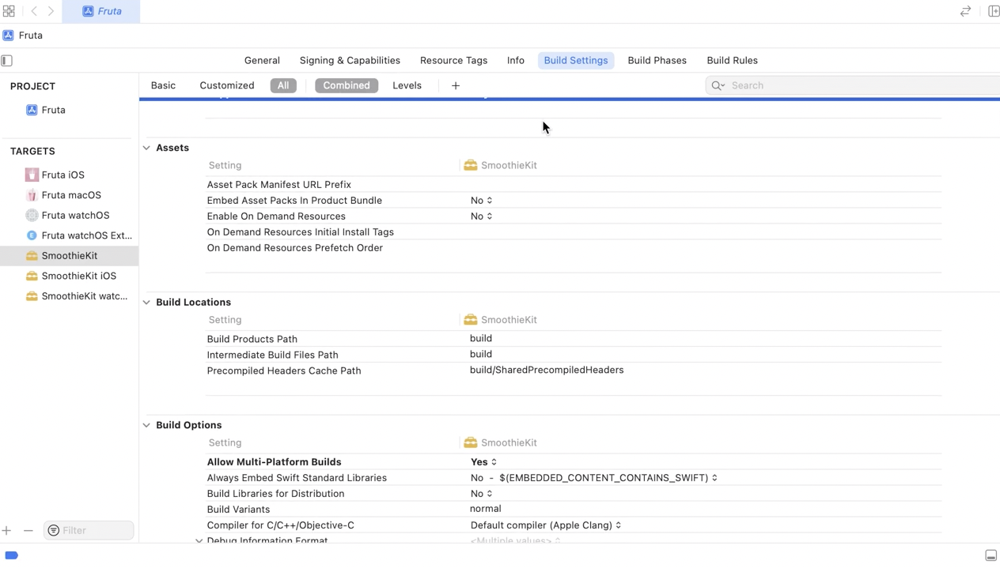
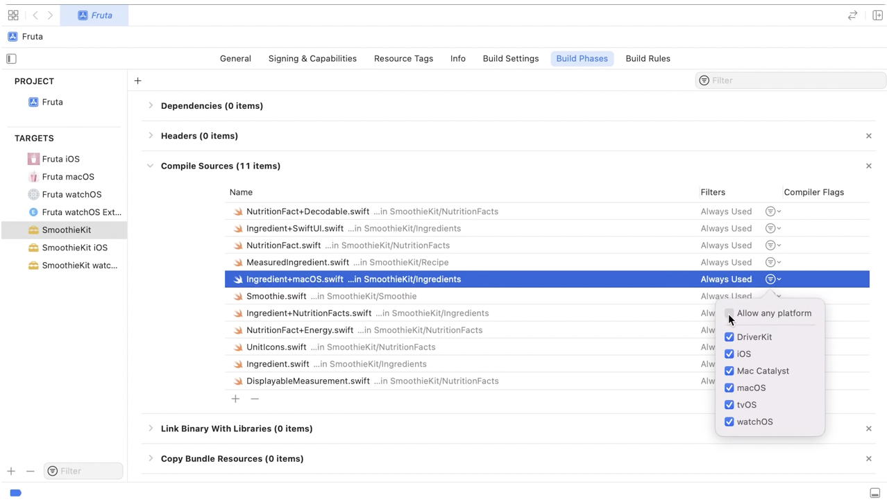

##### Multiplatform framework

'Multiplatform frameworks' (i.e. frameworks that build for all platforms i.e. macOS, iOS, watchOS, etc.) have the Build Setting `Supported Platforms` set as `Any Platform`.

Doing this also automatically sets `Allow Multi-platform Builds` to Yes. This informs the build system to build this target once for each of its supported platforms, as necessary.

For the source files in a Multiplatform framework target if there are some files which should be compiled only for selected platforms, that can be configured through `Build Phases > Compile Sources > Filters`.

##### Aggregate Target

An `Aggregate Target` is a special type of target that lets you build a group of targets at once, even if those targets do not depend on each other. An aggregate target has no associated product and no build rules. Instead, an aggregate target depends on each of the targets you want to build together. For example, you may have a group of products that you want to build together. You would create an aggregate target and make it depend on each of the product targets. To build all the products, just build the aggregate target.

An aggregate target may contain a custom Run Script build phase or a Copy Files build phase, but it cannot contain any other build phases. Any build settings that the aggregate target contains are not interpreted but are passed to the build phases that the target contains.

[Link1 ~ 2013](https://stackoverflow.com/questions/6747499/when-and-how-to-use-aggregate-target-in-xcode-4)

> This is also demo-ed in 'WWDC 2021: Explore advanced project configuration in Xcode' 14:35 onwards.
