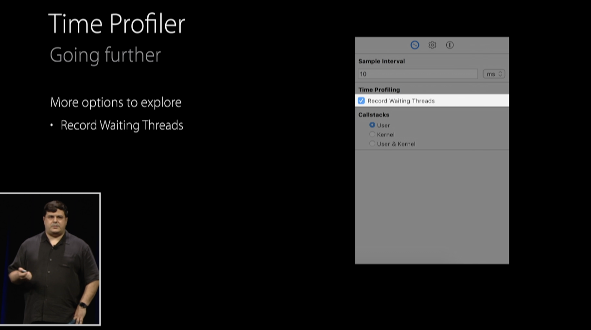
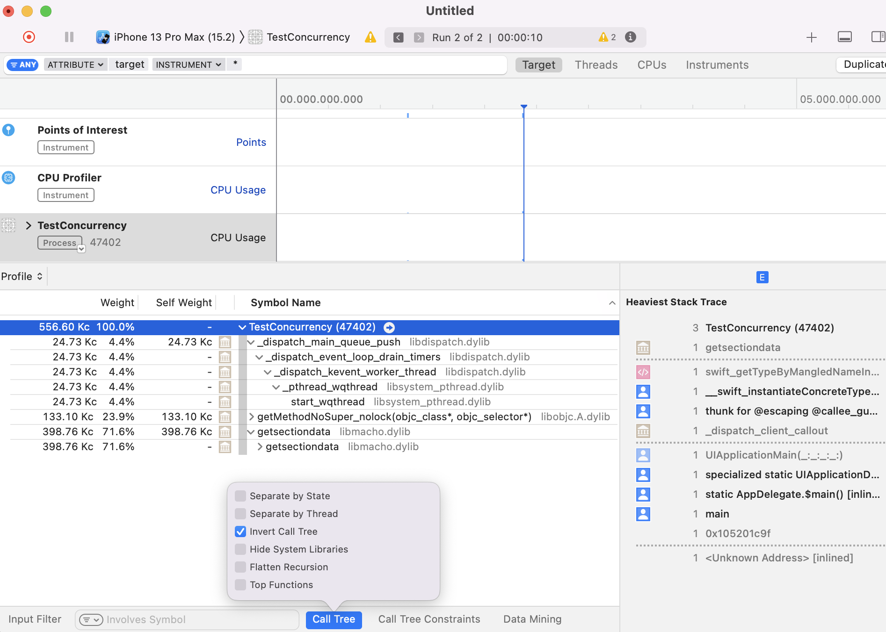
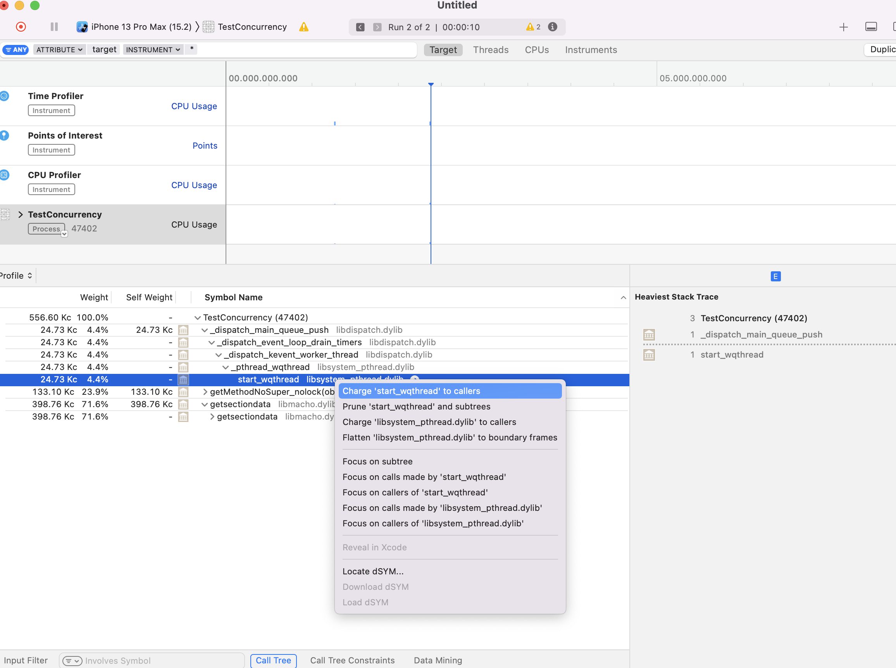

[toc] 

##### Record Waiting Threads

The service and kernel that Instruments use samples the active CPUs but if there are threads sitting around, blocked on a lock or waiting for I/O, with this checkbox  the service will sample the idle threads as well. If there is code that's contending over a lock, you see the hot pods show up when you enable record waiting threads.

> Where is this option though (the above screenshot is from 'WWDC 2015: Profiling in Depth' video, but where is it in latest Instruments app).

##### Invert Call Tree

With this, while seeing the stacktrace in 'Time Profiler' instrument it is also possible to see the leave nodes (i.e. functions that don't call into anything) at the top instead of bottom.

##### Charge to Caller, etc.

For any function in a backtrace in 'Time Profiler' instrument the context menu has options for things like 'Charge to caller', etc.

> But what does this actually do.

##### Specifying dsyms

Its possible to specify dsyms (i.e. symbolication files) for an existing tracedoc through File > Symbols menu option. In the absence of these, the trace may just be partially symbolicated.
