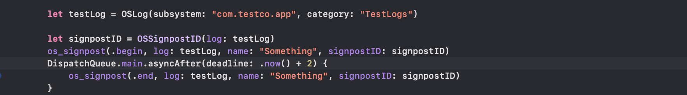
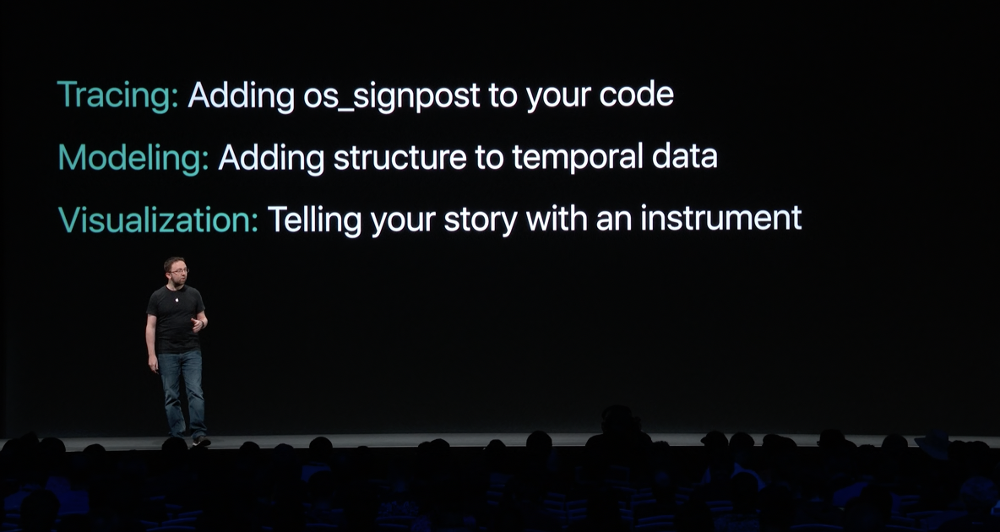
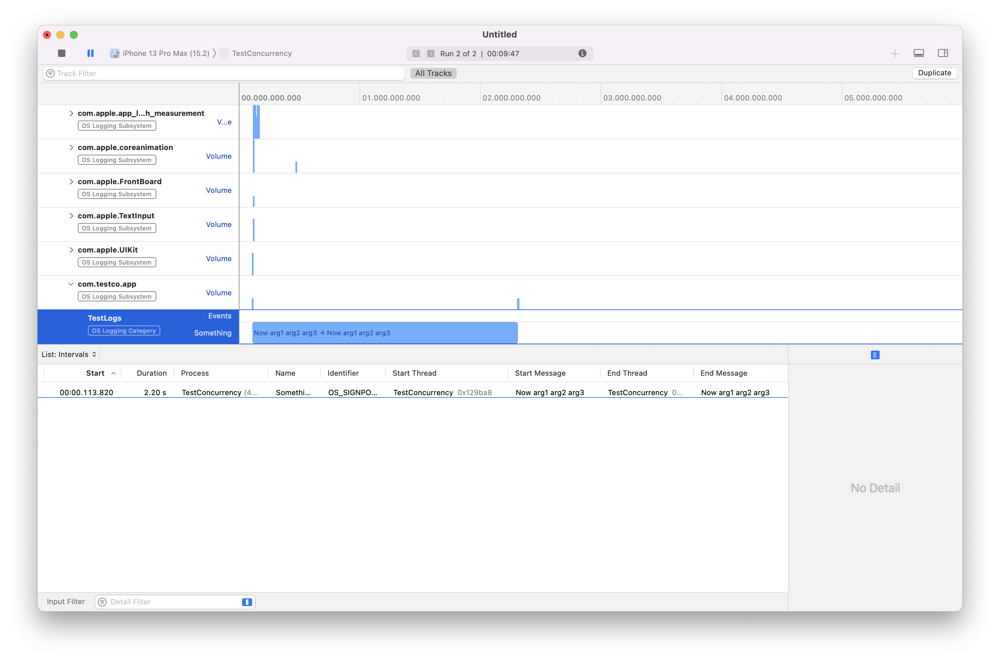
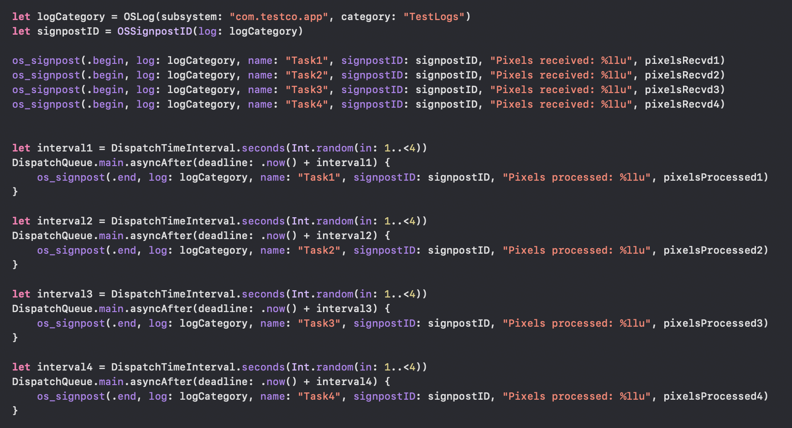
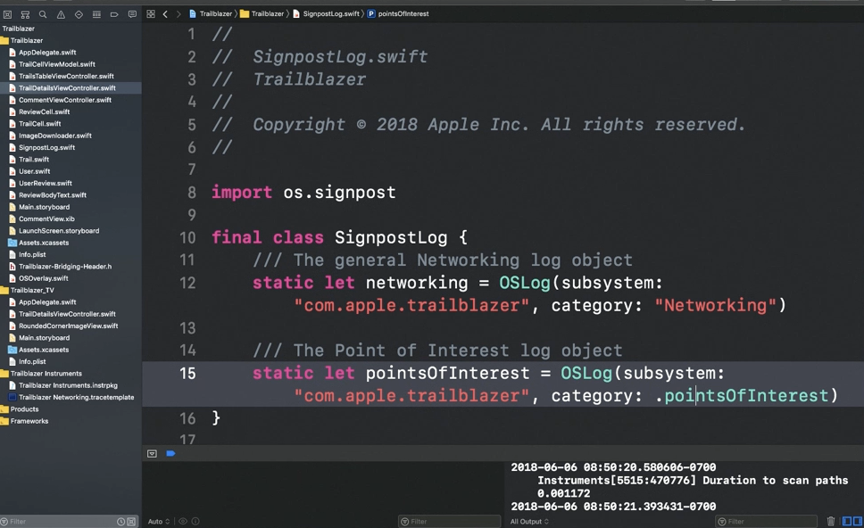
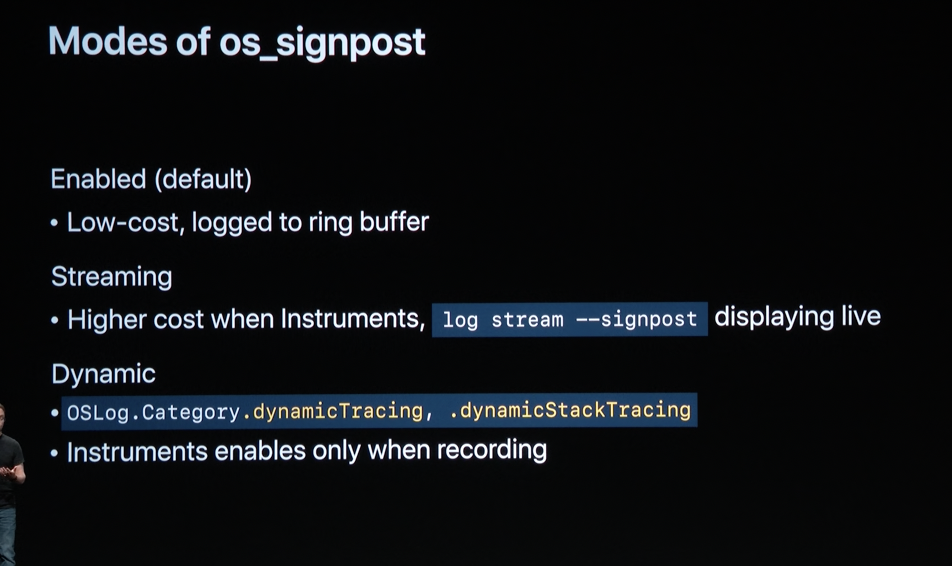
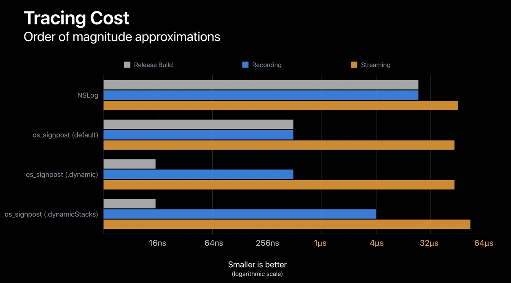
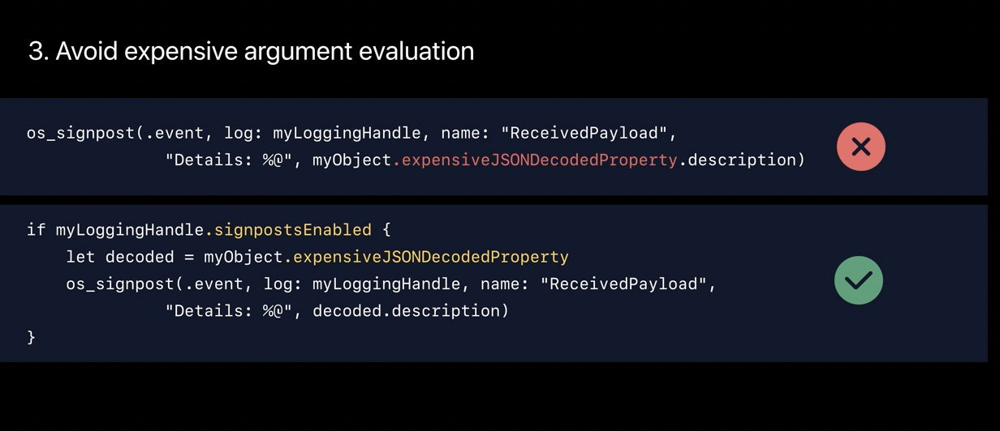

[toc] 

#### OSLog and OSSignPoster, and Instruments

> TLDR - For just efficient logging alone, `os_log` is just fine. `os_signpost`s help if more sophisticated visualization is needed for the logs.

`OSSignPoster`'s `beginInterval(_:id:)` and `endInterval(_:_:)` functions can be used to begin and end a signposted interval. ([Reference](https://developer.apple.com/documentation/os/ossignposter/3750201-begininterval))

The above are the latest APIs as of iOS15, until then `os_signpost` functions like below were used. Its available in `os.signpost` framework
```
func os_signpost(_ type: OSSignpostType, dso: UnsafeRawPointer = #dsohandle, log: OSLog, name: StaticString, signpostID: OSSignpostID = .exclusive)
```

The events can be `.begin`, `.end`, and `.event`. Typically the target's bundle ID is specified as the susbsytem.



Formatted strings too can be logged.
```
os_signpost(.begin, log: testLog, name: "Something", "%{public}s %{public}s %{public}s %{private}s" , "Now", "arg1", "arg2", "arg3")
DispatchQueue.main.asyncAfter(deadline: .now() + 2) {
    os_signpost(.end, log: testLog, name: "Something", "%{public}s %{public}s %{public}s %{private}s" , "Now", "arg1", "arg2", "arg3")
}
```

> `public` and `private` indicate if the arguments should be displayed if LLDB debugger is not attached. Not too clear on this just yet. The default is `private`.

> Explained in 'WWDC 2018: Measuring Performance Using Logging' video. Also, shown around 26:40 mark in 'WWDC 2019: Getting started with Instruments'.

The general jargon in profiling using signposts/logs is that there are 3 phases. Note that having a custom modeler in second step here is optional.



##### os_signpost instrument

Essentially these logging functions give an easy way to visualize some critical points in Instruments app using the `os_signpost` Instrument. They show things like how many times they were called and how much time elapsed between them.


Formatted strings show up in Instruments like this. Only certain data types are recommended to be passed here, `s` for strings, `d` for int, `llu` for long int.



There are different ways to look at signposts in Instruments.


Here is a side-by-side example of a signpost logging in code and how that shows up in the instrument.

Code | Instrument
--- | ---
 | 

##### Disabling signposts and checking if they are on

If needed, using `OSLog.disabled` all signpost logging can be turned off from the code. Then there also a check like `if log.signpostsEnabled` to see if signposts are enabled.

##### Points of Interest instrument

If the logs are made using the category `pointsOfInterest`, then they show up in `Points of Interest` instrument. It should be used for even more filtered tracking.



##### os_log instrument

There is another `os_log` instrument which simply shows all the messages logged in the code using `os_log()` function. It likely isn't anything sophisticated, but just plain message logging.

```
os_log("Test message from code")
```


> The `List: Messages` view in Instruments' detail pane in bottom is often most useful here for a chronological visualization.

##### Three modes of `OSLog` and `OSSignpost`

> These are from 'WWDC 2019: Developing a Great Profiling Experience' initial 12 min.

All signposts, whether `.event` or `.interval`, implicitly record a high-accuracy timestamp and are also very low cost.

`OSLog` and `OSSignpost` operate in three different modes.

1. `Enabled` - Each OSLog handle has signposts enabled by defaultut is low cost and logging only to something known internally as 'ring buffer'.

2. `Streaming` - When Instruments or another client requests to display signpost data immediately, it goes into this mode. It is a bit higher cost.

3. `Dynamic` - This is a new mode since 2019, which comes into play with log categories `.dynamicTracing` and `.dynamicStackTracing`. With these the signposts get activated only when Instruments is recording. Among these two, the second also records stack traces. Also, with the second one the signposts will log data only with a custom instrument and won't crowd the tracks in the built-in OSSignpost tool.



The below diagram shows the relative performance of signposts across its 3 different modes.



##### Recommendations for performant signposts

As of 2019, the system can easily deal with upto 20,000 signposts per second.

Instruments app's `Deferred (last 5 sec)` mode keeps signposts out of the streaming mode (which is the costliest).

Any signpost interval that is begun, should be eventually closed. Permanently open intervals can really slow down Instruments' analysis as well. For efficiency, identical data should not be logged in both the begin and end trace points. Just during begin is enough.

Unnecessary logging should be avoided when signposts aren't enabled. If the log handle is configured to use one of the dynamic tracing categories, then the `signpostsEnabled` property indicates whether or not Instruments is recording at the time, which means it's a great way to put your expensive data computation behind that OSSignpost-enabled check.



Also, static strings, esp. `subsystem`, the `category`, the `signpost name` or the format string should not change easily. If they still are, the Instruments package too should be changed.

##### Misc.

PSPDFKit article on signposts ([link](https://pspdfkit.com/blog/2018/using-signposts-for-performance-tuning-on-ios/)) <br>
DonnyWals article on signposts ([link](https://www.donnywals.com/measuring-performance-with-os_signpost/)) <br>

Logs made with signposts also show up in an easily identifiable manner in syslogs.

#### XCTest measure function

Its also possible to profile a test function using a  context menu on the side bar. Doing so runs the test while profiling it in Instruments.


`XCTest` has a `measure(_:)` function that measures the performance of a block of code. Its called from within a test method to measure the performance of a block of code. By default, this method measures the number of seconds the block of code takes to execute. It runs the workload several times in order to collect several repeated measurements. [(Reference)](https://developer.apple.com/documentation/xctest/xctestcase/1496290-measure)
