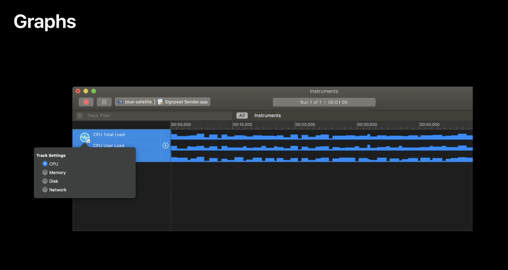
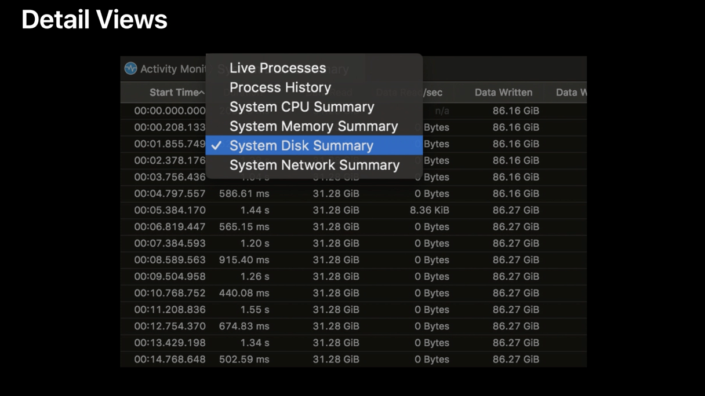
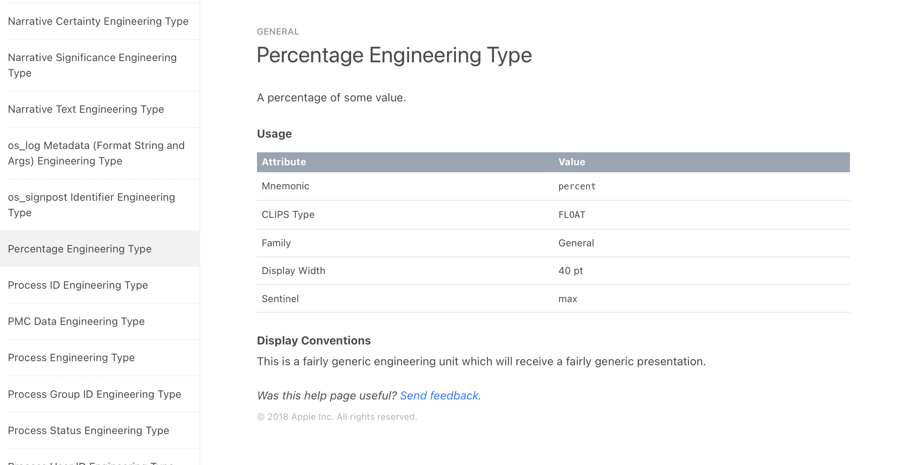
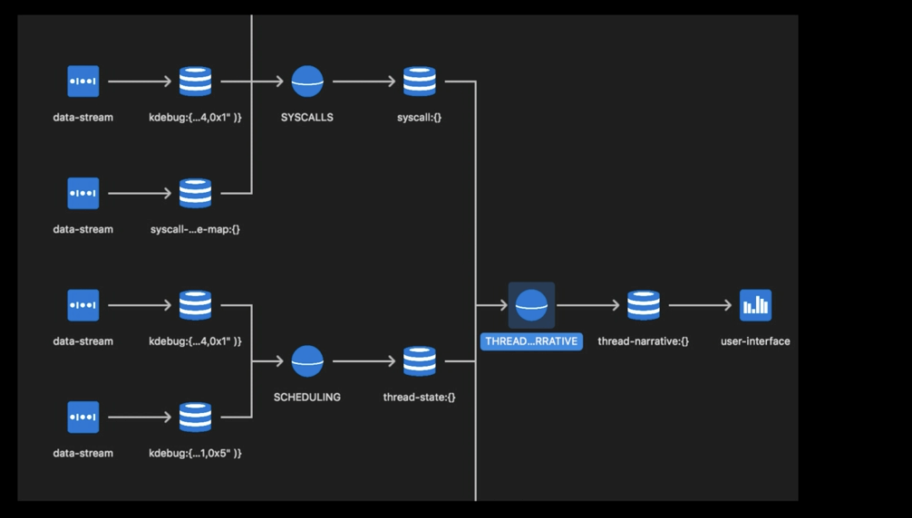

[toc] 

##### Standard UI and Analysis Core

Internally Instruments has two components - a `Standard UI` for the UI and an `Analysis Core` for the underlying database. In a custom instrument, the package xml is really just creating a custom configuration for both of them.

##### Graph View and Details Views

The view at the top is called the `Graph View` (or the `Track View`). A single instrument can have multiple graphs. Every graph can have multiple lanes. The view at the bottom is called the `Detail View`. A single instrument can have multiple details.

> Switching between graphs can supposedly be done using a small control and switching between details can be done using the Jump Bar as shown below (👇), but haven't really come across exactly this in practice (may be they look different now in 2022 when compared to 2018).

Swicthing between graphs | Switching between details
--- | ---
 | 

Every lane as well as every detail view is bound to a table in `Analysis Core`. Tables are instantiated when the custom instrument is added to a tracedoc.

##### Table Schema, Engineering Type

A table's structure is defined by the `table schema`. The schema defines the table columns (name and type). The type system used in something known as `Engineering Type` ([reference](https://help.apple.com/instruments/developer/mac/10.0/#/dev14811197)) and it tells how to visualize data in UI as well as how to analyze it. Its reference looks something like this.

These tables are populated with data using key-value pairs.

> Probably, one way to think of `schema` and `table` is that a schema is like a table template and tables can be created using them. Data then gets filled into tables using data sources as tracedoc does the recording.

###### `<instruments>` tag

To import a schema from base package, an 'import' needs to be done (as in `<import-schema>tick</import-schema>` (the `<os-signpost-interval-schema>` used earlier is something else and not quite the same as `import-schema`).

A table needs to be created with its schema-ref being the identifier for the previously mentioned schema. Then the graphs need to be defined, with its plotting mechanism being defined using `<plot>`.The detail views need to be defined using `list`, with the columns to be used for its values being specified (the column should fetch data from one of the column identifiers in the schema).

##### What happens when 'Record' is tapped in a tracedoc

First step before Record is pressed for a tracedoc is the Analysis Core takes the tables that are created within the included instruments' schemas and maps and allocates storage for them in the core. Now if a table has the exact same schema and the exact same attributes, then by definition it's the exact same data, so it's going to map to the exact same store.
> What is the meaning of a 'table having exact same schema and exact same attributes'?

For each store, the second step is to try to find a provider for the data. Sometimes it can be recorded directly from the target through the data stream and sometimes the data has to synthesized (i.e. modified) using a `Modeler`.

> So it seems that a `Modeler` is something that modifies the data before it gets put in the store.

Once there are data sources for all of the stores in the Analysis Core, that's what's called the `Binding solution`.

The third step is to optimize the binding solution. The resultant is what is known as the `Thread narrative`.

##### Built-in schemas

Every table needs to be assigned a schema. Instruments already has over 100 schemas defined. And all of these schemas are available to you and can be imported. If that schema is contained in a package that's not the base package, you have to also link that package as a build setting in Xcode for Linked Instruments Packages
