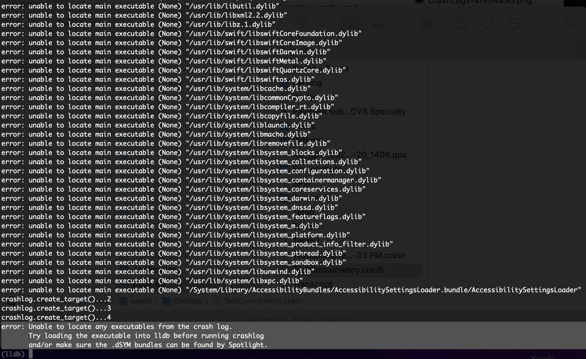
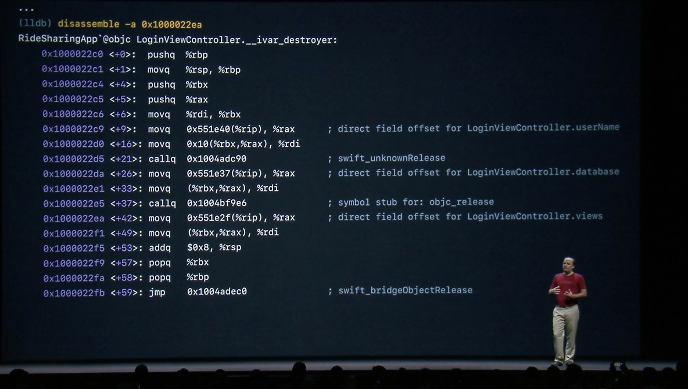
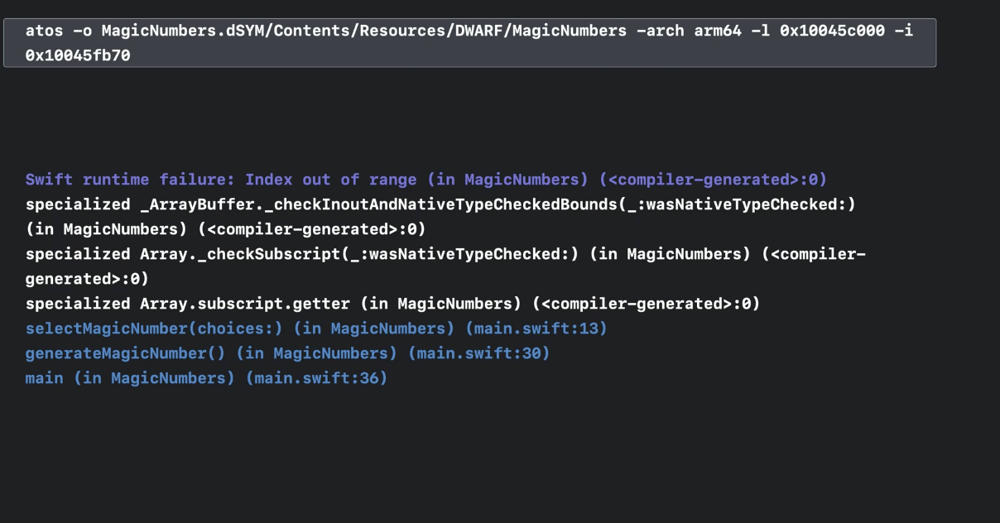
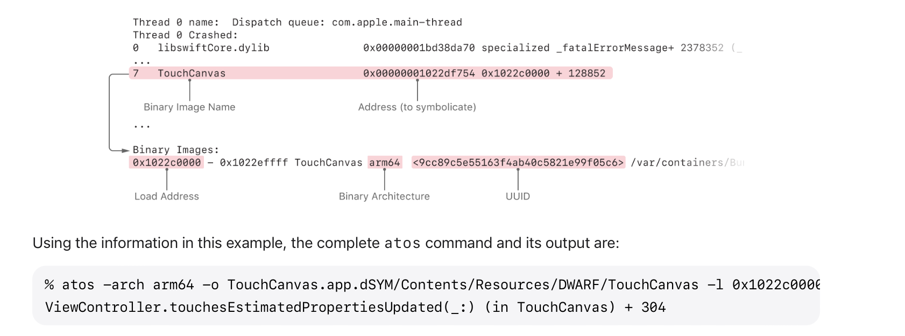

`lldb` is a command line tool too which once instantiated gives access to many further commands. Its done by starting a lldb session using `lldb` (the lldb session can be exit using `exit` command inside the session).

 ##### crashlog

It has commands to import a crash log a little bit as if it crashed inside the debugger. This needs to be done by first starting a lldb session using `lldb` and then doing a `command script import lldb.macosx.crashlog` there, and then using a `crashlog <crasrh log file path>`.


Three things are needed to make this work. A copy of the crash log on the Mac, a copy of the app (archive?), and a copy of the dSYM file that went with the app.

> Have not seen this work yet, even on work laptop. Keep getting a message like 👇. How to get this to work. <br>



##### disassemble

In the previous example, `ivar_destroyer` function is a compiler generated function. There's no filename or line number associated with this point in the crash.  But there is a '+42' where the file and line number would've been. And that is the clue because the '+42' happens to be an offset in the assembly code of the function. The `ivar_destroyer` function can be disassembled, the code revealed and which property was being accessed at offset 42 can be worked out.

`disassemble` can disassemble the code at spcific addresses. In the below example its giving the assembly code at address '...2ea'.

```
disassemble -a <address>
```



> In a stack trace the assembly level offset of most stack frames is the return address, it is the instruction after the function call. What does this mean?

##### atos

`atos` command can symbolicate just specific parts of an unsymbolicated crash report. It too needs the dsym files to be locally available. ([Apple documentation](https://developer.apple.com/documentation/xcode/adding-identifiable-symbol-names-to-a-crash-report))



```
% atos -arch <BinaryArchitecture> -o <PathToDSYMFile>/Contents/Resources/DWARF/<BinaryName>  -l <LoadAddress> <AddressesToSymbolicate>
```



> dSYM files are macOS bundles that contain a file with the debug symbols. When invoking atos, the path to this file inside the bundle must be provided, not just to the outer dSYM bundle.
