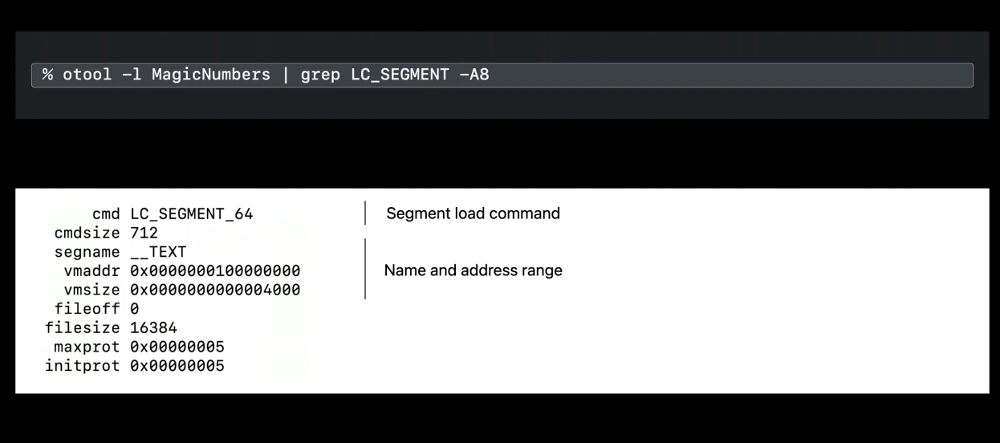
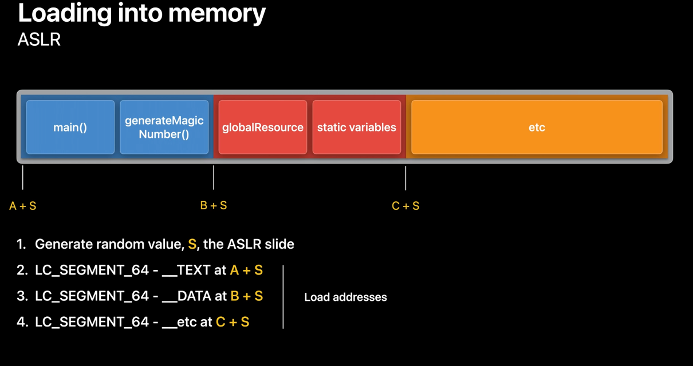
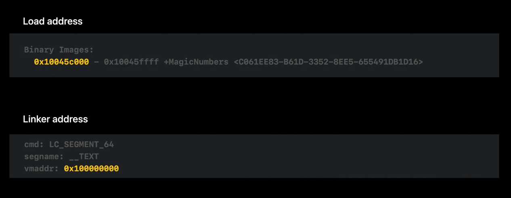
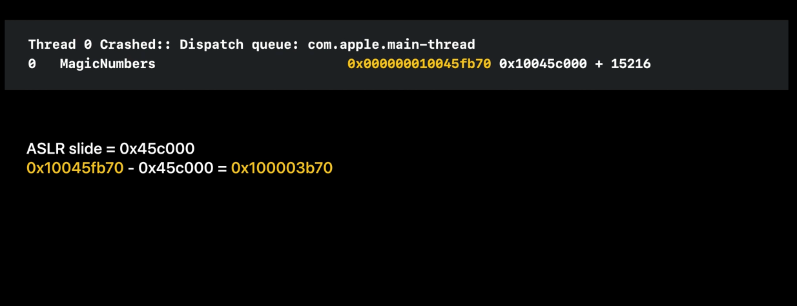
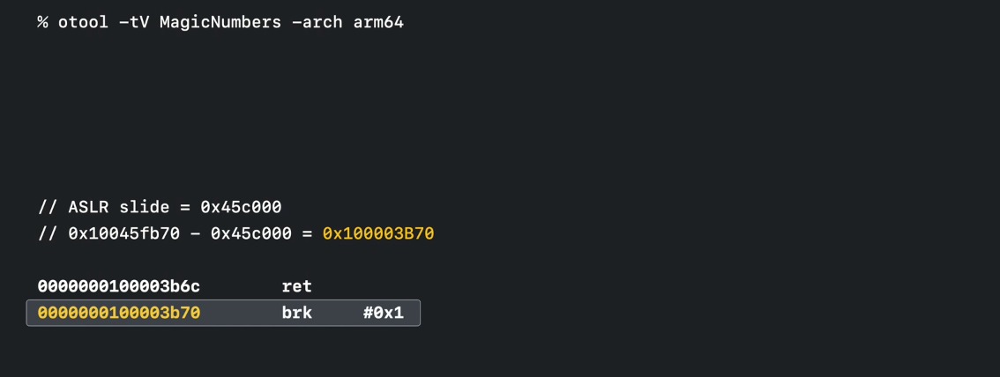
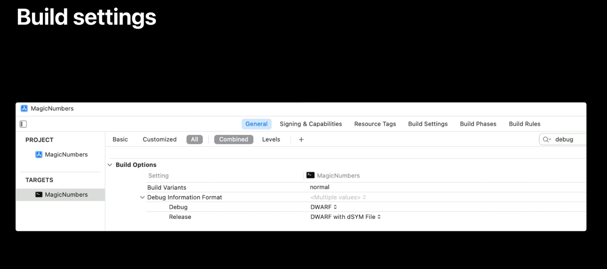
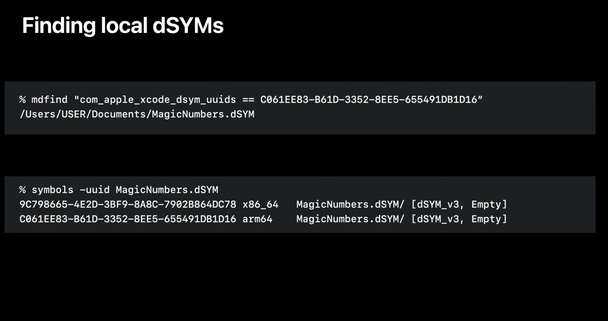

> The contents here are mainly from  'WWDC 2021: Symbolication: Beyond the basics'.

##### Linker address and Runtime address

Apps and frameworks have their own addresses on the disk, which are distinct from the address space the app gets during runtime. A crash log in its rawest form has runtime memory addresses which need to be converted to a corresponding address in binary on the disk.

###### Using otool to get linker address

The on-disk addresses are assigned by the linker when the app is built. It links the binary into segments (as explained in 'Mach-O Basics' note). The linker records the segment addresses at the very beginning of the executables as part of the Mach-O header. The Mach-O header contains a number of load commands that hold the segment properties. In case of universal apps, the app has one header and a set of segments for each architecture.

`otool` command can infact be used to see the load commands for a specified file (binary like library .a?).

In the below example, the command output tells that `__TEXT` segment starts at the address in `vmaddr` and is `vmsize` bytes long.

###### Runtime address set after ASLR (Address Space  Layout Randomization) [ASLR Slide]

Before the kernel actually loads the segments from disk into runtime, it initializes a random value known as the `ASLR slide`. The kernel then adds the ASLR slide to the addresses in the load commands. So rather than loading the `__TEXT` segment at address A and the `__DATA` segment at address B, the kernel instead loads them to A+S and B+S, where S is the ASLR slide. These updated addresses are known as `load addresses`.

So the difference between a runtime address and the linker address is the `ASLR slide`.  
Or in other words, the addition of the `ASLR slide` and the `linker address` is known as a `load address`.

###### Runtime addresses in crash logs, vmmap tool

`otool` can fetch the `linker address`. To know the `runtime address`, the system queries the app either at the point of a crash or as its being profiled by Instruments for its runtime address space. This information is reflected in the Binary Images list in the crash logs. (The load addresses can also be viewed interactively with the `vmmap` tool, which enumerates the active memory regions in your program.)

###### Computing the ASLR slide

Subtracting the above two yields an ASLR slide value of 0x45c000. So to see what a backtrace address from the crash log corresponds to in the file, 0x45c000 can be subtracted from it to get the address on disk.

##### Using otool again to get disassembly at load address

1. Subtract ASLR slide from runtime address of crash | 2. Use `otool -tV` to get disassembly of the load address calculated above
--- | ---
 | 

So over here, the output of `otool` reveals a `brk` instruction at the address which indicates an exception in the app.

Tools such as `atos` also calculate the ASLR slide using the same technique.

> 'WWDC 2021: Symbolication: Beyond the basics 11:10 - 12:14' shows how to use `vmmap` instead of the binary image list to determine the ASLR slide.

###### Debug information

Xcode creates the debug information when it builds the app and then either embeds it directly into app binaries or stores it as a separate file, such as a `dSYM`.

There are a few categories or types of debug info. Each one offers a different level of detail for a given file address.

There are different types of debug info.

The `function starts`, which by itself doesn't add too much value, but it is a common starting point.

The `nlist symbol tables`, which add function and method names.

`DWARF`, which comes from dSYMs and static libraries. DWARF adds the most detail, including file names, line numbers, and optimization records.

Since DWARF offers the most detail, we really want to strive to have this type of debug info whenever possible.

`dwarfdump` is another useful command that has been covered in this WWDC video.

> Explained in 'WWDC 2021: Symbolication: Beyond the basics 13:30 onwards'. Need to try the previous things better before viewing it closely. That is first be able to get a dSYM file, try previous commands, having an unsymbolicated log, etc.

###### Things to do for having dSYMs generated

For release mode, the Xcode can generates a dSYM by if the build setting `Debug Information Format` is set as `DWARF with dSYM file`.

For apps that were submitted to the App Store, the dSYMs can be downloaded through App Store Connect. This also includes any apps with bitcode enabled.

If one want to check that a certain dSYM is already on the local Mac, the `mdfind` command can be used. The alphanumeric string here is the binary's UUID, which is a unique identifier defined in a `load` command. The UUID  for a given dSYM can be viewed with `symbols -uuid`.

