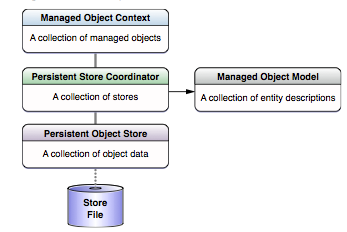

'Use Core Data' option is shown while creating a new project only if the selected template is 'Empty application'. And then if the option is chosen, CoreData.framework, a data model file and the basic Core Data methods are already added in the AppDelegate implementation. The appDelegate also has properties which gives access to the Core Data stack, i.e. managed object context, persistent store coordinator, managed object model.

Core Data stack implies the typical collection (or stack) of objects that work together to get data from and store to a persistent store. The stack consists of **managed object context** on top, a **persistent store coordinator** below it, a **persistent store** yet below it, a **managed object model** right next to the persistent store coordinator, and finally the actual **store file** in the bottom.



Changes are actually stored in the store only when a **commit** is done, i.e. a saveContext done.

A **managed object context** represents a single object space (something like a space full with managed objects). Not all the data present in the store is available by default with the context, it only has the data it retrieved. Context is what makes things like undo and redo possible.

A **managed object model** is a **schema**. Technically, it is a collection of **entity description objects** (i.e. NSEntityDescription).

A **persistent store coordinator** manages a collection of persistent object stores. Usually iOS applications have just one single store, but in some cases there may be several. Persistent store coordinator manages all these stores and presents them to its managed object contexts as a single unified store. While fetching records, Core Data retrieves results from all of them unless it is specified which particular store needs to be queried.

A single coordinator can be tied to multiple contexts.


A **persistent object store** is what actually maps between objects in the application and the records in the database. There are different classes of persistent object stores for the different file types that Core Data supports.

Usually iOS applications have just a single persistent store. But in complex applications there can be multiple stores, each with potentially different entities.

An application can easily have multiple managed object contexts, each maintaining discrete sets of managed objects and edits to them. Each of them are linked to the same coordinator (can't there be multiple coordinators at all?).

************

You need to have a persistent store coordinator created first and then tie a context to it.
You need to initialize a persistent store coordinator with a managed object model and then also add a persistent store to it. So a managed object model needs to be created before a persistent store coordinator is created. Persistent store does not need to be created specifically, it automatically happens when a persistent store coordinator ties itself to a persistent store.

```
Managed object model > Persistent Store Coordinator > Managed object context
```

Even though a managed object model is added to a persistent store coordinator using a URL with `.momd` extension, the .momd file cannot actually be located in Finder. It is generated from the `.xcdatamodeld` file present in the project, during runtime.

Usually document-based applications (or in other words apps using NSPersistentDocument) create their own persistence stack. In such cases, there is a one-to-one mapping between a document and an external data store.

An **entity** can have **attributes**, **relationships** and **fetched properties**. Programmatically, they are represented by `NSAttributeDescription`, `NSRelationshipDescription` and `NSFetchedPropertyDescription`.

Entities can also follow an inheritance structure, i.e. if some entities share some common attributes then there can be a parent entity made with those common attributes and other entities would inherit from it. If this inheritance is done from Xcode's data model editor, the parent entity needs to be specified (in the Utilities area) for each of the inheriting entities. However, if it is done from the code then an array of all the inheriting entities needs to be added to the parent entity.

The thing to understand about using an inheritance structure is that even if an instance of child entity is created, it automatically creates an instance of its parent entity too (i.e. 2 managed objects are getting created). Also, all the fetch requests for the parent entity will by default include even the instances (managed objects) which were created through the child entity as well. If these fetch requests should not include such instances, then includesSubentities property of the fetch request should be set as NO.

An abstract entity is one for which instances are never directly created (a lot like NSObject). They are typically parent entities in inheritance.

Transient properties are those which are not saved to the persistent store. However, changes to them are tracked by Core Data for undo operations. So, they are useful when some properties need to be tracked for change but not saved. They can have other uses too, for example if there needs to be a password attribute which should never be persisted in sandbox but instead in keychain or if an attribute's can always be determined from other attribute’s values and hence persisting this attribute is redundant.
A fetch request cannot have a predicate based on transient properties.

It is generally not advisable to mark attributes as optional, especially for numeric attributes. This is because due to some quirk in how SQL compares NULL, such attributes may not be properly fetched using fetch requests. It is instead better to have numeric attributes marked as mandatory with a default value of 0.

If just a validation constraint is added or a default value added to an attribute, old stores can be opened. However for even slightly more complicated things such as a new attribute, the old store becomes incompatible with the new schema.
Fetch Request templates are nothing but some plain vanilla fetch requests which are stored in a managed object model dictionary property. Each fetch request template in that dictionary has a name 'key' and an associated fetch request 'value'. They can later be easily used to execute fetch requests by just specifying the name.

In NSManagedObject subclasses, properties are declared as nonatomic and retain and then (for performance reasons?) synthesized as dynamic. Also for some reason, the attributes are declared as properties and not as instance variables. 

Core Data framework owns the managed objects, which includes the life cycle of managed objects. Hence, there are some restrictions on how much of customization can be done for NSManagedObject subclasses. Unlike NSObject, init method of NSManagedObject should not be overridden. Any customization to be done during initialization can be done by overriding the below methods -
-initWithEntity:insertIntoManagedObjectContext:
-awakeFromInsert
-awakeFromFetch
validateValue:forKey:error: should not be overridden by a NSManagedObject subclass.

The NSManagedObject subclasses that are generated using Xcode already contains the accessor methods (i.e. getters, setters, add/remove records for relationships) and usually there is no need to write any more custom accessor methods.

However, in some cases custom accessor methods do need to be written. One such instance is when there are transient properties to support non-standard data types.
Or when scalar variables are used to represent attributes.

To override the accessors of attributes in a managed object, @dynamic should not be done and instead usual accessor methods must be implemented. Also in the getter and setter methods willAccessValueForKey:, didAccessValueForKey:, willChangeValueForKey: and didChangeValueForKey: methods must be invoked appropriately.

The setter should set the attribute using setPrimitiveValue:forKey: method. (Link1, Link2)


While creating a NSManagedObject, it is mandatory to also provide the entity and context to which it should belong. Hence, it is not possible to use the init method to create a managed object. Instead, the usual insertNewObjectForEntityForName:inManagedObjectContext: method of NSEntityDescription should be used. In fact, NSManagedObject has a initWithEntity:insertIntoManagedObjectContext: method which can also be used (however, it returns an auto released object which may be a problem for some reason).nnn

When there are multiple persistent stores for an entity, the store to which a managed object must be saved while performing a saveContext can be specified using assignObject:toPersistentStore: method.

When a managed object is marked for deletion, the context posts a NSManagedObjectContextObjectsDidChangeNotification notification that includes the newly deleted object in its list of deleted objects. However, if an object is created and deleted in the same transaction without a save in between that object will not appear in the list of deleted objects in a NSManagedObjectContextObjectDidSaveNotification notification.
