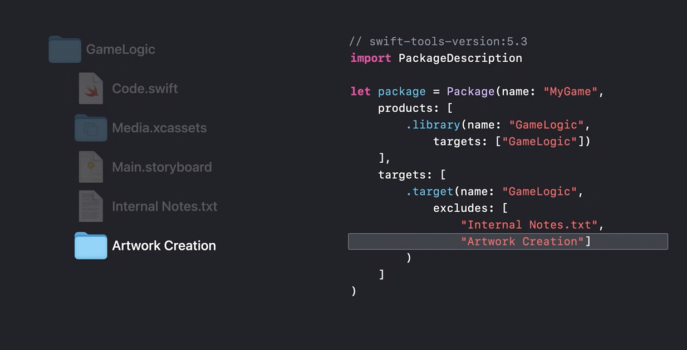
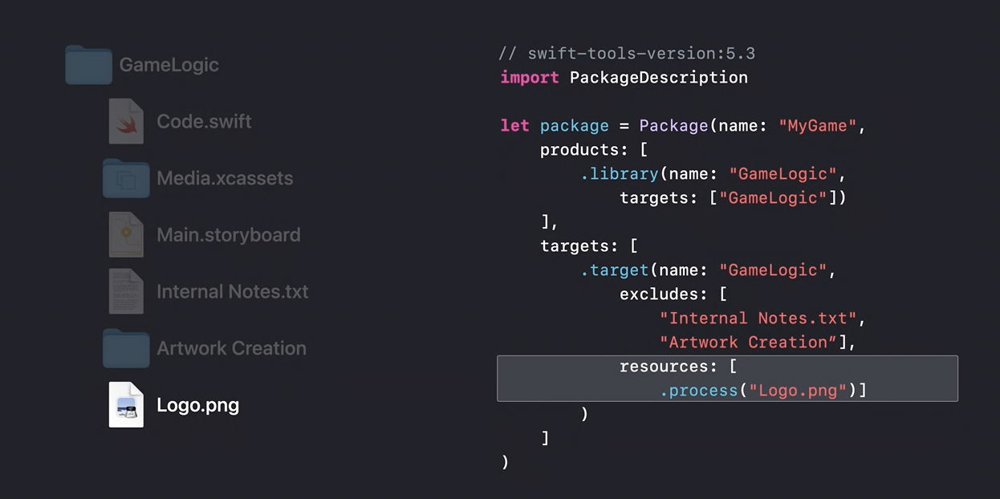
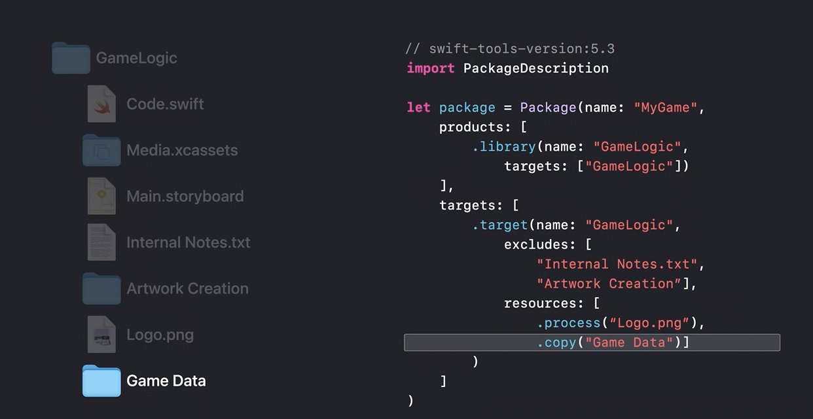
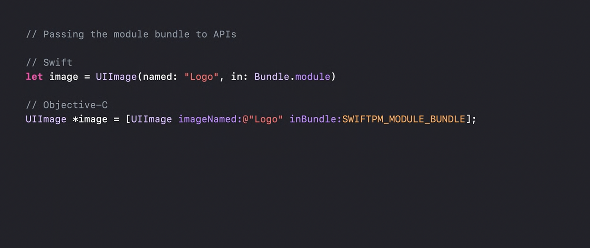
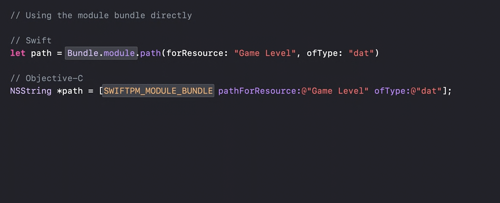
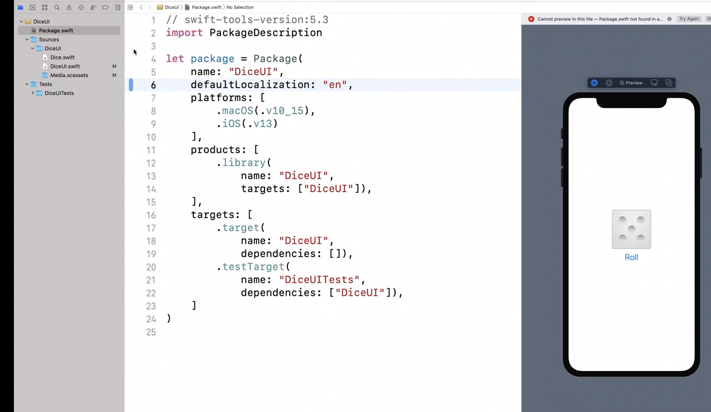
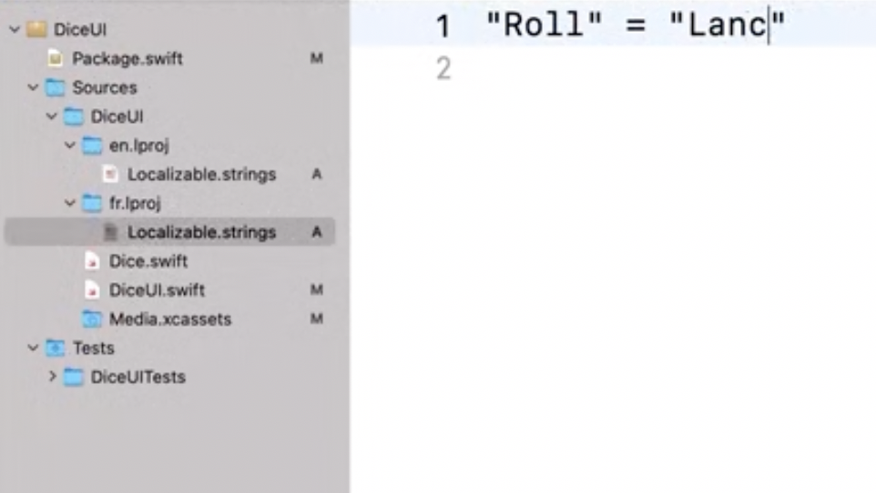

##### Manifest updates

If a text file or an entire folder is present in a target's directory but should not be built, that can be specified using `excludes` argument.



If an image (png, etc.) is included in the package, it should be specified for the target using `resources` argument with a `process` action. This process action probably indicates that the resource propcessing should be optimized for the current platform (for example storyboards go through some default processing with this action). xcasset, storyboard, nib files need not be specified in the manifest file.



A `copy` action indicates that all the files in the specified folder should be copied byte by byte and built for the mentioned target.



If the file type is unknown, or no special processing is needed for the platform, the file will be copied.

Upon building the consumer app/library, (package's) each target's sources get compiled into a code module and linked into the client app. Each target's resources are processed into a resource bundle for that module, which then gets embedded into the app.

##### Supported from Swift 5.3

Support for package resources is available since Swift 5.3, hence the package manifest needs to declare 5.3 as its required tools version if resources are used.
```
// swift-tools-version:5.3
```

##### Using in code (accessing package bundle module)

`Bundle.module` (Swift) and `SWIFTPM_MODULE_BUNDLE` (C) is how the package bundle should be accessed in the package code for using any asset related APIs.

Passing module bundle to APIs | Using module bundle directly
--- | ---
 | 

##### Localization

If localization of resources needs to be supported, `defaultLocalization` should be specified in the package manifest. It indicates the fallback localization to be used at runtime if no better match is available.

A localization directory (say `en.lproj`) should be created and the localized resources should be placed in it.

Localization directories can be included in package targets without mentioning them in the manifest because the `.lproj` suffix makes their purpose unambiguous already.

defaultLocalization in Manifest | Localization directories
--- | ---
 | 

> It's possible to localize the contents of an asset catalog (explained in 'WWDC 2019: Creating Great Localized Experiences').
