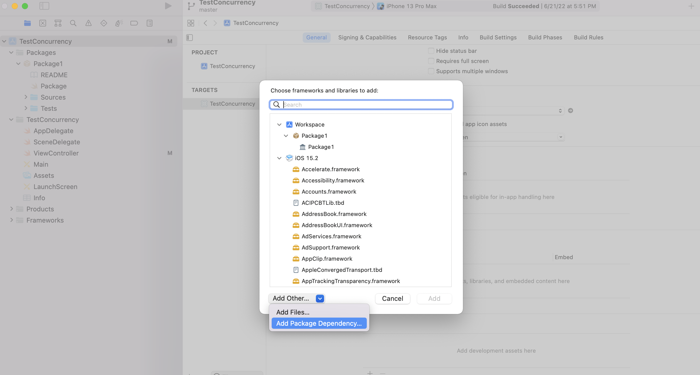
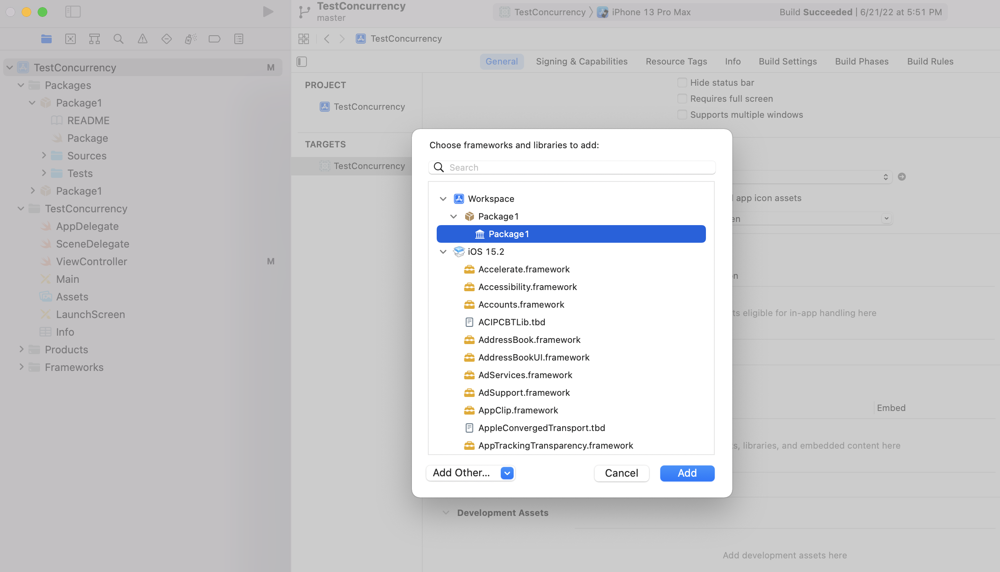
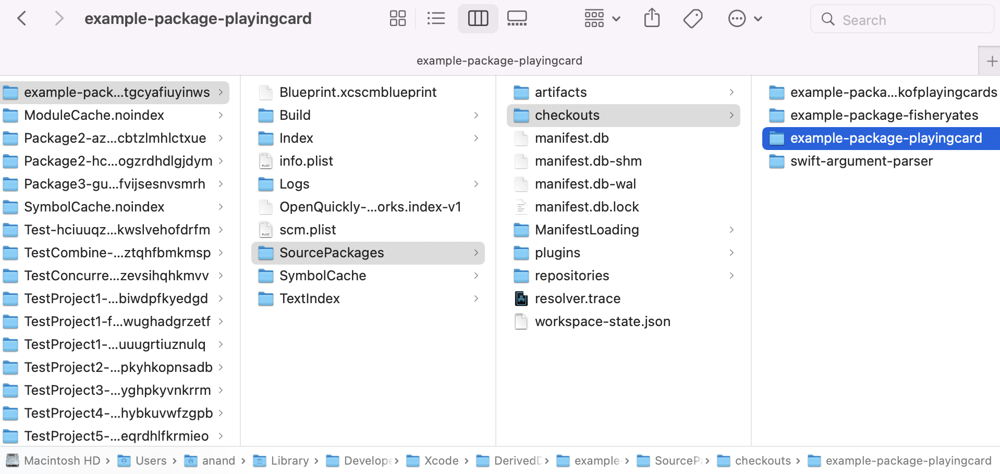

[toc]

#### Using a Library built with SPM 

The eventual goal of a Swift package (i.e. library) it to add it to an existing Xcode project and use it. An Xcode repo can consume both a remote Swift package as well as a local Swift package.

##### Remote Swift packages 

It can be done through the project's 'Frameworks, Libraries, and Embedded Content > Add Package Dependency' and then 'Add Local or Apple Swift Packages'.

Add Package Dependency | Select Package
--- | ---
 | 

> Its likely also possible to add a package through `Project Settings > Package Dependencies`.

While adding a remote package one of these things needs to be spcified for the package - Version (the package versions that are allowed in the consumer project), branch (the branch nme of the package to fetch), commit (the specific commit hash). These are called `Package requirements`. (The 'Dependency Rule' section in 'Select Package' modal.)

All remote packages added to a repository probably get shown in project navigator pane under a 'Swift Package Dependencies' section and if there is a `.xcodeproj` file also in  'Project settings > Package Dependencies'.

##### Local Packages

 If you want to make changes to a package dependency, you need to add it as a *local package* to your project. This can be done using 'Add Local' button in 'Select Package' modal. Adding a local package allows to edit the package directly if need be (instead of finding a way to edit the remote package.)

Adding a local package overrides any remote package dependency with the same name.

([Documentation](https://developer.apple.com/documentation/xcode/editing-a-package-dependency-as-a-local-package))

##### Add explicitly in 'Frameworks, Libraries, and Embedded Content'

Thereafter the package becomes available to in Xcode as a library, but still does need to be added afresh to the workspace.

> As a convenience, if a remote package being used in a project needs to be edited and tried with the consumer project its possible to simply download the remote package and add it to the consumer project and then simply edit them. Doing this does not mess up the consumer app's package dependencies, Xcode knows this dependency is now available locally and simply uses that.

##### When are dependencies downloaded

When the `swift build` command is run, Swift Package Manager downloads all of the dependencies, compiles them, and links them to the package module.

All the dependencies are in fact also automatically downloaded once the package is opened with Xcode.

The downloaded sources are typically present in the `.build/checkouts` directory at the root of the project, and intermediate build products in the `.build` directory at the root of the project packages. Once built they are typically present in `DerivedData/<PackageOrProjectName>/SourcePackages/checkouts`.

In root `.build` | In Derived Data `SourcePackages`
--- | ---
 | 

The packages can probably also be updated using `swift package update` command.

> Note that when a Swift package is added as a package dependency to an app for an Apple platform, it too has a `Package.resolved` file and its located inside ''(.xcodeproj|.xcworkspace)/xcshareddata/swiftpm' itself. (Need to verify this with a real example.)

##### Source Control and CICD

When using version control for a consumer project that uses packages, the `.xcshareddata > swiftpm` folder should be checked-in as well into commits as that is where resolved package dependencies are stored (in `Package.resolved` file) and this needs to be same across the entire team.

If using Xcode Server, to resolve package dependencies that require authentication, or `private packages`, you need to provide credentials to your CI setup. If you’re using Xcode Server, set up your Source Control Accounts in Xcode Server’s Preferences or as part of the workflows to create or edit a Bot. This enables Xcode Server to resolve your private package dependencies. ([Documentation](https://developer.apple.com/documentation/xcode/building-swift-packages-or-apps-that-use-them-in-continuous-integration-workflows))
