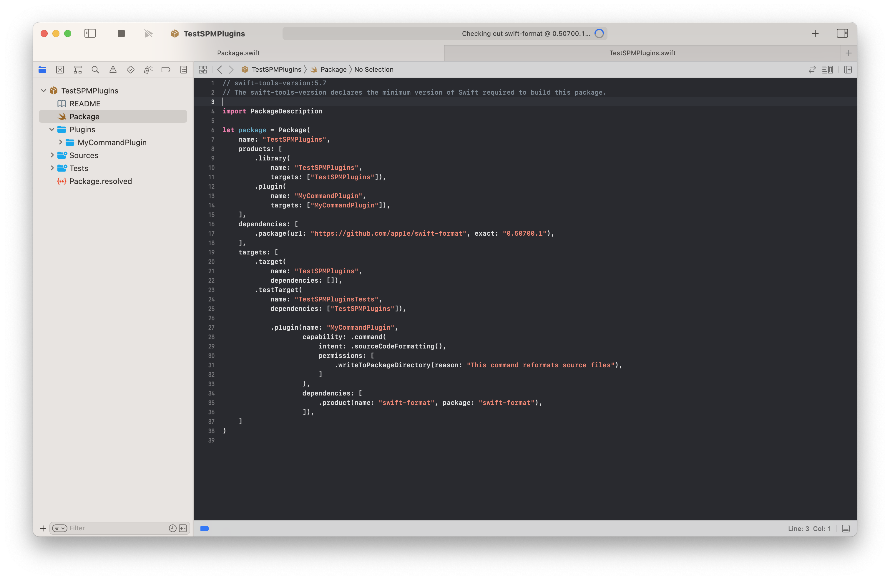
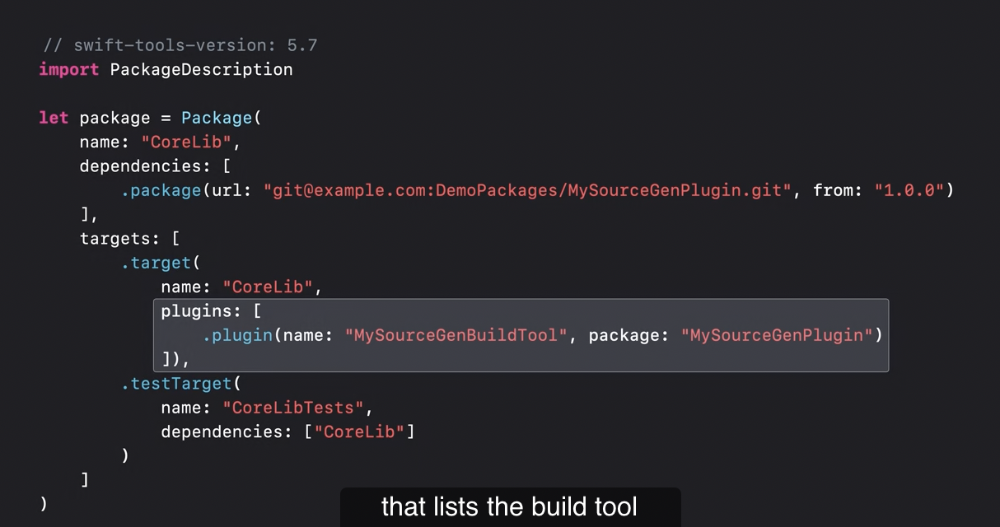
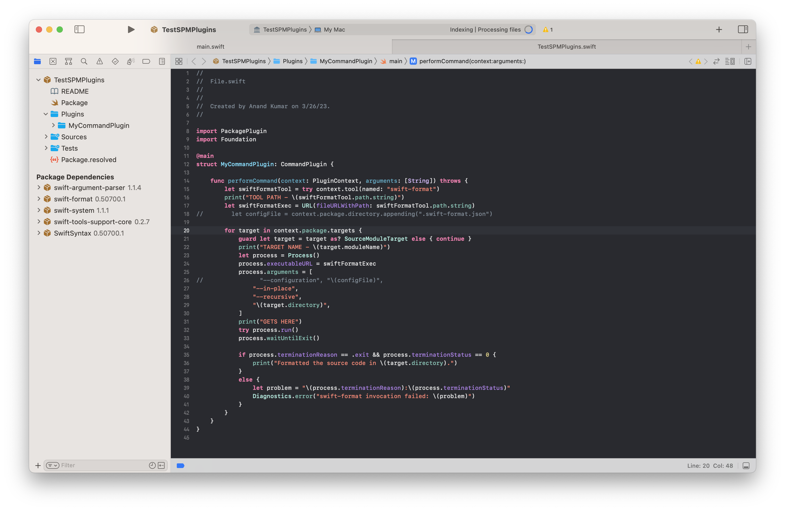
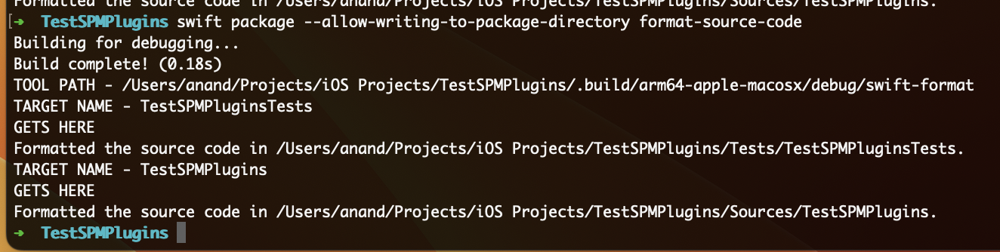
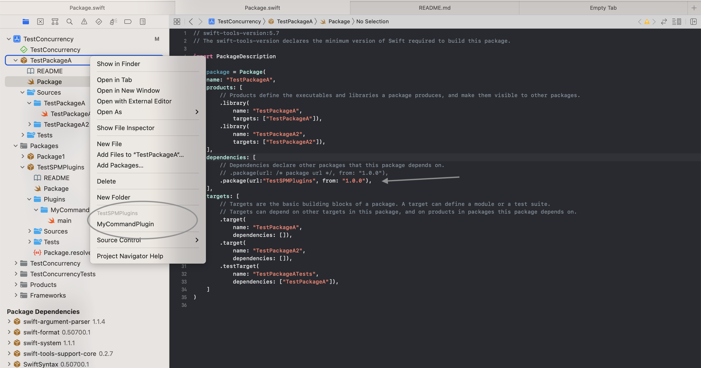
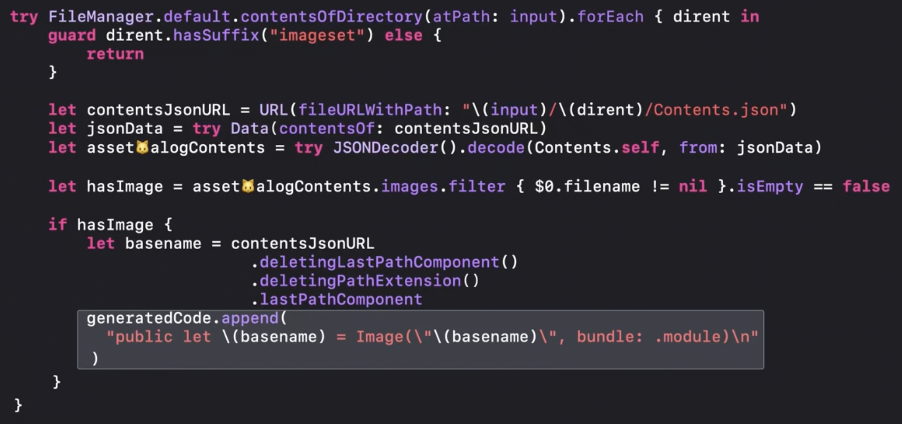
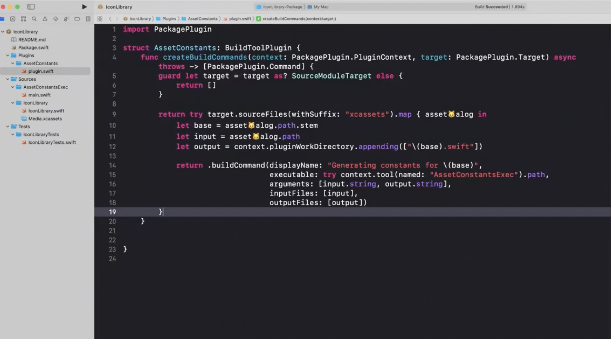

[toc]

#### What are Swift Package Plugins

Basically something that a Swift Package can produce (like it can produce library and executable).

Essentially they are Swift scripts that are compiled and can perform actions on a Swift package or an Xcode project. (It can be made available to other packages by defining it as a package product.)

Each plugin runs as a separate process. They have access to a distilled representation of the input package, including its source files, and dependencies.

Plugins run in a sandbox that prevents network access and that only allows writing to a few places in the file system, such as the build outputs directory. But plugins can ask for permission to also modify files in the package source directory. If the user approves, the sandbox is configured to allow writing to those locations. 


> TLDR as of 03/29/2023 - 
>
> Command plugins - Run executable using a context menu option without having to build entire host repo, all from within Xcode.
>
> Build tool plugins - Similar to Run Script phase but can add compilable code. And of course have scripts written in Xcode itself.

#### Different types of plugins

`Command plugins` - Can add custom commands to SwiftPM's command line interface (i.e. things like 'swift package xyz') or context menu items to Xcode.

`Build tool plugins` - Can contribute custom build tasks that run before or during the build, for example, to generate source code or resource files. 

##### Manifest interface

Command plugins have the capability as `.command` and Build tool plugins have the capability as `.buildTool`. If the plugin writes files in project, a `writeToPackageDirectory` should be specified in the permissions field in manifest.



In SwiftPM 5.6 and later, there is a new `plugins` parameter in the package manifest that lists the build tool plugins that a target wants to use.




#### Command Plugins

##### Creating a sample command plugin

The [SwiftDev](https://theswiftdev.com/beginners-guide-to-swift-package-manager-command-plugins/) article I followed (written in 2022). It creates a plugin that can modify source code so that it follows some code format standards.

###### Steps and code

1. Create a regular Swift package.

```
mkdir TestSPMPlugins ; cd TestSPMPlugins
swift package init --type=library
```

2. Modify the package's manifest file (i.e. Package.swift) to add a `.plugin` in `products`, along with another corresponding entry in `targets`. Also, specify the required dependencies. (The below example has [swift-format](https://github.com/apple/swift-format) as a dependency, an Apple package to do code formatting and linting.)

```
products: [
    .library(name: "Example", targets: ["Example"]),
    .plugin(name: "MyCommandPlugin", targets: ["MyCommandPlugin"]),
],

dependencies: [
    .package(url: "https://github.com/apple/swift-format", exact: "0.50700.1"),
],
    
targets: [       
    .plugin(name: "MyCommandPlugin",
            capability: .command(
                intent: .sourceCodeFormatting(),
                permissions: [
                    .writeToPackageDirectory(reason: "Reformats source files")
                ]
            ),
            dependencies: [
                .product(name: "swift-format", package: "swift-format"),
            ]),
]
```

3. Create a directory named `Plugins` under repository's root, add another directory under it with the name of the intended plugin, and then add a file named `plugin.swift` in it. 
4. Add the code there. Over here `swift-format` is accessed through `PluginContext.tool()`, all the targets in scope accessed through `context.package.targets`, and then the swift-format executable run on the directories of all targets one by one using a new `Process()` instance.



###### Testing it on the containing package

So it can be tested on the package's code itself by command line pretty easily. When I run this, it actually works and formats the code.

> But how did it know which 'command plugin' to run, MyCommandPlugin was not specified anywhere. If there is just one command plugin, does that get run by default. Well may be it comes from `soureCodeFormatting()` specified in the intent field in the plugin manifest.

```
swift package --allow-writing-to-package-directory format-source-code
```




###### Testing it on some other project

So I think the idea is that in another consumer project, if I add the plugin as a dependency I can run using context menu option in project navigator. Do make sure that the package containing the command plugin is added to the repo using 'File > Add Packages ..' and then also that its added as a dependency in Package.swift for the package where it should be run.



Running the context menu initially gave this error. It got solved by copying lib_InternalSwiftSyntaxParser.dylib from '/Applications/Xcode.app/Contents/Developer/Toolchains/XcodeDefault.xctoolchain/usr/lib/swift/macosx/lib_InternalSwiftSyntaxParser.dylib' 'to /usr/local/lib'.

> '/usr/lib/lib_InternalSwiftSyntaxParser.dylib' (no such file, not in dyld cache)


Its still not working though. Something to do with `swift-format`. The error it gives is this.

><unknown>: error: Unable to format. The loaded '_InternalSwiftSyntaxParser' library is from a toolchain that is not compatible with this version of SwiftSyntax

Tried running `otool` on the _InternalSwiftSyntaxParser to see if it gives any clues.

```
otool -L lib_InternalSwiftSyntaxParser.dylib

lib_InternalSwiftSyntaxParser.dylib (architecture x86_64):
	@rpath/lib_InternalSwiftSyntaxParser.dylib (compatibility version 1.0.0, current version 5.7.2)
	/usr/lib/libz.1.dylib (compatibility version 1.0.0, current version 1.2.11)
	/usr/lib/libncurses.5.4.dylib (compatibility version 5.4.0, current version 5.4.0)
	/usr/lib/libSystem.B.dylib (compatibility version 1.0.0, current version 1319.0.0)
	/usr/lib/libc++.1.dylib (compatibility version 1.0.0, current version 1300.32.0)

@rpath/lib_InternalSwiftSyntaxParser.dylib (compatibility version 1.0.0, current version 0.0.0)
	/usr/lib/libz.1.dylib (compatibility version 1.0.0, current version 1.2.11)
	/usr/lib/libncurses.5.4.dylib (compatibility version 5.4.0, current version 5.4.0)
	/usr/lib/libSystem.B.dylib (compatibility version 1.0.0, current version 1311.0.0)
	/usr/lib/libc++.1.dylib (compatibility version 1.0.0, current version 1200.3.0)
	/System/Library/Frameworks/CoreFoundation.framework/Versions/A/CoreFoundation (compatibility version 150.0.0, current version 1844.0.0)
```

#### Build Tool Plugins

`Build Tool Plugins` extend the build system by providing a description on which executables to run during a build (similar to run script phases). 

There are two different types of build tool plugins. The distinguishing factor here is whether your tool has a defined set of outputs. If you don't have a clear set of outputs, you can create a `pre-build command` which runs at the start of every build. You should be careful about doing expensive work in pre-build commands. If however you have a clear set of outputs, you should create an `in-build command` which will automatically be re-run by the build system if your outputs are out-of-date compared to your inputs. 

Files that are declared as outputs of the plugin are automatically incorporated into the build of the target the plugin is being applied to.

###### Sample pre-build plugin

> There seems to be one example in 'WWDC 2022 - Create Swift Package Plugin' video at around 18:45 mark.It automates some localization strings related pre-build tasks using the genstrings tool that ships with Xcode. The tool extracts localized strings from code into a localization directory for further use. 			

###### Sample in-build plugin

| Executable code               | Plugin code which uses the executable |
| ----------------------------- | ------------------------------------- |
|  |  |

> Note that unlike in a command plugin (where the file was named 'plugin,swift'), in a in-build plugin the file is (needs to be?) named as 'main.swift'.

> So what really happens? Is it that if a Package has a in-build plugin, every time the package is compiled the in-build plugins automatically run (i.e. no need to specify any build step anywhere)? Looks so. 
>
> Also, to state the obvious it seems it can be used only in a SPM repo.

#### PackagePlugin API

`PluginContext` gives access to the resolved package graph (i.e. the package code as well as all executables the package has access to) and other information about the context we are being executed in, as well as arguments. 

Executable can be accessed in multiple ways. Through `context.tool` to access an executable provided by an added dependency (i.e. third party dependency).

````
let swiftFormatTool = try context.tool(named: "swift-format")
let swiftFormatExecutable = URL(fileURLWithPath: swiftFormatTool.path.string)

let process = Process()
process.executableURL = swiftFormatExecutable
````

as well as by just specifying the path to an executable installed in the system.

```
let process = Process()
process.executableURL = URL(fileURLWithPath: "/usr/bin/git")
```

> The executables can be provided by the system, third party packages, or you can create one tailor-made for your plugin (i.e. a standard executable that is created using SPM and housed in the same package). 

#### Misc.

All Package Plugins in a given package can be retrieved using this command.

```
swift package plugin --list
```


Unlike command plugins, which are invoked for a whole package or a project at a time, build tool plugins are applied to each target that needs them. But this is not quite what I saw. When I tried running a command plugin, it still asked which targets it should be run on.


> Try git example plugin from WWDC video, should not give any libSwiftSyntaxParser error.

#### Resources

WWDC videos - 

WWDC 2022 - Meet Swift Package plugins <br>

WWDC 2022 - Create Swift Package plugins <br>


Test Projects - TestSPMPlugins, used in TestConcurrency (but giving error there)


[Official documentation](https://github.com/apple/swift-package-manager/blob/main/Documentation/Plugins.md) <br>

[SwiftDev article](https://theswiftdev.com/beginners-guide-to-swift-package-manager-command-plugins/) (had learnt using  this) <br>

[AugmentedCode article](https://augmentedcode.io/2022/11/28/setting-up-a-build-tool-plugin-for-a-swift-package/) <br>