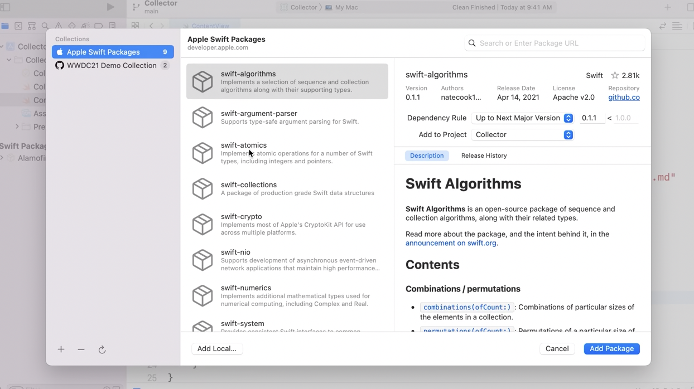
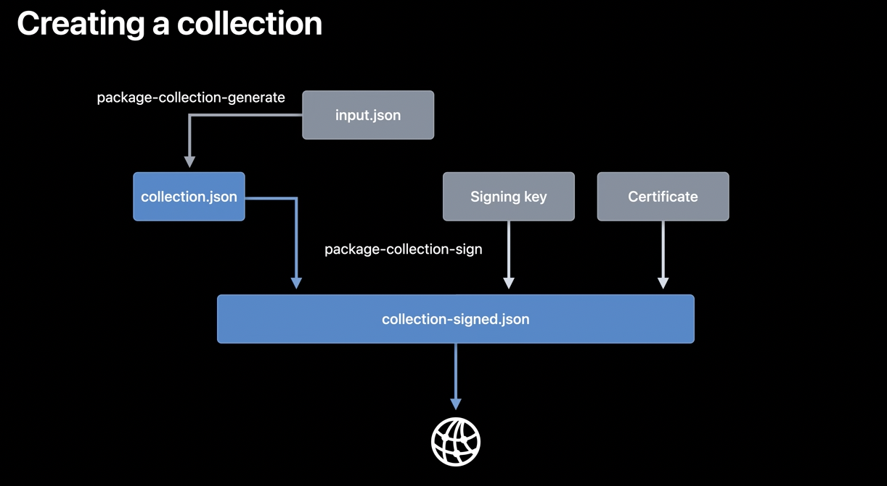
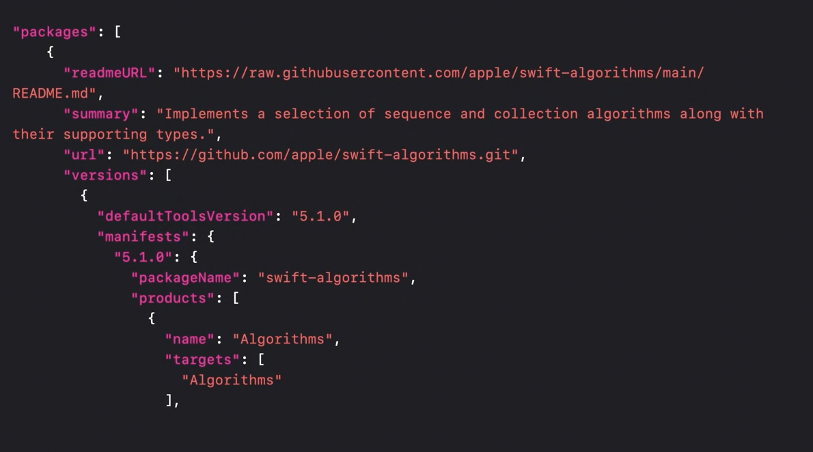

`Swift Package Collections` are a way to publish a collection of packages such that they can show up together in Xcode's Add Package list. For example, in the below screenshot 'WWDC21 Demo Collection' is a custom package.



A default collection of Apple packages (`Apple Swift Packages`) already come built-in with Xcode. This includes packages like `swift-algorithms`, `swift-nio`, etc. that serve some very specific purpose that are not common enough to always be included with standard APIs that come with Xcode.

The entire process of creation and distribution looks like this.



>The process is explained in 'WWDC 2021: Discover and curate Swift Packages using Collections' and a [swift.org page](https://www.swift.org/blog/package-collections/).

#### Packages.json file

Collections are a JSON file, typically fetched via HTTPS. A collection contains a list of package URLs and their metadata, including a summary, versions, and vended products.



> The above is likely a Packages.json file. How is this generated?

> SwiftPM manages a database for caching collections on the local mac. What this means that is that they can be accessed from any tool that uses libSwiftPM, not just Xcode, including SwiftPM on the command line. Again, talks about using SwiftPM directly. Will undertand it well, only once I have actually used the SwiftPM lib.

#### Generating a collection json

Given a packages.json file, this is how a collection json gets generated.
```
package-collection-generate packages.json collection.json
```

#### Signing a collection

This can (rather should) then be signed using Package Collection Signer [(link)](https://github.com/apple/swift-package-collection-generator/tree/main/Sources/PackageCollectionSigner) tool.
```
package-collection-sign \
    collection.json \
    collection-signed.json \
    /certs/private.pem \
    /certs/signing.cer
```

#### Distributing a collection

Once a collection is ready, it can be sent in email, or hosted on a web server.

#### Adding a collection

Adding a package collection in your Xcode. Can also be done using Xcode UI.
```
$ swift package-collection add https://swiftserver.group/collection/xyzPackageCollectionURL.json
```
