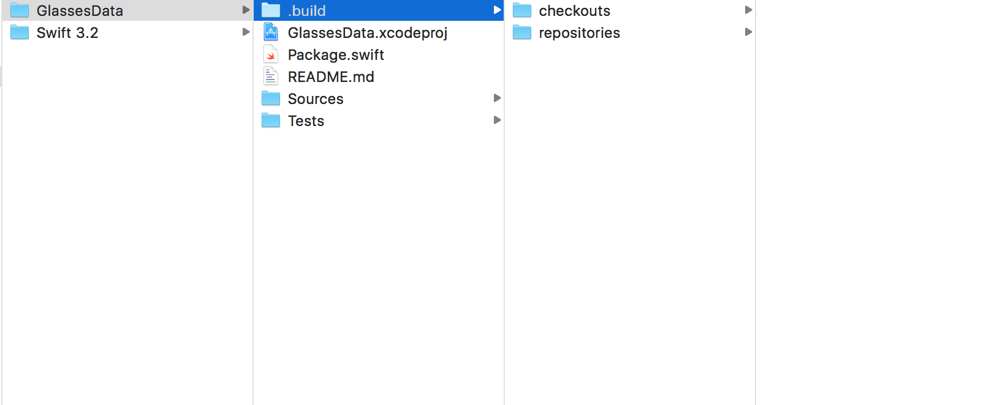
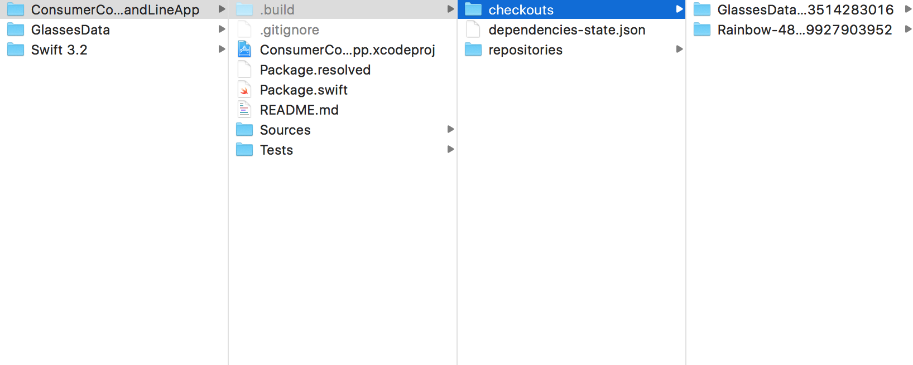

So Swift Package Manager is another dependency manager like Carthage and Cocoapods. However it as of now only supports OS X projects.

So as with any other dependency manager, SPM can be used to create new libraries and then also used in a project to manage its own dependencies.

Here is a typical sequence of commands -

```
swift package init --type library     // Creates a new library (static?)
swift package generate-xcodeproj      // Creates a new xcodeproj for the library created above
swift build                           // Builds the above library

swift package init --type executable   // Creates a new command line app
swift package generate-xcodeproj       // Adds an xcodeproj file to above command line app
swift build                            // Builds the above command line app
..project_path/.build/something/.debug/command_line_app_name     // Runs the executable in command line

swift package update                   // Updates the dependencies mentioned in a project
```

******

While creating the library -

"swift package init --type library" creates below structure. There is no .xcodeproj file yet.


"swift package generate-xcodeproj" creates an xcode project.
"swift build" then adds a .build folder as well.



While creating a command line app -

"swift package init --type executable" creates a command line app with below structure. It does not have an xcodeproj file yet.


"swift package generate-xcodeproj" then adds an xcode project.
"swift build" then builds the project with all its dependencies. The dependencies get checked out in .build folder.



And finally the executable can be run directlty from the command line.


`swift package generate-xcodeproj` - Generates an xcodeproj. To be deprecated soon though, apparently Xcode can now open packages without there needing to be an xcodeproj file anymore.

----------

Package.swift -

The depedencies are always specified in the Package.swift file. It typically looks like this. The syntax keeps changing with each SPM release, so be aware of that.


As of now, the dependencies should be specified in each of the targets as well.

*********

Also, its probably important that in the project settings' 'Import Paths' "$(SRCROOT)/.build" recursive is specified.


I don't know why but I could run the consumer app from command line, but while building it from Xcode I kept getting the error "XYZ module" not available when I tried to import it. Even though the XYZ dependency had been build and available in .build folder.

*********

So eventually just keep in mind that code can always be extracted from other places and put in library. A basic fact, independent of what dependencies management system you use.

*********

Official documentation - [link](https://github.com/apple/swift-package-manager/tree/master/Documentation)
Posts in Swift blog - [link](https://swift.org/blog/swift-package-manager-manifest-api-redesign/)


Added an iOS target (iOS Cocoa Touch Framework)
Changed its supported platforms, info.plist
Make scheme shared
Add this dependency in cartfile of GlassesView, update it
