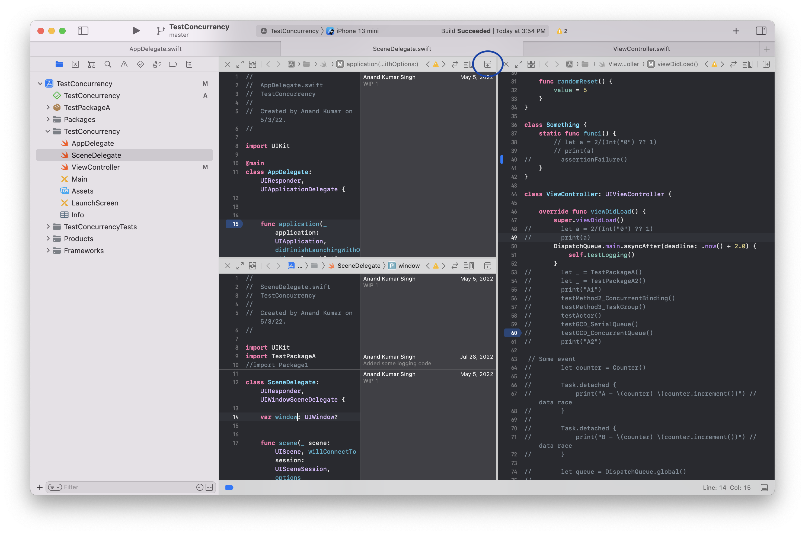
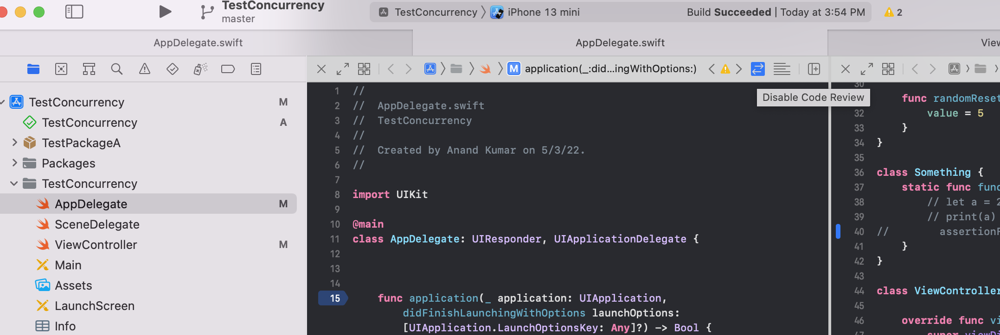
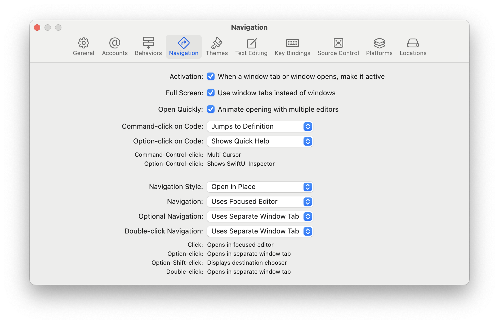

[toc]

##### WWDC Videos

WWDC 2019: Getting Started with Xcode k  
WWDC 2019: What's New in Xcode 11 k  
WWDC 2021: Explore advanced project configuration in Xcode k  
WWDC 2022: What's new in Xcode  

WWDC 2019: Great Developer Habits k  

-----

##### Opening new editor in same pane

As of Xcode 15 (2024), this can be created by the '+' button at the top right of current document tab. Each editor get its own state, so there can be Authors shown in one but not in the other, and so on. 

> Note that this is different from assistant editor which does not allow to open any random file you wish.

If 'option click' is done on +, then the new editor gets created in different a direction (i.e. horizontal/vertical) than before.

##### Destination chooser

If a 'option shift click' is done on a file in the File Navigator, the new editor can be opened anywhere you want. It can be in the existing window or even in a new window.

##### Focus mode

Focus mode can be activated using the Expand button on top left of every editor. Its handy when there are too many edtors open in a single tab.

##### Minimap

A rich snapshot of the current editor's contents. Its keyboard shorcut is `Cmd Shift Ctrl M`.

##### Source control - Change bar, Code Rewiew

When source control is being used, the `Change Bar` on left shows the parts that have changes. Doing a hover over there even brings up options like viewing and discarding changes.

Also, in the top bar for every editor there is a `Show code review` button which can show all the uncommited code changes that are there.

##### Opening new tabs

Since 2020 (i.e. Xcode 12), Xcode started having two tab bars. One was the traditional 'Window Tab' and just below it a nwere 'Document Tab'. 

And its pretty confusing as if left to defult setting, just tapping on a new file in the navigator opens that file as a new document tab and thereafter using keyboard shortcuts to switch between tabs just keeps switching between document tabs. To get Xcode to behave in the conventional way and not open new Document Tabs, the following selections need to be made in Xcode Preferences > Navigation. `Open In Place` has to be selected and even the optional navigation has to be selected as `Use Separate Window Tab` (as of Xcode 15, i.e. 2024).

> As of 2024 and Xcode 15, its all just messed up. While optional navigation (i.w. Option click) and double click navigation from project navigator open up new window tab, the highlighted file in the project navigator in both the old and the new window tab are incorrect. The simpler thing to do instead is to just open a new window tab (`Cmd Option ,`), it gets opened with the same file, and then go to the required file from project navigator, etc.

