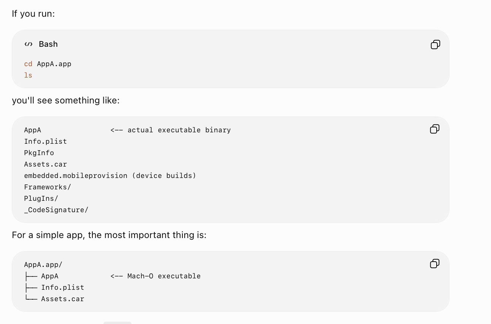
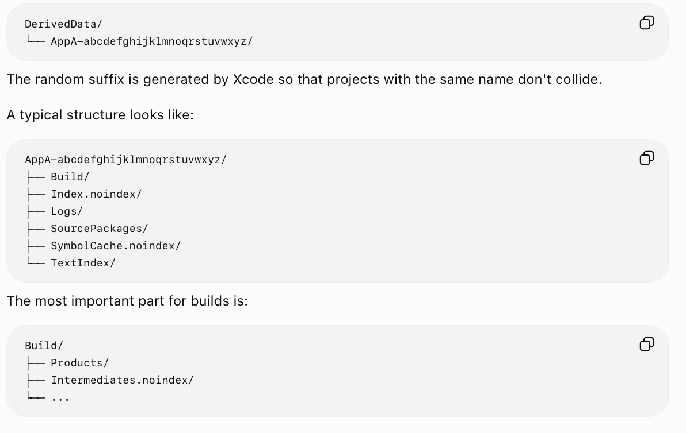

[toc]

([ChatGPT link](https://chatgpt.com/g/g-p-6a3aad28a3f48191a8d794943d837761-testing-pipeline/c/6a3ab86c-a734-83ea-b865-ff73601edd48))

##### App Bundle (.app)

**.app** is basically a bundle (directory in plainspeak) that contains the eventual compiled app Mach-O executable as well as  various things related to it.

##### Derived Data folder

**Derived data folder** is where several results of an app build are placed. These includes the eventually compiled app bundle (**.app**), as well as test bundles (i.e. **.xctest**) and test case detailes (**.xctestrun**) placed, and several more things for that matter. Such as **build logs**, as well as **object files**.

As of Xcode 26, by default any project's derived data folder gets created in **/Library/Developer/Xcode/DerivedData/<APPNAME>-<UUID>**.

An app designed not get multiple derived data locations for different simulators. The same .app gets copied to different simulators.

