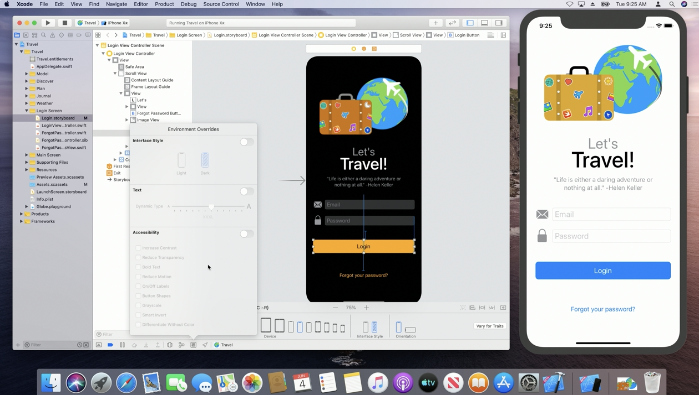

[toc]

##### Design related

> These are mainly from 'WWDC 2019: What's New in Xcode 11' 20:34 onwards. Have not tried them.

Devices bar in storyboard/xib can be used to switch between dark and light mode.

`Evironment Overrides` in storyboards/xib allow some quick rendering for different environments such as dark/light mode, accessibility, text size, etc. It allows me to test the app at runtime with these different settings, without actually changing the settings on the simulator or devices.

##### Device Condition

In the devices window there's also a `Device Condition` section where things such as `Network Link Conditioner` can be used and real world networking scenarios simiulated, even the `Thermal State Conditioner` can be used there to simulate various weather conditions.

##### Recommended good practices for good source code

> These are from 'WWDC 2019: Great Developer Habits'. All common sense things really, nothing absolutely unknown.

Xcode projects benefit from structure and organization using groups. It also helps to make sure that the Xcode project structure and file system structure match each other.

Use a different storyboard file for each major section of your application and then use references to tie them together. Don't have one huge storyboard for the entire app.

When Updating to a new version of Xcode, Xcode offers to automatically update the project settings and update your project file to the latest format. Do it.

Use the new Xcode build system first released in 2017. It's been the default build system since Xcode 10.

Establish a zero-warning practice for yourself and for your team.

Keep your commits small (I have my reasons. In big projects with many teams, its easier to locate my changes with lesser commits). Write useful commit messages.

Add documentation. Use descriptive names for variables.

Write unit tests.

Embrace packages and frameworks as a way to break apart your code base.

##### Use sanitizers, etc.

Use various sanitizers that Xcode offers. `Address Sanitizer` will watch for things like memory corruptions and buffer overflows. `Thread Sanitizer`, while debugging your app in the simulator can help discover data races. `Undefined Behavior Sanitizer` captures bugs like dividing by zero, out of range casts between floating point types, overflows, and misaligned pointers. `Main Thread Checker` ensures that you're not performing invalid usage of appKit, UIKit, and other API's on background threads.

Use the `Debug Gauges`. These are found in the debug navigator in Xcode anytime you've built and run your project. Here you can check out CPU, memory, disk, and network utilization throughout the lifecycle of your app

------
