[toc]

> Things to do with building such as 'Build Settings', 'Build Phases', etc. are described in more details in `7. Developer Tools/3. Build Process/` folder.

Various things in Xcode that determine project settings and actions invoked.

```
Build Settings
Build Configurations
Targets
Schemes
Actions
Run Destinations
```

There is a scheme, there is a run destination, and you perform an action upon that scheme on that run destination.

Scheme - Action - Build configurations
Run Destination.

#### Build Settings

A given `Build Setting` is a variable that contains information about how a particular aspect about the build process should be performed. It has two parts - the settings title (or the `build setting name`) and the `build setting definition` (a constant value or a formula used to determine the value at build time). It can also have a `display name`, which is used to display the build setting in Xcode user interface.

Every target has its own build settings which are inherited from the project but can be overridden. There can be different values for the same build setting in different build configuration (for the same target).

| Build Setting terms            | Build Settings levels          |
| ------------------------------ | ------------------------------ |
| 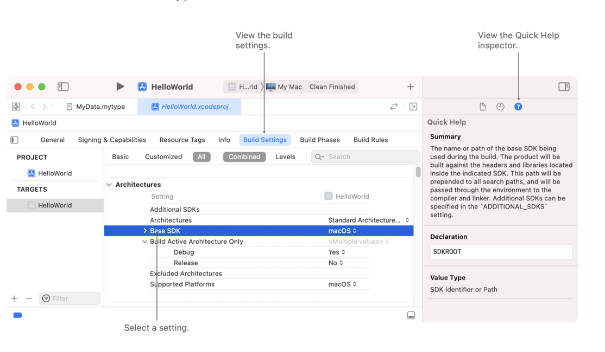 | 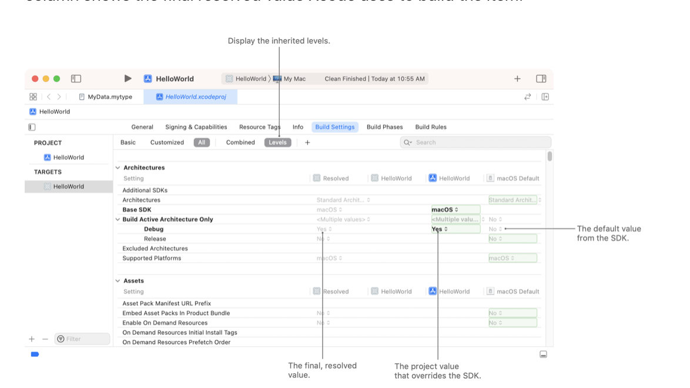 |

> One way to compare the build settings of two projects is to compare their pbxproj files using FileMerge or any other tool. The pbxproj file is present inside the xcodeproj file (rather package) of the project.

[Official documentation (link)](https://developer.apple.com/documentation/xcode/configuring-the-build-settings-of-a-target)


#### Build Configuration

> This is covered in 'WWDC 2021: Explore advanced project configuration in Xcode' 18:12 onwards.

Its possible for the same target to have multiple 'configurations'. And there can be different build setting values for each of these configurations. `Debug` and `Release` are two configs that are there by default.

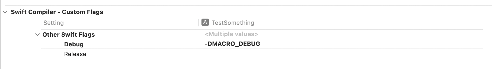

Xcode assigns inherited values in the following order (from lowest to highest precedence) -

Platform Defaults
Xcode Project xcconfig File
Xcode Project File Build Settings
Target xcconfig File
Target Build Settings

##### xcconfig files

Official documentation on xcconfigs ([Link1](https://developer.apple.com/documentation/xcode/adding-a-build-configuration-file-to-your-project), [Link2](https://help.apple.com/xcode/mac/11.4/#/dev745c5c974))<br>[NSHipster article on xcconfigs](https://nshipster.com/xcconfig/)<br>

Every configuration can also be assigned a `xcconfig` file, in which case it derieves its settings from that file.

They are specified in the `Project -> Info` tab. By default, 'Debug' and 'Release' build configurations are available.

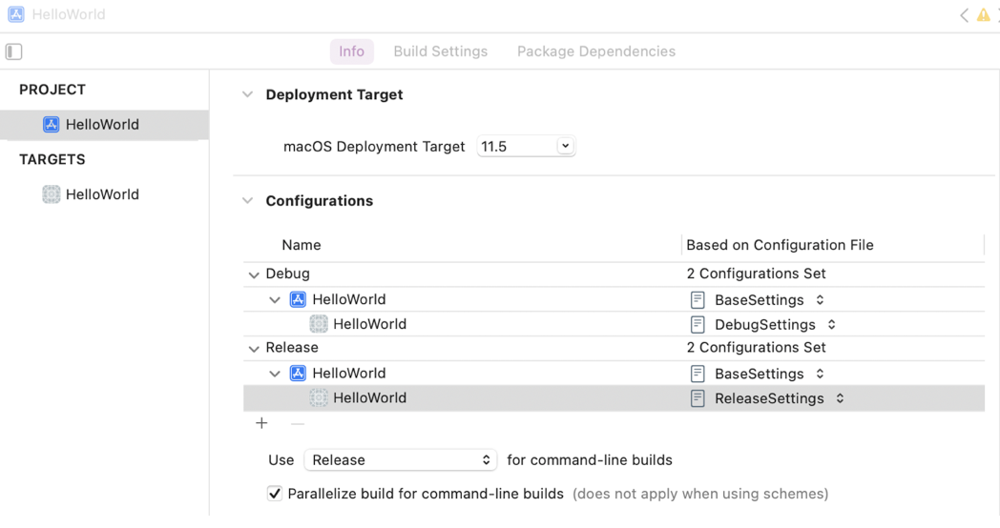


###### Build Setting evaluation operators

Project config files can even have operators. The three classifications of operators are - string operators, path operators, and replacement operators.

To append rather than replace existing definitions, use the `$(inherited)` variable. Its typically used to build up lists of values, such as the paths in which the compiler searches for frameworks to find included header files.

```
FRAMEWORK_SEARCH_PATHS = $(inherited) $(PROJECT_DIR)
```

You can use values from other settings by their declaration name with the following syntax.

```
BUILD_SETTING_NAME = $(ANOTHER_BUILD_SETTING_NAME)
```

```
OBJROOT = $(SYMROOT)
CONFIGURATION_BUILD_DIR = $(BUILD_DIR)/$(CONFIGURATION)-$(PLATFORM_NAME)
```

`default` evaluation operator can be used to specify a fallback value to use if the referenced build setting evaluates as empty.

```
$(BUILD_SETTING_NAME:default=value)
```

You can conditionalize build settings according to their SDK (sdk), architecture (arch), and / or configuration (config) according to the following syntax.

```
BUILD_SETTING_NAME[sdk=sdk] = value for specified sdk
BUILD_SETTING_NAME[arch=architecture] = value for specified architecture
BUILD_SETTING_NAME[config=configuration] = value for specified configuration
```

A build configuration file can include settings from other configuration files using the `#include` syntax.

```
#include "path/to/File.xcconfig"
```

Here are some replacement operators for path based settings.

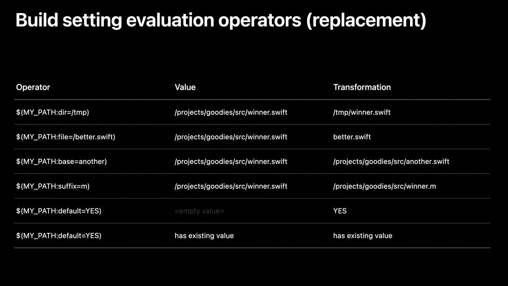

> Understand these operators better (covered in above 2021 video).

#### Targets

A `Target` specifies the product to build. These can be an app (iOS, macOS, etc.), app extension, framework, or unit tests. Every target then contains the instructions for building the product from a set of files in a project to workspace and then finally performing a set of actions on those products. These build instructions are specified through different means, i.e. Build Settings, Build Phases, XCConfigs, etc.

Its possibly the most fundamental thing to start with. A project can (and usually does) have multiple targets. Every source code file belongs to at least one target.

Targets are created by duplicating an existing target and then editing it or just tapping on the + button in project file to add a new target.

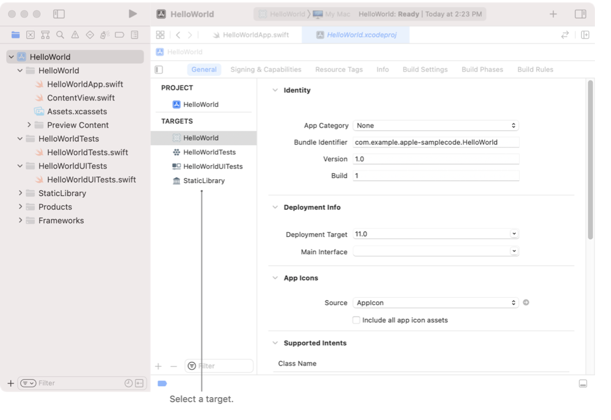

> Be aware that every target creates its own sandbox on compilation, so you cannot straight away assume that the data that is present in one target's bundle will also be present in another target's bundle.

[Official Documentation (link)](https://developer.apple.com/documentation/xcode/configuring-a-new-target-in-your-project)

##### Aggregate Target

An `Aggregate Target` is a special type of target that lets you build a group of targets at once, even if those targets do not depend on each other. An aggregate target has no associated product and no build rules. Instead, an aggregate target depends on each of the targets you want to build together. For example, you may have a group of products that you want to build together. You would create an aggregate target and make it depend on each of the product targets. To build all the products, just build the aggregate target.

An aggregate target may contain a custom Run Script build phase or a Copy Files build phase, but it cannot contain any other build phases. Any build settings that the aggregate target contains are not interpreted but are passed to the build phases that the target contains.

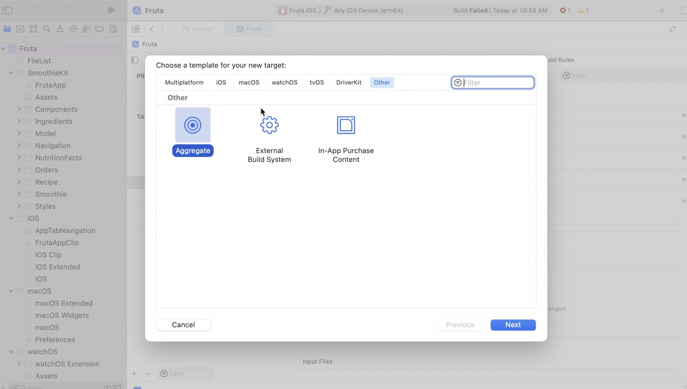

[Link1 ~ 2013](https://stackoverflow.com/questions/6747499/when-and-how-to-use-aggregate-target-in-xcode-4)

> This is also demo-ed in 'WWDC 2021: Explore advanced project configuration in Xcode' 14:35 onwards

#### Schemes

A `scheme` does several things. First up, it defines a collection of targets to build (in Build action of the concerned scheme) for the concerned `action`, the `configuration` to use when building them. In case of test action, it also says what tests to execute. And then it also has configs and options that can be specified for other actions like Test, Profile, Analyze, Archive.

There can be any no. of schemes as desired, however only one of them is active at a time. Usually, there is a scheme for every target. When a scheme is selected, a run destination is also selected.

Schemes are automatically created when a new target or project is created and also when a project or workspace is opened for the first time.

Selecting a scheme | List of schemes
--- | ---
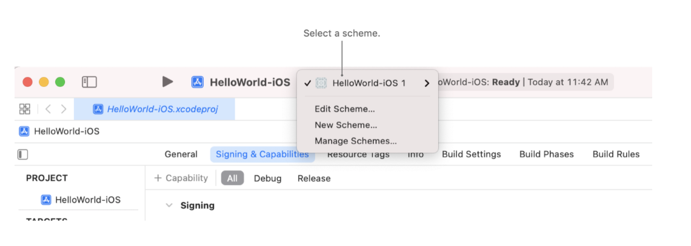 | 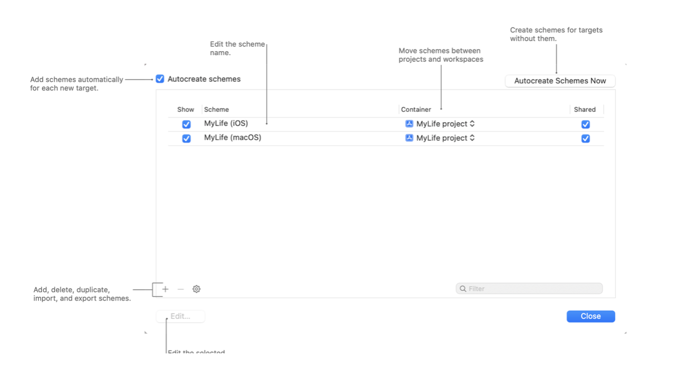

[Official Documentation (link)](https://developer.apple.com/documentation/xcode/customizing-the-build-schemes-for-a-project)

###### Environment Variables

Schemes are also where Environment variables can be specified when run from Xcode. Environment variables can be accessed from code using `ProcessInfo.processInfo.environment["VARIABLE_NAME"]`.

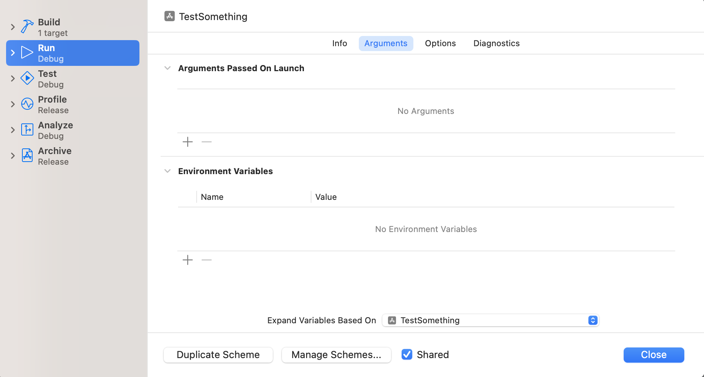

Keep in mind environment variables are always at work when a process runs, an app running is a process too. When run from Xcode, they can be specified in above fashion. When an executable/test is run from command line, environment variables are in play there too and can be specified using plain UNIX commands. For example, over here the environment variables get activated in a script which is run and made ready before tests are run. ([link](https://blog.eidinger.info/use-environment-variables-from-env-file-in-a-swift-package))

```
export MY_API_KEY='12345'
swift test
```

> Its a common practice to have sensitive keys in a `.env` file in CICD servers, and read values from them using shell scripts which then make them available in environment variables for tests to access.

#### Actions

`Actions` are the various things that can be done by a `scheme`. Every scheme has specifications for Build and all the 5 standard `actions` (i.e. Run, Test, Profile, Analyze, Archive) so that when any of actions is performed for that scheme, it is known how the scheme will perform it. -

1. Run
2. Test
3. Profile
4. Analyze
5. Archive

Even though Build is shown along with other actions in any scheme, it is not an action itself. Build is a step that is performed before any of these actions are performed.

The unit tests to be run for a scheme are set in the 'Test' action.
Test bundles (i.e. test targets) only build for Test actions. (What is a test bundle or test target?)

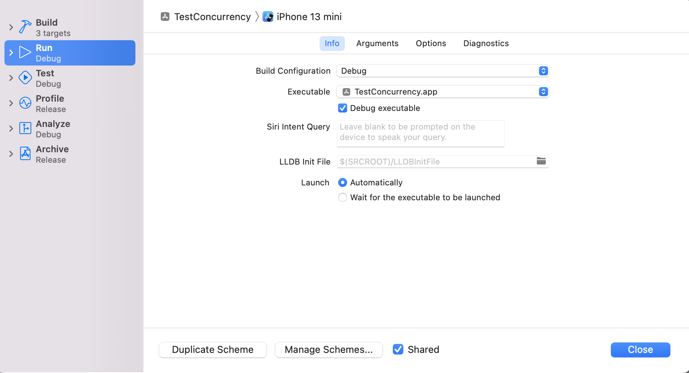
