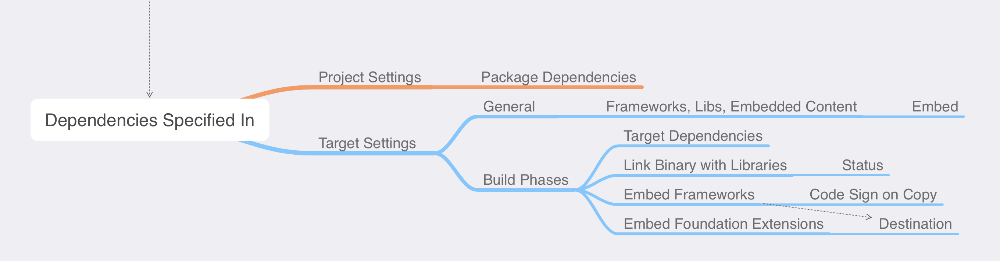
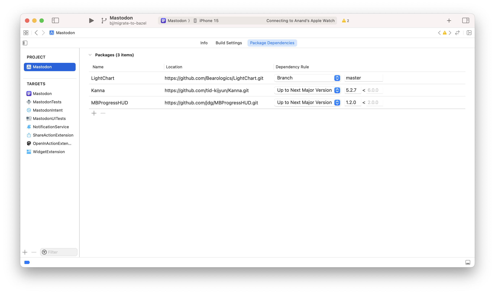
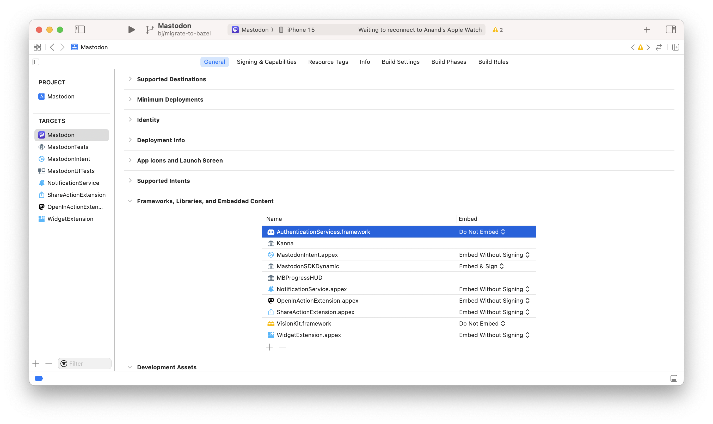
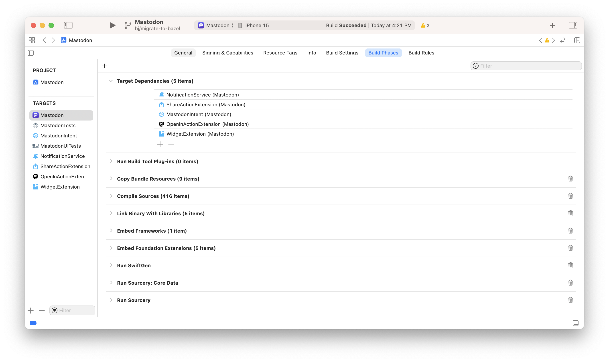
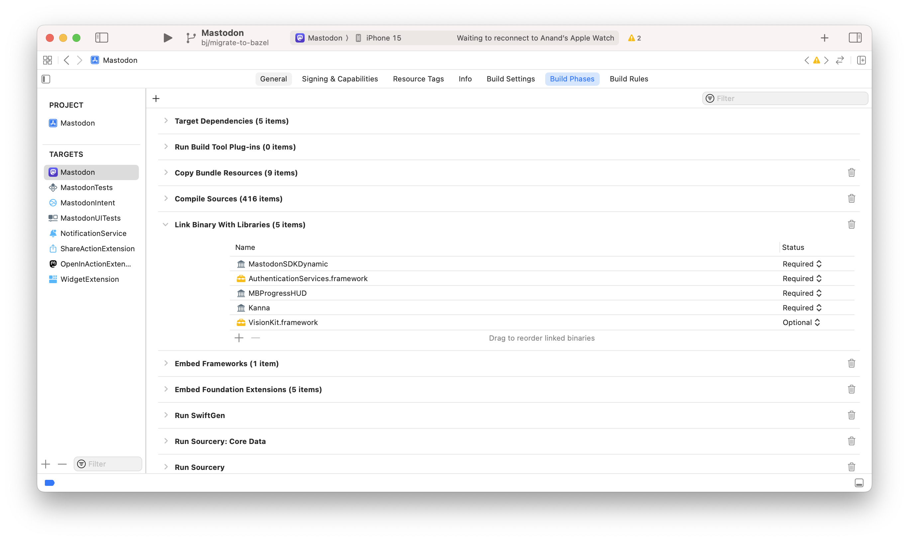
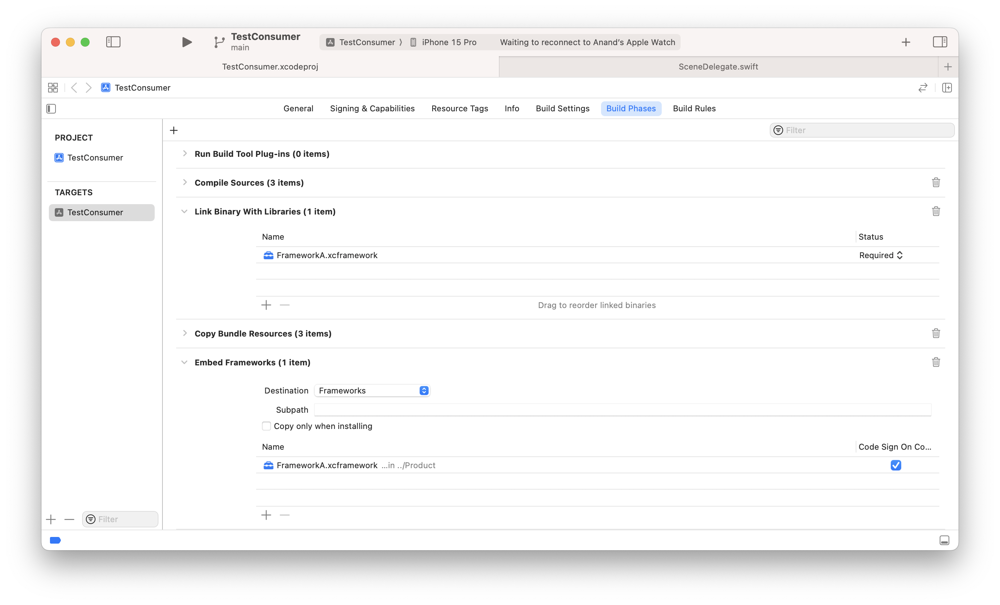
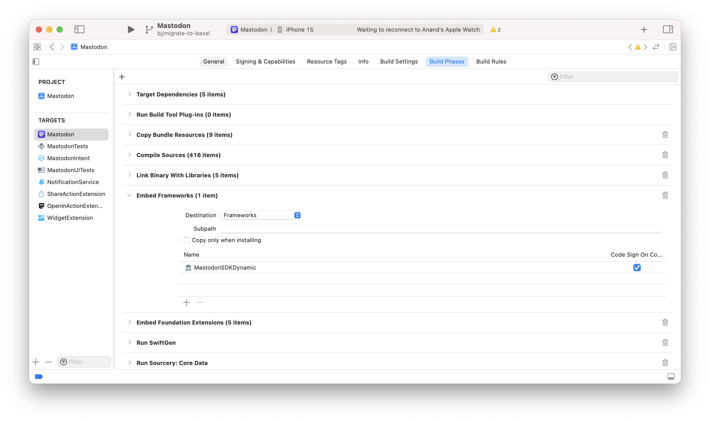
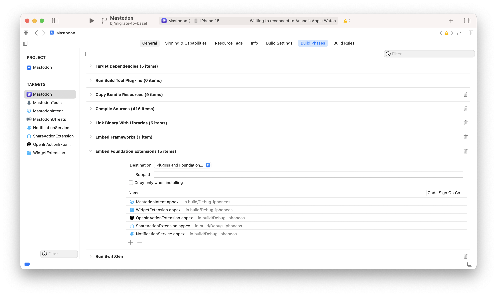
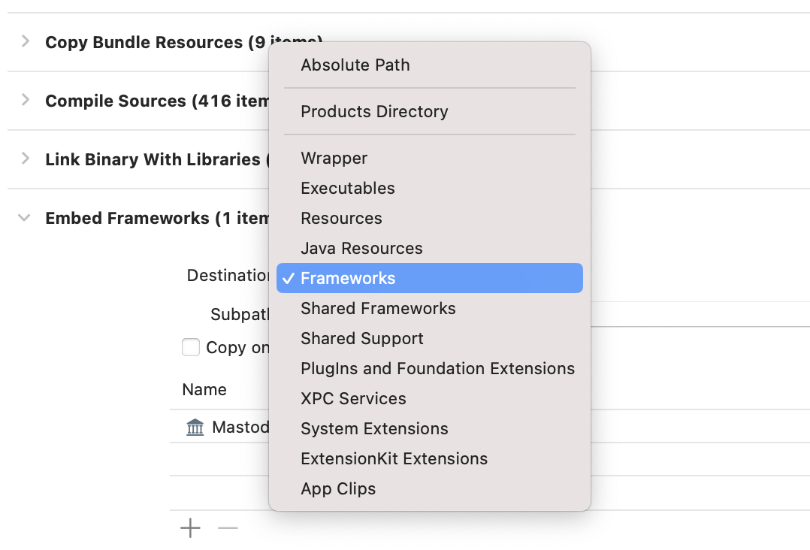

[toc]

#### Summary Diagram

There can be many different kinds of dependencies - Libraries, Frameworks, Libraries in Swift Packages, Xcframeworks, Targets, Extensions (Application Extensions, and more)

They are spcified in many different places in Xcode.

#### Project Settings

##### Project Settings > Package Dependencies

Packages to use can be added from here, and then you also get an option to specify which targets you'd want them in.

#### Target Settings

##### Target Settings > General > Frameworks, Libraries, Embedded Content

This is a summary of all that gets specified in various subsections of 'Target Settings > Build Phases', with Embed value depending on how they are specified there.

> `Embed & Sign`, `Embed Without Signing`, `Do Not Embed`, `Nothing` - How do things actually change in these options, and where are they used.

##### Target Settings > Build Phases > Target Dependencies

All the executables, app extensions (`.appex`) of other targets are included here. In case of a test target, this includes the main app target.

##### Target Settings > Build Phases > Link Binary with Libraries

All the frameworks and libs to be used are specified here. Including the ones present in any Swift package, as well as xcframeworks. 

For every dependency, 'Required' or 'Optional' is also specified. These show up in 'Target Settings > General > Framework, Libraries, Embedded Content', with Libraries not having any Embed value but frameworks having it as 'Do Not Embed'.

> What difference does Required/Optional make.

##### Target Settings > Build Phases > Copy Files: Embed Frameworks

This is actually a `Copy Files` phase with the destination being `Frameworks`. Any lib used can be mentioned here along with the option to specify `Code Sign on Copy`. It also seems to have xcFrameworks listed here.

The selection made for 'Code sign on copy' is what decides if the corresponding entry in 'Target Settings > General > Framework, Libraries, Embedded Content' is 'Embed & Sign' or 'Embed Without Signing'. 

##### Target Settings > Build Phases > Copy Files: Embed Foundation Extensions

This is actually a `Copy Files` phase with the destination being `Plugins and Foundation Extensions`. Application extensions (i.e. `.appex`) are listed here. These show up in 'Target Settings > General > Framework, Libraries, Embedded Content' and as 'Embed Without Signing'.

##### Possible destinations in Copy Files phase

